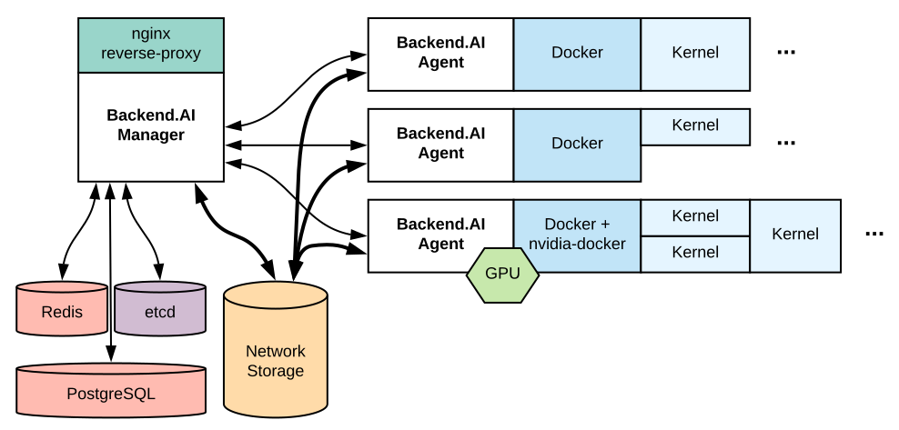

.. role:: raw-html-m2r(raw)
   :format: html
Backend.AI Concepts
===================

Here we describe the key concepts that are required to understand and follow this documentation.

.. _server-arch-diagram:

   The diagram of a typical multi-node Backend.AI server architecture

:numref:`server-arch-diagram` shows a brief Backend.AI server-side architecture where the components are what you need to install and configure.

Each border-connected group of components is intended to be run on the same server, but you may split them into multiple servers or merge different groups into a single server as you need.
For example, you can run separate servers for the nginx reverse-proxy and the Backend.AI manager or run both on a single server.
In the :doc:`development setup </dev/development-setup>`, all these components run on a single PC such as your laptop.

.. toctree::
   :maxdepth: 4

   services
   computing
   resources
   users
   networking
   storage
   configuration
   monitoring
   faq
