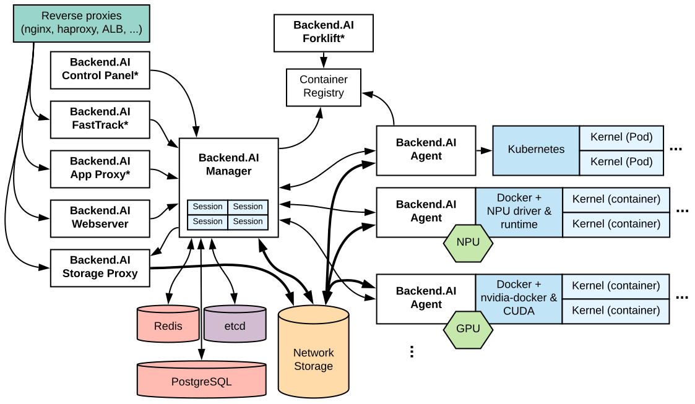

.. role:: raw-html-m2r(raw)
   :format: html

Key Concepts
------------

Here we describe the key concepts that are required to understand and follow this documentation.

.. _server-arch-diagram:

   The diagram of a typical multi-node Backend.AI server architecture

:numref:`server-arch-diagram` shows a brief Backend.AI server-side architecture where the components are what you need to install and configure.

Each border-connected group of components is intended to be run on the same server, but you may split them into multiple servers or merge different groups into a single server as you need.
For example, you can run separate servers for the nginx reverse-proxy and the Backend.AI manager or run both on a single server.
In the [[development setup]], all these components run on a single PC such as your laptop.

Manager and Agents
^^^^^^^^^^^^^^^^^^
:raw-html-m2r:``

Backend.AI manager is the central governor of the cluster.
It accepts user requests, creates/destroys the sessions, and routes code execution requests to appropriate agents and sessions.
It also collects the output of sessions and responds the users with them.

Backend.AI agent is a small daemon installed onto individual worker servers to control them.
It manages and monitors the lifecycle of kernel containers, and also mediates the input/output of sessions.
Each agent also reports the resource capacity and status of its server, so that the manager can assign new sessions on idle servers to load balance.

Compute sessions and Kernels
^^^^^^^^^^^^^^^^^^^^^^^^^^^^^^
:raw-html-m2r:``
:raw-html-m2r:``

Backend.AI spawns compute sessions as the form of containers upon user API requests.
Each compute session may have one or more containers (distributed across different nodes), and we call those member containers "kernels".
Such multi-container sessions are for distributed and parallel computation at large scales.
The agent automatically pulls and updates the kernel images if needed.

Cluster Networking
^^^^^^^^^^^^^^^^^^
:raw-html-m2r:``
:raw-html-m2r:``

The primary networking requirements are:

* The manager server (the HTTPS 443 port) should be exposed to the public Internet or the network that your client can access.
* The manager, agents, and all other database/storage servers should reside at the same local private network where any traffic between them are transparently allowed.
* For high-volume big-data processing, you may want to separate the network for the storage using a secondary network interface on each server, such as Infiniband and RoCE adaptors.

Databases
^^^^^^^^^
:raw-html-m2r:``

Redis and PostgreSQL are used to keep track of liveness of agents and compute sessions (which may be composed of one or more kernels).
They also store user metadata such as keypairs and resource usage statistics.

Configuration Management
^^^^^^^^^^^^^^^^^^^^^^^^
:raw-html-m2r:``

Most cluster-level configurations are stored in an etcd server or cluster.
The etcd server is also used for service discovery; when new agents boot up they register themselves to the cluster manager via etcd.
For production deployments, we recommend to use an etcd cluster composed of odd (3 or higher) number of nodes to keep high availability.

Virtual Folders
^^^^^^^^^^^^^^^
:raw-html-m2r:``

.. _vfolder-concept-diagram:
.. figure:: vfolder-concept.svg

   A conceptual diagram of virtual folders when using two NFS servers as vfolder hosts

As shown in :numref:`vfolder-concept-diagram`, Backend.AI abstracts network storages as "virtual folder", which provides a cloud-like private file storage to individual users.
The users may create their own (one or more) virtual folders to store data files, libraries, and program codes.
Each vfolder (virtual folder) is created under a designated storage mount (called "vfolder hosts").
Virtual folders are mounted into compute session containers at ``/home/work/{name}`` so that user programs have access to the virtual folder contents like a local directory.
As of Backend.AI v18.12, users may also share their own virtual folders with other users in differentiated permissions such as read-only and read-write.

A Backend.AI cluster setup may use any filesystem that provides a local mount point at each node (including the manager and agents) given that the filesystem contents are synchronized across all nodes.
The only requirement is that the local mount-point must be same across all cluster nodes (e.g., ``/mnt/vfroot/mynfs``).
Common setups may use a centralized network storage (served via NFS or SMB), but for more scalability, one might want to use distributed file systems such as CephFS and GlusterFS, or Alluxio that provides fast in-memory cache while backed by another storage server/service such as AWS S3.

For a single-node setup, you may simply use an empty local directory.
