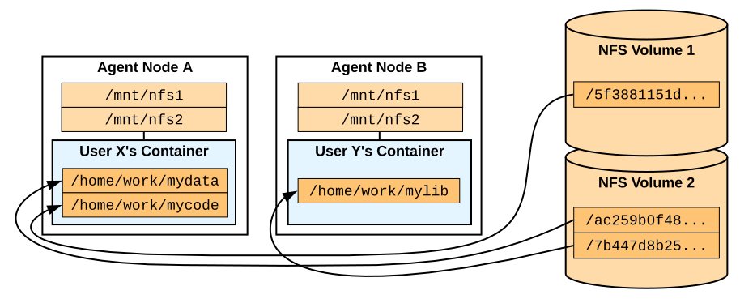

.. role:: raw-html-m2r(raw)
   :format: html

Storage Management
------------------

Virtual folders
~~~~~~~~~~~~~~~
:raw-html-m2r:``

.. _vfolder-concept-diagram:

   A conceptual diagram of virtual folders when using two NFS servers as vfolder hosts

As shown in :numref:`vfolder-concept-diagram`, Backend.AI abstracts network storages as "virtual folder", which provides a cloud-like private file storage to individual users.
The users may create their own (one or more) virtual folders to store data files, libraries, and program codes.
Each vfolder (virtual folder) is created under a designated storage mount (called "vfolder hosts").
Virtual folders are mounted into compute session containers at ``/home/work/{name}`` so that user programs have access to the virtual folder contents like a local directory.
As of Backend.AI v18.12, users may also share their own virtual folders with other users in differentiated permissions such as read-only and read-write.

A Backend.AI cluster setup may use any filesystem that provides a local mount point at each node (including the manager and agents) given that the filesystem contents are synchronized across all nodes.
The only requirement is that the local mount-point must be same across all cluster nodes (e.g., ``/mnt/vfroot/mynfs``).
Common setups may use a centralized network storage (served via NFS or SMB), but for more scalability, one might want to use distributed file systems such as CephFS and GlusterFS, or Alluxio that provides fast in-memory cache while backed by another storage server/service such as AWS S3.

For a single-node setup, you may simply use an empty local directory.

User-owned vfolders
^^^^^^^^^^^^^^^^^^^

Project-owned vfolders
^^^^^^^^^^^^^^^^^^^^^^

VFolder invitations and permissions
^^^^^^^^^^^^^^^^^^^^^^^^^^^^^^^^^^^

Volume-level permissions
^^^^^^^^^^^^^^^^^^^^^^^^

Quota scopes
~~~~~~~~~~~~

.. versionadded:: 23.03

Quota scopes implement per-user and per-project storage space limits.
There are two main schemes to set up this feature.

Storage with per-directory quota
^^^^^^^^^^^^^^^^^^^^^^^^^^^^^^^^

.. _vfolder-dir-quota:
.. figure:: vfolder-dir-quota.svg
   :width: 80%
   :align: center

   Quota scopes and vfolders with storage solutions supporting per-directry quota

For each storage volume, each user and project has their own dedicated quota scope directories.
The storage solution must support per-directory quota, at least for a single-level (like NetApp's QTree).
We recommend this configuration for filesystems like CephFS, Weka.io, or custom-built storage servers using ZFS or XFS where Backend.AI Storage Proxy can be installed directly onto the storage servers.

Storage with per-volume quota
^^^^^^^^^^^^^^^^^^^^^^^^^^^^^^^^

.. _vfolder-volume-quota:

   Quota scopes and vfolders with storage solutions supporting per-volume quota

Unfortunately, there are many cases that we cannot rely on per-directory quota support in storage solutions,
due to limitation of the underlying filesystem implementation or having no direct access to the storage vendor APIs.

For this case, we assign dedicated storage volumes to each user and project in this scheme,
which *naturally* limits the space usage by the volume size.

The shortcoming is that we may need to frequently mount/unmount the network volumes when we create or remove users and projects, which may cause unexpected system failures due to stale file descriptors.

.. warning::

   For both schemes, the administrator should take care of the storage solution's system limits such as the maximum number of volumes and quota sets
   because such limits may impose a hidden limit to the maximum number of users and projects in Backend.AI.
