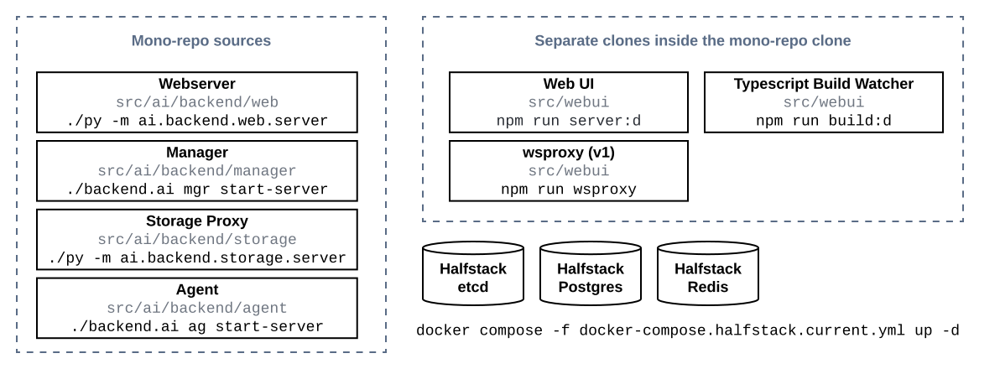
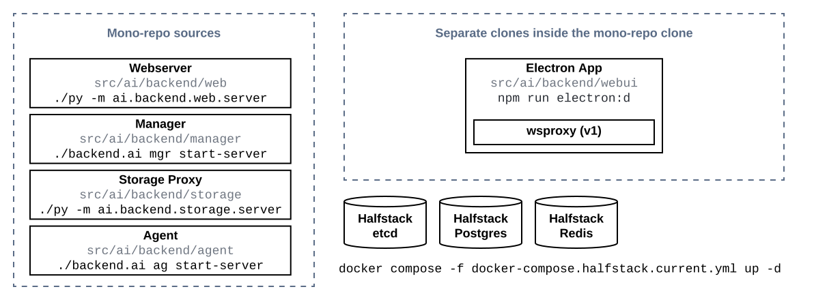
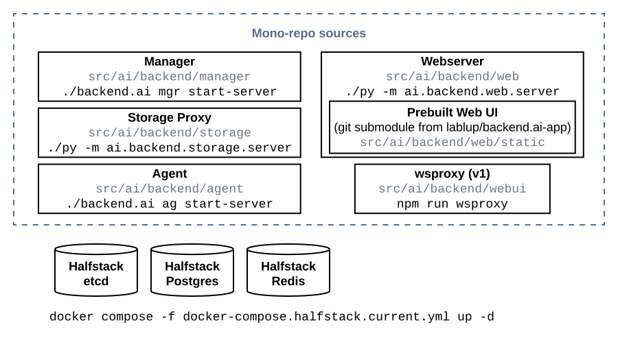

.. role:: raw-html-m2r(raw)
   :format: html

Development Setup
=================

Currently Backend.AI is developed and tested under only \*NIX-compatible platforms (Linux or macOS).

The development setup uses a mono-repository for the backend stack and a side-by-side repository checkout of the frontend stack.
In contrast, the production setup uses per-service independent virtual environments and relies on a separately provisioned app proxy pool.

There are three ways to run both the backend and frontend stacks for development, as demonstrated in
:numref:`dev-setup-standard`, :numref:`dev-setup-app`, and :numref:`dev-setup-staticwebui`.
The installation guide in this page using ``scripts/install-dev.sh`` covers all three cases because the only difference
is that how you launch the Web UI from the mono-repo.

.. _dev-setup-standard:

   A standard development setup of Backend.AI open source components

.. _dev-setup-app:

   A development setup of Backend.AI open source components for Electron-based desktop app

.. _dev-setup-staticwebui:

   A development setup of Backend.AI open source components with pre-built web UI from the ``backend.ai-app`` repository

.. currently the layout of the mermaid C4 diagrams has too large space and too small fonts....

   .. mermaid::

       C4Component
       title Component Diagram of Development Setup

       Person(user, "User")
       Boundary(backend, "Backend Stack from Mono-repo") {
          Container(manager, "Manager", "Python", "Independent daemon")
          Container(webserver, "Web server", "Python", "Independent daemon")
          Container(agent, "Agent", "Python", "Independent daemon")
          Container(storage_proxy, "Storage Proxy", "Python", "Independent daemon")
          ContainerDb(halfstack, "Halfstack", "Docker", "Set of containers")
       }
       Boundary(frontend, "Frontend Stack") {
          Container(wsproxy, "Embedded wsproxy", "NodeJS", "Running on a NodeJS server")
          Container(webui, "Web UI", "NodeJS", "Running on a NodeJS server")
       }
       Rel(user, manager, "HTTP", "")
       Rel(user, webui, "HTTP", "")
       Rel(user, wsproxy, "HTTP", "")
       Rel(user, storage_proxy, "HTTP", "")
       Rel(webui, webserver, "HTTP", "")
       Rel(wsproxy, agent, "Native protocols", "")
       Rel(webserver, manager, "HTTP", "")
       Rel(manager, agent, "Callosum", "")
       Rel(manager, storage_proxy, "HTTP", "")
       Rel(manager, halfstack, "Native protocols", "")
       Rel(agent, halfstack, "Native protocols", "")

   .. mermaid::

       C4Component
       title Component Diagram of Production Setup

       Person(user, "User")
       Boundary(backend, "Backend Services") {
          Container(manager, "Manager", "Python", "Independent service")
          Container(webserver, "Web server", "Python", "Independent service with embedded Web UI")
          Container(agent, "Agent", "Python", "Independent service")
          Container(storage_proxy, "Storage Proxy", "Python", "Independent service")
       }
       Boundary(frontend, "External App Proxy Pool") {
          Container(wsproxy, "Scalable wsproxy", "NodeJS", "Independent service")
       }
       Boundary(database, "Databases") {
          ContainerDb(halfstack, "Halfstack", "Docker", "Set of containers")
       }
       Rel(user, manager, "HTTP", "")
       Rel(user, webserver, "HTTP", "")
       Rel(user, wsproxy, "HTTP", "")
       Rel(user, storage_proxy, "HTTP", "")
       Rel(wsproxy, agent, "Native protocols", "")
       Rel(webserver, manager, "HTTP", "")
       Rel(manager, agent, "Callosum", "")
       Rel(manager, storage_proxy, "HTTP", "")
       Rel(manager, halfstack, "Native protocols", "")
       Rel(agent, halfstack, "Native protocols", "")

Installation from Source
------------------------

For the ease of onboarding developer experience, we provide an automated
script that installs all server-side components in editable states with just
one command.

Prerequisites
~~~~~~~~~~~~~

Install the following according to your host operating system.

* `Git LFS <https://git-lfs.github.com/>`_

* `pyenv <https://github.com/pyenv/pyenv>`_ and `pyenv-virtualenv <https://github.com/pyenv/pyenv-virtualenv>`_

  - Ensure that you have all of the Python versions specified in ``pants.toml`` with ``pyenv``.
    (both Python 3.9.x and Python 3.10.8 at the time of writing, but please consult your copy of ``pants.toml`` for the latest information)

  - `Check the prerequisites for Python build environment setup for your system. <https://github.com/pyenv/pyenv/wiki#suggested-build-environment>`_

* `Docker <https://docs.docker.com/install/>`_

* `Docker Compose <https://docs.docker.com/compose/install/>`_ (v2 required)

* (For Linux aarch64/arm64 setups only) `Rust <https://rustup.rs/>`_ to build Pants from its source

* `Pants <https://www.pantsbuild.org/2.18/docs/getting-started/installing-pants>`_

  - For pants version 2.18 and later. The following versions are released from Github Releases instead of PyPI.

.. warning::

   To avoid conflicts with your system Python such as macOS/XCode versions,
   our default ``pants.toml`` is configured to search only ``pyenv``-provided Python versions.

.. note::

   In some cases, locale conflicts between the terminal client and the remote host
   may cause encoding errors when installing Backend.AI components due to Unicode characters
   in README files.  Please keep correct locale configurations to prevent such errors.

Running the install-dev script
~~~~~~~~~~~~~~~~~~~~~~~~~~~~~~

.. code-block:: console

   $ git clone https://github.com/lablup/backend.ai bai-dev
   $ cd bai-dev
   $ ./scripts/install-dev.sh

.. note::

   The script requires ``sudo`` to check and install several system packages
   such as ``build-essential``.

This script will bootstrap `Pants <https://pantsbuild.org>`_ and creates the halfstack
containers using ``docker compose`` with fixture population.
At the end of execution, the script will show several command examples about
launching the service daemons such as manager and agent.
You may execute this script multiple times when you encounter prerequisite errors and
resolve them.
Also check out additional options using ``-h`` / ``--help`` option, such as installing
the CUDA mockup plugin together, etc.

.. versionchanged:: 22.09

   We have migrated to per-package repositories to a semi-mono repository that contains
   all Python-based components except plugins.  This has changed the installation
   instruction completely with introduction of Pants.

.. note::

   To install multiple instances/versions of development environments using this script,
   just clone the repository in another location and run ``scripts/install-dev.sh``
   inside that directory.

   It is important to name these working-copy directories *differently* not to confuse
   ``docker compose`` so that it can distinguish the containers for each setup.

   Unless you customize all port numbers by the options of ``scripts/install-dev.sh``,
   you should ``docker compose -f docker-compose.halfstack.current.yml down`` and ``docker compose -f docker-compose.halfstack.current.yml up -d`` when switching
   between multiple working copies.

.. note::

   By default, the script pulls the docker images for our standard Python kernel and
   TensorFlow CPU-only kernel.  To try out other images, you have to pull them
   manually afterwards.

.. note::

   Currently there are many limitations on running deep learning images on ARM64 platforms,
   because users need to rebuild the whole computation library stack, although more supported
   images will come in the future.

.. note::

   To install the webui in an editable state, try ``--editable-webui`` flag option when running ``scripts/install-dev.sh``.

.. tip::

   **Using the agent's cgroup-based statistics without the root privilege (Linux-only)**

   To allow Backend.AI to collect sysfs/cgroup resource usage statistics, the Python executable must have the following Linux capabilities: ``CAP_SYS_ADMIN``, ``CAP_SYS_PTRACE``, and ``CAP_DAC_OVERRIDE``.

   .. code-block:: console

      $ sudo setcap \
      >   cap_sys_ptrace,cap_sys_admin,cap_dac_override+eip \
      >   $(readlink -f $(pyenv which python))

Verifying Installation
~~~~~~~~~~~~~~~~~~~~~~

Refer the instructions displayed after running ``scripts/install-dev.sh``.
We recommend to use `tmux <https://github.com/tmux/tmux/wiki>`_ to open
multiple terminals in a single SSH session.
Your terminal app may provide a tab interface, but when using remote servers,
tmux is more convenient because you don't have to setup a new SSH connection
whenever adding a new terminal.

Ensure the halfstack containers are running:

.. code-block:: console

   $ docker compose -f docker-compose.halfstack.current.yml up -d

Open a terminal for manager and run:

.. code-block:: console

   $ ./backend.ai mgr start-server --debug

Open another terminal for agent and run:

.. code-block:: console

   $ ./backend.ai ag start-server --debug

Open yet another terminal for client and run:

.. code-block:: console

   $ source ./env-local-admin-api.sh  # Use the generated local endpoint and credential config.
   $ # source ./env-local-user-api.sh  # You may choose an alternative credential config.
   $ ./backend.ai config
   $ ./backend.ai run python --rm -c 'print("hello world")'
   ∙ Session token prefix: fb05c73953
   ✔ [0] Session fb05c73953 is ready.
   hello world
   ✔ [0] Execution finished. (exit code = 0)
   ✔ [0] Cleaned up the session.
   $ ./backend.ai ps

Resetting the environment
~~~~~~~~~~~~~~~~~~~~~~~~~

Shutdown all docker containers using ``docker compose -f docker-compose.halfstack.current.yml down`` and delete the entire working copy directory.  That's all.

You may need ``sudo`` to remove the directories mounted as halfstack container volumes
because Docker auto-creates them with the root privilege.

Daily Workflows
~~~~~~~~~~~~~~~

Check out :doc:`/dev/daily-workflows` for your reference.
