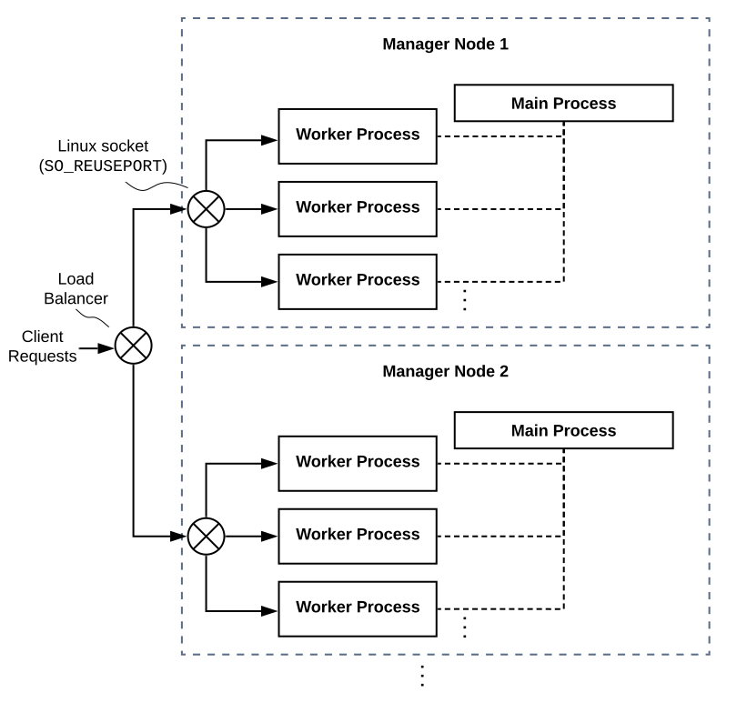

Multi-node Multi-process Scaling of Manager Instances
=====================================================

To deep-dive into the manager codebase, you first need to notice the process model of the manager.

Backend.AI Manager is horizontally scalable using multiple processes running on multiple nodes.
We call each process "an instance", and they work indepedently to each other.
For maximum scalability, manager instances share nothing.
All shared states must reside in external databases such as Redis, etcd, and PostgreSQL services.

   An example of multi-node multi-process manager instances

In a single node, it uses the multi-process server framework from `aiotools <https://github.com/achimnol/aiotools>`_ to spawn multiple processes.
Each process initializes its own event loop and an aiohttp application stack, with ``reuse_port=True`` option\ [1]_ so that the Linux kernel load-balances incoming connections across all processes.

To run multiple manager nodes, there should be a multiplexer in front of them, such as a load balancer or a reverse proxy.
Since each API request is considered stateless and any necessary synchronization is done by the manager instances, the load balancer may spread out individual TCP connections, assuming that there is no dependency across different connections.

.. [1] `The SO_REUSEPORT socket option <https://lwn.net/Articles/542629/>`_
