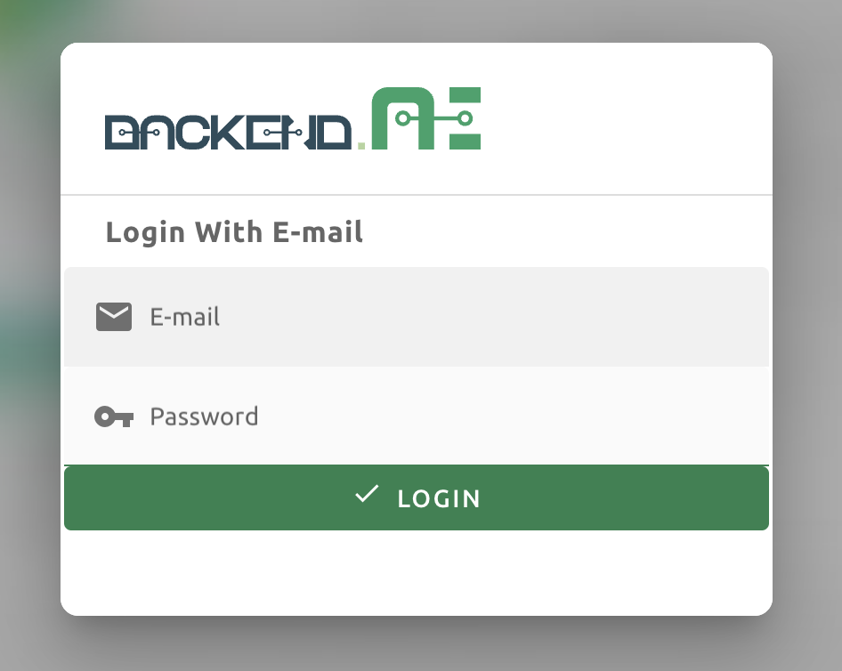

Install Backend.AI Webserver
============================

Refer to :ref:`prepare_python_and_venv` to setup Python and virtual environment
for the service.

Install the latest version of Backend.AI Webserver for the current Python
version:

.. code-block:: console

   $ cd "${HOME}/webserver"
   $ # Activate a virtual environment if needed.
   $ pip install -U backend.ai-webserver

If you want to install a specific version:

.. code-block:: console

   $ pip install -U backend.ai-webserver==${BACKEND_PKG_VERSION}

Local configuration
-------------------

Backend.AI Webserver uses a config file (``webserver.conf``) to configure
local service. Refer to the
`webserver.conf sample file <https://github.com/lablup/backend.ai/blob/main/configs/webserver/sample.conf>`_
for a detailed description of each section and item. A configuration example
would be:

.. code-block:: toml

   [service]
   ip = "0.0.0.0"
   port = 8080
   # Not active in open-source edition.
   wsproxy.url = "http://10.20.30.10:10200"

   # Set or enable it when using reverse proxy for SSL-termination
   # force_endpoint_protocol = "https"

   mode = "webui"
   enable_signup = false
   allow_signup_without_confirmation = false
   always_enqueue_compute_session = false
   allow_project_resource_monitor = false
   allow_change_signin_mode = false
   mask_user_info = false
   enable_container_commit = false
   hide_agents = true
   directory_based_usage = false

   [resources]
   open_port_to_public = false
   allow_non_auth_tcp = false
   allow_preferred_port = false
   max_cpu_cores_per_container = 255
   max_memory_per_container = 1000
   max_cuda_devices_per_container = 8
   max_cuda_shares_per_container = 8
   max_shm_per_container = 256
   # Maximum per-file upload size (bytes)
   max_file_upload_size = 4294967296

   [environments]
   # allowlist = ""

   [ui]
   brand = "Backend.AI"
   menu_blocklist = "pipeline"

   [api]
   domain = "default"
   endpoint = "http://bai-m1:8081"
   text = "Backend.AI"
   ssl-verify = false

   [session]
   redis.host = "bai-m1"
   redis.port = 8110
   redis.db = 5
   redis.password = "develove"
   max_age = 604800  # 1 week
   flush_on_startup = false
   login_block_time = 1200  # 20 min (in sec)
   login_allowed_fail_count = 10
   max_count_for_preopen_ports = 10

   [license]

   [webserver]

   [logging]
   # One of: "NOTSET", "DEBUG", "INFO", "WARNING", "ERROR", "CRITICAL"
   # Set the global logging level.
   level = "INFO"

   # Multi-choice of: "console", "logstash", "file"
   # For each choice, there must be a "logging.<driver>" section
   # in this config file as exemplified below.
   drivers = ["console", "file"]

   [logging.console]
   # If set true, use ANSI colors if the console is a terminal.
   # If set false, always disable the colored output in console logs.
   colored = true

   # One of: "simple", "verbose"
   format = "verbose"

   [logging.file]
   # The log file path and filename pattern.
   # All messages are wrapped in single-line JSON objects.
   # Rotated logs may have additional suffixes.
   # For production, "/var/log/backend.ai" is recommended.
   path = "./logs"
   filename = "webserver.log"

   # Set the maximum number of recent container coredumps in the coredump directory.
   # Oldest coredumps are deleted if there is more than this number of coredumps.
   backup-count = 10

   # The log file size to begin rotation.
   rotation-size = "10M"

   [logging.logstash]
   # The endpoint to publish logstash records.
   endpoint = { host = "localhost", port = 9300 }

   # One of: "zmq.push", "zmq.pub", "tcp", "udp"
   protocol = "tcp"

   # SSL configs when protocol = "tcp"
   ssl-enabled = true
   ssl-verify = true

   # Specify additional package namespaces to include in the logs
   # and their individual log levels.
   # Note that the actual logging level applied is the conjunction of the global logging level and the
   # logging levels specified here for each namespace.
   [logging.pkg-ns]
   "" = "WARNING"
   "aiotools" = "INFO"
   "aiohttp" = "INFO"
   "ai.backend" = "INFO"

   [debug]
   enabled = false

   [plugin]

   [pipeline]

Save the contents to ``${HOME}/.config/backend.ai/webserver.conf``.

Run Backend.AI Webserver service
------------------------------------

You can run the service by specifying the config file path with ``-f`` option:

.. code-block:: console

   $ cd "${HOME}/webserver"
   $ python -m ai.backend.web.server -f ${HOME}/.config/backend.ai/webserver.conf

Press ``Ctrl-C`` to stop both services.

Register systemd service
------------------------

The service can be registered as a systemd daemon. It is recommended to
automatically run the service after rebooting the host machine, although this is
entirely optional.

First, create a runner script at ``${HOME}/bin/run-webserver.sh``:

.. code-block:: bash

   #! /bin/bash
   set -e

   if [ -z "$HOME" ]; then
      export HOME="/home/bai"
   fi

   # -- If you have installed using static python --
   source .venv/bin/activate

   # -- If you have installed using pyenv --
   if [ -z "$PYENV_ROOT" ]; then
      export PYENV_ROOT="$HOME/.pyenv"
      export PATH="$PYENV_ROOT/bin:$PATH"
   fi
   eval "$(pyenv init --path)"
   eval "$(pyenv virtualenv-init -)"

   if [ "$#" -eq 0 ]; then
      exec python -m ai.backend.web.server -f ${HOME}/.config/backend.ai/webserver.conf
   else
      exec "$@"
   fi

Make the scripts executable:

.. code-block:: console

   $ chmod +x "${HOME}/bin/run-webserver.sh"

Then, create a systemd service file at
``/etc/systemd/system/backendai-webserver.service``:

.. code-block:: dosini

   [Unit]
   Description= Backend.AI Webserver
   Requires=network.target
   After=network.target remote-fs.target

   [Service]
   Type=simple
   ExecStart=/home/bai/bin/run-webserver.sh
   PIDFile=/home/bai/webserver/webserver.pid
   WorkingDirectory=/home/bai/webserver
   User=1100
   Group=1100
   TimeoutStopSec=5
   KillMode=process
   KillSignal=SIGTERM
   PrivateTmp=false
   Restart=on-failure
   RestartSec=10
   LimitNOFILE=5242880
   LimitNPROC=131072

   [Install]
   WantedBy=multi-user.target

Finally, enable and start the service:

.. code-block:: console

   $ sudo systemctl daemon-reload
   $ sudo systemctl enable --now backendai-webserver

   $ # To check the service status
   $ sudo systemctl status backendai-webserver
   $ # To restart the service
   $ sudo systemctl restart backendai-webserver
   $ # To stop the service
   $ sudo systemctl stop backendai-webserver
   $ # To check the service log and follow
   $ sudo journalctl --output cat -u backendai-webserver -f

Check user GUI access via web
-----------------------------

You can check the access to the web GUI by opening the URL
``http://<host-ip-or-domain>:8080`` in your web browser. If all goes well, you
will see the login page.

Enter the email and password you set in the previous step to check login.

You can use almost every feature from the web GUI, but launching compute sesison
apps like Terminal and/or Jupyer notebook is not possible from the web in the
open-source edition. You can instead use the GUI desktop client to fully use the
GUI features.

You can download the GUI desktop client from the web GUI in the Summary page.
Please use the "Download Backend.AI Web UI App" at the bottom of the page.

Or, you can download from the following release page:
https://github.com/lablup/backend.ai-webui/releases

Web UI (user GUI) guide can be found at https://webui.docs.backend.ai/.
