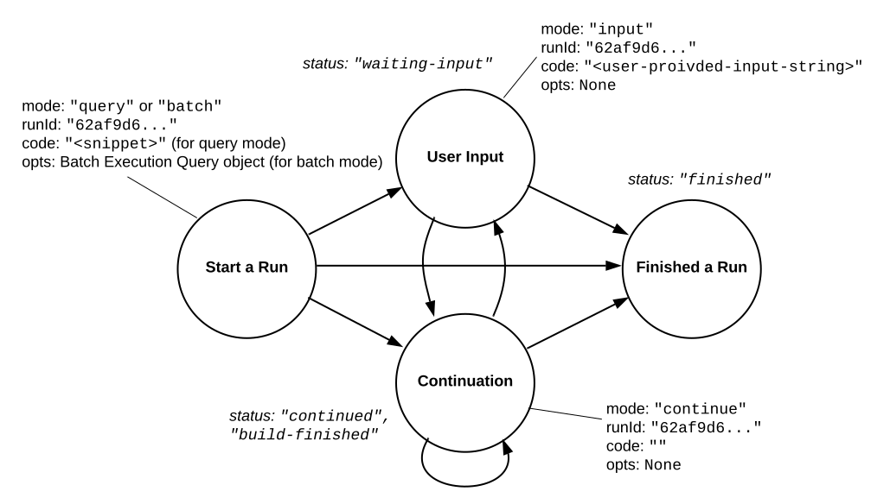

Manager REST API
================

Backend.AI REST API is for running instant compute sessions at scale in clouds or on-premise clusters.

.. toctree::
   :maxdepth: 2

   sessions
   exec-query
   exec-batch
   exec-stream
   events
   service-ports
   resource-presets
   vfolders

.. _code-execution-model:

Code Execution Model
--------------------

The core of the user API is the **execute** call which allows clients to execute user-provided codes in isolated **compute sessions** (aka **kernels**).
Each session is managed by a **kernel runtime**, whose implementation is language-specific.
A runtime is often a containerized daemon that interacts with the Backend.AI agent via our internal ZeroMQ protocol.
In some cases, kernel runtimes may be just proxies to other code execution services instead of actual executor daemons.

Inside each compute session, a client may perform multiple **runs**.
Each run is for executing different code snippets (**the query mode**) or different sets of source files (**the batch mode**).
The client often has to call the **execute** API *multiple times* to finish a single run.
It is completely legal to mix query-mode runs and batch-mode runs inside the same session, given that the kernel runtime supports both modes.

To distinguish different runs which may be overlapped, the client must provide the same **run ID** to all **execute** calls during a single run.
The run ID should be unique for each run and can be an arbitrary random string.
If the run ID is not provided by the client at the first execute call of a run, the API server will assign a random one and inform it to the client via the first response.
Normally, if two or more runs are overlapped, they are processed in a FIFO order using an internal queue.
But they may be processed in parallel if the kernel runtime supports parallel processing.
Note that the API server may raise a timeout error and cancel the run if the waiting time exceeds a certain limit.

In the query mode, usually the runtime context (e.g., global variables) is preserved for next subsequent runs, but this is not guaranteed by the API itself---it's up to the kernel runtime implementation.

.. _run-state-diagram:

   The state diagram of a “run” with the **execute** API.

.. we need prettier version of mermaid... :(

   .. mermaid::

      flowchart TB
          START(Start a Run) -->|status: continued,\nbuild-finished,\nclean-finished| CONT;
          START -->|status: waiting-input| INPUT;
          START -->|status: finished| FIN;
          INPUT(User Input) -->|status: continued,\nbuild-finished,\nclean-finished| CONT;
          INPUT -->|status: finished| FIN;
          CONT(Continuation) -->|status: continued,\nbuild-finished,\nclean-finished| CONT;
          CONT -->|status: waiting-input| INPUT;
          CONT -->|status: finished| FIN;
          FIN(Finish a Run);

The **execute** API accepts 4 arguments: ``mode``, ``runId``, ``code``, and ``options`` (``opts``).
It returns an :ref:`execution-result-object` encoded as JSON.

Depending on the value of ``status`` field in the returned :ref:`execution-result-object`,
the client must perform another subsequent **execute** call with appropriate arguments or stop.
:numref:`run-state-diagram` shows all possible states and transitions between them via the ``status`` field value.

If ``status`` is ``"finished"``, the client should stop.

If ``status`` is ``"continued"``, the client should make another **execute** API call with the ``code`` field set to an empty string and the ``mode`` field set to ``"continue"``.
Continuation happens when the user code runs longer than a few seconds to allow the client to show its progress, or when it requires extra step to finish the run cycle.

If ``status`` is ``"clean-finished"`` or ``"build-finished"`` (this happens at the batch-mode only), the client should make the same continuation call.
Since cleanup is performed before every build, the client will always receive ``"build-finished"`` after ``"clean-finished"`` status.
All outputs prior to ``"build-finished"`` status return are from the build program and all future outputs are from the executed program built.
Note that even when the ``exitCode`` value is non-zero (failed), the client must continue to complete the run cycle.

If ``status`` is ``"waiting-input"``, you should make another **execute** API call with the ``code`` field set to the user-input text and the ``mode`` field set to ``"input"``.
This happens when the user code calls interactive ``input()`` functions.
Until you send the user input, the current run is blocked.
You may use modal dialogs or other input forms (e.g., HTML input) to retrieve user inputs.
When the server receives the user input, the kernel's ``input()`` returns the given value.
Note that each kernel runtime may provide different ways to trigger this interactive input cycle or may not provide at all.

When each call returns, the ``console`` field in the :ref:`execution-result-object` have the console logs captured since the last previous call.
Check out the following section for details.

.. _handling-console-output:

Handling Console Output
-----------------------

The console output consists of a list of tuple pairs of item type and item data.
The item type is one of ``"stdout"``, ``"stderr"``, ``"media"``, ``"html"``, or ``"log"``.

When the item type is ``"stdout"`` or ``"stderr"``, the item data is the standard I/O stream outputs as (non-escaped) UTF-8 string.
The total length of either streams is limited to 524,288 Unicode characters per each **execute** API call; all excessive outputs are truncated.
The stderr often includes language-specific tracebacks of (unhandled) exceptions or errors occurred in the user code.
If the user code generates a mixture of stdout and stderr, the print ordering is preserved and each contiguous block of stdout/stderr becomes a separate item in the console output list so that the client user can reconstruct the same console output by sequentially rendering the items.

.. note::

   The text in the stdout/stderr item may contain arbitrary terminal control sequences such as ANSI color codes and cursor/line manipulations.
   It is the user's job to strip out them or implement some sort of terminal emulation.

.. tip::

   Since the console texts are *not* escaped, the client user should take care of rendering and escaping depending on the UI implementation.
   For example, use ``<pre>`` element, replace newlines with `` ``, or apply ``white-space: pre`` CSS style when rendering as HTML.
   An easy way to do escape the text safely is to use ``insertAdjacentText()`` DOM API.

When the item type is ``"media"``, the item data is a pair of the MIME type and the content data.
If the MIME type is text-based (e.g., ``"text/plain"``) or XML-based (e.g., ``"image/svg+xml"``), the content is just a string that represent the content.
Otherwise, the data is encoded as a data URI format (RFC 2397).
You may use `backend.ai-media library <https://github.com/lablup/backend.ai-media>`_ to handle this field in Javascript on web-browsers.

When the item type is ``"html"``, the item data is a partial HTML document string, such as a table to show tabular data.
If you are implementing a web-based front-end, you may use it directly to the standard DOM API, for instance, ``consoleElem.insertAdjacentHTML(value, "beforeend")``.

When the item type is ``"log"``, the item data is a 4-tuple of the log level, the timestamp in the ISO 8601 format, the logger name and the log message string.
The log level may be one of ``"debug"``, ``"info"``, ``"warning"``, ``"error"``, or ``"fatal"``.
You may use different colors/formatting by the log level when printing the log message.
Not every kernel runtime supports this rich logging facility.