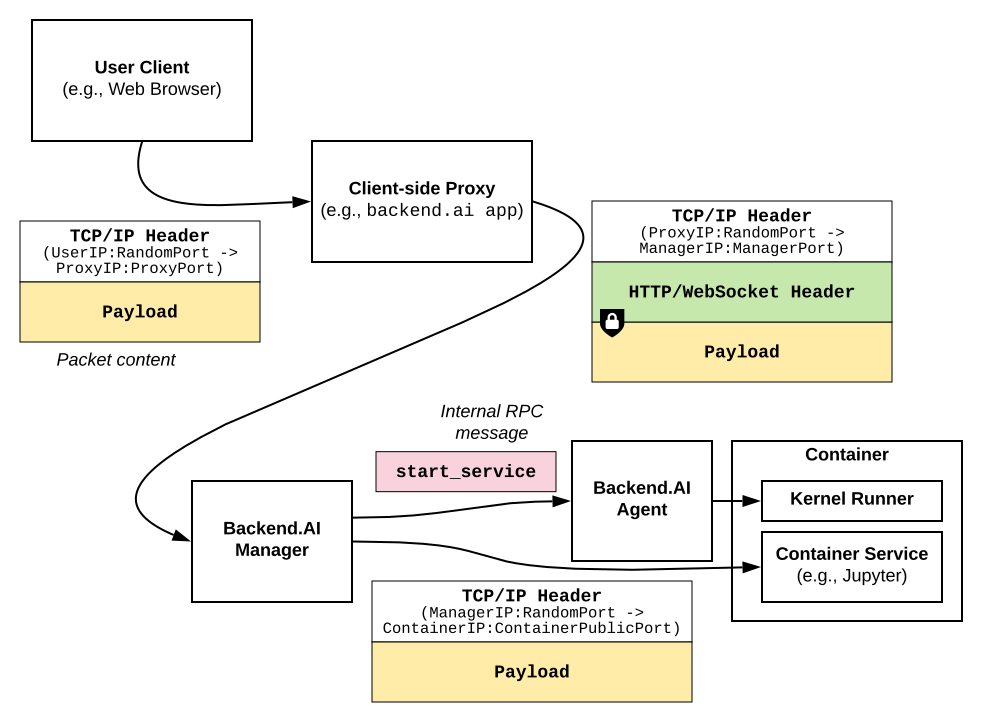

Service Ports (aka Service Proxies)
===================================

The service ports API provides WebSocket-based authenticated and encrypted tunnels
to network-facing services ("container services") provided by the kernel container.
The main advantage of this feature is that all application-specific network traffic
are wrapped as a standard WebSocket API (no need to open extra ports of the manager).
It also hides the container from the client and the client from the container,
offerring an extra level of security.

.. _service-port-diagram:

   The diagram showing how tunneling of TCP connections via WebSockets works.

As :numref:`service-port-diagram` shows, all TCP traffic to a container service
could be sent to a WebSocket connection to the following API endpoints.  A
single WebSocket connection corresponds to a single TCP connection to the
service, and there may be multiple concurrent WebSocket connections to
represent multiple TCP connections to the service.  It is the client's
responsibility to accept arbitrary TCP connections from users (e.g., web
browsers) with proper authorization for multi-user setups and wrap those as
WebSocket connections to the following APIs.

When the first connection is initiated, the Backend.AI Agent running the designated
kernel container signals the kernel runner daemon in the container to start the
designated service.  It shortly waits for the in-container port opening and
then delivers the first packet to the service.  After initialization, all
WebSocket payloads are delivered back and forth just like normal TCP packets.
Note that the WebSocket message type must be ``BINARY``.

The container service will see the packets from the manager and it never knows
the real origin of packets unless the service-level protocol enforces to state
such client-side information.  Likewise, the client never knows the container's
IP address (though the port numbers are included in :ref:`service port objects
<service-port-object>` returned by :ref:`the session creation API
<create-session-api>`).

.. note:: Currently non-TCP (e.g., UDP) services are not supported.

Service Proxy (HTTP)
--------------------

* URI: ``/stream/kernel/:id/httpproxy?app=:service``
* Method: ``GET`` upgraded to WebSockets

The service proxy API allows clients to directly connect to service daemons running *inside*
compute sessions, such as Jupyter and TensorBoard.

The service name should be taken from the list of :ref:`service port objects
<service-port-object>` returned by :ref:`the session creation API
<create-session-api>`.

.. versionadded:: v4.20181215

Parameters
""""""""""

.. list-table::
   :widths: 15 5 80
   :header-rows: 1

   * - Parameter
     - Type
     - Description
   * - ``:id``
     - ``slug``
     - The kernel ID.
   * - ``:service``
     - ``slug``
     - The service name to connect.

Service Proxy (TCP)
-------------------

* URI: ``/stream/kernel/:id/tcpproxy?app=:service``
* Method: ``GET`` upgraded to WebSockets

This is the TCP version of service proxy, so that client users can connect to native services
running inside compute sessions, such as SSH.

The service name should be taken from the list of :ref:`service port objects
<service-port-object>` returned by :ref:`the session creation API
<create-session-api>`.

.. versionadded:: v4.20181215

Parameters
""""""""""

.. list-table::
   :widths: 15 5 80
   :header-rows: 1

   * - Parameter
     - Type
     - Description
   * - ``:id``
     - ``slug``
     - The kernel ID.
   * - ``:service``
     - ``slug``
     - The service name to connect.

