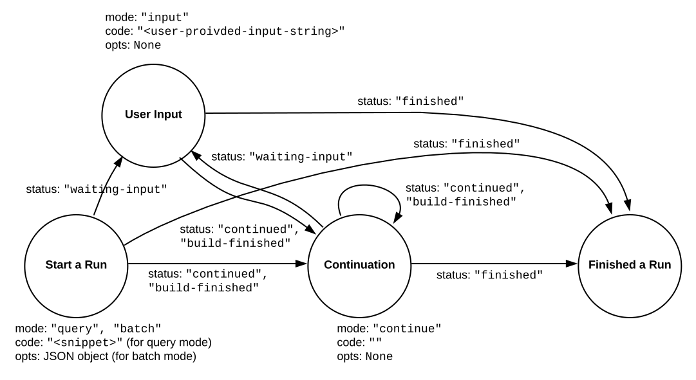

Introduction
============

Backend.AI User API is for running instant compute sessions at scale in clouds or on-premise clusters.

.. _code-execution-model:

Code Execution Model
--------------------

The core of the user API is the **execute** call which allows the clients to execute user-provided codes in isolated **compute sessions** (aka **kernels**).

Inside each compute session, the client may perform multiple **runs**.
Each run is for executing different code snippets (**the query mode**) or dffierent sets of source files (**the batch mode**).
The client often has to call the **execute** API *multiple times* to finish a single run.

To distinguish different runs which may be overlapped, the client must provide the same **run ID** to all **execute** calls during a single run.
The run ID should be unique for each run and can be an arbitrary random string.
Normally, if two or more runs are overlapped, they are processed in a FIFO order using an internal queue.
But they may be processed in parallel if the kernel runtime supports parallel processing.
Note that the API server may raise a timeout error if the waiting time exceeds a certain limit.

In the query mode, usually the runtime context (e.g., global variables) is preserved for next subsequent runs, but this is not guaranteed by the API itself---it's up to the kernel runtime implementation.

.. _run-state-diagram:

   The state diagram of a “run” with the **execute** API.

The **execute** API accepts 4 arguments: ``mode``, ``runId``, ``code``, and ``opts``.
It returns an :ref:`execution-result-object` encoded as JSON.

Depending on the value of ``status`` field in the returned :ref:`execution-result-object`,
the client must perform another subsequent **execute** call with appropriate arguments or stop.
:numref:`run-state-diagram` shows all possible states and its transition via the ``status`` field value.
At each state except ``"finished"``, the client must make a call using the arguments displayed besides each state.

If ``status`` is ``"continued"``, the client should call **execute** again with empty ``code`` and ``opts`` but setting ``mode`` to ``"continue"``.
This happens when the user code runs longer than a few seconds, to allow the client to show its progress.

If ``status`` is ``"build-finished"`` (this happens at the batch-mode only), the client should make a ``"continued"`` call.
All outputs prior to this status return are from the build program and all future outputs are from the executed program built.

If ``status`` is ``"waiting-input"``, you should make another API call with setting ``code`` field of the request to the user-input text.
This happens when the user code calls interactive ``input()`` functions.
Until you send the user input, the current run is blocked.
You may use modal dialogs or other input forms (e.g., HTML input) to retrieve user inputs.
When the server receives the user input, the kernel's ``input()`` returns the given value.
Note that each kernel runtime may provide different ways to trigger this interactive input cycle or may not provide at all.

When each call returns, the ``console`` field in the :ref:`execution-result-object` have the console logs captured since the last previous call.
The client user should render returned console logs into its UI view.
