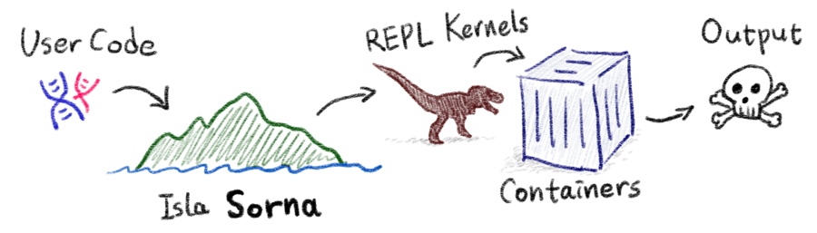

## Featured Highlight

Now [API key registration](https://cloud.sorna.io) is open (beta)!

For more fun, we have also released an Atom editor / Visual Studio Code plugin,
[`live-code-runner`](https://atom.io/packages/live-code-runner),
that runs your code directly from the editor without installing anything else!

 * Search and install `live-code-runner` in Atom's package manager.
 * Get Sorna API access / secret key at [Sorna Cloud](https://cloud.sorna.io)
 * Type your keys on package preferences page.
 * You are ready to go!

<div class="video-container">
  <iframe width="853" height="480" src="https://www.youtube.com/embed/IVX1SClEaMY" frameborder="0" allowfullscreen></iframe>
</div>

## Getting Started

All you need is [Python 3.6](https://www.python.org/downloads/) or higher.  
(Yes, it works as well on Windows!)

Just do some magic on your command line:

```sh
$ pip install sorna-client
$ export SORNA_ACCESS_KEY=...
$ export SORNA_SECRET_KEY=...
```

Then run the following Python code:

```python
from sorna.kernel import Kernel

kern = Kernel('lua5')
result = kern.execute('print("hello world!")', mode='query')
print(result['console'])
# hello world!
kern.destroy()
```

*Coming soon:* run your code from the command line!

```sh
$ python -m sorna plot.py some-data.csv
```

*Coming soon:* compile your code as well!

```sh
$ python -m sorna --build="make" main.c lib.c lib.h Makefile
```


Now you have executed a real Lua code without installing Lua (in our clouds)!  

Want more? How about GPU-backed TensorFlow?  
There are [many more languages you can use](http://github.com/lablup/sorna-repl).
Currently Sorna supports 11 programming languages now.

You may run also [your own Sorna API server on your machines](https://github.com/lablup/sorna).  
<sup>* Python 3.6+, Linux 64bit or macOS, Docker 1.12+ required</sup>

## Server Architecture

Sorna consists of three loosely coupled components.

 * **sorna-gateway**: Provides an HTTP REST API server and routes user code snippets to agents.

 * **sorna-agent**: Executes user code snippets inside Docker containers.

 * **sorna-repl**: The Docker containers with REPL (read-evaluate-print-loop) daemons in various programming languages.

We call each code-running container *a kernel*.
All kernels have our custom-built sandbox (called "sorna-jail") that secures our infrastructure on the system-call level.

Additionally, we provide a pluggable **sorna-media** Javascript library and Python packages for front-end services to render interactive graphics and handle multi-media outputs generated from kernels.

## FAQ

Q: Why "Sorna"?

 : It's an acronym for "Software on Remote Networking Appliances". Kidding?  
   Here is the real origin...  
   {:width="450px"}

Q: vs. AWS Lambda?

 : Sorna has no packaging process --- just run your code snippets on-the-fly.

Q: vs. Apache Zeppelin / Jupyter Notebooks?

 : Sorna is a pure *back-end API* with an optional front-end helper library (sorna-media).
   It can be plugged into existing front-ends including Jupyter and Zeppelin as well to extend their computation capabilities to cloud-scale!
   We plan to provide such integration in the future.


## License

Sorna and its sub-projects are distributed under GNU Lesser Public License (LGPL) 2.0.
