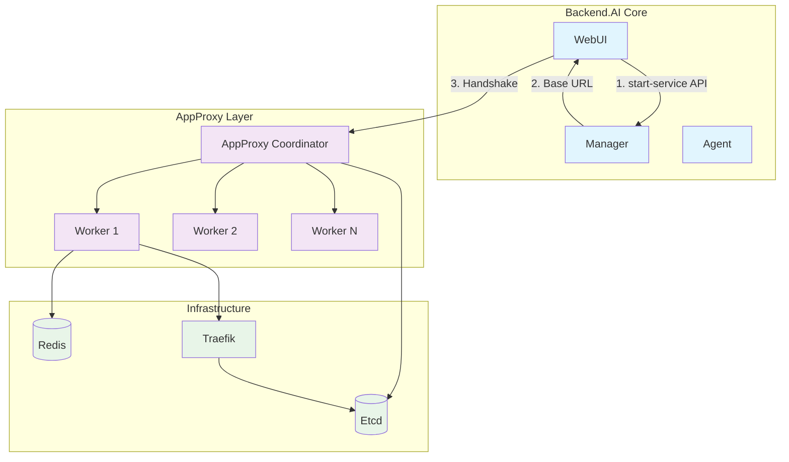
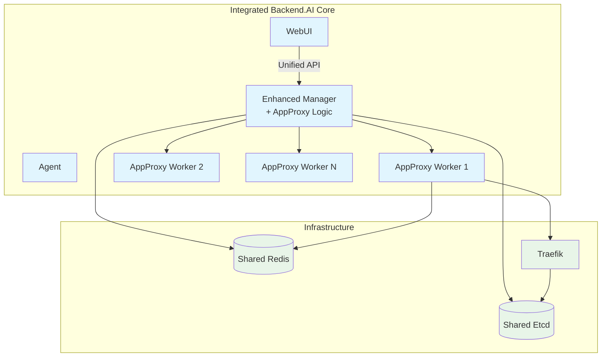
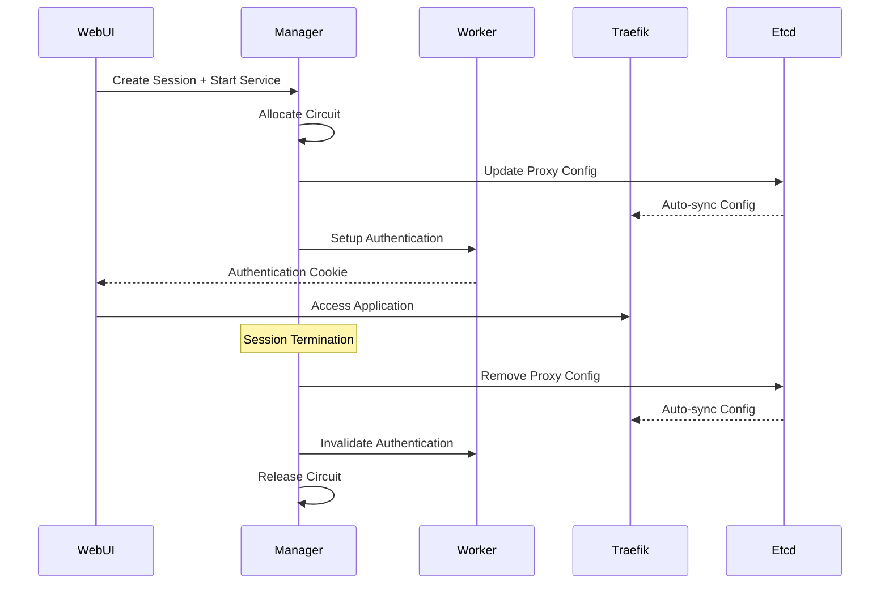

# Backend.AI AppProxy Architecture Enhancement

## Abstract

This BEP (Backend.AI Enhancement Proposal) outlines comprehensive improvements to the Backend.AI AppProxy architecture. The proposal addresses critical issues including lifecycle synchronization between sessions and circuits, authentication integration, TCP idle timeout functionality, and open-sourcing of the AppProxy component. The proposed architecture aims to consolidate AppProxy Coordinator functionality into the Backend.AI Manager, enabling better resource management and eliminating current connectivity constraints.

## Motivation

The current AppProxy architecture suffers from several architectural limitations that impact system reliability and maintainability. Originally, the separation between Backend.AI Core and AppProxy was an intentional design decision to maintain clear abstraction boundaries. However, the introduction of Model Service has compromised these abstraction barriers, creating hybrid requirements that the current architecture cannot adequately address.

Additionally, AppProxy is currently managed as a separate private repository from Backend.AI Core, which presents challenges for technical maintenance, enterprise stability assurance, and security issue management. Considering the ongoing maintenance overhead, enterprise stability requirements, and security issue reports that have emerged in the open source ecosystem, consolidating AppProxy through open-sourcing and integration appears to be the more sustainable approach.

Key technical issues include the inability to synchronize session and circuit lifecycles due to connectivity constraints between Manager and AppProxy. When sessions enter the TERMINATING state in the scheduler, circuit reclaim requests cannot be sent to AppProxy due to these connectivity limitations. Additionally, while SameSite cookie restrictions and Redis layer abstraction are not inherently problematic, these factors prevent unified session cookie management between Webserver and AppProxy, creating authentication synchronization challenges.

TCP circuit management presents additional challenges, as Traefik-based AppProxy Workers cannot implement TCP idle timeout functionality. This limitation stems from Traefik's lack of TCP access log support for non-HTTP TCP proxies and absence of TCP plugin functionality, which are essential for detecting idle connections and implementing timeout mechanisms. These Traefik limitations hinder effective TCP resource management and monitoring capabilities.

The current architecture also complicates inference circuit lifecycle management, requiring Manager to break abstraction boundaries by directly calling Coordinator REST APIs for session creation, destruction, and health status updates.

## As-is

### Current Architecture Overview

### Interactive App Creation Flow

The current interactive app creation process follows these steps:

1. WebUI calls Manager's `/session/{id}/start-service` API
2. Manager responds with AppProxy Coordinator's Base URL (no handshake between Manager and Coordinator)
3. WebUI uses the received Base URL to proceed with handshake process with Coordinator
4. Coordinator manages circuit allocation and worker assignments

### Component Responsibilities

#### Coordinator Functions
- **Worker Lifecycle Management**: Manages worker health checks and excludes unresponsive workers from port pools
- **App Allocation**: Receives circuit creation requests from browsers and assigns idle ports from worker-reported port pools
  - Port-based workers: Assigns lowest available value
  - Wildcard-based workers: Generates 6-character random hex
- **Configuration Management**: Pushes idle port configurations, proxy backends, and authentication information to Etcd for real-time Traefik consumption
- **Authentication**: Creates JWT tokens with pre-shared secrets and redirects browsers to Worker's `/setup` API
- **Inference Circuit Management**: Receives session creation/destruction/health status updates from Manager via REST API calls

#### Worker Functions
- **Authentication Cookie Injection**: Handles `/setup` API for browser authentication
- **Traffic Monitoring**: Receives circuit traffic history from Traefik via Unix Domain Socket and updates Redis

### Current Limitations

The existing architecture presents several structural problems:

**Connectivity Constraints**: While Backend.AI Manager and AppProxy were originally designed with separate abstraction boundaries, the introduction of Model Service has broken these boundaries, creating inconsistent architectural patterns. The current inability for bidirectional communication prevents proper session-circuit lifecycle synchronization.

**Independent Authentication Systems**: Webserver and AppProxy maintain separate authentication entities. While SameSite cookie restrictions and Redis layer abstraction are not inherently problematic, these factors prevent unified session cookie management between the two systems, creating authentication synchronization challenges.

**TCP Circuit Limitations**: Traefik-based AppProxy Workers cannot implement TCP idle timeout functionality due to Traefik's inherent limitations: lack of TCP access log support for non-HTTP TCP proxies and absence of TCP plugin functionality. These missing features prevent the detection of idle TCP connections and implementation of automated timeout mechanisms.

## Suggested Architecture

### Unified Architecture Overview

### Session and Circuit Lifecycle Synchronization

### Key Architectural Changes

#### AppProxy Integration into Manager
The proposed architecture consolidates all Coordinator functionality into the Backend.AI Manager, enabling:

**Unified Lifecycle Management**: Sessions and circuits share the same lifecycle, ensuring proper resource cleanup when sessions terminate.

**Real-time Backend Updates**: Inference circuit proxy backends can be updated in real-time without breaking abstraction boundaries.

**Enhanced Session Management**: Integration enables coordinated session invalidation across components (detailed in Enhanced Session Management section).

#### Shared Infrastructure Requirements
The integrated architecture requires Manager and Workers to access the same Redis and Etcd clusters, establishing a shared infrastructure foundation.

**Critical Network Requirements**: The proposed architecture mandates **East-West traffic reachability** between Backend.AI Manager and Backend.AI AppProxy Workers (including Traefik). This represents a significant infrastructure requirement change for customer deployments. Current and future customer environments must ensure bidirectional communication capabilities between these components, which may require updates to their network policies, firewalls, and service mesh configurations.

#### Enhanced Session Management
**Automatic Session Invalidation**: Webserver logout automatically invalidates AppProxy sessions through coordinated logout URI management.

**Dynamic Logout URI Configuration**: Account Manager maintains dynamically configurable logout URI lists for browser traversal during logout processes.

## Implementation Plan

### Phase 1: Infrastructure Preparation

#### Shared Database Access
- Configure Manager access to AppProxy Redis and Etcd clusters
- Implement connection pooling and failover mechanisms
- Establish monitoring and alerting for shared infrastructure

#### Authentication System Integration
- Design unified authentication token system
- Implement cross-component session validation
- Create logout URI management system in Account Manager

### Phase 2: Manager Integration

#### AppProxy Logic Migration

#### Session Integration
- Implement circuit creation during session startup
- Add circuit termination to session cleanup procedures
- Create circuit health monitoring integrated with session health checks

### Phase 3: TCP Idle Timeout Enhancement

#### Traefik Extension Evaluation

**Lifecycle Synchronization First Approach**
Given the technical complexity and ongoing maintenance requirements of forking Traefik, the primary strategy should focus on session-circuit lifecycle synchronization. This approach may eliminate the need for TCP idle timeout functionality entirely, as circuits will be automatically terminated when their associated sessions end.

**Conditional Traefik Enhancement**
TCP idle timeout functionality should only be pursued if lifecycle synchronization proves insufficient for resource management needs:

**Option 1: Plugin Development** (Preferred if needed)
- Develop Traefik plugin for TCP idle timeout detection
- Implement access logging for TCP connections
- Create circuit activity monitoring system

**Option 2: Traefik Fork** (Last resort)
- Fork Traefik with enhanced TCP support only if plugin approach is insufficient
- Consider long-term maintenance overhead and upgrade compatibility
- Evaluate trade-offs against lifecycle synchronization benefits

**Option 3: Alternative Monitoring** (Interim solution)
- Implement connection monitoring at Worker level
- Use system-level connection tracking
- Create periodic circuit health validation

### Phase 4: Open Source Preparation

#### Code Cleanup and Documentation
- Remove proprietary dependencies
- Create comprehensive API documentation
- Implement configuration examples and deployment guides

#### Community Integration
- Establish contribution guidelines
- Create issue templates and development workflows
- Set up continuous integration for open source repository

## Migration Strategy

### Backward Compatibility
During the transition period, both old and new architectures must coexist:

**Feature Flag Implementation**: Use feature flags to enable new AppProxy functionality while maintaining existing behavior.

**Gradual Migration**: Migrate services incrementally, starting with new sessions while maintaining existing circuits.

**Rollback Capability**: Maintain ability to revert to previous architecture if issues arise.

### Testing Strategy
**Integration Testing**: Comprehensive testing of Manager-Worker communication and lifecycle synchronization.

**Load Testing**: Validate performance under high concurrent circuit loads.

**Failover Testing**: Test behavior during infrastructure failures and component restarts.

## Benefits and Trade-offs

### Benefits
**Simplified Architecture**: Eliminates abstraction boundaries and connectivity constraints between components.

**Improved Resource Management**: Synchronized lifecycles ensure proper cleanup and resource utilization.

**Enhanced Monitoring**: Unified system enables comprehensive logging and monitoring capabilities.

**Better Scalability**: Integrated architecture supports more efficient scaling and load distribution.

### Trade-offs
**Increased Manager Complexity**: Manager becomes responsible for additional AppProxy functionality.

**Customer Infrastructure Requirements**: Requires shared access to Redis and Etcd clusters, and **mandatory East-West traffic reachability** between Manager and AppProxy Workers. This network connectivity requirement may necessitate significant infrastructure changes in customer environments, particularly those with strict network segmentation policies.

**Migration Complexity**: Transitioning existing customer deployments requires careful planning and execution, particularly for network topology modifications in on-premise environments.

### TCP Idle Timeout Considerations
The necessity of TCP idle timeout functionality requires careful evaluation against implementation complexity and maintenance overhead. Since the original abstraction boundary between Manager and AppProxy was intentionally designed but has been compromised by Model Service requirements, the proposed session-circuit lifecycle synchronization may provide sufficient resource management without requiring complex Traefik modifications.

TCP circuits typically don't involve browser-based authentication, making the lifecycle synchronization approach potentially more effective than idle timeout mechanisms. The decision to pursue Traefik fork development should be deferred until after lifecycle synchronization implementation is complete and its effectiveness can be properly assessed.

## Plan

### Phase 1: Open Source Preparation (Week 1)
- Remove proprietary dependencies from AppProxy codebase
- Create comprehensive API documentation
- Implement configuration examples and deployment guides
- Establish contribution guidelines and development workflows
- Set up continuous integration for open source repository

### Phase 2: Foundation and Integration (Weeks 2-3)
- Validate **East-West traffic reachability** requirements for customer environments
- Document network connectivity prerequisites for customer infrastructure teams
- Set up shared infrastructure access (Redis and Etcd clusters)
- Implement unified authentication system
- Create feature flag framework
- Migrate Coordinator functionality to Manager
- Implement circuit-session lifecycle synchronization

### Phase 3: Enhancement and Optimization (Week 4)
- Validate session-circuit lifecycle synchronization effectiveness
- Evaluate TCP idle timeout requirements post-integration
- Optimize performance and monitoring
- Complete integration testing
- Prepare deployment configurations

**Note on TCP Idle Timeout**: The necessity for Traefik fork development should be reassessed after session-circuit lifecycle synchronization is complete. The lifecycle synchronization approach may provide sufficient resource management capabilities, eliminating the need for complex Traefik modifications and associated maintenance overhead.

### Phase 4: Testing and Production Deployment (Weeks 5-6)
- Deploy integrated system in staging environment
- Conduct comprehensive testing (integration, load, failover)
- Deploy to production with gradual migration
- Monitor and optimize production performance
