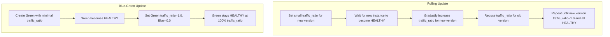

# Backend.AI Model Service Deployment Strategy Enhancement

## Abstract

This proposal aims to enhance the Backend.AI Model Service deployment process by providing more sophisticated, zero- or near-zero-downtime strategies. Specifically, it outlines how to implement rolling updates and blue-green deployments to ensure minimal service interruption. In addition, it proposes a way to dynamically update environment variables and to rollback when needed.

## Motivation

As model serving usage has been growing, Backend.AI introduced the “Model Service” in version 23.09 and Backend.AI FastTrack introduced the “Model Serving Task” in 25.09 to meet evolving market needs. However, the current deployment process does not fully support strategies for zero-downtime deployment—an important requirement for end user-facing services. To address this limitation, we propose:
• A rolling update mechanism that updates services incrementally while keeping a subset of instances operational.
• A blue-green deployment flow suitable for use cases requiring isolated testing or strict regulatory requirements.
• A rollback capability that preserves service continuity in case of errors in the new version.

## Design

### AS-IS

- Deployments only support simple replacement or upgrades, causing short service interruptions.
- Environment variables are fixed at deployment time and cannot be dynamically updated.
- The system lacks fine-grained versioning (e.g., a dedicated “version” field in the `Routing` object) for easier rollback or co-existence of multiple versions.

### TO-BE

1. Introduce a Rolling Update Strategy:
- When a user triggers a promotion or update, Backend.AI attempts to create new model service sessions incrementally.
- New instances are launched and must pass health checks before receiving a portion of traffic. Once a new instance is deemed healthy, traffic is gradually shifted. This continues until all instances run the new version without causing significant service downtime.
- In the event of a failure during rollout, rollback can occur automatically or manually. However, automatic rollback applies only to the newly deployed version, and specific rules (e.g., timeout, error rate thresholds, resource constraints) govern exactly when it triggers. This helps ensure issues are contained early, while giving users control over rollback policies.
- Manual rollback is always possible through versioned deployments, allowing users to revert to a previous stable version with minimal disruption.

2. Introduce a Blue-Green Deployment Mode:
- A user initiates a deployment update via API (UI and CLI support planned).
- The existing active deployment is referred to as “Blue.” The new one is “Green.”
- The system creates new “Green” routings—each with an initial traffic ratio of 0.0—equal to the desired replica count.
- Once the new “Green” routings are all healthy (or have passed custom validation checks), the system updates `traffic_ratio` to 1.0 for Green and to 0.0 for the old Blue.
- Blue routings are retained temporarily for rollback purposes or removed entirely if deemed stable.
- The Model Service returns to a `HEALTHY` (or “active”) status.

3. Enable Updating of Environment Variables:
- Allow environment variables (envs) to be modified during rolling or blue-green updates, removing the need for redeployment solely for env changes.
- Provide graceful handling of env changes so that sessions have time to reload configurations and verify correctness.

4. Enhance Versioning:
- Each `Routing` gains a new field: `version`.
- The system can track which version is currently in production (and previous stable ones), making rollbacks simpler.

### Detailed Flow for Deployment Strategies

Below is a unified architectural approach that supports both rolling updates and blue-green deployments. While the steps share a common foundation, they differ mainly in how traffic is shifted between the old and new versions.

#### Common Process Overview
1. User triggers or submits a promotion (API/UI/CLI) to deploy a new version of the Model Service.
2. The system checks resource availability (e.g., replicas × required resources). If insufficient, the deployment request is rejected.
3. New routing objects (pointing to the updated version) are created with an initial traffic ratio.
4. The system monitors each new instance’s health. Once the health checks pass (or other validations are satisfied), traffic is gradually or fully diverted according to the chosen strategy (rolling or blue-green).
5. If at any point validation fails, the process may pause or roll back to a stable version.
6. Upon successful completion, the new version handles all (or the majority) of traffic, and the old version is either terminated or retained briefly for rollback.

#### Rolling Update
1. Set a small initial `traffic_ratio` on the new version.
2. Wait for each new instance to become 'HEALTHY'.
3. Gradually increase the `traffic_ratio` for the new version while reducing it for the old one.
4. Continue until the new version’s `traffic_ratio` reaches 1.0 and all instances are 'HEALTHY'.

#### Blue-Green Update
1. Create a new version (Green) with a minimal `traffic_ratio` (e.g., 0.0 or very low).
2. Once Green is 'HEALTHY', adjust `traffic_ratio` to route traffic fully to Green.
3. Simultaneously reduce the old (Blue) version’s `traffic_ratio` to 0.0.
4. When Green remains 'HEALTHY' at 100% `traffic_ratio`, the update is complete.

### Rollback Considerations

- Both rolling and blue-green strategies can revert to a prior stable version if errors arise.
- Retaining the old version (with its associated environment variables and configuration) until final confirmation ensures a seamless fallback option.

### Canary Support (Future Extension)

- Introduce a subset of new routes (e.g., 5-10% traffic) to test the new version in production-like conditions.
- If error rates exceed a defined threshold, the canary is rolled back before full deployment.
- This feature would require additional monitoring and alerting capabilities to be fully effective.

## Conclusion

Introducing rolling updates and blue-green deployments will help achieve near-zero downtime, minimize risk during releases, and allow for dynamic configuration changes. These enhancements will significantly improve the deployment experience for both customers and end users of the Backend.AI Model Service.

### References

- Kubernetes - Performing a Rolling Update: https://kubernetes.io/docs/tutorials/kubernetes-basics/update/update-intro/
> Rolling updates allow Deployments to take place with zero downtime by incrementally updating Pods instances with new ones.

- Kubernetes - ReplicaSet: https://kubernetes.io/docs/concepts/workloads/controllers/replicaset/
