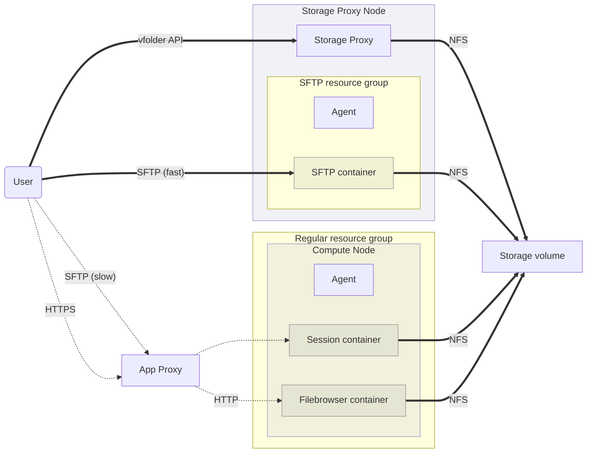
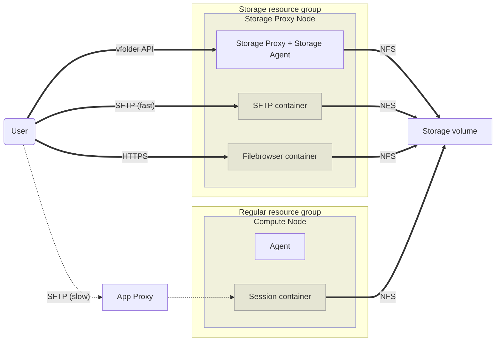

# Storage Agent

## Background

This porposal defines the extension of storage-proxy to host "direct-access" sessions for fast-path of large file transfers:

- They bypass App Proxy to minimize the traffic forwarding overheads.
- They directly access the storage volume mount to minimize the burden of the data-plane.
  The best place to achieve the above conditions is **Storage Proxy**.

This issue overrides the concept of previously proposed "DIRECT_ACCESS" sessions.

## Current design

So far, we have implemented a specialized form of resource group and session for "SFTP", as the above diagram shows.

* There is a special "SFTP resource group" where a regular Agent manages "SFTP sessions".

* There is a special `keypair.sftp_concurrency_used.{access_key}` counter in addition to the `keypair.concurrency_used.{access_key}` counter in Redis.

* The agent is unmodified and we have missed to include additional measures to consider publicly exposed container ports.

* Still, [Filebrowser](https://filebrowser.org/) sessions are just regular sessions using the _current_ resource group.
  The WebUI has a special filter to show them separately and executes them from the storage folder list view.

  - ref) https://github.com/lablup/backend.ai-webui/blob/11ca13ffab4c0ef782b8c4a6d1971b20292ec5d3/src/components/backend-ai-folder-explorer.ts#L1488

## Proposed design

### Goals

- Simplify the deployment and configuration of storage agent(s).
  Once users/developers install Backend.AI and its Storage Proxy, _there should be nothing special to do_ for starting use of "fast" SFTP sessions.
  Currently we have to do extra `docker pull` and agent/resource-group configuration to say which image is for SFTP and filebrowser, etc.

- Let's avoid incorporating bug-prone specialized implementations and configurations just for "SFTP" sessions.

**DESIGN**

* Generalize "SFTP resource group" to **Storage resource group**.

  - Manager won't _allocate_ (i.e., exclusively reserve) the occupied resource slots for the containers in storage resource groups.

    Instead, it will limit the total number of containers per storage agent (configured in `storage-agent.toml` and reported via heartbeat) to allow oversubscription of storage-access containers.

  - Still, storage agents set per-container cgroup resource limits. (Proposed default: 1 CPU core, 1 GiB RAM)

* Generalize "sftp concurrency limit" to "max session count per resource group per user".

* Combine **Storage Proxy** with **Storage Agent**.

  - Storage Agent reuses the existing `DockerAgent` backend but adds security features to allow exposing container ports publicly.
  
  - In a single Python process, both the Storage Proxy's aiohttp application and the Storage Agent's RPC handler runs side-by-side.
  
  - It uses `storage-agent.toml` (which is almost compatible with `agent.toml`) so that a regular agent and the storage agent together in an all-in-one setup with ease.
  
  - Let **Storage Agent** also manage the Filebrowser sessions and make them faster in the same way.

### Expected technical issues

- Filebrowser containers should have HTTPS (self-signed certificates or customer-provided ones) if exposed to the public network.
  This could be implemented as a storage-agent configuration to auto-generate or inject the certificates and mount it into the filebrowser containers.

## References

- Original issue: lablup/backend.ai#2791 (BA-86)
- lablup/backend.ai#1809
- lablup/backend.ai#2746
- lablup/backend.ai#1679

