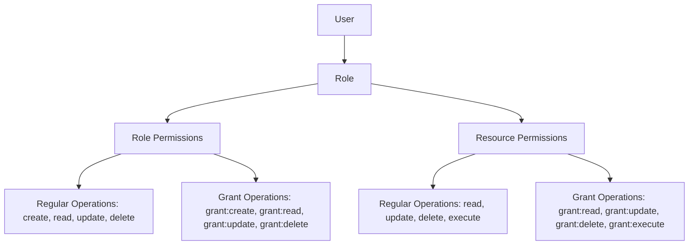

# Backend.AI Role-Based Access Control (RBAC)

## Abstract

This BEP (Backend.AI Enhancement Proposal) introduces the Role-Based Access Control (RBAC) system for Backend.AI. This system enables granular permission management for users and projects, providing flexible access control suitable for various use cases. RBAC defines API access permissions according to user roles, thereby enhancing security and management efficiency.

## Motivation

Backend.AI allows multiple users to perform various operations on different entities such as sessions, vfolders, and images, with limited permissions granted through user or project privileges. However, the current authentication and permission management system provides fragmented permissions for specific domain tasks and lacks granular permission management, making it difficult to set detailed permissions. Additionally, inconsistent permission management for users and projects does not guarantee consistent behavior at the time of permission verification.

To address these issues, Backend.AI aims to introduce a Role-Based Access Control (RBAC) system. The RBAC system defines permissions for various entities and operations throughout the system according to user roles and manages permissions in a generalized manner. This enables granular permission settings and consistent permission management. Furthermore, the RBAC system ensures consistent permission verification for all requests, enhancing security and management efficiency.

## Design

### Permission Architecture



Users can have one or more Roles, and each Role has multiple Permissions. Previously, each permission was assigned and managed directly to users, but this made the relationship between users and permissions complex and difficult to manage. Therefore, Roles were introduced to group permissions, and users are granted permissions through Roles. This structure improves consistency in permission management and simplifies the relationship between users and permissions.

Permissions are divided into 2 main types:
1. **Role Permissions**: Defines permissions for operations on a specific Entity Type.
2. **Resource Permissions**: Defines permissions for operations on a specific Entity.

Each permission type includes both regular operations and grant operations. Grant operations (prefixed with "grant:") allow a role to grant the corresponding regular operation to other roles.

#### Role Permissions

Role Permissions define permissions for operations on a specific Entity Type. Operations include:
- **Regular operations**: 'create', 'read', 'update', 'delete', etc.
- **Grant operations**: 'grant:create', 'grant:read', 'grant:update', 'grant:delete', etc.

A Role with regular permissions can perform operations on all Entities of the Entity Type accessible within a specific scope. A Role with grant permissions can grant the corresponding regular permissions to other Roles within the same or narrower scope.

For example:
- A role with 'read' permission for 'session' entity type can read all sessions within their scope
- A role with 'grant:read' permission for 'session' entity type can grant 'read' permission to other roles

#### Resource Permissions

Resource Permissions define permissions for operations on a specific Entity. Operations include:
- **Regular operations**: 'read', 'update', 'delete', 'execute', etc.
- **Grant operations**: 'grant:read', 'grant:update', 'grant:delete', 'grant:execute', etc.

A Role with regular permissions can perform operations only on that specific Entity. A Role with grant permissions can grant the corresponding regular permissions for that specific Entity to other Roles.

This enables granular permission management such as granting only 'read' permission for a specific Session, or granting 'read' and 'update' permissions for a specific VFolder to enable collaboration with other users.

### Managing Roles as Entities

Roles themselves are entities that can be managed through the RBAC system. This enables controlled delegation of role management responsibilities across different scopes.

#### Role Management Operations

- **create**: Create new roles within the permitted scope
- **read**: View role definitions and their permissions
- **update**: Modify role names, descriptions, and permissions
- **delete**: Soft-delete roles by changing their state
- **assign**: Assign roles to users within the permitted scope

#### Role Scope Hierarchy

Roles follow the same scope hierarchy as other permissions:
- **Global roles**: Can be used across the entire system
- **Domain roles**: Can be used within a specific domain
- **Project roles**: Can be used within a specific project
- **User roles**: Specific to individual users

Role management permissions respect this hierarchy - for example, a domain admin can only create and manage roles within their domain scope.

### Grant Permission Rules

1. **Scope Hierarchy**: Permissions can only be granted within the same or narrower scope
   - Global scope can grant to: global, domain, project, or user scope
   - Domain scope can grant to: domain, project, or user scope (within same domain)
   - Project scope can grant to: project or user scope (within same project)
   - User scope can grant to: user scope only

2. **Grant Authority**: Having 'grant:X' permission allows granting 'X' permission, regardless of whether the granter has 'X' permission themselves

3. **Revoke Authority**: Having 'grant:X' permission includes the ability to revoke 'X' permission that they granted

4. **No Grant Delegation**: There is no 'grant:grant' permission to prevent complex delegation chains

### Flow

#### RBAC check Flow

1. A user requests an operation by calling a specific REST API or GraphQL.
2. All requests verify permissions in the Action Processor.
3. The permissions for the requested Action and Entity are verified.
   1. If there are Role Permissions, the Operations defined in those Role Permissions are verified.
   2. If there are Resource Permissions, the Resource Permissions for that Entity ID are verified.
4. If permissions exist, the request is processed; otherwise, an appropriate error message is returned.

#### Grant Flow

1. A user requests a Grant operation by calling a specific REST API or GraphQL.
2. The Action Processor verifies whether the Grant request can be performed.
3. It checks whether the requested permission can be granted:
   1. Verify the granter has the corresponding grant permission (e.g., 'grant:read' to grant 'read')
   2. Verify the scope hierarchy rule is followed
   3. For resource permissions, verify the granter has access to the specific resource
4. If all checks pass, the Permission is granted; otherwise, an appropriate error message is returned.

#### Role Management Flow

1. **Creating a Role**:
   - User must have 'create' permission for entity_type='role' within the target scope
   - The new role is created with the same or narrower scope than the creator's permission scope

2. **Assigning a Role**:
   - User must have 'assign' permission for the specific role
   - The assignment respects scope hierarchy (can only assign to users within the same or narrower scope)
   - Creates a new record in the user_roles table

3. **Modifying a Role**:
   - User must have 'update' permission for entity_type='role' within the role's scope
   - Changes to role permissions are immediately reflected for all users with that role

4. **Deleting a Role**:
   - User must have 'delete' permission for entity_type='role' within the role's scope
   - Performs soft delete by updating the 'state' field and setting 'deleted_at' timestamp
   - Existing user_roles assignments can be retained for audit purposes

### Database Schema

The RBAC system of Backend.AI is implemented by extending the existing database structure. New RBAC tables are integrated with the existing scope-based permission system.

#### Core RBAC Tables

##### 1. roles table

```sql
CREATE TABLE roles (
    id UUID PRIMARY KEY DEFAULT gen_random_uuid(),
    name VARCHAR(64) NOT NULL,
    description TEXT,
    state VARCHAR(32) DEFAULT 'active',
    created_at TIMESTAMP WITH TIME ZONE DEFAULT NOW(),
    updated_at TIMESTAMP WITH TIME ZONE DEFAULT NOW(),
    deleted_at TIMESTAMP WITH TIME ZONE,
    UNIQUE(name, scope_type, scope_id)
);
```

The roles table defines sets of Permissions within the system. Each Role includes a name, description, state, etc. The `state` field enables soft deletion and role lifecycle management. This table itself does not actually grant permissions, but connects with other tables to manage permissions. The `id` value of the `roles` table is used as the `role_id` in each permissions table, defining the relationship between Roles and Permissions.

##### 2. user_roles table
```sql
CREATE TABLE user_roles (
    id UUID PRIMARY KEY DEFAULT gen_random_uuid(),
    user_id UUID NOT NULL REFERENCES users(uuid) ON DELETE CASCADE,
    role_id UUID NOT NULL REFERENCES roles(id) ON DELETE CASCADE,
    granted_by UUID REFERENCES users(uuid),
    granted_at TIMESTAMP WITH TIME ZONE DEFAULT NOW(),
    expires_at TIMESTAMP WITH TIME ZONE,
    state VARCHAR(32) DEFAULT 'active',
    deleted_at TIMESTAMP WITH TIME ZONE,
    UNIQUE(user_id, role_id)
);
```

The user_roles table defines the relationship between each user and Role. Users can have multiple Roles, and each Role receives permissions through associations with specific permissions tables. Users granted permissions can record who granted the permission through the `granted_by` field. The `expires_at` field allows for temporary role assignments that automatically expire at a specified time. The `state` and `deleted_at` fields enable soft deletion of role assignments while maintaining audit history.

##### 3. role_permissions table (Role Permissions)
```sql
CREATE TABLE role_permissions (
    id UUID PRIMARY KEY DEFAULT gen_random_uuid(),
    role_id UUID NOT NULL REFERENCES roles(id) ON DELETE CASCADE,
    entity_type VARCHAR(32) NOT NULL, -- 'session', 'vfolder', 'image', 'role', etc.
    operation VARCHAR(32) NOT NULL,   -- 'create', 'read', 'update', 'delete', 'assign', 'grant:create', 'grant:read', etc.
    scope_type VARCHAR(32),           -- 'global', 'domain', 'project', 'user'
    scope_id VARCHAR(64),             -- Specific scope identifier
    created_at TIMESTAMP WITH TIME ZONE DEFAULT NOW(),
    UNIQUE(role_id, entity_type, operation, scope_type, scope_id)
);
```

The role_permissions table defines Operations that a Role can perform on specific Entity Types. This table grants permissions for entity_type and operation to a specific Role. A Role with the regular permissions and the grant permissions can perform operations on all Entities of the Entity Type within a defined scope. The entity_type='role' enables role management permissions, with operations including 'create', 'read', 'update', 'delete', and 'assign'.

##### 4. resource_permissions table (Resource Permissions)
```sql
CREATE TABLE resource_permissions (
    id UUID PRIMARY KEY DEFAULT gen_random_uuid(),
    role_id UUID NOT NULL REFERENCES roles(id) ON DELETE CASCADE,
    entity_type VARCHAR(32) NOT NULL, -- 'session', 'vfolder', 'image', etc.
    entity_id UUID NOT NULL,          -- Specific entity ID
    operation VARCHAR(32) NOT NULL,   -- 'read', 'update', 'delete', 'execute', 'grant:read', 'grant:update', etc.
    created_at TIMESTAMP WITH TIME ZONE DEFAULT NOW(),
    UNIQUE(role_id, entity_type, entity_id, operation)
);
```

The resource_permissions table defines Operations that a Role can perform on specific Entities. This table grants permissions for entity_type and entity_id to a specific Role. A Role with the regular permissions and the grant permissions can perform operations only on that Entity.

#### Migration from Existing Tables (Example: VFolder Invitation)

Currently, Backend.AI has the VFolder Invitation feature, which operates by granting permissions for VFolders to specific users. For migration to the new RBAC system, the existing VFolder Invitation feature can be modified to fit the new RBAC structure.

1. **Existing VFolder Invitation Table**:
   - Currently, VFolder Invitation operates by granting permissions for VFolders to specific users.
   - This feature is managed in the `vfolder_invitations` table.

2. **Migration to the New RBAC System**:
    - Convert the `vfolder_invitations` table to the `resource_permissions` table of the new RBAC system.
    - Each VFolder Invitation is added as a new record to the `resource_permissions` table.
    - Set the `entity_type` field to 'vfolder' and the `entity_id` field to the ID of the corresponding VFolder.
    - Set the `operation` field to permissions such as 'read', 'update'.

3. **Change in Existing Permission Check**:
   - Remove the permission verification logic from the existing VFolder Invitation feature.
   - Instead, use the permission verification logic of the new RBAC system to check permissions in the Service Layer of VFolder.

## Predefined Roles

The system includes five predefined roles with the following general permissions:

1. **super-admin**: Global administrator with full permissions across the entire system
   - Can create, read, update, delete, and assign all roles globally
   - Has all permissions for all entity types

2. **admin**: Domain-level administrator with full permissions within their domain
   - Can create, read, update, delete, and assign roles within their domain
   - Has all permissions for all entity types within their domain scope

3. **project-admin**: Project-level administrator with full permissions within their project
   - Can create, read, update, delete, and assign roles within their project
   - Has all permissions for all entity types within their project scope

4. **monitor**: Read-only access for monitoring purposes
   - Can read all entities within their assigned scope
   - Cannot create, update, delete, or assign any roles

5. **user**: Basic user with limited permissions for their own resources
   - Can read and update their own resources
   - Cannot manage roles

Detailed permission sets for each role will be defined in the implementation specification.

## Conclusion

The RBAC system of Backend.AI enables granular permission management for users and projects, providing flexible access control suitable for various use cases. This system manages permissions based on Roles and allows granular permission settings through Role Permissions and Resource Permissions. The RBAC system ensures consistent permission verification for all requests, enhancing security and management efficiency.