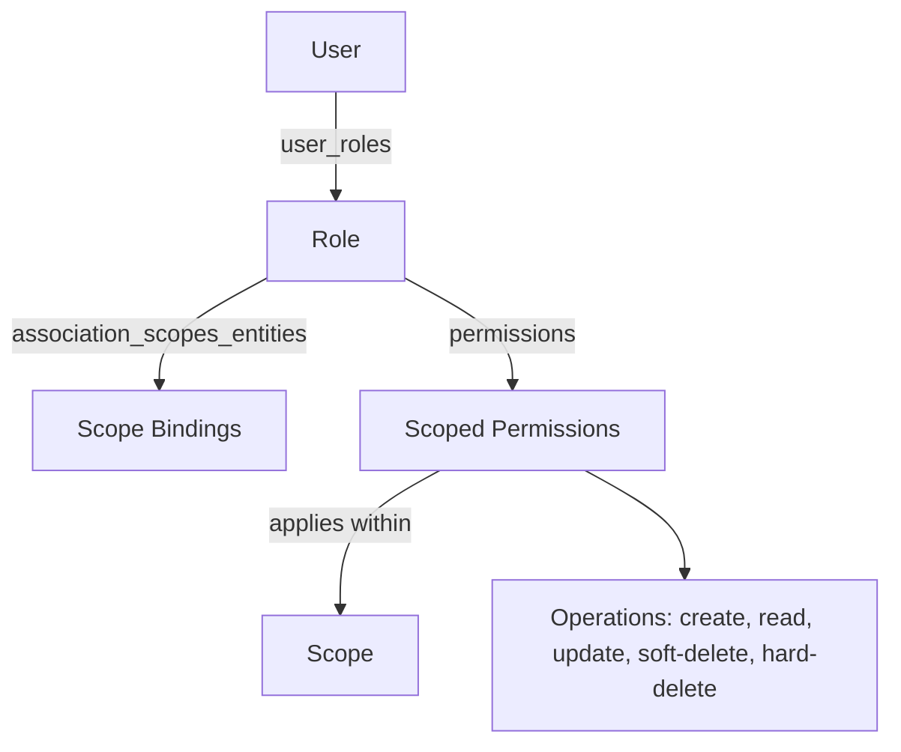

# Backend.AI Role-Based Access Control (RBAC)

## Abstract

This BEP (Backend.AI Enhancement Proposal) introduces the Role-Based Access Control (RBAC) system for Backend.AI. This system enables granular permission management for users and projects, providing flexible access control suitable for various use cases. RBAC defines API access permissions according to user roles, thereby enhancing security and management efficiency.

## Motivation

Backend.AI allows multiple users to perform various operations on different entities such as sessions, vfolders, and images, with limited permissions granted through user or project privileges. However, the current authentication and permission management system provides fragmented permissions for specific domain tasks and lacks granular permission management, making it difficult to set detailed permissions. Additionally, inconsistent permission management for users and projects does not guarantee consistent behavior at the time of permission verification.

To address these issues, Backend.AI aims to introduce a Role-Based Access Control (RBAC) system. The RBAC system defines permissions for various entities and operations throughout the system according to user roles and manages permissions in a generalized manner. This enables granular permission settings and consistent permission management. Furthermore, the RBAC system ensures consistent permission verification for all requests, enhancing security and management efficiency.

## Design

### Permission Architecture


```mermaid
graph TD
    A[User] -->|user_roles| B[Role]
    B -->|association_scopes_entities| S[Scope Bindings]
    B -->|permissions| C[Scoped Permissions]
    C -->|applies within| Scope
    C --> E[Operations: create, read, update, soft-delete, hard-delete]
```

Users can have one or more Roles, and each Role has multiple Permissions. Roles are introduced to group permissions, and users are granted permissions through Roles. This structure improves consistency in permission management and simplifies the relationship between users and permissions.

Roles are bound to one or more scopes via `association_scopes_entities`. Scope bindings determine role visibility, manageability, and user-scope membership. Permissions are independently scoped and can reference hierarchy scopes (domain/project/user) or entity-level scopes (vfolder/session/etc.).

#### Scoped Permissions

Scoped Permissions define permissions for operations on a specific Entity Type within a scope. Operations include:
- **Regular operations**: 'create', 'read', 'update', 'soft-delete', 'hard-delete', etc.
- **Grant operations**: 'grant:read', 'grant:update', 'grant:soft-delete', 'grant:hard-delete', etc.

A Role with regular permissions can perform operations on all Entities of the Entity Type accessible within the permission's scope.

For example:
- A role bound to Project-A with 'read' permission for 'session' entity type can read all sessions within Project-A
- A role bound to both Project-A and Project-B can have different permissions per scope

### Managing Roles as Entities

Roles themselves are entities that can be managed through the RBAC system. This enables controlled delegation of role management responsibilities across different scopes.

#### Role Management Operations

- **create**: Create new roles within the permitted scope
- **read**: View role definitions and their permissions
- **update**: Modify role names, descriptions, and permissions
- **delete**: Soft-delete roles by changing their state
- **assign**: Assign roles to users within the permitted scope

#### Role Scope Hierarchy

Roles follow the same scope hierarchy as other permissions:
- **Domain roles**: Can be used within a specific domain
- **Project roles**: Can be used within a specific project
- **User roles**: Specific to individual users

A role can be bound to multiple scopes and have different permissions per scope. Role management permissions respect the scope hierarchy — for example, a domain admin can only create and manage roles within their domain scope.

### Grant Permission Rules

1. **Scope Hierarchy**: Permissions can only be granted within the same or narrower scope
   - Domain scope can grant to: domain, project, or user scope (within same domain)
   - Project scope can grant to: project or user scope (within same project)
   - User scope can grant to: user scope only

2. **Grant Authority**: Having 'grant:X' permission allows granting 'X' permission, regardless of whether the granter has 'X' permission themselves

3. **Revoke Authority**: Having 'grant:X' permission includes the ability to revoke 'X' permission that they granted

4. **No Grant Delegation**: There is no 'grant:grant' permission to prevent complex delegation chains

### Flow

#### RBAC check Flow

1. A user requests an operation by calling a specific REST API or GraphQL.
2. All requests verify permissions in the Action Processor.
3. The permissions for the requested Action and Entity are verified.
   1. If there are Role Permissions, the Operations defined in those Role Permissions are verified.
   2. If there are Resource Permissions, the Resource Permissions for that Entity ID are verified.
4. If permissions exist, the request is processed; otherwise, an appropriate error message is returned.

#### Grant Flow

1. A user requests a Grant operation by calling a specific REST API or GraphQL.
2. The Action Processor verifies whether the Grant request can be performed.
3. It checks whether the requested permission can be granted:
   1. Verify the granter has the corresponding grant permission (e.g., 'grant:read' to grant 'read')
   2. Verify the scope hierarchy rule is followed
   3. For resource permissions, verify the granter has access to the specific resource
4. If all checks pass, the Permission is granted; otherwise, an appropriate error message is returned.

#### Role Management Flow

1. **Creating a Role**:
   - User must have 'create' permission for entity_type='role' within the target scope
   - The new role is created with the same or narrower scope than the creator's permission scope

2. **Assigning a Role**:
   - User must have 'assign' permission for the specific role
   - The assignment respects scope hierarchy (can only assign to users within the same or narrower scope)
   - Creates a new record in the user_roles table

3. **Modifying a Role**:
   - User must have 'update' permission for entity_type='role' within the role's scope
   - Changes to role permissions are immediately reflected for all users with that role

4. **Deleting a Role**:
   - User must have 'delete' permission for entity_type='role' within the role's scope
   - Performs soft delete by updating the 'state' field and setting 'deleted_at' timestamp
   - Existing user_roles assignments can be retained for audit purposes

### Database Schema

The RBAC system of Backend.AI is implemented by extending the existing database structure. New RBAC tables are integrated with the existing scope-based permission system.

#### Core RBAC Tables

##### 1. roles table

```sql
CREATE TABLE roles (
    id UUID PRIMARY KEY DEFAULT gen_random_uuid(),
    name VARCHAR(64) NOT NULL,
    source VARCHAR(16) NOT NULL DEFAULT 'system', -- 'system' or 'custom'
    description TEXT,
    status VARCHAR(32) DEFAULT 'active',
    created_at TIMESTAMP WITH TIME ZONE DEFAULT NOW(),
    updated_at TIMESTAMP WITH TIME ZONE DEFAULT NOW(),
    deleted_at TIMESTAMP WITH TIME ZONE
);
```

The roles table defines sets of Permissions within the system. Each Role includes a name, source, description, status, etc. The `status` field enables soft deletion and role lifecycle management. The `source` field indicates whether the role is system-generated or custom-created. This table itself does not contain scope information — Role-scope bindings are managed via the `association_scopes_entities` table.

##### 2. user_roles table
```sql
CREATE TABLE user_roles (
    id UUID PRIMARY KEY DEFAULT gen_random_uuid(),
    user_id UUID NOT NULL REFERENCES users(uuid) ON DELETE CASCADE,
    role_id UUID NOT NULL REFERENCES roles(id) ON DELETE CASCADE,
    granted_by UUID REFERENCES users(uuid),
    granted_at TIMESTAMP WITH TIME ZONE DEFAULT NOW(),
    UNIQUE(user_id, role_id)
);
```

The user_roles table defines the relationship between each user and Role. Users can have multiple Roles. When a role is assigned or unassigned, the system automatically syncs user-scope membership entries in `association_scopes_entities` (with `entity_type='user'`), enabling single-table membership lookups. This replaces the previous `association_groups_users` table for project membership.

##### 3. association_scopes_entities table (Scope-Entity Binding)
```sql
CREATE TABLE association_scopes_entities (
    id UUID PRIMARY KEY DEFAULT gen_random_uuid(),
    scope_type VARCHAR(32) NOT NULL,  -- 'domain', 'project', 'user'
    scope_id VARCHAR(64) NOT NULL,    -- Specific scope identifier
    entity_type VARCHAR(32) NOT NULL, -- 'role', 'user', 'vfolder', 'session', etc.
    entity_id VARCHAR(64) NOT NULL,   -- Entity identifier (e.g., role_id, user_id)
    relation_type VARCHAR(32) NOT NULL DEFAULT 'auto', -- 'auto' or 'ref'
    registered_at TIMESTAMP WITH TIME ZONE DEFAULT NOW(),
    UNIQUE(scope_type, scope_id, entity_id)
);
```

The association_scopes_entities table manages scope bindings for all entity types. Key usages:
- **Roles** (`entity_type='role'`): Defines which scopes the role is bound to, determining role visibility and manageability.
- **Users** (`entity_type='user'`): Stores user-scope membership, auto-synced on role assign/unassign. Enables single-table membership queries (replaces `association_groups_users`).
- **Other entities** (`entity_type='vfolder'`, `'session'`, etc.): Manages entity-scope associations for ownership and sharing.

The `relation_type` distinguishes between `auto` (primary scope binding) and `ref` (visibility-only, e.g., for cross-scope sharing).

##### 4. permissions table (Scoped Permissions)
```sql
CREATE TABLE permissions (
    id UUID PRIMARY KEY DEFAULT gen_random_uuid(),
    role_id UUID NOT NULL REFERENCES roles(id) ON DELETE CASCADE,
    scope_type VARCHAR(32) NOT NULL,  -- 'domain', 'project', 'user'
    scope_id VARCHAR(64) NOT NULL,    -- Specific scope identifier
    entity_type VARCHAR(32) NOT NULL, -- 'session', 'vfolder', 'image', 'role', etc.
    operation VARCHAR(32) NOT NULL,   -- 'create', 'read', 'update', 'soft-delete', 'hard-delete', etc.
    created_at TIMESTAMP WITH TIME ZONE DEFAULT NOW(),
    UNIQUE(role_id, scope_type, scope_id, entity_type, operation)
);
```

The permissions table defines Operations that a Role can perform on specific Entity Types within a scope. The scope can be a hierarchy scope (domain/project/user) or an entity-level scope (e.g., vfolder/session) for instance-level access control such as resource sharing.

#### Migration from Existing Tables

**VFolder Invitation Migration**:
- Convert `vfolder_invitations` to `ref` edges in `association_scopes_entities` + Scoped Permissions in the invitee's User Owner role
- Remove the permission verification logic from the existing VFolder Invitation feature
- Use the unified RBAC permission check in the Service Layer

**Project Membership Migration**:
- Convert `association_groups_users` entries to Role Assignments (`user_roles`) with project-scoped system roles (Project Member, Project Admin), which auto-syncs user-scope entries in `association_scopes_entities`
- Sunset `association_groups_users` table

## Predefined Roles

The system includes the following predefined (system sourced) roles:

1. **super-admin**: Global administrator with full permissions across the entire system
   - Can create, read, update, delete, and assign all roles globally
   - Has all permissions for all entity types

2. **domain-admin**: Domain-level administrator with full permissions within their domain
   - Can create, read, update, delete, and assign roles within their domain
   - Has all permissions for all entity types within their domain scope

3. **domain-member**: Default member role for domain scope
   - Basic read access to domain-level resources
   - Automatically created when a domain is created

4. **project-admin**: Project-level administrator with full permissions within their project
   - Can create, read, update, delete, and assign roles within their project
   - Has all permissions for all entity types within their project scope

5. **project-member**: Default member role for project scope
   - Basic read access to project-level resources
   - Automatically created when a project is created
   - Assigning this role to a user makes them a member of the project

6. **user-owner**: Default role for user scope
   - Full control over owned resources
   - Automatically created when a user is created

Detailed permission sets for each role will be defined in the implementation specification.

## Conclusion

The RBAC system of Backend.AI enables granular permission management for users and projects, providing flexible access control suitable for various use cases. This system manages permissions based on Roles and allows granular permission settings through Role Permissions and Resource Permissions. The RBAC system ensures consistent permission verification for all requests, enhancing security and management efficiency.