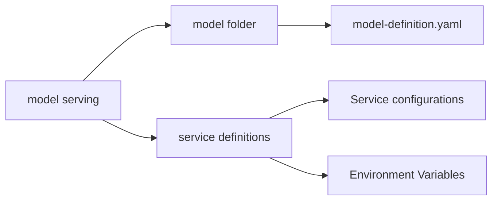
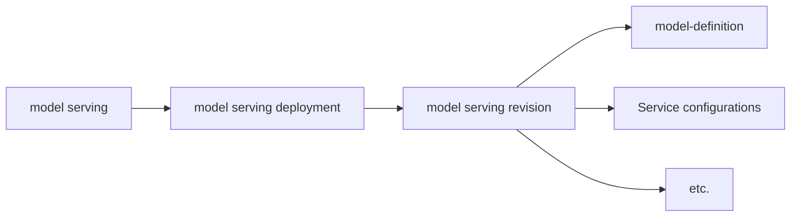

# Model Serving Registry

This document proposes a new BEP for the Model Serving Registry, which will serve as a centralized repository for model serving configurations and metadata.

## Abstract

This document defines the concept of a Model Serving Registry and proposes methods to facilitate the management and deployment of model serving through this registry. The Model Serving Registry aims to improve consistency and reusability of model serving by including model definitions, service definitions, deployment information, and other related metadata.

## Motivation

Currently, Backend.AI uses the following metadata for model serving:

- **Model Definition**: Defines the structure and metadata of models.
- **Service Definition**: Defines service configurations for serving models.
    - Currently, accepting service definitions as YAML is limited, and they are primarily defined through input forms.

These configurations are managed through vfolder for model-definition and Web UI for service-definition. However, this approach has the following limitations:

1. **Variability of vfolder**: Model-definition files stored in vfolder can be directly modified by users, making it difficult to maintain consistency.
2. **Lack of reusability for service-definition**: Current service-definition is primarily input through Web UI, making it difficult to reuse or share.
3. **Lack of consistency in model serving**: Model serving configurations are distributed across different sources, making management and deployment complex.

To address these issues, we propose introducing a Model Serving Registry to centralize model serving metadata and enable consistent management.

## Current Design

Currently, Backend.AI uses vfolder and Web UI to manage model definitions and service definitions for model serving. However, this approach has the following limitations:



1. **Deployment Complexity**
    - Storing model-definition in vfolder is disconnected from the model deployment flow, making deployment complex.
2. **Lack of Deployment Consistency**
    - Model-definition files stored in vfolder can be modified by users, causing model serving behavior to vary depending on the vfolder state.
3. **Lack of Version Management for Model Serving**
    - Currently, model-definition files stored in vfolder are not version-controlled, making rollback to previous versions difficult.
    - Service configurations are also not version-controlled, making rollback to previous deployments difficult.

## Proposed Design

### Model Serving Revision

To address the limitations of the current approach, we introduce the Model Serving Registry to centralize model serving metadata and enable consistent management.



We define the structure above as a **Model Serving Revision**. A Model Serving Revision represents a specific version of model serving and includes the following components:

- **model-definition**: Defines the structure and metadata of the model.
- **Service configurations**: Defines service settings for serving the model.
- **etc.**: May include additional configurations or metadata.

Through this structure, we can improve the consistency of model serving and enhance reusability. Additionally, the Model Serving Registry can provide the following features:

- **Version Management**: Each Model Serving Revision has a unique version, enabling rollback to previous versions.
- **Reusability**: By managing model definitions and service definitions centrally, multiple users can easily reuse the same model serving configurations.
- **Deployment Management**: Instead of managing model serving configurations through vfolder and Web UI, deployments can be managed consistently through the Model Serving Registry.
- **Configuration Sharing**: By storing model serving configurations in the registry, other users can easily access and use them.

### Model Serving Registry

The Model Serving Registry is a central repository for managing Model Serving Revisions and provides the following functionalities:

- **Model Serving Revision Management**: Provides APIs to create, modify, and delete Model Serving Revisions.
- **Model Serving Revision Retrieval**: Provides APIs to retrieve detailed information about specific Model Serving Revisions.
- **Model Serving Revision Search**: Provides functionality to search for Model Serving Revisions.
- **Model Serving Revision Version Management**: Manages versions of each Model Serving Revision and provides rollback functionality to previous versions.
- **Model Serving Revision Sharing**: Provides functionality to share Model Serving Revisions with other users.

In Backend.AI, the default Model Serving Registry will be implemented using a database-based approach to satisfy the above interface requirements.

However, the Model Serving Registry implementation will be designed to support various implementations for Backend.AI's extensibility. For example, it can provide functionality to fetch model serving configurations from external sources through Remote Registry or integrate with other systems.

## Technical Implementation

### Registry Interface

The Model Serving Registry will implement a standardized interface to ensure consistency across different implementations:

```python
class ModelServingRegistry(ABC):
    def create_revision(self, revision: ModelServingRevision) -> str:
        """Create a new model serving revision and return its ID"""
        pass
    
    def get_revision(self, revision_id: str) -> ModelServingRevision:
        """Retrieve a specific model serving revision"""
        pass
    
    def list_revisions(self, filters: dict[str, Any]) -> List[ModelServingRevision]:
        """List model serving revisions with optional filters"""
        pass
    
    def update_revision(self, revision_id: str, revision: ModelServingRevision) -> None:
        """Update an existing model serving revision"""
        pass
    
    def delete_revision(self, revision_id: str) -> None:
        """Delete a model serving revision"""
        pass
```

### Data Model

The core data structures for the Model Serving Registry:

```python
@dataclass
class ModelServingRevision:
    id: str
    name: str
    version: str
    model_definition: dict[str, Any] # TODO: Define model definition structure
    service_configuration: dict[str, Any] # TODO: Define service configuration structure
    metadata: dict[str, Any]
    created_at: datetime
    updated_at: datetime
    created_by: str
```

### Database Schema

The default database-based implementation will use the following schema:

- `model_serving_revisions` table with columns for revision metadata
- `model_serving_definitions` table for storing model definitions
- `model_serving_configurations` table for service configurations
- Version history tracking for rollback capabilities

## Impacts to Users or Developers

The introduction of the Model Serving Registry will have the following impacts on Backend.AI users and developers:

### For Users
- **Centralized Management**: Users can manage model serving configurations centrally, enabling consistent deployment and management of model serving.
- **Improved Reusability**: Model serving configurations can be easily reused and shared across different projects and teams.
- **Enhanced Reliability**: Version control and rollback capabilities provide better reliability for production deployments.

### For Developers
- **Extensible Architecture**: The registry provides APIs for managing model serving configurations, creating a foundation for extending and improving model serving functionality.
- **Multiple Implementation Support**: The design supports various Model Serving Registry implementations, enhancing Backend.AI's extensibility.
- **Better Integration**: Enables integration with external systems and remote registries for more flexible deployment scenarios.

## References

* https://github.com/lablup/beps/blob/main/drafts/BEP-1006-service-deployment-strategy.md
