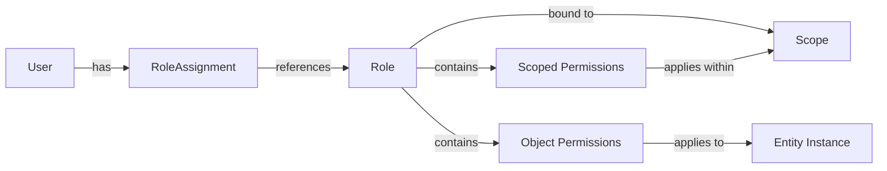
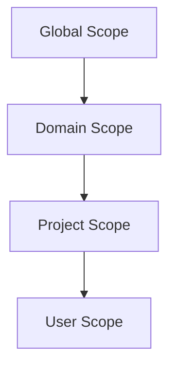
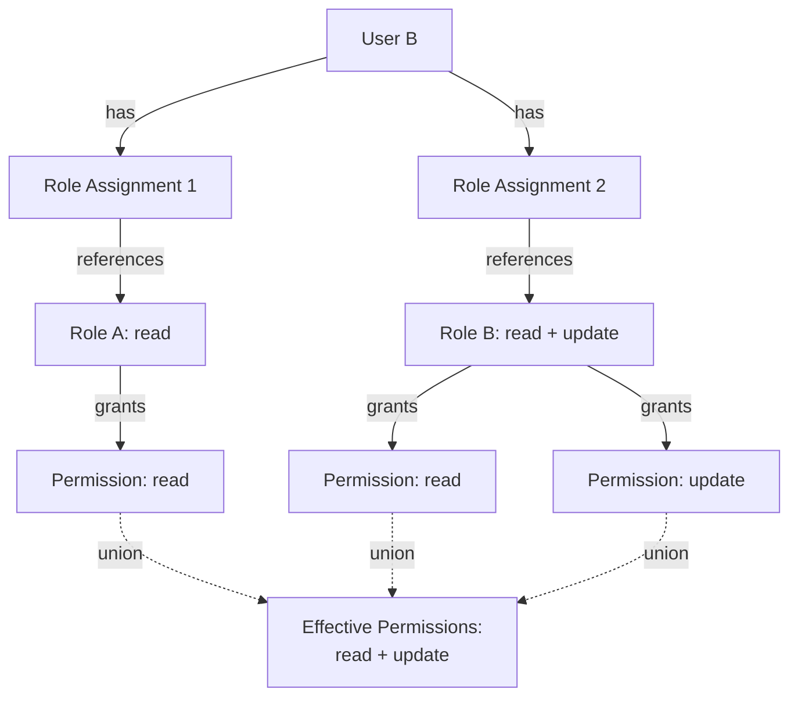
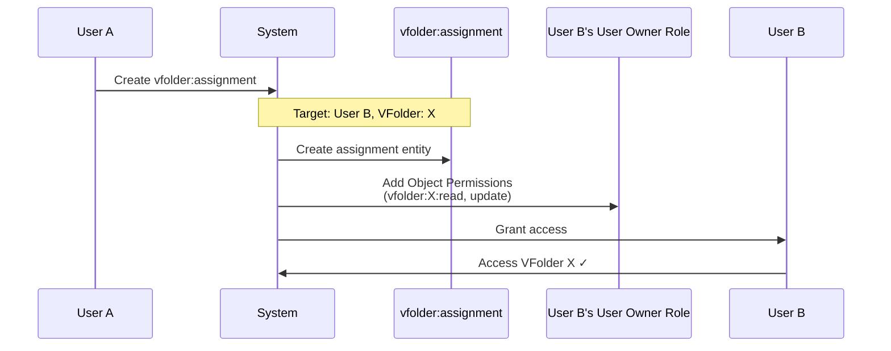

# Backend.AI Role-Based Access Control (RBAC) Feature Specification

## Abstract

This document defines the functional requirements for Backend.AI's Role-Based Access Control (RBAC) system. The RBAC system aims to provide a unified and consistent permission management framework across all entity types in Backend.AI, replacing the current fragmented permission logic. This specification focuses on defining the features and behaviors of the RBAC system, while the technical implementation details are covered in BEP-1008.

## Motivation

The current Backend.AI permission system has several critical limitations that make it difficult to maintain and extend:

1. **Fragmented and Inconsistent Permission Logic**: Each entity type (Compute Session, VFolder, Image, Model Service, etc.) implements its own permission checking logic. Developers must examine the code for each entity to understand how permissions work. Permission handling varies significantly across entity types, leading to different permission models for similar operations, inconsistent behavior across the system, and high maintenance burden when adding new features.

2. **Limited Granularity**: The current system provides only basic user roles (superadmin, user) without flexible permission assignment capabilities.

3. **Poor Scalability**: As new entity types are added, each requires custom permission logic, increasing system complexity exponentially.

4. **Inconsistent Collaboration Support**: While some entity types like VFolder have invitation-based sharing mechanisms, other entity types (e.g., Compute Sessions, Model Services) lack systematic ways to share resources with specific permissions. This inconsistency makes it difficult for users to collaborate effectively across different resource types.

To address these issues, Backend.AI will adopt a unified RBAC system that provides:
- Consistent permission model across all entity types
- Flexible role definition and assignment
- Granular permission control at both type and resource levels
- Better support for collaborative workflows

## Current Design (As-is)

### Existing User Roles

Backend.AI currently supports two user roles:
- **superadmin**: Global administrator with full system access
- **user**: Regular user with limited permissions

### Current Permission Model

Each entity type in Backend.AI implements its own permission checking logic:

- **Compute Sessions**: Permission checks are scattered throughout session management code
- **VFolders**: Uses a separate invitation system for sharing with custom permission logic
- **Images**: Permission checks based on user ownership and visibility settings
- **Model Services**: Service-specific permission validation
- **Domains and Projects**: Hierarchical ownership model with implicit permissions

### Problems

1. **Code-Level Permission Logic**: Permissions are embedded in application code rather than being data-driven, requiring code changes for permission modifications.

2. **No Unified Interface**: Each entity type has different methods for checking permissions, making it difficult to:
   - Understand the overall permission structure
   - Audit permissions across the system
   - Implement consistent permission checking

3. **Limited Delegation**: No systematic way to delegate permissions to other users except for specific features like VFolder invitations.

4. **Maintenance Burden**: Changes to permission logic require understanding entity-specific implementations, increasing development time and error risk.

## Proposed Design (To-be)

### Entity Types

The RBAC system will manage permissions for the following entity types:

| Entity Type | Description | Dual Role |
|-------------|-------------|-----------|
| Compute Session | Computational workloads and containers | Entity only |
| VFolder | Virtual folders for data storage | Entity only |
| Image | Container images for sessions | Entity only |
| Model Service | Model serving deployments | Entity only |
| Model Artifact | Trained model files and metadata | Entity only |
| Agent | Agent nodes providing computing resources | Entity only |
| Resource Group | Logical groups of agents | Entity only |
| Storage Host | Storage backend hosts | Entity only |
| App Config | Application configuration items | Entity only |
| Notification | System notification messages (admin-only) | Entity only |
| Domain | Administrative domain grouping | Entity & Scope |
| Project | Project grouping within domains | Entity & Scope |
| User | User accounts | Entity & Scope |
| Role | Permission set definitions | Entity only |
| {Entity}:assignment | Mappings for sharing specific entities with other users (e.g., role:assignment vfolder:assignment, compute_session:assignment) | Entity only |

**Note**: Domain, Project, and User serve dual roles as both manageable entities and permission scopes. Role defines what permissions are available, while Role Assignment maps users to roles within specific scopes.

### Operations

All entity types support the same set of operations, providing consistency across the system:

| Operation | Description |
|-----------|-------------|
| **create** | Create new entities of this type |
| **read** | View entity information and metadata |
| **update** | Modify entity properties and settings |
| **soft-delete** | Mark entity as deleted without removing data (default deletion behavior) |
| **hard-delete** | Permanently remove entity data |

**Note on delete operations for Role and Role Assignment**:
Role and Role Assignment entities support soft-delete and hard-delete operations in the initial implementation. Soft-delete preserves the entity in an inactive state for audit purposes and allows reactivation, while hard-delete permanently removes the entity from active use (database records may be retained for audit trails).

**Note on Role Assignment operations**:
- **create**: Assign a role to a user within a specific scope (requires `create` permission for `role_assignment` entity type)
- **read**: View existing Role Assignments (requires `read` permission for `role_assignment` entity type)
- **update**: Modify Role Assignment metadata such as expiration time or state (requires `update` permission for `role_assignment` entity type)

To manage Role Assignments within a scope, users need the corresponding permissions for the `role_assignment` entity type. For example, a Project Admin needs `create` and `update` permissions for `role_assignment` to assign and manage roles for project members.

#### Soft-Delete vs Hard-Delete

- **soft-delete**: Changes the entity's state in the database without removing underlying data
  - Example: Moving a VFolder to trash (files remain intact)
  - For Role: Marks as inactive, preventing new Role Assignments but retaining existing ones
  - For Role Assignment: Changes state to inactive, suspending permissions but preserving the assignment record
  - Allows recovery and maintains referential integrity
  - Soft-deleted entities can be reactivated by authorized administrators

- **hard-delete**: Removes the actual data associated with the entity
  - Example: Permanently deleting files in a trashed VFolder
  - For Role: Removes the role definition (only allowed if no active Role Assignments reference it)
  - For Role Assignment: Permanently removes the assignment record
  - Note: Database records may be retained for a certain period for audit purposes

### Permission Delegation

Permission delegation is achieved through Role and Role Assignment management.

**Process**:
1. Create or identify a Role with the desired permissions
2. Create a Role Assignment linking the target user to that Role
3. The user immediately receives all permissions defined in the Role

**Security**: To prevent privilege escalation, creating a Role Assignment requires `read` permission for the target Role within the same scope. This ensures that Project Admins can only assign roles they can see in their scope, preventing them from assigning Global Admin or cross-scope roles.

### Permission Types

The RBAC system provides two types of permissions:

#### 1. Scoped Permission (Scope-Level Permission)

Defines permissions for operations on an **entity type** within a specific scope.

- Specifies: entity type (e.g., `vfolder`) + operation (e.g., `read`)
- Applies to all entities of that type accessible within the scope
- Example: `vfolder:read` permission allows reading all VFolders within the scope

#### 2. Object Permission (Instance-Level Permission)

Defines permissions for operations on a **specific entity instance**.

- Specifies: entity type + entity ID + operation
- Applies only to that specific entity
- Example: `vfolder:{id}:read` permission allows reading only that specific VFolder
- Can reference entities from different scopes, enabling cross-scope sharing
- Attached directly to a Role, independent of the Role's scope binding

**Cross-Scope Object Permissions**:
When a Role bound to Project-A scope includes Object Permissions for entities in Project-B scope, the Project-B scope is automatically added to the Role. This enables scenarios like:
- Sharing a personal VFolder with project team members
- Granting access to a specific session across projects
- Collaborative workflows spanning multiple scopes

### Role Structure

Each Role in the RBAC system has the following structure:

**Attributes**:
- **Name**: Human-readable role name (e.g., "Project-A-Admin", "VFolder-X-Reader")
- **Description**: Optional description of the role's purpose
- **Scope Binding**: Every Role is bound to exactly one scope (Global, Domain, Project, or User)
- **Source**: Indicates whether the role is system-generated or custom-created

**Permission Components**:
- **Scoped Permissions**: A collection of scope-level permissions (entity type + operation) that apply within the Role's bound scope
  - Example: `vfolder:read`, `compute_session:create`
- **Object Permissions**: A collection of instance-level permissions (entity type + entity ID + operation)
  - Can reference entities from any scope, enabling cross-scope sharing
  - Example: `vfolder:abc-123:read`



### Role Source

Roles in the RBAC system have a source attribute indicating how they were created:

| Role Source | Description | Purpose | Management |
|-------------|-------------|---------|------------|
| **system** | Automatically created by the system | Provide default admin role when scope is created | Share lifecycle with scope; cannot be individually deleted |
| **custom** | Manually created by administrators | Custom roles tailored to specific requirements | Can be created, modified, and deleted by users with appropriate permissions |

#### System Sourced Roles

**Purpose**: System sourced roles are default roles automatically created when a scope is created. They ensure that each scope has a fundamental permission structure.

**Automatically Created System Sourced Roles**:
- **Domain Admin**: Administrator role for domain scope
- **Project Admin**: Administrator role for project scope
- **User Owner**: Default role for user scope (for owned resources and shared resource access)

**Characteristics**:
- Cannot be individually deleted as they form the fundamental infrastructure of the scope
- Automatically deleted when the scope is deleted
- Multiple users can be assigned to the same system sourced role (via Role Assignments)
- **Multi-scope binding support**: Especially for User Owner Role, when other users share resources, their scopes are automatically added to the role

#### Custom Sourced Roles

**Purpose**: Custom sourced roles are manually created by administrators to tailor permissions to their organization's specific requirements. They enable fine-grained permission control and flexible access management.

**Usage Examples**:
- "Project-A-Admin": Role with administrative permissions for a specific project
- "Department-Viewer": Role with read-only permissions for all resources in a specific department
- "Cross-Project-Coordinator": Role with resource access across multiple projects

**Characteristics**:
- Freely created, modified, and deleted by administrators as needed
- Can define permission sets optimized for specific scopes or organizational structures
- Enable fine-grained resource access control using Object Permissions

### Role Assignment Entity

Role Assignment is a separate entity that maps users to roles within specific scopes. This design provides several benefits:

**Key Characteristics**:
- **Separation of Concerns**: Role definition is independent of Role Assignment
- **Flexible Management**: Create and manage Role Assignments without modifying the Role itself
- **Audit Trail**: Each assignment tracks who granted it and when
- **Consistent Operations**: Uses standard create/read/update operations instead of special-purpose operations

**Role Assignment Attributes**:
- `user_id`: The user receiving the role
- `role_id`: The role being assigned
- `scope_type` and `scope_id`: Where the role applies
- `granted_by`: Who created this assignment
- `granted_at`: When the assignment was created
- `state`: Active or inactive

**Example**:
- Role: "Project-A-User" (defines permissions for Project A)
- Role Assignment: User Alice → "Project-A-User" role
- Result: Alice has the permissions defined in "Project-A-User" role within Project A scope

**Management**: Scope administrators (Domain Admin, Project Admin) typically have all Role Assignment management permissions for their scope, allowing them to assign roles, revoke assignments, and view all assignments within their scope.

### Scope Hierarchy

Backend.AI uses a four-level scope hierarchy:



**Scope Characteristics**:
- **Global Scope**: System-wide resources and permissions
- **Domain Scope**: Organizational units within the system
- **Project Scope**: Collaborative workspaces within domains
- **User Scope**: Individual user's private resources

**Management Principle**:
Each scope is managed independently by its respective administrators:
- **Global Admin**: Manages global scope resources
- **Domain Admin**: Manages their domain scope resources
- **Project Admin**: Manages their project scope resources
- **User Owner**: Manages their user scope resources

**Important: No Permission Inheritance**:
Permissions defined in a Role bound to a specific scope apply **only** to actions within that scope. They do **not** cascade to child scopes.

Examples:
- A Domain Admin role (bound to Domain-A scope) with `vfolder:read` Permission can read VFolders **at the domain level only**
- This permission does **not** automatically grant access to VFolders in projects within Domain-A
- To access resources in Project-A (child of Domain-A), a separate Role bound to Project-A scope is required
- Alternatively, use Object Permissions to grant access to specific resources in child scopes

**Cross-Scope Access**:
- Scope admins cannot directly manage resources in other scopes at the same level
- Cross-scope collaboration is achieved through Object Permissions, not hierarchical delegation
- To work across scopes, users need either:
  1. Multiple Role Assignments (one per scope)
  2. Object Permissions for specific resources in other scopes

### Administrative Safeguards

The RBAC system includes safeguards to prevent accidental loss of administrative access while maintaining operational flexibility.

#### System Sourced Role Protection

System sourced roles (Domain Admin, Project Admin, User Owner) are default admin roles automatically created when scopes are created, forming the fundamental infrastructure of the scope.

**Deletion Constraints**:

System sourced roles cannot be individually deleted:

1. **Individual Deletion Prohibited**: Attempting to delete a system sourced role returns an error. System sourced roles are removed only when their corresponding scope is deleted.

2. **Role Assignments Are Manageable**: While system sourced roles cannot be deleted, Role Assignments for these roles can be created and removed normally, allowing administrators to manage who has admin access.

### Resource Ownership

In the RBAC system, resource ownership is managed through automatic Role Assignment creation, not as a separate ownership concept.

**Ownership Model**:

When a user creates a resource (VFolder, Compute Session, Model Service, etc.), the system automatically adds Object Permissions to the creator's "User Owner" System Sourced Role.

**Example - VFolder Creation**:
```
1. User A creates VFolder-X in Project-A
2. System automatically adds Object Permissions to User A's "User Owner" System Sourced Role:
   - vfolder:X:read
   - vfolder:X:update
   - vfolder:X:soft-delete
   - vfolder:X:hard-delete
   - vfolder:assignment:X:create (permission to share with other users)
   - vfolder:assignment:X:delete (permission to revoke shares)
3. User A now has full control and sharing permissions over VFolder-X
```

**Implications**:
- Ownership is represented as Object Permissions in the "User Owner" System Sourced Role
- Owned resources and shared resources are managed within the same Role
- Resource creators delegate permissions by adding Object Permissions to other users' System Sourced Roles

**Scope-Level Resources**:

Resources can be owned at different scope levels:
- **User-scope resources**: Personal resources (e.g., personal VFolders)
  - Created and owned by individual users
  - Accessible only to the owner by default
- **Project-scope resources**: Shared resources within a project
  - Created by project members, owned at project level
  - Accessible to project members based on their roles
- **Domain-scope resources**: Organization-wide resources
  - Owned at domain level
  - Accessible to domain members based on their roles
  - *Note*: Not all resource types support domain-scope ownership yet

**Current Scope Support by Resource Type**:

Legend:
- ✅ **Yes**: Currently supported
- ⏳ **Not yet**: Planned for future implementation
- ❌ **No**: Not planned or not applicable

| Resource Type | User Scope | Project Scope | Domain Scope |
|---------------|------------|---------------|--------------|
| VFolder | ✅ Yes | ✅ Yes | ⏳ Not yet |
| Compute Session | ✅ Yes | ✅ Yes | ⏳ Not yet |
| Model Service | ✅ Yes | ✅ Yes | ⏳ Not yet |
| Image | ✅ Yes | ✅ Yes | ✅ Yes |

**Future Example - Domain-Level VFolder**:
When Domain-level VFolders are implemented:
- Domain Admin creates a VFolder at domain scope
- All users in that domain can access it based on domain-level permissions
- Domain Admin role includes `vfolder:read` permission for domain-scope VFolders

### Permission Conflict Resolution

When a user has multiple Role Assignments that grant different permissions for the same resource, the RBAC system uses a **union (additive) model**:

- All permissions from all Role Assignments are combined
- If any Role grants a permission, the user has that permission
- There is no "deny" mechanism

**Example**: User B with Role A (read) and Role B (read + update) has both read and update permissions.



**Note**: To revoke permissions, you must deactivate or delete the Role Assignment granting them.

### Key Use Cases

#### 1. VFolder Sharing

When User A shares their VFolder with User B:

**Sharing Process**:
1. User A creates a `vfolder:assignment` entity
2. System automatically adds Object Permissions to User B's "User Owner" System Sourced Role:
   - `vfolder:{folder_id}:read`
   - `vfolder:{folder_id}:update` (if write permission included)
3. User B can immediately access the VFolder



**Revoking Share**:
- User A deletes the `vfolder:assignment` entity
- System automatically removes the VFolder's Object Permissions from User B's System Sourced Role

**Backward Compatibility**: Existing share/invite API continues to work, internally using this RBAC mechanism.

#### 2. Session Access Control

Project Admins can grant access to specific compute sessions by:
- Adding Object Permissions to team members' System Sourced Roles
- Or creating a Custom Role in project scope with Role Assignment

#### 3. Custom Role Creation

Project Admins can create custom roles tailored to their needs:
- Define a Custom Role with necessary Scoped Permissions and Object Permissions
- Assign the role to team members via Role Assignments
- Permission updates automatically apply to all users with that role

### Migration Strategy

Existing permissions will be migrated to the RBAC system:

**Migration Targets**:
- User roles (superadmin, user) → RBAC Roles and Role Assignments
- Project memberships → Role Assignments in project scopes
- Resource ownership → Object Permissions in System Sourced Roles
- VFolder invitations → Object Permissions and `vfolder:assignment` entities

**Approach**: Gradual migration by entity type with backward compatibility maintained throughout the transition.


### Audit and Compliance

All RBAC operations are recorded in the audit log for compliance and security monitoring:

## Impacts to Users or Developers

### For Users

**Improvements**:
- **Unified Permission Model**: Consistent permission behavior across all entity types
- **Fine-grained Control**: Ability to share specific resources with specific permissions
- **Better Collaboration**: Easier team workflows with flexible permission assignment
- **Transparency**: Clear visibility into who has access to what resources

**Changes**:
- Some existing permission behaviors may change to align with the unified model
- Users will need to understand the new role and permission concepts
- Administrative interfaces will be updated to support RBAC management

### For Developers

**Improvements**:
- **Simplified Permission Checks**: Single interface for all permission validation
- **Data-Driven Permissions**: No code changes required for permission modifications
- **Easier Maintenance**: Consistent permission logic across all entity types
- **Better Extensibility**: New entity types automatically inherit RBAC framework

**Changes**:
- Replace entity-specific permission code with RBAC API calls
- Add role and permission management interfaces

## Future Features

The following features are planned for future implementation:

### 1. Temporary Role Assignments with Expiration

Support for time-limited access grants with automatic expiration:
- Add `expires_at` attribute to Role Assignment
- Automatically revoke permissions when expiration time is reached
- Use cases: temporary contractor access, time-limited trial memberships, scheduled access revocation

### 2. Role Templates

Predefined, reusable role definitions that can be instantiated across different scopes:
- System-provided and custom templates for common role patterns
- Quick role creation without manual permission configuration
- Centralized updates to common role patterns
- Organization-wide role standards and consistency

## References

- [BEP-1008: Backend.AI Role-Based Access Control (RBAC)](./BEP-1008-RBAC.md) - Technical implementation details and architecture
- [BEP-1012 RBAC Design Decisions](../refs/BEP-1012-RBAC-design-decision.md) - Key design decisions made during specification development
