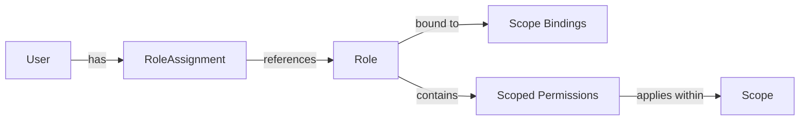
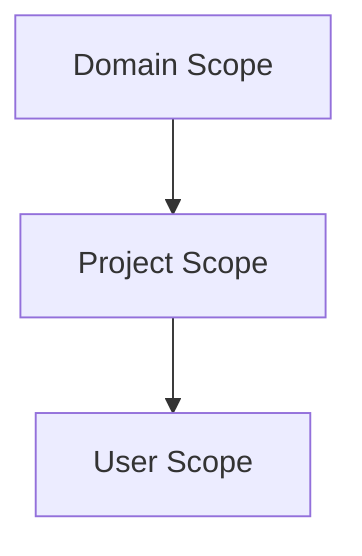
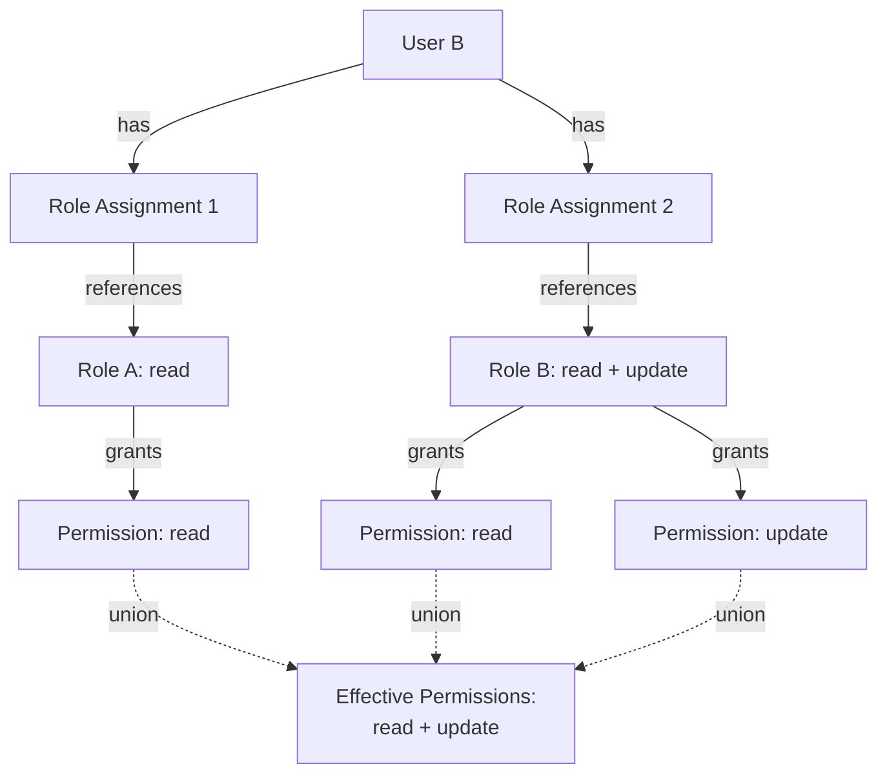
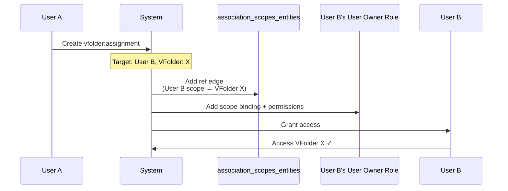

# Backend.AI Role-Based Access Control (RBAC) Feature Specification

## Abstract

This document defines the functional requirements for Backend.AI's Role-Based Access Control (RBAC) system. The RBAC system aims to provide a unified and consistent permission management framework across all entity types in Backend.AI, replacing the current fragmented permission logic. This specification focuses on defining the features and behaviors of the RBAC system, while the technical implementation details are covered in BEP-1008.

## Motivation

The current Backend.AI permission system has several critical limitations that make it difficult to maintain and extend:

1. **Fragmented and Inconsistent Permission Logic**: Each entity type (Compute Session, VFolder, Image, Model Service, etc.) implements its own permission checking logic. Developers must examine the code for each entity to understand how permissions work. Permission handling varies significantly across entity types, leading to different permission models for similar operations, inconsistent behavior across the system, and high maintenance burden when adding new features.

2. **Limited Granularity**: The current system provides only basic user roles (superadmin, user) without flexible permission assignment capabilities.

3. **Poor Scalability**: As new entity types are added, each requires custom permission logic, increasing system complexity exponentially.

4. **Inconsistent Collaboration Support**: While some entity types like VFolder have invitation-based sharing mechanisms, other entity types (e.g., Compute Sessions, Model Services) lack systematic ways to share resources with specific permissions. This inconsistency makes it difficult for users to collaborate effectively across different resource types.

To address these issues, Backend.AI will adopt a unified RBAC system that provides:
- Consistent permission model across all entity types
- Flexible role definition and assignment
- Granular permission control at both type and resource levels
- Better support for collaborative workflows

## Current Design (As-is)

### Existing User Roles

Backend.AI currently supports two user roles:
- **superadmin**: Global administrator with full system access
- **user**: Regular user with limited permissions

### Current Permission Model

Each entity type in Backend.AI implements its own permission checking logic:

- **Compute Sessions**: Permission checks are scattered throughout session management code
- **VFolders**: Uses a separate invitation system for sharing with custom permission logic
- **Images**: Permission checks based on user ownership and visibility settings
- **Model Services**: Service-specific permission validation
- **Domains and Projects**: Hierarchical ownership model with implicit permissions

### Problems

1. **Code-Level Permission Logic**: Permissions are embedded in application code rather than being data-driven, requiring code changes for permission modifications.

2. **No Unified Interface**: Each entity type has different methods for checking permissions, making it difficult to:
   - Understand the overall permission structure
   - Audit permissions across the system
   - Implement consistent permission checking

3. **Limited Delegation**: No systematic way to delegate permissions to other users except for specific features like VFolder invitations.

4. **Maintenance Burden**: Changes to permission logic require understanding entity-specific implementations, increasing development time and error risk.

## Proposed Design (To-be)

### Entity Types

The RBAC system will manage permissions for the following entity types:

| Entity Type | Description | Dual Role |
|-------------|-------------|-----------|
| Compute Session | Computational workloads and containers | Entity only |
| VFolder | Virtual folders for data storage | Entity only |
| Image | Container images for sessions | Entity only |
| Model Service | Model serving deployments | Entity only |
| Model Artifact | Trained model files and metadata | Entity only |
| Agent | Agent nodes providing computing resources | Entity only |
| Resource Group | Logical groups of agents | Entity only |
| Storage Host | Storage backend hosts | Entity only |
| App Config | Application configuration items | Entity only |
| Notification | System notification messages (admin-only) | Entity only |
| Domain | Administrative domain grouping | Entity & Scope |
| Project | Project grouping within domains | Entity & Scope |
| User | User accounts | Entity & Scope |
| Role | Permission set definitions | Entity only |
| {Entity}:assignment | Mappings for sharing specific entities with other users (e.g., role:assignment vfolder:assignment, compute_session:assignment) | Entity only |

**Note**: Domain, Project, and User serve dual roles as both manageable entities and permission scopes. Role defines what permissions are available, while Role Assignment maps users to roles within specific scopes.

### Operations

All entity types support the same set of operations, providing consistency across the system:

| Operation | Description |
|-----------|-------------|
| **create** | Create new entities of this type |
| **read** | View entity information and metadata |
| **update** | Modify entity properties and settings |
| **soft-delete** | Mark entity as deleted without removing data (default deletion behavior) |
| **hard-delete** | Permanently remove entity data |

**Note on delete operations for Role and Role Assignment**:
Role and Role Assignment entities support soft-delete and hard-delete operations in the initial implementation. Soft-delete preserves the entity in an inactive state for audit purposes and allows reactivation, while hard-delete permanently removes the entity from active use (database records may be retained for audit trails).

**Note on Role Assignment operations**:
- **create**: Assign a role to a user within a specific scope (requires `create` permission for `role_assignment` entity type)
- **read**: View existing Role Assignments (requires `read` permission for `role_assignment` entity type)
- **update**: Modify Role Assignment metadata such as expiration time or state (requires `update` permission for `role_assignment` entity type)

To manage Role Assignments within a scope, users need the corresponding permissions for the `role_assignment` entity type. For example, a Project Admin needs `create` and `update` permissions for `role_assignment` to assign and manage roles for project members.

#### Soft-Delete vs Hard-Delete

- **soft-delete**: Changes the entity's state in the database without removing underlying data
  - Example: Moving a VFolder to trash (files remain intact)
  - For Role: Marks as inactive, preventing new Role Assignments but retaining existing ones
  - For Role Assignment: Changes state to inactive, suspending permissions but preserving the assignment record
  - Allows recovery and maintains referential integrity
  - Soft-deleted entities can be reactivated by authorized administrators

- **hard-delete**: Removes the actual data associated with the entity
  - Example: Permanently deleting files in a trashed VFolder
  - For Role: Removes the role definition (only allowed if no active Role Assignments reference it)
  - For Role Assignment: Permanently removes the assignment record
  - Note: Database records may be retained for a certain period for audit purposes

### Permission Delegation

Permission delegation is achieved through Role and Role Assignment management.

**Process**:
1. Create or identify a Role with the desired permissions
2. Create a Role Assignment linking the target user to that Role
3. The user immediately receives all permissions defined in the Role

**Security**: To prevent privilege escalation, creating a Role Assignment requires `read` permission for the target Role within the same scope. This ensures that Project Admins can only assign roles they can see in their scope, preventing them from assigning Global Admin or cross-scope roles.

### Permission Types

The RBAC system uses Scoped Permissions to define access control:

#### Scoped Permission (Scope-Level Permission)

Defines permissions for operations on an **entity type** within a specific scope.

- Specifies: scope + entity type (e.g., `vfolder`) + operation (e.g., `read`)
- Applies to all entities of that type accessible within the scope
- Example: A role bound to Project-A with `vfolder:read` permission allows reading all VFolders within Project-A

**Multi-Scope Permissions**:
A single role can have different permissions per scope. For example, a "Cross-Project-Coordinator" role bound to both Project-A and Project-B can have `vfolder:read` in Project-A and `session:create` in Project-B.

### Role Structure

Each Role in the RBAC system has the following structure:

**Attributes**:
- **Name**: Human-readable role name (e.g., "Project-A-Admin", "Cross-Project-Coordinator")
- **Description**: Optional description of the role's purpose
- **Scope Bindings**: A Role is bound to one or more scopes (Domain, Project, or User) via `association_scopes_entities`. Scope bindings determine:
  1. Where the role is visible and manageable (e.g., which scope admin can see and assign the role)
  2. Which scopes users assigned this role become members of
- **Source**: Indicates whether the role is system-generated or custom-created

**Permission Components**:
- **Scoped Permissions**: A collection of scope-level permissions (scope + entity type + operation)
  - Example: A role bound to Project-A can have `vfolder:read`, `compute_session:create` for Project-A


```mermaid
graph LR
    User -->|has| RoleAssignment
    RoleAssignment -->|references| Role
    Role -->|bound to| Scopes[Scope Bindings]
    Role -->|contains| ScopedPermission[Scoped Permissions]
    ScopedPermission -->|applies within| Scope
```

### Role Source

Roles in the RBAC system have a source attribute indicating how they were created:

| Role Source | Description | Purpose | Management |
|-------------|-------------|---------|------------|
| **system** | Automatically created by the system | Provide default admin role when scope is created | Share lifecycle with scope; cannot be individually deleted |
| **custom** | Manually created by administrators | Custom roles tailored to specific requirements | Can be created, modified, and deleted by users with appropriate permissions |

#### System Sourced Roles

**Purpose**: System sourced roles are default roles automatically created when a scope is created. They ensure that each scope has a fundamental permission structure.

**Automatically Created System Sourced Roles**:
- **Domain Admin**: Administrator role for domain scope
- **Domain Member**: Default member role for domain scope (basic read access)
- **Project Admin**: Administrator role for project scope
- **Project Member**: Default member role for project scope (basic read access)
- **User Owner**: Default role for user scope (for owned resources)

**Characteristics**:
- Cannot be individually deleted as they form the fundamental infrastructure of the scope
- Automatically deleted when the scope is deleted
- Multiple users can be assigned to the same system sourced role (via Role Assignments)

#### Custom Sourced Roles

**Purpose**: Custom sourced roles are manually created by administrators to tailor permissions to their organization's specific requirements. They enable fine-grained permission control and flexible access management.

**Usage Examples**:
- "Project-A-Admin": Role with administrative permissions for a specific project
- "Department-Viewer": Role with read-only permissions for all resources in a specific department
- "Cross-Project-Coordinator": Role with resource access across multiple projects

**Characteristics**:
- Freely created, modified, and deleted by administrators as needed
- Can be bound to one or more scopes, with different permissions per scope
- Can define permission sets optimized for specific scopes or organizational structures

### Role Assignment Entity

Role Assignment is a separate entity that maps users to roles. This design provides several benefits:

**Key Characteristics**:
- **Separation of Concerns**: Role definition is independent of Role Assignment
- **Flexible Management**: Create and manage Role Assignments without modifying the Role itself
- **Audit Trail**: Each assignment tracks who granted it and when
- **Consistent Operations**: Uses standard create/read/update operations instead of special-purpose operations
- **Membership Determination**: A user's scope membership is automatically synced to `association_scopes_entities` when roles are assigned or unassigned

**Role Assignment Attributes**:
- `user_id`: The user receiving the role
- `role_id`: The role being assigned
- `granted_by`: Who created this assignment
- `granted_at`: When the assignment was created

**Scope Membership via Role Assignment**:
When a user is assigned a role, the system automatically syncs user-scope membership entries in `association_scopes_entities` (with `entity_type='user'`). This replaces the previous `association_groups_users` table and unifies scope membership queries across all scope types.

- **On role assign**: Insert user-scope entries for the role's bound scopes (`ON CONFLICT DO NOTHING` to handle overlap with other roles).
- **On role unassign**: Delete user-scope entries only for scopes not covered by the user's remaining roles.

**Querying Users in a Scope**:

All scope types use a single-table lookup:

```sql
SELECT entity_id AS user_id
FROM association_scopes_entities
WHERE scope_type = :scope_type   -- 'domain', 'project', 'user'
  AND scope_id = :scope_id
  AND entity_type = 'user'
```

Previously, each scope type required a different query path (e.g., `association_groups_users` for projects, `users.domain_name` for domains). The new approach unifies all scope membership queries into a single-table pattern with no JOINs.

**Example**:
- Role: "Project-A-Member" (bound to Project-A scope, with basic read permissions)
- Role Assignment: User Alice → "Project-A-Member" role
- Result: System inserts `(scope_type='project', scope_id='proj-A', entity_type='user', entity_id=alice_id)` into `association_scopes_entities`. Alice becomes a member of Project-A and has the permissions defined in the role.

**Management**: Scope administrators (Domain Admin, Project Admin) typically have all Role Assignment management permissions for their scope, allowing them to assign roles, revoke assignments, and view all assignments within their scope.

### Scope Hierarchy

Backend.AI uses a three-level scope hierarchy:


```mermaid
graph TD
    B[Domain Scope] --> C[Project Scope]
    C --> D[User Scope]
```

**Scope Characteristics**:
- **Domain Scope**: Organizational units within the system
- **Project Scope**: Collaborative workspaces within domains
- **User Scope**: Individual user's private resources

**Management Principle**:
Each scope is managed independently by its respective administrators:
- **Domain Admin**: Manages their domain scope resources
- **Project Admin**: Manages their project scope resources
- **User Owner**: Manages their user scope resources

**Note**: Permission inheritance and scope chain traversal rules are defined in [BEP-1048](./BEP-1048-RBAC-entity-relationship-model.md).

### Administrative Safeguards

The RBAC system includes safeguards to prevent accidental loss of administrative access while maintaining operational flexibility.

#### System Sourced Role Protection

System sourced roles (Domain Admin, Project Admin, User Owner) are default admin roles automatically created when scopes are created, forming the fundamental infrastructure of the scope.

**Deletion Constraints**:

System sourced roles cannot be individually deleted:

1. **Individual Deletion Prohibited**: Attempting to delete a system sourced role returns an error. System sourced roles are removed only when their corresponding scope is deleted.

2. **Role Assignments Are Manageable**: While system sourced roles cannot be deleted, Role Assignments for these roles can be created and removed normally, allowing administrators to manage who has admin access.

### Resource Ownership

In the RBAC system, resource ownership is managed through the creator's "User Owner" System Sourced Role, which is bound to the user's own scope.

**Ownership Model**:

When a user creates a resource (VFolder, Compute Session, Model Service, etc.), the resource is associated with the creator's user scope via `association_scopes_entities`. The creator's "User Owner" role, bound to their user scope, provides full control over owned resources through Scoped Permissions.

**Example - VFolder Creation**:
```
1. User A creates VFolder-X in Project-A
2. VFolder-X is associated with User A's user scope via association_scopes_entities
3. User A's "User Owner" role (bound to user scope) grants full control:
   - vfolder:read, vfolder:update, vfolder:soft-delete, vfolder:hard-delete
4. User A can share VFolder-X with others via vfolder:assignment
```

**Implications**:
- Ownership is determined by the resource's scope association with the user scope
- The "User Owner" role provides Scoped Permissions for all owned resources
- Resource sharing is managed via assignment entities and role-scope bindings

**Scope-Level Resources**:

Resources can be owned at different scope levels:
- **User-scope resources**: Personal resources (e.g., personal VFolders)
  - Created and owned by individual users
  - Accessible only to the owner by default
- **Project-scope resources**: Shared resources within a project
  - Created by project members, owned at project level
  - Accessible to project members based on their roles
- **Domain-scope resources**: Organization-wide resources
  - Owned at domain level
  - Accessible to domain members based on their roles
  - *Note*: Not all resource types support domain-scope ownership yet

**Current Scope Support by Resource Type**:

Legend:
- ✅ **Yes**: Currently supported
- ⏳ **Not yet**: Planned for future implementation
- ❌ **No**: Not planned or not applicable

| Resource Type | User Scope | Project Scope | Domain Scope |
|---------------|------------|---------------|--------------|
| VFolder | ✅ Yes | ✅ Yes | ⏳ Not yet |
| Compute Session | ✅ Yes | ✅ Yes | ⏳ Not yet |
| Model Service | ✅ Yes | ✅ Yes | ⏳ Not yet |
| Image | ✅ Yes | ✅ Yes | ✅ Yes |

**Future Example - Domain-Level VFolder**:
When Domain-level VFolders are implemented:
- Domain Admin creates a VFolder at domain scope
- All users in that domain can access it based on domain-level permissions
- Domain Admin role includes `vfolder:read` permission for domain-scope VFolders

### Permission Conflict Resolution

When a user has multiple Role Assignments that grant different permissions for the same resource, the RBAC system uses a **union (additive) model**:

- All permissions from all Role Assignments are combined
- If any Role grants a permission, the user has that permission
- There is no "deny" mechanism

**Example**: User B with Role A (read) and Role B (read + update) has both read and update permissions.


```mermaid
graph TD
    User[User B] -->|has| RA1[Role Assignment 1]
    User -->|has| RA2[Role Assignment 2]
    RA1 -->|references| RoleA[Role A: read]
    RA2 -->|references| RoleB[Role B: read + update]
    RoleA -->|grants| P1[Permission: read]
    RoleB -->|grants| P2[Permission: read]
    RoleB -->|grants| P3[Permission: update]
    P1 -.union.-> EP[Effective Permissions:<br/>read + update]
    P2 -.union.-> EP
    P3 -.union.-> EP
```

**Note**: To revoke permissions, you must deactivate or delete the Role Assignment granting them.

### Key Use Cases

#### 1. VFolder Sharing

When User A shares their VFolder with User B:

**Sharing Process**:
1. User A creates a `vfolder:assignment` entity
2. System adds a `ref` edge in `association_scopes_entities` linking User B's scope to VFolder-X
3. System adds Scoped Permissions for VFolder-X's scope to User B's "User Owner" role:
   - `vfolder:read` (and `vfolder:update` if write permission included)
4. User B can immediately access the VFolder


```mermaid
sequenceDiagram
    participant UserA as User A
    participant System
    participant ASE as association_scopes_entities
    participant RoleB as User B's User Owner Role
    participant UserB as User B

    UserA->>System: Create vfolder:assignment
    Note over System: Target: User B, VFolder: X
    System->>ASE: Add ref edge<br/>(User B scope → VFolder X)
    System->>RoleB: Add scope binding + permissions
    System->>UserB: Grant access
    UserB->>System: Access VFolder X ✓
```

**Revoking Share**:
- User A deletes the `vfolder:assignment` entity
- System removes the `ref` edge and associated permissions from User B's role

**Backward Compatibility**: Existing share/invite API continues to work, internally using this RBAC mechanism.

#### 2. Session Access Control

Project Admins can grant access to compute sessions by:
- Assigning a role with `session:read` permission bound to the project scope
- Creating a Custom Role in project scope with appropriate Scoped Permissions

#### 3. Custom Role Creation

Project Admins can create custom roles tailored to their needs:
1. Create a Custom Role and declare its scope bindings (e.g., Project-A)
2. Add Scoped Permissions within the declared scopes
3. Assign the role to team members via Role Assignments
4. Permission updates automatically apply to all users with that role

### Migration Strategy

Existing permissions will be migrated to the RBAC system:

**Migration Targets**:
- User roles (superadmin, user) → RBAC Roles and Role Assignments
- Project memberships (`association_groups_users`) → Role Assignments with project-scoped roles (sunset `association_groups_users`)
- Resource ownership → Scope associations in `association_scopes_entities` with User Owner role
- VFolder invitations → `ref` edges in `association_scopes_entities` and `vfolder:assignment` entities

**Approach**: Gradual migration by entity type with backward compatibility maintained throughout the transition.


### Audit and Compliance

All RBAC operations are recorded in the audit log for compliance and security monitoring:

## Impacts to Users or Developers

### For Users

**Improvements**:
- **Unified Permission Model**: Consistent permission behavior across all entity types
- **Fine-grained Control**: Ability to share specific resources with specific permissions
- **Better Collaboration**: Easier team workflows with flexible permission assignment
- **Transparency**: Clear visibility into who has access to what resources

**Changes**:
- Some existing permission behaviors may change to align with the unified model
- Users will need to understand the new role and permission concepts
- Administrative interfaces will be updated to support RBAC management

### For Developers

**Improvements**:
- **Simplified Permission Checks**: Single interface for all permission validation
- **Data-Driven Permissions**: No code changes required for permission modifications
- **Easier Maintenance**: Consistent permission logic across all entity types
- **Better Extensibility**: New entity types automatically inherit RBAC framework

**Changes**:
- Replace entity-specific permission code with RBAC API calls
- Add role and permission management interfaces

## Future Features

The following features are planned for future implementation:

### 1. Temporary Role Assignments with Expiration

Support for time-limited access grants with automatic expiration:
- Add `expires_at` attribute to Role Assignment
- Automatically revoke permissions when expiration time is reached
- Use cases: temporary contractor access, time-limited trial memberships, scheduled access revocation

### 2. Role Templates

Predefined, reusable role definitions that can be instantiated across different scopes:
- System-provided and custom templates for common role patterns
- Quick role creation without manual permission configuration
- Centralized updates to common role patterns
- Organization-wide role standards and consistency

## References

- [BEP-1008: Backend.AI Role-Based Access Control (RBAC)](./BEP-1008-RBAC.md) - Technical implementation details and architecture
- [BEP-1012 RBAC Design Decisions](../refs/BEP-1012-RBAC-design-decision.md) - Key design decisions made during specification development
