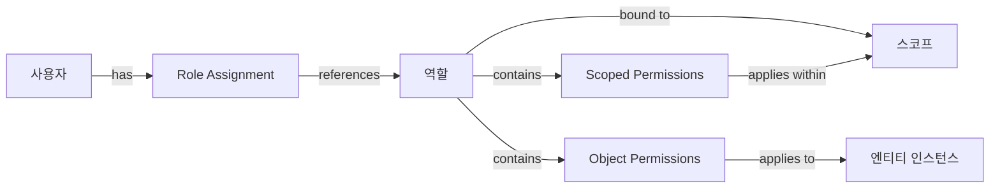
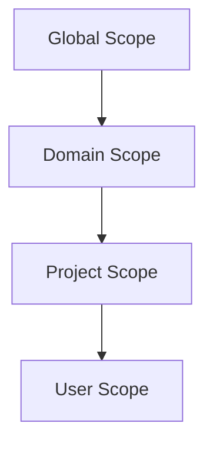
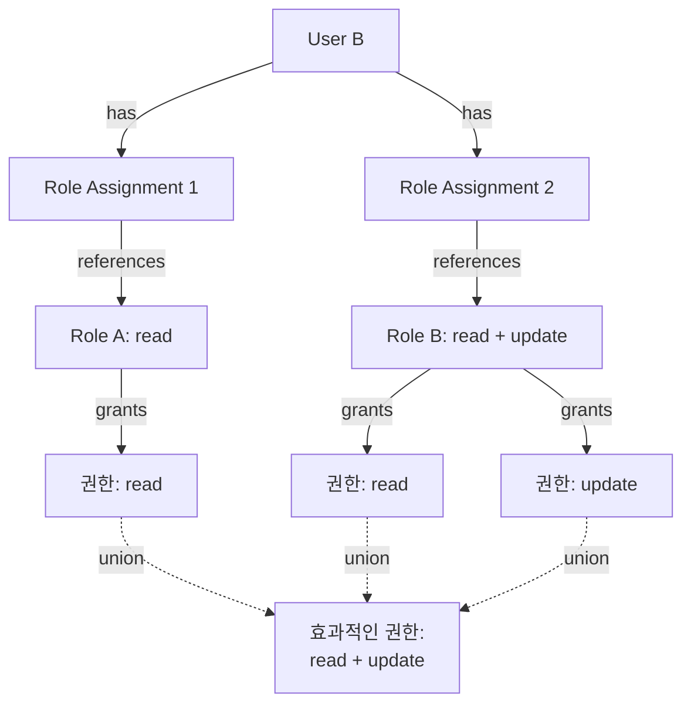
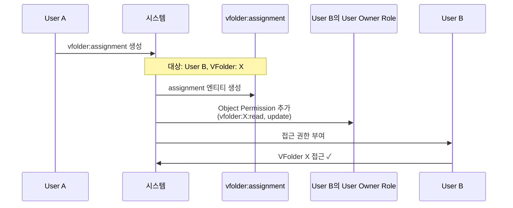

# Backend.AI 역할 기반 접근 제어 (RBAC) 기능 정의서

## 개요

본 문서는 Backend.AI의 역할 기반 접근 제어(RBAC) 시스템의 기능 요구사항을 정의합니다. RBAC 시스템은 Backend.AI의 모든 엔티티 타입에 걸쳐 통합되고 일관된 권한 관리 프레임워크를 제공하여, 현재의 단편화된 권한 로직을 대체하는 것을 목표로 합니다. 본 명세서는 RBAC 시스템의 기능과 동작을 정의하는 데 초점을 맞추며, 기술적 구현 세부사항은 BEP-1008에서 다룹니다.

## 동기

현재 Backend.AI 권한 시스템은 유지보수와 확장을 어렵게 만드는 몇 가지 중대한 한계를 가지고 있습니다:

1. **단편화되고 일관성 없는 권한 로직**: 각 엔티티 타입(Compute Session, VFolder, Image, Model Service 등)이 자체 권한 검사 로직을 구현합니다. 개발자는 권한이 어떻게 작동하는지 이해하기 위해 각 엔티티의 코드를 검토해야 합니다. 권한 처리가 엔티티 타입 간에 크게 달라, 유사한 작업에 대해 서로 다른 권한 모델, 시스템 전반에 걸친 일관성 없는 동작, 새로운 기능 추가 시 높은 유지보수 부담으로 이어집니다.

2. **제한된 세분성**: 현재 시스템은 유연한 권한 할당 기능 없이 기본적인 사용자 역할(superadmin, user)만 제공합니다.

3. **낮은 확장성**: 새로운 엔티티 타입이 추가될 때마다 각각 사용자 정의 권한 로직이 필요하여, 시스템 복잡도가 기하급수적으로 증가합니다.

4. **일관성 없는 협업 지원**: VFolder와 같은 일부 엔티티 타입은 초대 기반 공유 메커니즘을 가지고 있지만, 다른 엔티티 타입(예: Compute Sessions, Model Services)은 특정 권한으로 리소스를 공유하는 체계적인 방법이 부족합니다. 이러한 불일치는 사용자가 서로 다른 리소스 타입 간에 효과적으로 협업하는 것을 어렵게 만듭니다.

이러한 문제를 해결하기 위해, Backend.AI는 다음을 제공하는 통합 RBAC 시스템을 채택합니다:
- 모든 엔티티 타입에 걸친 일관된 권한 모델
- 유연한 역할 정의 및 할당
- 타입 및 리소스 수준 모두에서의 세분화된 권한 제어
- 협업 워크플로우에 대한 더 나은 지원

## 현재 설계 (As-is)

### 기존 사용자 역할

Backend.AI는 현재 두 가지 사용자 역할을 지원합니다:
- **superadmin**: 전체 시스템 접근 권한을 가진 글로벌 관리자
- **user**: 제한된 권한을 가진 일반 사용자

### 현재 권한 모델

Backend.AI의 각 엔티티 타입은 자체 권한 검사 로직을 구현합니다:

- **Compute Sessions**: 권한 검사가 세션 관리 코드 전체에 분산되어 있음
- **VFolders**: 사용자 정의 권한 로직을 가진 별도의 초대 시스템 사용
- **Images**: 사용자 소유권 및 가시성 설정 기반 권한 검사
- **Model Services**: 서비스별 권한 검증
- **Domains and Projects**: 암묵적 권한을 가진 계층적 소유권 모델

### 문제점

1. **코드 수준 권한 로직**: 권한이 데이터 기반이 아닌 애플리케이션 코드에 내장되어 있어, 권한 수정을 위해 코드 변경이 필요합니다.

2. **통합 인터페이스 부재**: 각 엔티티 타입이 권한 검사를 위한 서로 다른 메서드를 가지고 있어 다음을 어렵게 만듭니다:
   - 전체 권한 구조 이해
   - 시스템 전체의 권한 감사
   - 일관된 권한 검사 구현

3. **제한된 위임**: VFolder 초대와 같은 특정 기능을 제외하고는 다른 사용자에게 권한을 위임하는 체계적인 방법이 없습니다.

4. **유지보수 부담**: 권한 로직 변경 시 엔티티별 구현을 이해해야 하므로, 개발 시간과 오류 위험이 증가합니다.

## 제안된 설계 (To-be)

### 엔티티 타입

RBAC 시스템은 리소스(VFolder, Compute Session, Image 등), 스코프(Domain, Project, User), 메타 엔티티(Role, assignment) 등 다양한 엔티티 타입에 대한 권한을 관리합니다.

엔티티 타입의 전체 목록과 상세 내용은 [BEP-1012 RBAC 엔티티 및 필드 타입](./entity-types.md)을 참조하세요.

### 필드 타입

필드 타입은 자체 권한 검사를 수행하지 않고, 속해 있는 엔티티에 권한 검사를 위임하는 객체입니다. 독립적인 권한 대신, 연관된 엔티티의 권한 검사 결과를 상속받습니다.

**주요 특징**:
- 필드 객체는 자체 권한 항목을 갖지 않음
- 권한 검사는 연관된 엔티티로 리다이렉트됨
- 작업 타입은 동일하게 유지됨 (예: `kernel:read` → `session:read`)

**예시**: Kernel은 Compute Session에 연관된 필드 타입입니다. 사용자가 Kernel X를 읽을 수 있는지 검사할 때, 시스템은 실제로 해당 Kernel이 속한 Session을 읽을 수 있는지를 검사합니다.

필드 타입의 전체 목록과 연관 엔티티는 [BEP-1012 RBAC 엔티티 및 필드 타입](./entity-types.md)을 참조하세요.

### 작업

모든 엔티티 타입은 동일한 작업 집합을 지원하여 시스템 전체에 일관성을 제공합니다:

| 작업 | 설명 |
|------|------|
| **create** | 이 타입의 새 엔티티 생성 |
| **read** | 엔티티 정보 및 메타데이터 조회 |
| **update** | 엔티티 속성 및 설정 수정 |
| **soft-delete** | 데이터를 제거하지 않고 삭제된 것으로 표시 (기본 삭제 동작) |
| **hard-delete** | 엔티티 데이터 영구 제거 |

**Role 및 Role Assignment에 대한 삭제 작업 참고사항**:
Role 및 Role Assignment 엔티티는 초기 구현에서 soft-delete 및 hard-delete 작업을 지원합니다. Soft-delete는 감사 목적으로 엔티티를 비활성 상태로 보존하고 재활성화를 허용하는 반면, hard-delete는 활성 사용에서 엔티티를 영구적으로 제거합니다(감사 추적을 위해 데이터베이스 레코드는 보존될 수 있습니다).

**Role Assignment 작업 참고사항**:
- **create**: 특정 스코프 내에서 사용자에게 역할 할당 (`role_assignment` 엔티티 타입에 대한 `create` 권한 필요)
- **read**: 기존 Role Assignment 조회 (`role_assignment` 엔티티 타입에 대한 `read` 권한 필요)
- **update**: 만료 시간 또는 상태와 같은 Role Assignment 메타데이터 수정 (`role_assignment` 엔티티 타입에 대한 `update` 권한 필요)

스코프 내에서 Role Assignment를 관리하려면, 사용자는 `role_assignment` 엔티티 타입에 대한 해당 권한이 필요합니다. 예를 들어, Project Admin은 프로젝트 멤버에게 역할을 할당하고 관리하기 위해 `role_assignment`에 대한 `create` 및 `update` 권한이 필요합니다.

#### Soft-Delete vs Hard-Delete

- **soft-delete**: 기본 데이터를 제거하지 않고 데이터베이스에서 엔티티의 상태를 변경
  - 예시: VFolder를 휴지통으로 이동 (파일은 그대로 유지)
  - Role의 경우: 비활성으로 표시하여 새 Role Assignment는 방지하지만 기존 것은 유지
  - Role Assignment의 경우: 상태를 비활성으로 변경하여 권한을 중단하지만 할당 레코드는 보존
  - 복구를 허용하고 참조 무결성 유지
  - Soft-delete된 엔티티는 권한 있는 관리자가 재활성화 가능

- **hard-delete**: 엔티티와 관련된 실제 데이터 제거
  - 예시: 휴지통에 있는 VFolder의 파일 영구 삭제
  - Role의 경우: 역할 정의 제거 (활성 Role Assignment가 참조하지 않는 경우에만 허용)
  - Role Assignment의 경우: 할당 레코드 영구 제거
  - 참고: 감사 목적으로 데이터베이스 레코드는 특정 기간동안 보존될 수 있음

### 권한 위임

권한 위임은 Role 및 Role Assignment 관리를 통해 달성됩니다.

**프로세스**:
1. 원하는 권한을 가진 Role 생성 또는 식별
2. 대상 사용자를 해당 Role에 연결하는 Role Assignment 생성
3. 사용자가 Role에 정의된 모든 권한을 즉시 받음

**보안**: 권한 상승을 방지하기 위해 Role Assignment 생성에는 동일한 스코프 내에서 대상 Role에 대한 `read` 권한이 필요합니다. 이를 통해 Project Admin은 자신의 스코프에서 볼 수 있는 역할만 할당할 수 있으며, Global Admin이나 크로스 스코프 역할을 할당할 수 없습니다.

### 권한 타입

RBAC 시스템은 두 가지 타입의 권한을 제공합니다:

#### 1. Scoped Permission (스코프 수준 권한)

특정 스코프 내에서 **엔티티 타입**에 대한 작업 권한을 정의합니다.

- 지정 사항: 엔티티 타입 (예: `vfolder`) + 작업 (예: `read`)
- 스코프 내에서 접근 가능한 해당 타입의 모든 엔티티에 적용
- 예시: `vfolder:read` 권한은 스코프 내 모든 VFolder 읽기 허용

#### 2. Object Permission (인스턴스 수준 권한)

**특정 엔티티 인스턴스**에 대한 작업 권한을 정의합니다.

- 지정 사항: 엔티티 타입 + 엔티티 ID + 작업
- 해당 특정 엔티티에만 적용
- 예시: `vfolder:{id}:read` 권한은 해당 특정 VFolder만 읽기 허용
- 다른 스코프의 엔티티를 참조할 수 있어 크로스 스코프 공유 가능
- Role의 스코프 바인딩과 독립적으로 Role에 직접 첨부됨

**크로스 스코프 Object Permission**:
Project-A 스코프에 바인딩된 Role에서 Project-B 스코프의 엔티티에 대한 Object Permission을 포함할 경우 자동으로 Role에 Project-B 스코프가 추가됩니다. 이는 다음과 같은 시나리오를 가능하게 합니다:
- 개인 VFolder를 프로젝트 팀 멤버와 공유
- 프로젝트 간에 특정 세션에 대한 접근 권한 부여
- 여러 스코프에 걸친 협업 워크플로우

### Role 구조

RBAC 시스템의 각 Role은 다음 구조를 가집니다:

**속성**:
- **Scope Binding**: 모든 Role은 정확히 하나의 스코프에 바인딩됨 (Global, Domain, Project, 또는 User)
- **Source**: 역할이 시스템 생성인지 사용자 정의인지 표시

**권한 구성요소**:
- **Scoped Permissions**: Role의 바인딩된 스코프 내에서 적용되는 스코프 수준 권한 모음 (엔티티 타입 + 작업)
  - 예시: `vfolder:read`, `compute_session:create`
- **Object Permissions**: 인스턴스 수준 권한 모음 (엔티티 타입 + 엔티티 ID + 작업)
  - 모든 스코프의 엔티티를 참조할 수 있어 크로스 스코프 공유 가능
  - 예시: `vfolder:abc-123:read`

**메타데이터**
- **Name**: 사람이 읽을 수 있는 역할 이름 (예: "Project-A-Admin", "VFolder-X-Reader")
- **Description**: 역할 목적에 대한 선택적 설명



### Role Source

RBAC 시스템의 Role은 생성 방법을 나타내는 source 속성을 가집니다:

| Role Source | 설명 | 목적 | 관리 |
|-------------|------|------|------|
| **system** | 시스템에 의해 자동 생성됨 | 스코프 생성 시 기본 관리자 역할 제공 | 스코프와 생명주기를 같이함; 개별 삭제 불가 |
| **custom** | 관리자에 의해 수동 생성됨 | 특정 요구사항에 맞는 사용자 정의 역할 | 적절한 권한을 가진 사용자가 생성, 수정, 삭제 가능 |

#### System Sourced Roles

**목적**: System sourced role은 스코프가 생성될 때 자동으로 생성되는 기본 역할입니다. 각 스코프가 기본 권한 구조를 가지도록 보장합니다.

**자동 생성되는 System Sourced Roles**:
- **Domain Admin**: 도메인 스코프의 관리자 역할
- **Project Admin**: 프로젝트 스코프의 관리자 역할
- **User Owner**: 사용자 스코프의 기본 역할 (리소스 소유 및 공유받은 리소스 접근)

**특징**:
- 스코프의 기본 인프라를 구성하므로 스코프가 존재하는 동안 개별적으로 삭제 불가
- 스코프가 삭제될 때 자동으로 함께 삭제됨
- 여러 사용자에게 동일한 system sourced role을 할당 가능 (Role Assignment를 통해)
- **Multi-scope binding 지원**: 특히 User Owner Role은 다른 사용자가 리소스를 공유할 때 해당 사용자의 스코프가 자동으로 추가됨

#### Custom Sourced Roles

**목적**: Custom sourced role은 관리자가 조직의 특정 요구사항에 맞춰 수동으로 생성하는 역할입니다. 세밀한 권한 제어와 유연한 접근 관리를 가능하게 합니다.

**사용 예시**:
- "Project-A-Admin": 특정 프로젝트에 대한 관리자 권한을 가진 역할
- "Department-Viewer": 특정 부서의 모든 리소스에 대한 읽기 전용 권한을 가진 역할
- "Cross-Project-Coordinator": 여러 프로젝트에 걸친 리소스 접근 권한을 가진 역할

### Role Assignment 엔티티

Role Assignment는 특정 스코프 내에서 사용자를 역할에 매핑하는 별도의 엔티티입니다. 이 설계는 여러 이점을 제공합니다:

**주요 특성**:
- **관심사 분리**: Role 정의가 Role Assignment와 독립적
- **유연한 관리**: Role 자체를 수정하지 않고 Role Assignment를 생성 및 관리
- **감사 추적**: 각 할당이 누가 언제 부여했는지 추적
- **일관된 작업**: 특수 목적 작업 대신 표준 create/read/update 작업 사용

**Role Assignment 속성**:
- `user_id`: 역할을 받는 사용자
- `role_id`: 할당되는 역할
- `scope_type` 및 `scope_id`: 역할이 적용되는 위치
- `granted_by`: 이 할당을 생성한 사람
- `granted_at`: 할당이 생성된 시간
- `state`: 활성 또는 비활성

**예시**:
- Role: "Project-A-User" (Project A에 대한 권한 정의)
- Role Assignment: User Alice → "Project-A-User" 역할
- 결과: Alice는 Project A 스코프 내에서 "Project-A-User" 역할에 정의된 권한을 가짐

**관리**: 스코프 관리자(Domain Admin, Project Admin)는 일반적으로 자신의 스코프에 대한 모든 Role Assignment 관리 권한을 가지며, 역할 할당, 할당 취소, 스코프 내 모든 할당 조회가 가능합니다.

### 스코프 계층

Backend.AI는 4단계 스코프 계층을 사용합니다:



**스코프 특성**:
- **Global Scope**: 시스템 전체 리소스 및 권한
- **Domain Scope**: 시스템 내 조직 단위
- **Project Scope**: 도메인 내 협업 작업 공간
- **User Scope**: 개별 사용자의 개인 리소스

**관리 원칙**:
각 스코프는 해당 관리자가 독립적으로 관리합니다:
- **Global Admin**: 글로벌 스코프 리소스 관리
- **Domain Admin**: 자신의 도메인 스코프 리소스 관리
- **Project Admin**: 자신의 프로젝트 스코프 리소스 관리
- **User Owner**: 자신의 사용자 스코프 리소스 관리

**중요: 권한 상속 없음**:
특정 스코프에 바인딩된 Role에 정의된 권한은 **해당 스코프 내의 작업에만** 적용됩니다. 하위 스코프로 **캐스케이드되지 않습니다**.

예시:
- Domain-A 스코프에 바인딩된 Domain Admin 역할이 `vfolder:read` Permission을 가지면 **도메인 수준의 VFolder만** 읽을 수 있음
- 이 권한은 Domain-A 내 프로젝트의 VFolder에 대한 접근을 **자동으로 부여하지 않음**
- Project-A(Domain-A의 하위)의 리소스에 접근하려면, Project-A 스코프에 바인딩된 별도의 Role이 필요
- 또는 Object Permission을 사용하여 하위 스코프의 특정 리소스에 대한 접근 권한 부여

**크로스 스코프 접근**:
- 스코프 관리자는 동일한 수준의 다른 스코프에서 리소스를 직접 관리할 수 없음
- 크로스 스코프 협업은 계층적 위임이 아닌 Object Permission을 통해 달성됨
- 스코프 간 작업을 하려면 사용자에게 다음 중 하나가 필요:
  1. 여러 Role Assignment (스코프당 하나)
  2. 다른 스코프의 특정 리소스에 대한 Object Permission

### 관리 안전장치

RBAC 시스템은 운영 유연성을 유지하면서 관리 접근 권한의 우발적 손실을 방지하기 위한 안전장치를 포함합니다.

#### System Sourced Role 보호

System sourced role(Domain Admin, Project Admin, User Owner)은 스코프 생성 시 자동으로 생성되는 기본 관리자 역할로, 스코프의 기본 인프라를 구성합니다.

**삭제 제약**:

System sourced role은 개별적으로 삭제할 수 없습니다:

1. **개별 삭제 금지**: System sourced role 삭제 시도 시 오류를 반환합니다. System sourced role은 해당 스코프가 삭제될 때만 제거됩니다.

2. **Role Assignment는 관리 가능**: System sourced role 자체는 삭제할 수 없지만, 이 역할에 대한 Role Assignment는 일반적인 방식으로 생성 및 제거가 가능하여 관리자를 추가하거나 제거할 수 있습니다.

### 리소스 소유권

RBAC 시스템에서 리소스 소유권은 별도의 소유권 개념이 아닌 자동 Role Assignment 생성을 통해 관리됩니다.

**소유권 모델**:

사용자가 리소스(VFolder, Compute Session, Model Service 등)를 생성할 때, 시스템은 자동으로 생성자의 "User Owner" System Sourced Role에 Object Permission을 추가합니다.

**예시 - VFolder 생성**:
```
1. User A가 Project-A에서 VFolder-X 생성
2. 시스템이 자동으로 User A의 "User Owner" System Sourced Role에 Object Permission 추가:
   - vfolder:X:read
   - vfolder:X:update
   - vfolder:X:soft-delete
   - vfolder:X:hard-delete
   - vfolder:assignment:X:create (다른 사용자와 공유 권한)
   - vfolder:assignment:X:delete (공유 해제 권한)
3. User A는 이제 VFolder-X에 대한 완전한 제어권과 공유 권한을 가짐
```

**의미**:
- 소유권은 "User Owner" System Sourced Role의 Object Permission으로 표현됨
- 자신이 소유한 리소스와 공유받은 리소스가 동일한 Role에서 관리됨
- 리소스 생성자는 다른 사용자의 System Sourced Role에 Object Permission을 추가하여 권한 위임

**스코프 수준 리소스**:

리소스는 다양한 스코프 수준에서 소유될 수 있습니다:
- **User 스코프 리소스**: 개인 리소스 (예: 개인 VFolder)
  - 개별 사용자가 생성 및 소유
  - 기본적으로 소유자만 접근 가능
- **Project 스코프 리소스**: 프로젝트 내 공유 리소스
  - 프로젝트 멤버가 생성, 프로젝트 수준에서 소유
  - 프로젝트 멤버가 자신의 역할에 따라 접근 가능
- **Domain 스코프 리소스**: 조직 전체 리소스
  - 도메인 수준에서 소유
  - 도메인 멤버가 자신의 역할에 따라 접근 가능
  - *참고*: 아직 모든 리소스 타입이 도메인 스코프 소유권을 지원하지는 않음

**리소스 타입별 현재 스코프 지원**:

범례:
- ✅ **Yes**: 현재 지원됨
- ⏳ **Not yet**: 향후 구현 예정
- ❌ **No**: 계획되지 않았거나 해당 없음

| 리소스 타입 | User Scope | Project Scope | Domain Scope |
|-------------|------------|---------------|--------------|
| VFolder | ✅ Yes | ✅ Yes | ⏳ Not yet |
| Compute Session | ✅ Yes | ✅ Yes | ⏳ Not yet |
| Model Service | ✅ Yes | ✅ Yes | ⏳ Not yet |
| Image | ✅ Yes | ✅ Yes | ✅ Yes |

**향후 예시 - Domain 수준 VFolder**:
Domain 수준 VFolder가 구현되면:
- Domain Admin이 도메인 스코프에서 VFolder 생성
- 해당 도메인의 모든 사용자가 도메인 수준 권한에 따라 접근 가능
- Domain Admin 역할에 도메인 스코프 VFolder에 대한 `vfolder:read` 권한 포함

### 권한 충돌 해결

사용자가 동일한 리소스에 대해 서로 다른 권한을 부여하는 여러 Role Assignment를 가질 때, RBAC 시스템은 **합집합(가산적) 모델**을 사용합니다:

- 모든 Role Assignment의 모든 권한이 결합됨
- 어떤 Role이라도 권한을 부여하면 사용자가 그 권한을 가짐
- "거부" 메커니즘 없음

**예시**: Role A(read)와 Role B(read + update)를 가진 User B는 read와 update 권한을 모두 가집니다.



**참고**: 권한을 취소하려면 권한을 부여하는 Role Assignment를 비활성화하거나 삭제해야 합니다.

### 주요 사용 사례

#### 1. VFolder 공유

User A가 자신의 VFolder를 User B에게 공유하는 경우:

**공유 프로세스**:
1. User A가 `vfolder:assignment` 엔티티 생성
2. 시스템이 자동으로 User B의 "User Owner" System Sourced Role에 Object Permission 추가:
   - `vfolder:{folder_id}:read`
   - `vfolder:{folder_id}:update` (쓰기 권한 포함 시)
3. User B는 즉시 해당 VFolder에 접근 가능



**공유 취소**:
- User A가 `vfolder:assignment` 엔티티 삭제
- 시스템이 자동으로 User B의 System Sourced Role에서 해당 VFolder의 Object Permission 제거

**하위 호환성**: 기존 공유/초대 API는 내부적으로 이 RBAC 메커니즘을 사용하여 계속 작동합니다.

#### 2. 세션 접근 제어

Project Admin은 특정 compute session에 대한 접근을 다음 방식으로 부여할 수 있습니다:
- 팀 멤버의 System Sourced Role에 해당 세션들에 대한 Object Permission 추가
- 또는 프로젝트 스코프의 Custom Role 생성 후 Role Assignment

#### 3. 사용자 정의 역할 생성

Project Admin은 자신의 필요에 맞는 사용자 정의 역할을 생성할 수 있습니다:
- 필요한 Scoped Permission과 Object Permission을 가진 Custom Role 정의
- Role Assignment를 통해 팀 멤버에게 역할 할당
- 역할의 권한 업데이트는 해당 역할을 가진 모든 사용자에게 자동으로 적용됨

### 마이그레이션 전략

기존 권한을 RBAC 시스템으로 마이그레이션합니다:

**마이그레이션 대상**:
- 사용자 역할 (superadmin, user) → RBAC Role 및 Role Assignment
- 프로젝트 멤버십 → 프로젝트 스코프의 Role Assignment
- 리소스 소유권 → System Sourced Role의 Object Permission
- VFolder 초대 → Object Permission 및 `vfolder:assignment` 엔티티

**접근 방식**: 하위 호환성을 유지하면서 엔티티 타입별로 점진적으로 마이그레이션합니다.


### 감사 및 규정 준수

모든 RBAC 작업이 규정 준수 및 보안 모니터링을 위해 감사 로그에 기록됩니다.

## 사용자 또는 개발자에게 미치는 영향

### 사용자

**개선 사항**:
- **통합 권한 모델**: 모든 엔티티 타입에 걸친 일관된 권한 동작
- **세분화된 제어**: 특정 권한으로 특정 리소스를 공유할 수 있는 능력
- **더 나은 협업**: 유연한 권한 할당으로 더 쉬운 팀 워크플로우
- **투명성**: 누가 어떤 리소스에 접근할 수 있는지 명확하게 확인

**변경 사항**:
- 일부 기존 권한 동작이 통합 모델에 맞춰 변경될 수 있음
- 사용자는 새로운 역할 및 권한 개념을 이해해야 함
- 관리 인터페이스가 RBAC 관리를 지원하도록 업데이트됨

### 개발자

**개선 사항**:
- **간소화된 권한 검사**: 모든 권한 검증을 위한 단일 인터페이스
- **데이터 기반 권한**: 권한 수정을 위해 코드 변경 불필요
- **더 쉬운 유지보수**: 모든 엔티티 타입에 걸친 일관된 권한 로직
- **더 나은 확장성**: 새로운 엔티티 타입이 자동으로 RBAC 프레임워크 상속

**변경 사항**:
- 엔티티별 권한 코드를 RBAC API 호출로 대체
- 역할 및 권한 관리 인터페이스 추가

## 향후 기능

다음 기능은 향후 구현 예정입니다:

### 1. 만료 기능이 있는 임시 Role Assignment

자동 만료 기능을 가진 시간 제한 접근 권한 부여 지원:
- Role Assignment에 `expires_at` 속성 추가
- 만료 시간에 도달하면 자동으로 권한 취소
- 사용 사례: 임시 계약자 접근, 시간 제한 체험 멤버십, 예약된 접근 취소

### 2. Role 템플릿

다양한 스코프에 걸쳐 인스턴스화할 수 있는 사전 정의되고 재사용 가능한 역할 정의:
- 일반적인 역할 패턴을 위한 시스템 제공 및 사용자 정의 템플릿
- 수동 권한 구성 없이 빠른 역할 생성
- 공통 역할 패턴에 대한 중앙화된 업데이트
- 조직 전체 역할 표준 및 일관성

## 참고 자료

- [BEP-1008: Backend.AI 역할 기반 접근 제어 (RBAC)](./BEP-1008-RBAC.md) - 기술 구현 세부사항 및 아키텍처
- [BEP-1012 RBAC 설계 결정 사항](./design-decision.md) - 명세 개발 중 내린 주요 설계 결정
- [BEP-1012 RBAC 테이블 관계](./table-relations.md) - 데이터베이스 테이블 구조 및 관계
