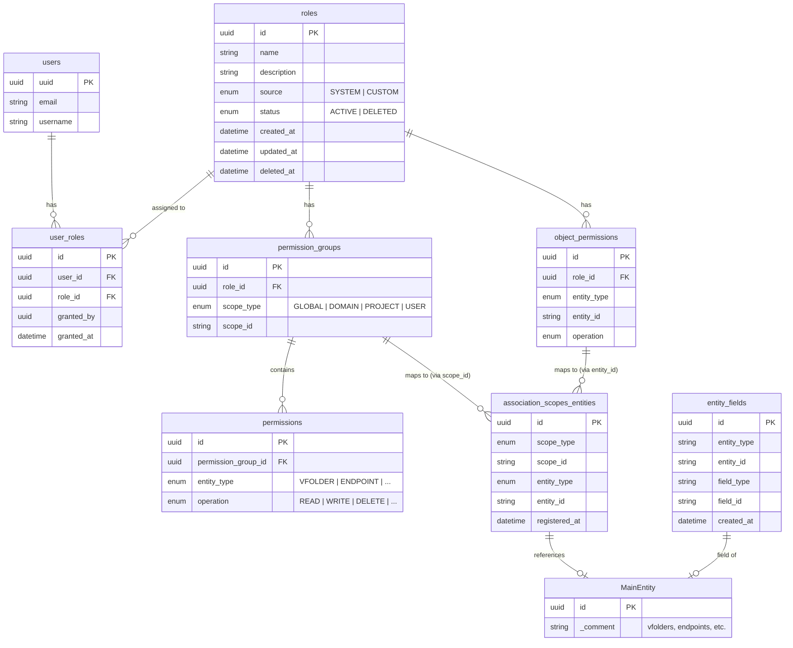
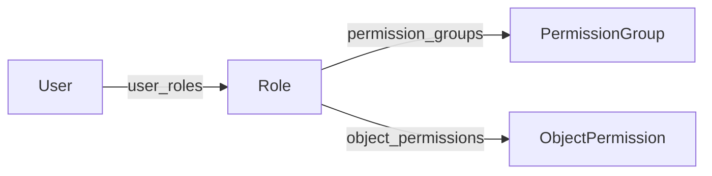
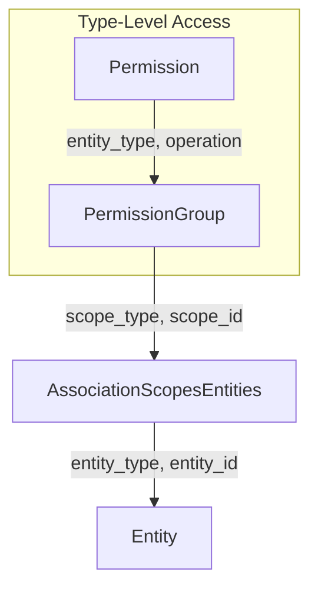
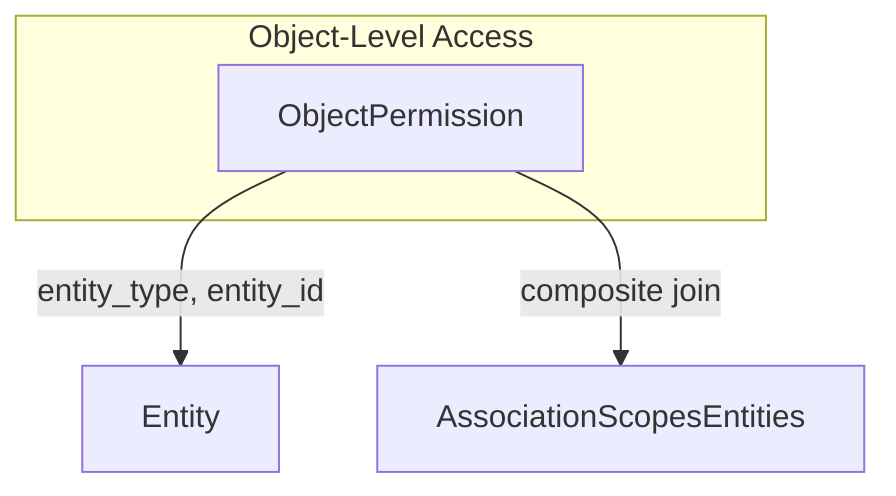

# RBAC Table Relations

## Overview

RBAC (Role-Based Access Control) 시스템의 테이블 관계도입니다.

## Entity Relationship Diagram



## Table Descriptions

### Core Tables

| Table | Description |
|-------|-------------|
| `roles` | Role definitions with name, source (SYSTEM/CUSTOM), and status |
| `user_roles` | Many-to-many mapping between users and roles |
| `permission_groups` | Groups permissions by scope (domain, project, user) |
| `permissions` | Type-level permissions (entity_type + operation) |
| `object_permissions` | Object-level permissions for specific entity instances |

### Association Tables

| Table | Description |
|-------|-------------|
| `association_scopes_entities` | Maps entities to their owning scopes |
| `entity_fields` | Maps field-level entities to their parent entities |

## Permission Types

### Type-Level Permissions (`permissions`)

Scope 내의 모든 entity에 대한 권한을 부여합니다.

```
PermissionGroup (scope: project-A)
  └── Permission (entity_type: VFOLDER, operation: READ)
      → project-A 내 모든 VFolder에 READ 권한
```

### Object-Level Permissions (`object_permissions`)

특정 entity instance에 대한 권한을 부여합니다.

```
ObjectPermission (entity_type: VFOLDER, entity_id: "vf-123", operation: READ)
  → vf-123 VFolder에만 READ 권한
```

## Relationship Details

### 1. User → Role Assignment



### 2. Scope-Based Permission Resolution



### 3. Object-Level Permission Resolution



## Composite Relationships (No FK)

다음 관계들은 FK 없이 composite key로 연결됩니다:

| From | To | Join Condition |
|------|----|----------------|
| `object_permissions` | `association_scopes_entities` | `entity_type = entity_type AND entity_id = entity_id` |
| `permission_groups` | `association_scopes_entities` | `scope_id = scope_id` |

SQLAlchemy에서는 `viewonly=True`와 `foreign()` 마커를 사용하여 구현합니다.

## Indexes

| Table | Index | Columns |
|-------|-------|---------|
| `roles` | `ix_id_status` | id, status |
| `user_roles` | `uq_user_id_role_id` | user_id, role_id (UNIQUE) |
| `permission_groups` | `ix_id_role_id_scope_id` | id, role_id, scope_id |
| `permissions` | `ix_id_permission_group_id` | id, permission_group_id |
| `object_permissions` | `ix_id_role_id_entity_id` | id, role_id, entity_id |
| `association_scopes_entities` | `uq_scope_id_entity_id` | scope_type, scope_id, entity_id (UNIQUE) |
| `entity_fields` | `ix_entity_fields_entity_lookup` | entity_type, entity_id |
| `entity_fields` | `ix_entity_fields_field_lookup` | field_type, field_id |
| `entity_fields` | `uq_entity_fields_mapping` | entity_type, entity_id, field_type, field_id (UNIQUE) |
