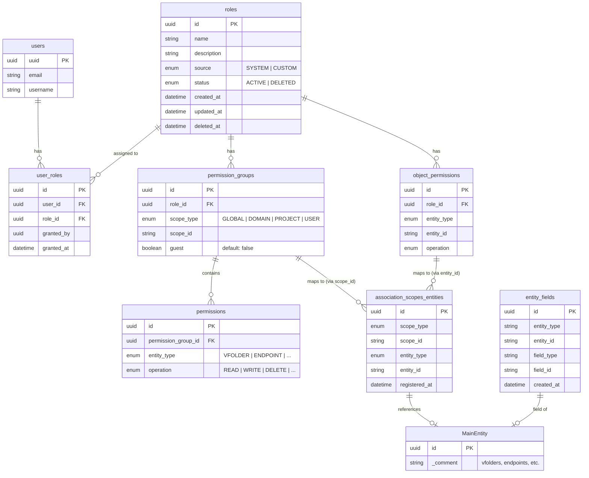
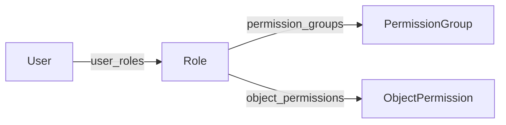
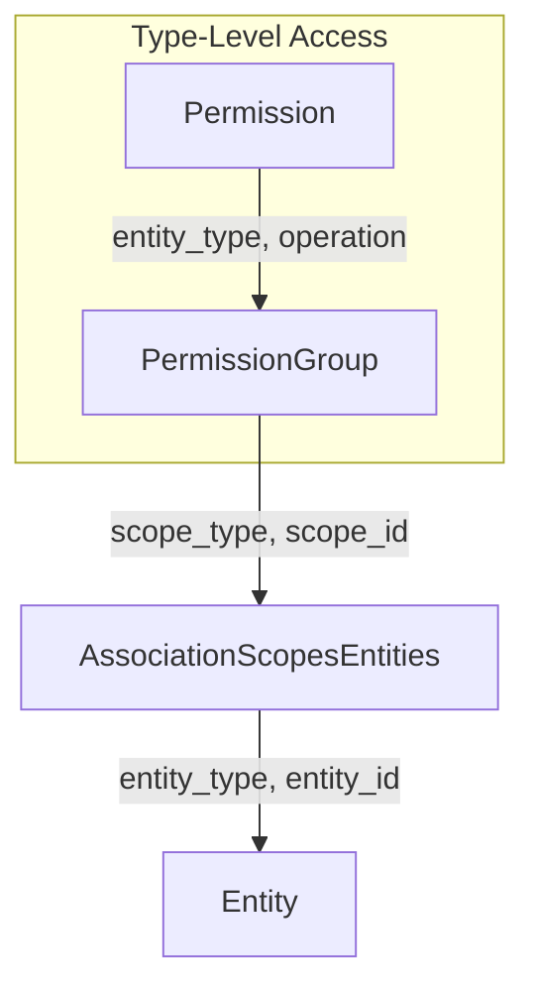
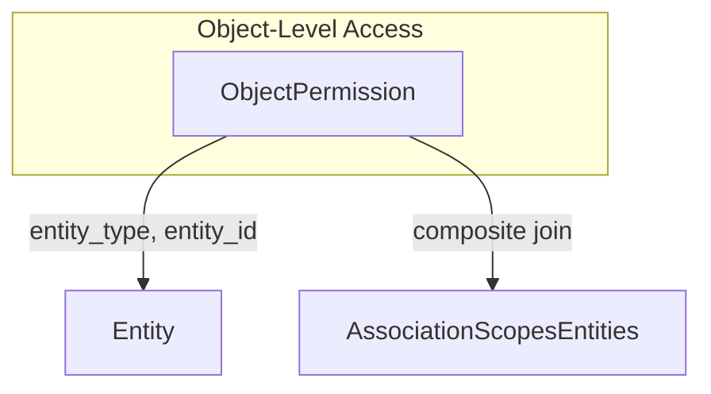

# RBAC Table Relations

## Overview

This document describes the table relationships for the RBAC (Role-Based Access Control) system.

## Entity Relationship Diagram



## Table Descriptions

### Core Tables

| Table | Description |
|-------|-------------|
| `roles` | Role definitions with name, source (SYSTEM/CUSTOM), and status |
| `user_roles` | Many-to-many mapping between users and roles |
| `permission_groups` | Groups permissions by scope (domain, project, user). `guest=true` indicates cross-scope visibility without type-level permissions |
| `permissions` | Type-level permissions (entity_type + operation) |
| `object_permissions` | Object-level permissions for specific entity instances |

### Association Tables

| Table | Description |
|-------|-------------|
| `association_scopes_entities` | Maps entities to their owning scopes |
| `entity_fields` | Maps field-level objects to their associated entities |

## Permission Types

### Type-Level Permissions (`permissions`)

Grants permissions for all entities within a scope.

```
PermissionGroup (scope: project-A)
  └── Permission (entity_type: VFOLDER, operation: READ)
      → READ permission for all VFolders in project-A
```

### Object-Level Permissions (`object_permissions`)

Grants permissions for a specific entity instance.

```
ObjectPermission (entity_type: VFOLDER, entity_id: "vf-123", operation: READ)
  → READ permission only for vf-123 VFolder
```

### Guest Permission Groups

Provides scope visibility for cross-scope permission sharing, allowing roles to see other scopes.

**Characteristics**:
- Permission group with `guest=true`
- Provides scope visibility only, without type-level permissions
- Actual permissions are granted via object_permissions
- Only one guest permission group per scope is maintained

**Example: User A invites User B to vfolderA**:

```
1. Items added to User B's system role:
   - ObjectPermission (entity_type: VFOLDER, entity_id: "vfolderA", operation: READ)
   - PermissionGroup (scope_type: USER, scope_id: "userA", guest: true)
     └── permissions: none

2. Result:
   - User B can see User A's scope (guest permission group)
   - User B has READ permission on vfolderA (object permission)
```

**Deletion Conditions**:
- When a share is revoked, the guest permission group is only deleted if the removed object permission was the only entity in that scope for the role
- Example: If User B's system role has only vfolderA as an object permission in User A's scope → revoking the share also deletes the guest permission group
- Example: If User B's system role has both vfolderA and vfolderB as object permissions in User A's scope → revoking vfolderA share keeps the guest permission group

## Relationship Details

### 1. User → Role Assignment



### 2. Scope-Based Permission Resolution



### 3. Object-Level Permission Resolution



## Composite Relationships (No FK)

The following relationships are connected via composite keys without foreign keys:

| From | To | Join Condition |
|------|----|----------------|
| `object_permissions` | `association_scopes_entities` | `entity_type = entity_type AND entity_id = entity_id` |
| `permission_groups` | `association_scopes_entities` | `scope_id = scope_id` |

In SQLAlchemy, these are implemented using `viewonly=True` and `foreign()` markers.

## Indexes

| Table | Index | Columns |
|-------|-------|---------|
| `roles` | `ix_id_status` | id, status |
| `user_roles` | `uq_user_id_role_id` | user_id, role_id (UNIQUE) |
| `permission_groups` | `ix_id_role_id_scope_id` | id, role_id, scope_id |
| `permissions` | `ix_id_permission_group_id` | id, permission_group_id |
| `object_permissions` | `ix_id_role_id_entity_id` | id, role_id, entity_id |
| `association_scopes_entities` | `uq_scope_id_entity_id` | scope_type, scope_id, entity_id (UNIQUE) |
| `entity_fields` | `ix_entity_fields_entity_lookup` | entity_type, entity_id |
| `entity_fields` | `ix_entity_fields_field_lookup` | field_type, field_id |
| `entity_fields` | `uq_entity_fields_mapping` | entity_type, entity_id, field_type, field_id (UNIQUE) |
