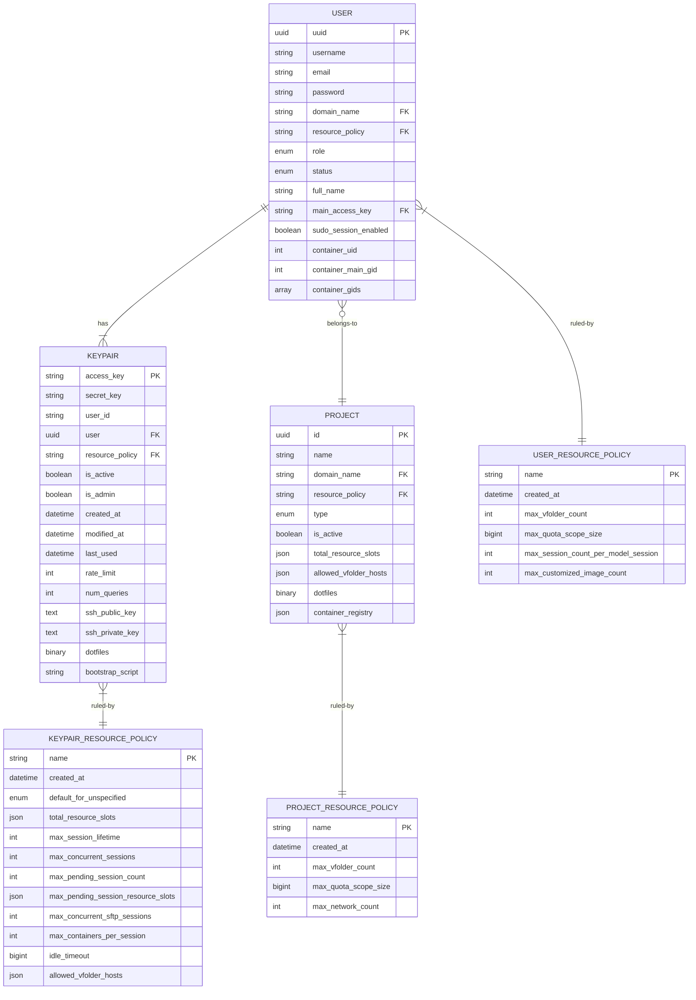
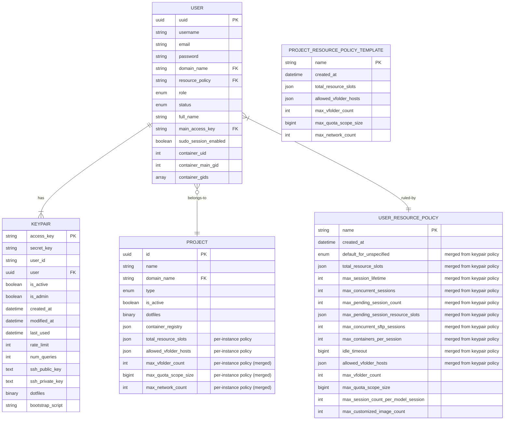
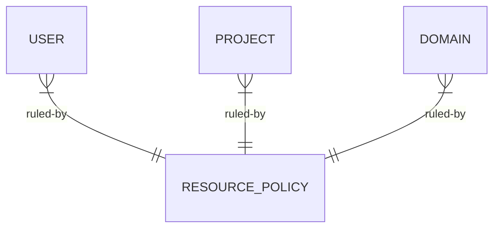

# KeyPair/User/Project Resource Policy Reorganization

## Motivation

**Keypairs** are intended to be volatile, replaceable, and rotatable authentication tokens for programmatic access to Backend.AI Manager.

Historically, we had only keypairs in the early versions of Backend.AI (when it was "Sorna" deployed as the backend of CodeOnWeb) and later added users. Due to this historical order, we first added separate resource policies bound to each keypair and later added per-user resource policies.

This design makes a lot of confusion and complication in the system and UI design, as the user identity is mapped to a user, not the keypair.
``
- There has been multiple customer requests to make keypairs auto-rotated, which makes additional complication because sharing the quota by multiple keypairs for a single user requires bug-prone additional database queries and exception handling.
- If a user has multiple keypairs, they get duplication of resource quota specified in the keypair resource policy.
- We need to have a "main" keypair concept to designate which keypair to display in various keypair-based user scenarios.

## Current Design

Currently we have three resource policies:

* **Keypair resource policy** (`keypair_resource_policies` table): Controls session-related quotas bound to each keypair.
  - `total_resource_slots`: Maximum compute resources (CPU, memory, GPU, etc.) the keypair can consume across all running sessions.
  - `max_concurrent_sessions`: Maximum number of non-SFTP sessions that can run simultaneously.
  - `max_concurrent_sftp_sessions`: Maximum number of private SFTP sessions allowed.
  - `max_pending_session_count`: Maximum number of sessions allowed in pending state.
  - `max_pending_session_resource_slots`: Resource limit for pending sessions.
  - `max_session_lifetime`: Maximum duration a session can run (in seconds, 0 = unlimited).
  - `max_containers_per_session`: Maximum kernels/containers per session (for multi-container sessions).
  - `idle_timeout`: Session idle timeout duration.
  - `allowed_vfolder_hosts`: Storage hosts and their permission levels that this keypair can access.
  - `default_for_unspecified`: Default behavior (`LIMITED` or `UNLIMITED`) for resource types not explicitly specified.

* **User resource policy** (`user_resource_policies` table): Controls storage and model-serving quotas bound to each user.
  - `max_vfolder_count`: Maximum number of virtual folders the user can own.
  - `max_quota_scope_size`: Maximum total storage size for user-owned vfolders.
  - `max_session_count_per_model_session`: Maximum concurrent sessions for a single model service endpoint owned by the user.
  - `max_customized_image_count`: Maximum number of custom container images the user can publish. 

* **Project resource policy** (`project_resource_policies` table): Controls shared quotas for project-level resources.
  - `max_vfolder_count`: Maximum number of virtual folders the project can own.
  - `max_quota_scope_size`: Maximum total storage size for project-owned vfolders.
  - `max_network_count`: Maximum number of container networks the project can create (-1 = unlimited).

Note that `PROJECT` (groups) table also has `total_resource_slots` and `allowed_vfolder_hosts` columns directly embedded, which are used to enforce aggregate resource limits and storage access at the project level (separate from the named policy).

### Relationship between Projects and Project Resource Policies

There are two distinct types of resource configurations in each side of individual project instances and "named" project resource policy objects.

#### 1. Per-Project Instance Fields (directly in `groups` table)

These fields are **independently configured for each project instance** at creation time and can be modified individually:

| Field                   | Default                  | Source               | Purpose                                                           |
| ----------------------- | ------------------------ | -------------------- | ----------------------------------------------------------------- |
| `total_resource_slots`  | `{}` (empty = no limit)  | Provided at creation | Aggregate compute resource quota for all sessions in this project |
| `allowed_vfolder_hosts` | `{}` (empty = no access) | Provided at creation | Storage host access permissions specific to this project          |

These per-instance fields allow different projects within the same domain to have different compute resource caps and storage access configurations, even if they share the same named policy.

#### 2. Policy-Referenced Fields (via `resource_policy` FK)

The `resource_policy` column is a foreign key to `project_resource_policies.name` (defaults to `"default"`). Multiple projects can share the same named policy, and changes to the policy affect all referencing projects:

| Field (in policy)      | Applied via  | Purpose                                                    |
| ---------------------- | ------------ | ---------------------------------------------------------- |
| `max_vfolder_count`    | FK reference | Limits total number of vfolders the project can own        |
| `max_quota_scope_size` | FK reference | Limits total storage size across all project vfolders      |
| `max_network_count`    | FK reference | Limits number of container networks the project can create |

#### Semantic Distinction

| Aspect | Per-Project Fields | Policy-Referenced Fields |
|--------|-------------------|-------------------------|
| **Granularity** | Per-project instance | Shared across projects |
| **Modification** | Change affects only this project | Change affects all projects using the policy |
| **Resource Type** | Compute resources (CPU, memory, GPU) | Storage quotas and network limits |
| **Enforcement** | Scheduler validators (`GroupResourceLimitValidator`) | VFolder/Network creation handlers |
| **Inheritance** | None - independently set | Inherited from named policy |

This design pattern is ***not*** replicated in keypair or user resource policies, where all quota fields are managed through the named policy reference. 

## Proposed Design

### 1. Merge KeyPair resource policies into User resource policies

Since resource policies should applied in the granularity of users, not the authentication tokens (= keypairs), we need to merge the entire keypair resource policies into the user resource policies.

### 2. Merge Project resource policies into individual Project resource configurations

There is no reason to have separate shared, inherited named resource policy for projects. Let's merge and migrate all project resource policy fields to individual project instances.

We could repurpose the existing project resource policy as "project resource policy templates" for administrators repeatedly creating new projects.

### 1 & 2: Redesigned database schema

**Summary of changes:**

1. **`KEYPAIR` table**: Removed `resource_policy` FK. Keypairs no longer reference resource policies directly; all resource constraints are now enforced at the user level.

2. **`KEYPAIR_RESOURCE_POLICY` table**: **Removed**. All fields merged into `USER_RESOURCE_POLICY`.

3. **`USER_RESOURCE_POLICY` table**: Now contains all session-related quotas previously in keypair resource policies, plus existing user-specific quotas:
   - Session quotas: `total_resource_slots`, `max_concurrent_sessions`, `max_session_lifetime`, `idle_timeout`, etc.
   - Storage quotas: `max_vfolder_count`, `max_quota_scope_size`, `allowed_vfolder_hosts`
   - Model serving: `max_session_count_per_model_session`, `max_customized_image_count`

4. **`PROJECT` table**: Now contains all quota fields directly (no FK reference to policy):
   - `max_vfolder_count`, `max_quota_scope_size`, `max_network_count` merged from `PROJECT_RESOURCE_POLICY`
   - Existing `total_resource_slots` and `allowed_vfolder_hosts` remain as per-instance fields

5. **`PROJECT_RESOURCE_POLICY` → `PROJECT_RESOURCE_POLICY_TEMPLATE`**: Repurposed as an optional template for administrators to quickly configure new projects with preset values. Projects no longer reference this via FK; it serves only as a convenience for copying defaults during project creation.

### 3. Add per-user default project aka workspace AND/OR implement RBAC-like scoping of user and project resource policies

> [!NOTE]
> **Discussion required**
> 
> We could even **merge per-user resource policies into per-project resource** if we make all users have their own "workspace" project.
> The problem is that sometimes we may want to impose resource limits across multiple users who belong to different projects. For such case, we may want to have separate per-user reference to external resource policies.
> 
> In other words, we need to reconcile the following concepts:
> 
> - Per-user shared resource policies crossing the project boundary
> - Per-project resource policies with per-user's own default workspace project

## Impacts to Users or Developers / Migration Plan
(TODO)
