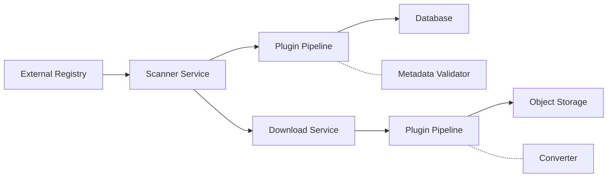
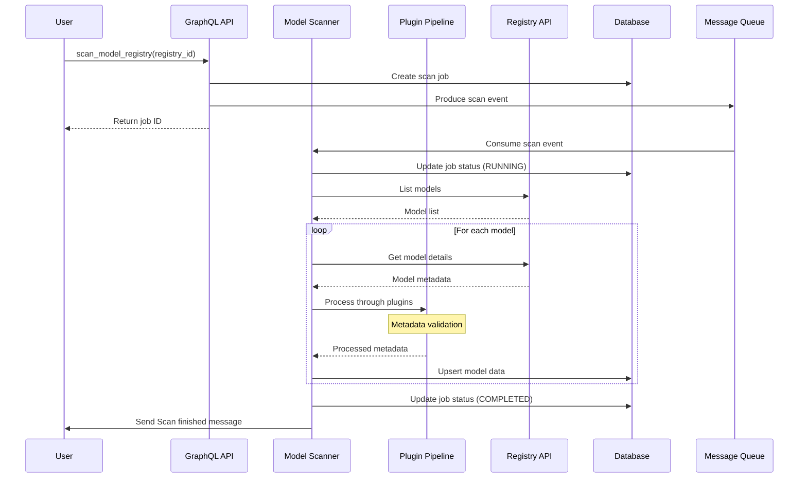
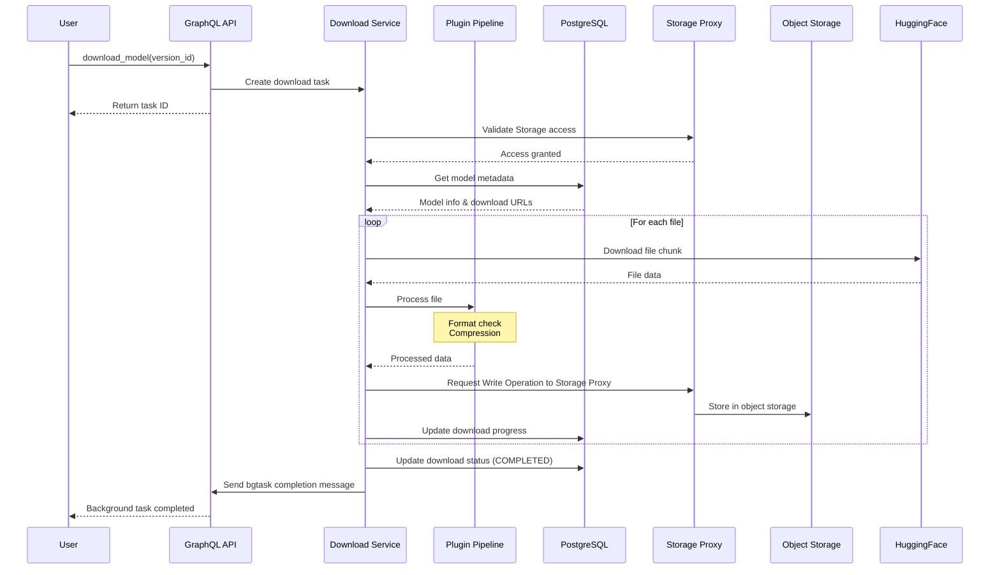

# Title

Model Scanner and Downloader for downloading Model codes from external model hubs

## Motivation

Backend.AI currently lacks a systematic way to discover, catalog, and manage ML models from external model registries. Users must manually download models from sources like HuggingFace, manage versions independently, and upload them to Storage


## Current Design

Currently, Backend.AI handles models through:
- VFolder System: Generic file storage without model-specific metadata
- Container Registry: For Docker images, not ML models
- Model Serving: Assumes models are already present in VFolders


## Proposed Design

### High-Level Architecture



### Sequence Diagram
#### Model Scanning Flow with Plugins


#### Model Download Flow with Plugins



### Core Components

1. **Model Scanner Service**
   - Interfaces with external registries (HuggingFace, ModelHub, custom)
   - Fetches and normalizes model metadata
   - Supports both manual and scheduled scanning
   - Metadata is stored in DB

2. **Plugin Architecture**
   - Extensible processing pipeline for scan and download workflows
   - Built-in plugins: lisence checking, metadata validation, format conversion

3. **Download Serivce**
   - Concurrent download support with progress tracking
   - Resumable downloads for large models
   - Downloaded artifacts will be stored in (Object Storage) via Storage Proxy


## Technical Implementation

### Model Scanner Service
#### Scanner Service Interface
```python
class ModelScannerService:
    """Core service for scanning model registries"""
    
    def __init__(self, db, cache, event_bus, plugin_pipeline):
        self.db = db
        self.plugin_pipeline = plugin_pipeline
        self.scanners: dict[str, BaseScanner] = {}
    
    async def scan_registry(
        self,
        registry_id: UUID,
        options: ScanOptions
    ) -> ScanJob:
        """Execute a registry scan with plugin pipeline"""
        # 1. Create scan job
        # 2. Get registry config
        # 3. Initialize appropriate scanner
        # 4. Execute PRE_SCAN plugins
        # 5. Process results through POST_SCAN plugins
        # 6. Process results through POST_SCAN plugins
        # 7. Update job status
        # 8. Publish events
    
    async def scan_single_model(
        self,
        registry_id: UUID,
        external_id: str,
    ) -> ModelInfo:
        """Scan a specific model with plugin processing"""
        # 1. Get model details
        # 2. Process through POST_SCAN plugins
        # 3. Update database
```

#### Scanner Data Model
```python
@dataclass
class ScanJob:
    """Event published to message queue for scan jobs"""
    job_id: UUID
    model_registry_id: UUID 
    options: dict[str, Any]
    created_by: Optional[UUID]
    created_at: datetime


@dataclass
class ModelInfo:
    """Base class for model information from any source"""
    model_id: str  # Source-specific identifier (repo_id for HF)
    name: str
    author: Optional[str]
    description: Optional[str]
    last_modified: Optional[datetime]
    download_count: int = 0
    popularity_score: int = 0  # likes, stars, etc.
    tags: list[str] = field(default_factory=list)
    license: Optional[str] = None
    framework: Optional[str] = None  # Detected or specified
    task_type: Optional[str] = None
    metadata: dict[str, Any] = field(default_factory=dict)


@dataclass
class ModelFileInfo:
    """Base class for file information from any source"""
    path: str
    size: int
    checksum: Optional[str] = None
    mime_type: Optional[str] = None
    download_url: Optional[str] = None
    metadata: dict[str, Any] = field(default_factory=dict)
    
```

#### Scanner Interface
```python
class AbstractScanner(ABC):
    """Abstract base for registry scanners"""
    
    @abstractmethod
    async def list_models(self, query, limit, offset, filters) -> list[ModelInfo]:
        """List models with pagination"""
    
    @abstractmethod
    async def get_model_details(self, model_id: str) -> ModelInfo:
        """Get comprehensive model information"""
    
    @abstractmethod
    async def get_model_versions(self, model_id: str) -> list[ModelVersionInfo]:
        """Get all versions of a model"""
    
    @abstractmethod
    async def get_version_files(self, model_id: str, version: str) -> list[ModelFileInfo]:
        """Get file listing for a version"""
    
    @abstractmethod
    async def get_download_url(self, model_id: str, version: str, file_path: str) -> str:
        """Generate download URL for a file"""
```

#### Scanner Implementations
```python
class HuggingFaceScanner(BaseScanner):
    """HuggingFace Hub scanner implementation"""
    
    def __init__(self, config: ScannerConfig):
        self.token = config.token
    
    @override
    async def list_models(self, **kwargs) -> list[ModelInfo]
        # Implementation using HF API

class ManagerScanner(BaseScanner):
    """Scan from other manager"""
```


### Download Service

#### Download service implementation
```python
class DownloadManagerService:
    """Manages concurrent model downloads with plugin support"""
    
    def __init__(
        self,
        vfolder_service: VFolderService,
        plugin_pipeline: PluginPipeline,
        max_concurrent: int,
        chunk_size: int
    ):
        self.vfolder_service = vfolder_service
        self.plugin_pipeline = plugin_pipeline
        self.active_downloads: dict[UUID, DownloadTask] = {}
        self.download_queue = asyncio.Queue()
        self.semaphore = asyncio.Semaphore(max_concurrent)
    
    async def create_download(
        self,
        model_version_id: UUID,
        vfolder_id: UUID,
        user_id: UUID,
    ) -> DownloadTask:
        """Create and queue a download with plugin processing"""
        # 1. Validate permissions
        # 2. Execute PRE_DOWNLOAD plugins
        # 3. Create download record
        # 4. Queue download task
        # 5. Return download object
    
    async def download_worker(self):
        """Background worker for processing downloads"""
        while True:
            task = await self.download_queue.get()
            async with self.semaphore:
                await self._execute_download_with_plugins(task)
```

#### Download Data Model
```python
@dataclass
class DownloadTask:
    """Download task information"""
    task_id: UUID
    model_version_id: UUID
    vfolder_id: UUID
    status: str
    created_at: datetime
    total_files: int
    total_size: int
```

### Plugin Architecture

```python
class PluginStage(StrEnum):
    PRE_SCAN = "PRE_SCAN"
    POST_SCAN = "POST_SCAN"
    PRE_DOWNLOAD = "PRE_DOWNLOAD"
    POST_DOWNLOAD = "POST_DOWNLOAD"

class PluginType(StrEnum):
    VALIDATOR = "VALIDATOR"
    LICENSE_CHECKER = "LICENSE_CHECKER"


@dataclass
class PluginContext:
    model_registry_id: UUID
    stage: PluginStage
    user_id: Optional[UUID]
    metadata: dict[str, Any]  # Can include repo_id, model_name, etc.


@dataclass
class PluginResult:
    success: bool
    data: Optional[Any] # TODO: Define proper type
    error: Optional[Any] # TODO: Define proper type


class BasePlugin(ABC):
    """Base class for all model registry plugins"""
    
    @property
    @abstractmethod
    def name(self) -> str:
        """Unique plugin name"""
    
    @property
    @abstractmethod
    def version(self) -> str:
        """Plugin version"""
    
    @property
    @abstractmethod
    def plugin_type(self) -> PluginType:
        """Type of the plugin"""
    
    @property
    @abstractmethod
    def supported_stages(self) -> list[PluginStage]:
        """Stages where this plugin can be executed"""
    
    @abstractmethod
    async def initialize(self, config: PluginConfig) -> None:
        """Initialize plugin with configuration"""
    
    @abstractmethod
    async def process(
        self,
        data: Any,
        context: dict[str, Any],
        stage: PluginStage
    ) -> PluginResult:
        """Process data through the plugin"""
    
    @abstractmethod
    async def cleanup(self) -> None:
        """Cleanup plugin resources"""
    
    def can_handle(self, data_type: str, stage: PluginStage) -> bool:
        """Check if plugin can handle this data type at this stage"""
        return stage in self.supported_stages
```

```python
class PluginPipeline:
    """Manages plugin execution pipeline"""
    
    def __init__(self, plugin_registry: PluginRegistry):
        self.registry = plugin_registry
    
    async def execute(
        self,
        data: Any, # TODO: Define proper type
        context: dict[str, Any],
        stage: PluginStage,
        model_registry_id: Optional[UUID]
    ) -> PipelineResult:
        """Execute all plugins for a given stage"""
```


## Impacts to Users or Developers

1. **Simplified Workflow**
   - One-click model discovery and download
   - No manual file transfers needed
   - Integrated version management

2. **Extensible Architecture**
   - Plugin system for custom processing
   - Easy to add new registry types


## References
1. **HuggingFace Hub API**: https://huggingface.co/docs/hub/api
2. **Model Registry Patterns**: 
   - MLflow Model Registry
   - Kubeflow Model Management

3. **Backend.AI Architecture**:
   - VFolder System Documentation
   - Container Registry Implementation (`src/ai/backend/manager/api/container_registry.py`)
   - GraphQL API Patterns (`src/ai/backend/manager/models/gql.py`)
