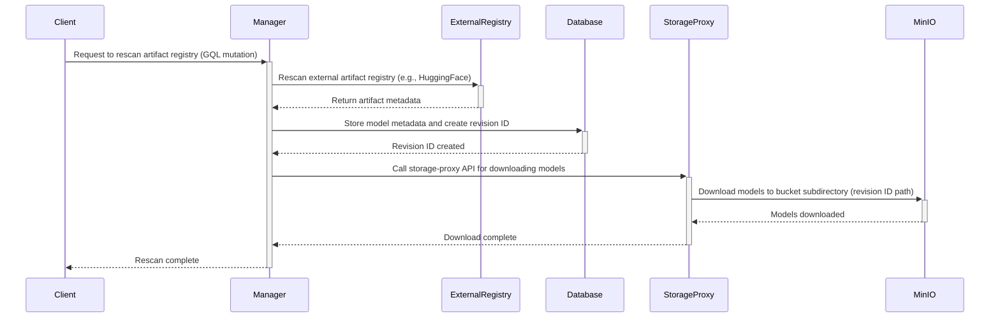

# Support MinIO as Artifact Registry Storage Backend

Let's add support for `MinIO` in the storage proxy as a storage backend for the artifact registry.

## Motivation

Let's integrate external storage into the storage proxy so that models, images, packages, and more can be stored and accessed by the Backend.AI scanner. We will use MinIO as the storage backend.

# Use Case

1. Client sends a request to the manager to rescan the artifact registry via a GQL mutation.

2. Manager rescans an external artifact registry (such as HuggingFace or an external manager), and the metadata of the models is stored in the database.

3. Call storage-proxy API for downloading the rescanned models to the storage.

4. The models and metadata files are downloaded to the subdirectory path corresponding to the revision ID of the bucket.



# Database Schema

## Artifact Registry Storage Mapping Table

The artifact registry requires database tables to store mapping information between artifacts and MinIO bucket paths.

```sql
CREATE TABLE artifacts (
    id UUID PRIMARY KEY DEFAULT gen_random_uuid(),
    type VARCHAR(20) NOT NULL,  -- 'image', 'package', 'model'
    name VARCHAR(50) NOT NULL,
    storage_type VARCHAR(50) NOT NULL DEFAULT 'minio',  -- 'minio', 's3', etc.
    created_at TIMESTAMP DEFAULT NOW()
);

CREATE TABLE object_storage_backend (
    id UUID PRIMARY KEY DEFAULT gen_random_uuid(),
    artifact_id UUID NOT NULL REFERENCES artifacts(id),
    access_key TEXT NOT NULL,
    secret_key TEXT NOT NULL,
    endpoint TEXT NOT NULL,
)

CREATE TABLE association_artifact_storage (
    id UUID PRIMARY KEY DEFAULT gen_random_uuid(),
    artifact_id UUID NOT NULL REFERENCES artifacts(id),
    storage_object_id UUID NOT NULL REFERENCES storage_objects(id),
    created_at TIMESTAMP DEFAULT NOW(),
    UNIQUE(artifact_id, storage_object_id)
);

-- S3 compataible storage object data
-- (Since object storage that is not S3-compatible is not planned to be supported, we will use the name storage_object.)
CREATE TABLE storage_objects (
    id UUID PRIMARY KEY DEFAULT gen_random_uuid(),
    artifact_id UUID NOT NULL REFERENCES artifacts(id),
    object_key TEXT NOT NULL,  -- bucket path
    size_bytes BIGINT,
    checksum_sha256 VARCHAR(64),
    created_at TIMESTAMP DEFAULT NOW(),
    updated_at TIMESTAMP DEFAULT NOW(),
    UNIQUE(artifact_id, object_key)
);
```

# Storage Proxy Implementations

The following additional implementations are required to realize the use cases.

## Integration with MinIO

Add service code to the storage proxy for configuring the artifact registry.
We can refer to components such as `BaseVolume` and `FsOpModel`, which operate as the VFolder backend, when writing the implementation. But, since the artifact registry storage does not need to function as a VFolder at this point, let's remove any unnecessary parts and properly abstract the interface.

Communication with `MinIO` is handled using `s3fs`. We will need to implement an `FsOpModel` that mounts the `s3fs` bucket as a file system on the storage host and handles download and upload operations.

## Storage proxy status management

It will be necessary to track the storage status of the storage proxy.

Let's cache the current status of the storage in Redis such as which storage objects are currently mounted, which are not yet mounted, or if any errors have occurred—so that the storage proxy's status can be easily checked.

## API Specifications

It will be necessary to implement additional CRUD REST APIs for each artifact type in the storage proxy.

### Storage Proxy REST APIs

The storage proxy APIs will provide general storage operations for managing content from external sources:

The REST APIs specified below should include the external registry’s `type`, `endpoint`, and `credentials` in the request body.

#### Rescan Metadata from External Registry

Rescans the metadata from an external registry. After the rescanned metadata is sent to the *Manager*, it will be stored in the database.

```
POST /storages/{storage_type}/rescan
Content-Type: application/json

{
  "registry_type": "huggingface",
  "registry_url": "https://huggingface.co/gpt2",
  "artifact_type": "model",
  "artifact_name": "gpt-2",
  "revision": "main"
}

Response:
{
  "status": "success",
  "message": "Metadata rescanned successfully",
  "artifact_id": "123e4567-e89b-12d3-a456-426614174000",
  "revision_id": "abc123def456",
  "metadata": {
    "name": "gpt-2",
    "type": "model",
    "size": 548000000,
    "files": [
      "config.json",
      "pytorch_model.bin",
      "tokenizer.json"
    ],
    "last_modified": "2025-07-11T10:00:00Z"
  }
}
```

#### Download Artifact Files from External Registry

Rescans the external registry and downloads the artifact files to the designated storage.

```
POST /storages/{storage_type}/download
Content-Type: application/json

{
  "artifact_id": "123e4567-e89b-12d3-a456-426614174000",
  "revision_id": "abc123def456",
  "registry_type": "huggingface",
  "registry_url": "https://huggingface.co/gpt2",
  "target_bucket": "artifacts",
  "target_path": "models/gpt-2/abc123def456",
  "files": [
    "config.json",
    "pytorch_model.bin",
    "tokenizer.json"
  ]
}

Response:
{
  "task_id": "download_task_123",
  "status": "started",
  "message": "Download started to models/gpt-2/abc123def456"
}
```


#### Get Download Task Status

Returns the download task's status.

```
GET /storages/{storage_type}/download/{task_id}

Response:
{
  "task_id": "download_task_123",
  "status": "completed",
  "progress": 100,
  "target_path": "models/gpt-2/abc123def456",
  "downloaded_files": [
    "config.json",
    "pytorch_model.bin",
    "tokenizer.json"
  ]
}
```

#### List Storage Files

Lists the files located in a specific path of the designated storage and returns them in the response.

```
GET /storages/{storage_type}/list-files

Response:
{
  "path": "models/gpt-2/abc123def456",
  "size": 548000000,
  "files": [
    {
      "name": "config.json",
      "size": 1024,
      "last_modified": "2025-07-11T10:00:00Z"
    },
    {
      "name": "pytorch_model.bin",
      "size": 547998976,
      "last_modified": "2025-07-11T10:05:00Z"
    }
  ]
}
```

#### Delete Storage Files

Deletes the files located in a specific path of the designated storage.

```
DELETE /storages/{storage_type}

Response: 204 No Content
```

# References

- [`s3fs` FAQ](https://github.com/s3fs-fuse/s3fs-fuse/wiki/FAQ)

- [`s3fs` options](https://github.com/s3fs-fuse/s3fs-fuse/wiki/Fuse-Over-Amazon#options)
