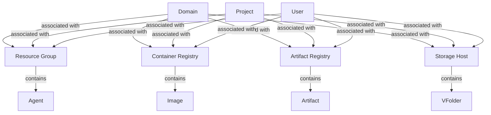

# Scope Types Description

## Motivation

The current Backend.AI RBAC system manages permissions through a hierarchical scope structure (Domain > Project > User). The Global scope type exists in the enum definition but is not used for actual permission verification — global-level access is handled as a wildcard and admin APIs are being separated into a distinct layer. The effective hierarchical scopes for permission checks are Domain, Project, and User.

While this structure effectively represents organizational hierarchy, it has limitations when it comes to fine-grained access control for the following infrastructure resources:

1. **Resource Group**: Access control for logical groups of computing resources (agent nodes)
2. **Container Registry**: Access control for container image registries
3. **Artifact Registry**: Access control for artifact registries (models, datasets, etc.)
4. **Storage Host**: Access control for storage backend hosts

Currently, these resources are associated with Domains or Projects through association tables, but they are not treated as independent permission boundaries (Scopes) within the RBAC system. This leads to the following issues:

- Difficulty in restricting which users can create sessions on specific Resource Groups
- Limited ability to control image access permissions per Container Registry
- Insufficient role-based access control for Artifact Registries
- Inflexible management of VFolder creation permissions per Storage Host

This document defines new Scope Types that operate **independently** from the existing hierarchical Scopes, enabling fine-grained permission management for infrastructure resources.

## Current Design

### Existing Scope Types

The current Backend.AI RBAC system defines four Scope Types:

```python
class ScopeType(enum.StrEnum):
    GLOBAL = "global"
    DOMAIN = "domain"
    PROJECT = "project"
    USER = "user"
```

The `GLOBAL` scope type exists in the definition but is not used for actual permission verification. Global-level access is treated as a wildcard, and admin APIs are being separated into a distinct layer. The effective scopes for permission checks follow this hierarchy:

```
DOMAIN (broadest effective scope)
   ↓
PROJECT
   ↓
USER (narrowest)
```

### Existing Entity Types

Infrastructure resources are currently defined only as Entity Types:

```python
class EntityType(enum.StrEnum):
    # Scope-defining entities
    USER = "user"
    PROJECT = "project"
    DOMAIN = "domain"

    # Resource entities
    VFOLDER = "vfolder"
    IMAGE = "image"
    SESSION = "session"
    ARTIFACT = "artifact"
    ARTIFACT_REGISTRY = "artifact_registry"
    # ...
```

### Current Resource Access Management

Access to infrastructure resources is currently managed through association tables:

| Resource | Association Method | Limitation |
|----------|-------------------|------------|
| Resource Group | `association_groups_users` table | Only Domain/Project-level control |
| Container Registry | `association_container_registries_groups` table | Only Group-level association |
| Artifact Registry | Entity ownership-based | Limited RBAC-based fine-grained control |
| Storage Host | Domain/Project configuration | Difficult per-user control |

## Proposed Design

### Overview of New Scope Types

Four new Scope Types are introduced that operate **independently (orthogonally)** from the existing hierarchical Scopes:

```
Hierarchical Scopes:              Independent Scopes:
┌─────────────────┐              ┌─────────────────────┐
│     DOMAIN      │              │   RESOURCE_GROUP    │
│        ↓        │              ├─────────────────────┤
│     PROJECT     │    ─────     │ CONTAINER_REGISTRY  │
│        ↓        │              ├─────────────────────┤
│      USER       │              │  ARTIFACT_REGISTRY  │
│                 │              ├─────────────────────┤
│                 │              │    STORAGE_HOST     │
└─────────────────┘              └─────────────────────┘
   (hierarchical)                     (independent)
```

**Note**: The `GLOBAL` scope type exists in the enum definition but is not used for permission verification. Global-level access is handled as a wildcard, and admin APIs are being separated into a distinct layer.

### Characteristics of Independent Scopes

The new Scope Types have the following characteristics:

1. **Non-hierarchical**: No parent-child relationships among themselves
2. **Orthogonal**: Permissions are applied independently from the existing hierarchical Scopes
3. **Composable**: Can be combined with existing Scopes for fine-grained permission control
4. **Associable with Hierarchical Scopes**: Each independent Scope can be mapped to existing Domain, Project, and User scopes

### Scope-Entity Type Mapping

Each new Scope Type has a primary Entity Type that belongs to it. When querying these entities, users must specify the parent Scope as part of the query context.

| Scope Type | Mapped Entity Type | Description |
|------------|-------------------|-------------|
| Resource Group | **Agent** | Agent nodes that provide computing resources within a Resource Group |
| Container Registry | **Image** | Container images stored in a Container Registry |
| Artifact Registry | **Artifact** | ML models, datasets, and checkpoints stored in an Artifact Registry |
| Storage Host | **VFolder** | Virtual folders stored on a Storage Host |

### Entity Query Pattern

When users query entities that belong to an independent Scope, they must specify the parent Scope to define the query boundary. This explicit scope specification ensures unambiguous resource resolution and consistent permission checks.

```
Query Pattern:
  entity_type + parent_scope_type + parent_scope_id → filtered entities

Examples:
  - List Agents    → specify Resource Group scope      (e.g., resource_group:<id>)
  - List Images    → specify Container Registry scope   (e.g., container_registry:<id>)
  - List Artifacts → specify Artifact Registry scope    (e.g., artifact_registry:<id>)
  - List VFolders  → specify Storage Host scope         (e.g., storage_host:<id>)
```

### Association with Hierarchical Scopes

Each independent Scope can be associated with existing hierarchical Scopes (Domain, Project, User). This association determines which users can access the independent Scope and its contained entities.



For example:
- A Domain can be associated with multiple Resource Groups, making the agents within those Resource Groups accessible to the Domain's members
- A Project can be associated with specific Container Registries, restricting which images are available for session creation within that Project
- A User can be granted access to specific Storage Hosts, controlling where they can create VFolders

### 1. Resource Group Scope

**Definition**: A Resource Group is a logical grouping of computing resources (agent nodes). The Resource Group Scope defines the permission boundary for accessing and using these groups.

**Mapped Entity Type**: **Agent** — Agent nodes that provide computing resources belong to a Resource Group.

**Purpose**:
- Restrict which Resource Groups can be used for session creation
- Control access to specific computing resources
- Enable resource isolation and allocation management

### 2. Container Registry Scope

**Definition**: A Container Registry stores and manages container images. The Container Registry Scope defines the permission boundary for accessing registries and their images.

**Mapped Entity Type**: **Image** — Container images belong to a Container Registry.

**Purpose**:
- Control access to container images per registry
- Separate security-verified images from public images

### 3. Artifact Registry Scope

**Definition**: An Artifact Registry stores and manages ML artifacts such as models, datasets, and checkpoints. The Artifact Registry Scope defines the permission boundary for accessing registries and their artifacts.

**Mapped Entity Type**: **Artifact** — ML models, datasets, and checkpoints belong to an Artifact Registry.

**Purpose**:
- Control access to artifacts (models, datasets)
- Manage artifact sharing across teams and projects

### 4. Storage Host Scope

**Definition**: A Storage Host is a storage backend that stores VFolder data. The Storage Host Scope defines the permission boundary for accessing storage hosts and managing VFolders on them.

**Mapped Entity Type**: **VFolder** — Virtual folders are stored on a Storage Host.

**Purpose**:
- Restrict which Storage Hosts can be used for VFolder creation
- Control access by storage tier (high-performance / standard / archive)

## Migration / Compatibility

This is a concept design document. Concrete migration plans will be defined separately during the implementation phase.

### Compatibility Considerations

1. **Existing association tables**: Maintain existing association mechanisms while adding RBAC-based permission control
2. **Existing APIs**: Preserve existing APIs while adding new Scope-based permission checks
3. **Gradual adoption**: Introduce new Scope Types incrementally to maintain compatibility with the existing system

## Open Questions

1. **Grant permission rules**: How should grant permissions work for new independent Scopes?
   - Should the existing hierarchical Scope grant rules be applied as-is?
   - How does granting work between independent Scopes?

2. **Scope priority**: How should conflicts between hierarchical Scope and independent Scope permissions be resolved?
   - e.g., All Resource Groups available at the Project level, but only specific Resource Groups allowed at the User level

3. **Default permissions**: What is the default permission policy for new Scope Types?
   - Explicit allow (allowlist) vs. explicit deny (denylist)

4. **Predefined Roles extension**: How should new Scope permissions be mapped to existing predefined roles (super-admin, admin, project-admin, etc.)?

## References

- [BEP-1008: RBAC](BEP-1008-RBAC.md) — RBAC technical implementation design
- [BEP-1012: RBAC (detailed)](BEP-1012-RBAC.md) — RBAC feature specification
