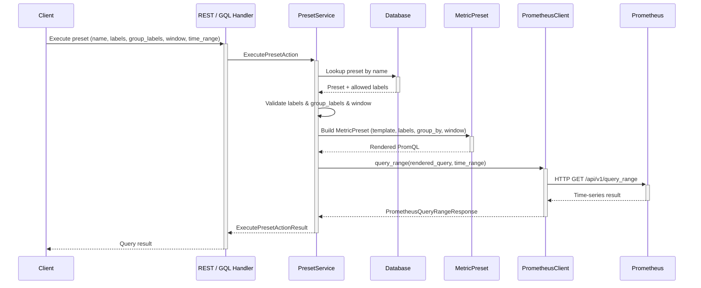

# Prometheus Query Preset System

## Related Issues

- JIRA: BA-4052
- JIRA: BA-4040 (epic: Prometheus Client Extraction and Querier Interface Abstraction)

## Motivation

In the current design introduced by [BEP-1045](BEP-1045-prometheus-client-extraction-and-querier-interface-abstraction.md), PromQL templates are hardcoded in the service layer. Adding a new metric query requires a code change, a review, and a release cycle — even when the underlying Prometheus metric already exists.

This proposal introduces a **Prometheus Query Preset System** that stores PromQL templates in the database and exposes them via API. Administrators can register, update, and remove query presets at runtime; authenticated users can execute presets by injecting parameters — without any code deployment.

### Goals

- Decouple PromQL template definitions from application code
- Allow administrators to manage query presets via CRUD API at runtime
- Provide a safe execution API that validates and renders templates using existing `MetricPreset` infrastructure
- Maintain injection safety via `_escape_label_value()` and label whitelisting

## Current Design

[BEP-1045](BEP-1045-prometheus-client-extraction-and-querier-interface-abstraction.md) extracted reusable Prometheus components (`MetricPreset`, `PrometheusClient`, `MetricQuerier`), but the PromQL template selection logic remains hardcoded in the service layer. Templates are chosen via a `match` statement at compile time, meaning any new query pattern requires a code change and redeployment.

### Problems

- **Template rigidity**: New query patterns require code changes and redeployment
- **No runtime management**: Administrators cannot add or modify queries without developer intervention
- **No label governance**: Any label can be used without validation; there is no concept of which labels are filterable or groupable per metric

## Proposed Design

### DB Schema

Two new tables store preset definitions and their allowed labels.

**Table: `prometheus_query_presets`**

| Column | Type | Constraints | Description |
|--------|------|------------|-------------|
| `id` | `UUID` | PK, default `uuid_generate_v4()` | Primary key |
| `name` | `VARCHAR(256)` | NOT NULL, UNIQUE | Human-readable preset identifier (used in execute URL) |
| `metric_name` | `VARCHAR(256)` | NOT NULL | Prometheus metric name (e.g., `backendai_container_utilization`) |
| `query_template` | `TEXT` | NOT NULL | PromQL template with `{labels}`, `{window}`, `{group_by}` placeholders |
| `time_window` | `VARCHAR(32)` | NULLABLE | Preset-specific default window; falls back to server config `metric.timewindow` if NULL |
| `created_at` | `TIMESTAMPTZ` | NOT NULL, default `now()` | Creation timestamp |
| `updated_at` | `TIMESTAMPTZ` | NOT NULL, default `now()` | Last update timestamp |

**Table: `prometheus_query_preset_labels`**

| Column | Type | Constraints | Description |
|--------|------|------------|-------------|
| `id` | `UUID` | PK, default `uuid_generate_v4()` | Primary key |
| `preset_id` | `UUID` | NOT NULL, FK → `presets(id)` ON DELETE CASCADE | Parent preset |
| `label_name` | `VARCHAR(128)` | NOT NULL | Prometheus label name |
| `filterable` | `BOOLEAN` | NOT NULL, default `true` | Whether this label can appear in `{labels}` filter |
| `groupable` | `BOOLEAN` | NOT NULL, default `false` | Whether this label can appear in `by ({group_by})` |
| | | UNIQUE(`preset_id`, `label_name`) | One definition per label per preset |

### Architecture

The system follows the Backend.AI layered architecture:

```
REST API Handler
     ↓
  Service Layer  ←→  PrometheusClient (for execute)
     ↓
  Repository Layer
     ↓
  Data Layer (DTOs)
     ↓
  Model Layer (ORM rows)
```

### API Design

#### CRUD Endpoints (SUPERADMIN only)

| Method | Path | Description |
|--------|------|-------------|
| `POST` | `/resource/prometheus-query-presets` | Create a new preset |
| `GET` | `/resource/prometheus-query-presets` | List all presets |
| `GET` | `/resource/prometheus-query-presets/{id}` | Get preset by ID |
| `PATCH` | `/resource/prometheus-query-presets/{id}` | Modify a preset |
| `DELETE` | `/resource/prometheus-query-presets/{id}` | Delete a preset |

**Create Request:**

```json
{
  "name": "container_cpu_rate",
  "metric_name": "backendai_container_utilization",
  "query_template": "sum by ({group_by})(rate({metric_name}{{{labels}}}[{window}]))",
  "time_window": "5m",
  "labels": [
    {"label_name": "container_metric_name", "filterable": true, "groupable": false},
    {"label_name": "kernel_id", "filterable": true, "groupable": true},
    {"label_name": "session_id", "filterable": true, "groupable": true},
    {"label_name": "value_type", "filterable": true, "groupable": true}
  ]
}
```

**Create / Get Response:**

```json
{
  "id": "550e8400-e29b-41d4-a716-446655440000",
  "name": "container_cpu_rate",
  "metric_name": "backendai_container_utilization",
  "query_template": "sum by ({group_by})(rate({metric_name}{{{labels}}}[{window}]))",
  "time_window": "5m",
  "labels": [
    {"id": "...", "label_name": "container_metric_name", "filterable": true, "groupable": false},
    {"id": "...", "label_name": "kernel_id", "filterable": true, "groupable": true},
    {"id": "...", "label_name": "session_id", "filterable": true, "groupable": true},
    {"id": "...", "label_name": "value_type", "filterable": true, "groupable": true}
  ],
  "created_at": "2025-02-20T10:00:00Z",
  "updated_at": "2025-02-20T10:00:00Z"
}
```

#### Execute Endpoint (All authenticated users)

| Method | Path | Description |
|--------|------|-------------|
| `POST` | `/resource/prometheus-query-presets/{name}/execute` | Execute a preset by name |

**Execute Request:**

```json
{
  "labels": [
    {"key": "container_metric_name", "value": "cpu_util"},
    {"key": "kernel_id", "value": "abc-123"}
  ],
  "group_labels": ["kernel_id", "value_type"],
  "window": "5m",
  "time_range": {
    "start": "2025-02-20T09:00:00Z",
    "end": "2025-02-20T10:00:00Z",
    "step": "60s"
  }
}
```

**Execute Response:**

```json
{
  "status": "success",
  "data": {
    "result_type": "matrix",
    "result": [
      {
        "metric": [
          {"key": "kernel_id", "value": "abc-123"},
          {"key": "value_type", "value": "current"}
        ],
        "values": [[1708412400, "0.85"], [1708412460, "0.72"]]
      }
    ]
  }
}
```

The `metric` field uses a key-value entries pattern instead of fixed fields, allowing each preset to return a different set of labels.

#### GraphQL API

The preset system also exposes a Strawberry GraphQL interface following existing Backend.AI conventions (`Node`/`Connection` pattern, `admin_` prefix for superadmin operations).

**Types:**

```graphql
type PrometheusQueryPreset implements Node {
  id: ID!
  name: String!
  metricName: String!
  queryTemplate: String!
  timeWindow: String
  labels: [PrometheusQueryPresetLabel!]!
  createdAt: DateTime!
  updatedAt: DateTime!
}

type PrometheusQueryPresetLabel {
  id: ID!
  labelName: String!
  filterable: Boolean!
  groupable: Boolean!
}
```

**Admin Queries (SUPERADMIN only):**

```graphql
type Query {
  adminPrometheusQueryPreset(id: ID!): PrometheusQueryPreset
  adminPrometheusQueryPresets(
    filter: PrometheusQueryPresetFilter
    orderBy: [PrometheusQueryPresetOrderBy!]
    first: Int, after: String, last: Int, before: String
    limit: Int, offset: Int
  ): PrometheusQueryPresetConnection!
}
```

**Admin Mutations (SUPERADMIN only):**

```graphql
type Mutation {
  adminCreatePrometheusQueryPreset(input: CreatePrometheusQueryPresetInput!): CreatePrometheusQueryPresetPayload!
  adminModifyPrometheusQueryPreset(id: ID!, input: ModifyPrometheusQueryPresetInput!): ModifyPrometheusQueryPresetPayload!
  adminDeletePrometheusQueryPreset(id: ID!): DeletePrometheusQueryPresetPayload!
}
```

**Execute Query (all authenticated users):**

```graphql
type MetricLabelEntryGQL {
  key: String!
  value: String!
}

type MetricResultValueGQL {
  timestamp: Float!
  value: String!
}

type MetricResultGQL {
  metric: [MetricLabelEntryGQL!]!
  values: [MetricResultValueGQL!]!
}

type PrometheusQueryResultGQL {
  status: String!
  resultType: String!
  result: [MetricResultGQL!]!
}

input QueryTimeRangeInput {
  start: DateTime!
  end: DateTime!
  step: String!
}

input MetricLabelEntryInput {
  key: String!
  value: String!
}

type Query {
  prometheusQueryPresetResult(
    name: String!
    labels: [MetricLabelEntryInput!]
    groupLabels: [String!]
    window: String
    timeRange: QueryTimeRangeInput!
  ): PrometheusQueryResultGQL!
}
```

`MetricLabelEntryGQL` uses the key-value entries pattern (consistent with `ImageV2LabelEntryGQL`, `ResourceOptsEntryGQL`, etc.) so that each preset can return a different set of labels without requiring schema changes. `QueryTimeRangeInput` corresponds to the existing `QueryTimeRange` Pydantic model. The execute query is available to all authenticated users and is modeled as a Query because the operation is essentially a read against Prometheus.

#### CLI

The CLI follows existing Backend.AI Click-based conventions.

**Admin CRUD (SUPERADMIN):**

```
backend.ai admin prometheus-query-preset list
backend.ai admin prometheus-query-preset info <ID>
backend.ai admin prometheus-query-preset add \
    --name <NAME> \
    --metric-name <METRIC> \
    --query-template <TEMPLATE> \
    [--time-window <WINDOW>] \
    [--labels <JSON>]
backend.ai admin prometheus-query-preset modify <ID> [--name ...] [--query-template ...] [--labels ...]
backend.ai admin prometheus-query-preset delete <ID>
```

**Execute (all authenticated users):**

```
backend.ai prometheus-query-preset execute <NAME> \
    --start <ISO8601> \
    --end <ISO8601> \
    --step <STEP> \
    [--labels '{"key": "value", ...}'] \
    [--group-labels label1,label2] \
    [--window <WINDOW>]
```

The execute command is a top-level (non-admin) command because it is available to all authenticated users.

### Execute Flow



**Validation rules:**

- Each label key in the request must have `filterable = true` in the preset's allowed labels
- Each entry in `group_labels` must have `groupable = true` in the preset's allowed labels
- `window` must match `^\d+[smhdw]$`; if absent, falls back to the preset's `time_window` or the server config `metric.timewindow`

### Security

| Threat | Mitigation |
|--------|-----------|
| **Label value injection** | Reuse `_escape_label_value()` from `preset.py` — escapes `\`, `"`, `\n`, `\r` |
| **Arbitrary label keys** | Only labels marked `filterable=true` can be used in `{labels}`, only `groupable=true` in `{group_by}` |
| **Window format injection** | Validate against `^\d+[smhdw]$` regex before substitution |
| **Template modification** | CRUD operations restricted to SUPERADMIN role |
| **Metric name substitution** | `{metric_name}` is resolved from the preset's `metric_name` field (DB-stored, admin-controlled), not from user input |

### Reused Infrastructure

| Component | From | Usage |
|-----------|------|-------|
| `MetricPreset` | `common/clients/prometheus/preset.py` | Template rendering with `render()`, `_escape_label_value()` |
| `PrometheusClient` | `common/clients/prometheus/client.py` | `query_range()` execution |
| `QueryTimeRange` | `common/dto/clients/prometheus/request.py` | Time range parameters for execute |

## Migration / Compatibility

### Database Migration

- Two new tables: `prometheus_query_presets` and `prometheus_query_preset_labels`
- Alembic migration: `CREATE TABLE` only — no existing tables are modified
- No data migration needed

### Backward Compatibility

- **No breaking changes**: Existing `ContainerUtilizationMetricService` continues to work with its hardcoded templates
- **Additive only**: New REST endpoints and DB tables; no modifications to existing APIs
- **Future migration path**: Once presets are populated, `ContainerUtilizationMetricService._build_preset()` can be refactored to look up presets from the repository instead of using hardcoded templates. This is out of scope for this BEP.

## Open Questions

1. **`{metric_name}` placeholder**: Should the template support a `{metric_name}` placeholder that resolves to the preset's `metric_name` field, or should administrators inline the metric name directly in the template? Supporting the placeholder adds flexibility; inlining is simpler and avoids an extra substitution step.

2. **Seed data**: Should we provide default presets (gauge, rate, diff for `backendai_container_utilization`) as part of the migration, or leave the table empty and let administrators populate it?

3. **Preset versioning**: If a preset is modified while a query is in-flight, should we add an optimistic locking mechanism (e.g., `version` column), or is the current read-then-execute approach sufficient?

## References

- [BEP-1045: Prometheus Client Extraction and Querier Interface Abstraction](BEP-1045-prometheus-client-extraction-and-querier-interface-abstraction.md)
- [Prometheus HTTP API — Range Queries](https://prometheus.io/docs/prometheus/latest/querying/api/#range-queries)
