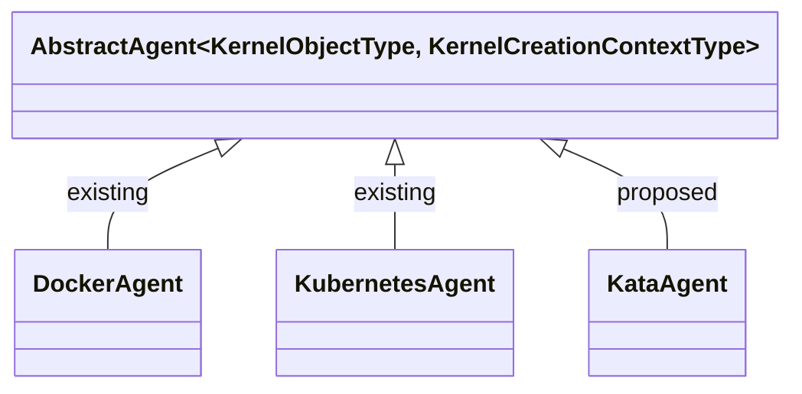
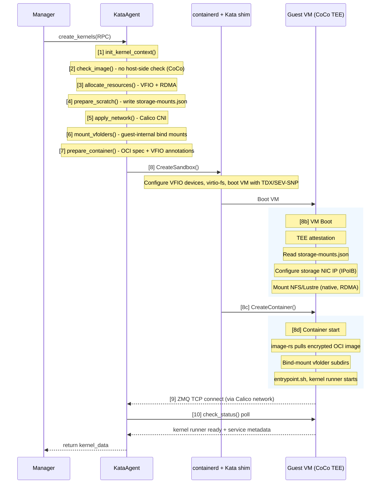

<!-- context-for-ai
type: master-bep
scope: Add Kata Containers as a third container backend (KataAgent) with CoCo by default, VFIO GPU passthrough, GPUDirect RDMA, and direct guest-side storage mounts
detail-docs: [configuration-deployment.md, kata-agent-backend.md, storage-compatibility.md, networking.md, vfio-accelerator-plugin.md, scheduler-integration.md, migration-compatibility.md]
key-constraints:
  - Full AbstractAgent implementation, NOT a RuntimeClass annotation
  - CoCo (Confidential Containers) by default — host is always untrusted
  - Whole-GPU VFIO passthrough only, NO fractional GPU
  - DiscretePropertyAllocMap for cuda.device slot type
  - Must not break existing DockerAgent or KubernetesAgent deployments
  - VFolder storage via direct guest-side NFS/Lustre/WekaFS mount (native kernel client, preserves RDMA), NOT virtio-fs
  - Guest-side image pull via image-rs (host must not see image contents)
  - Monolithic attested guest rootfs with all drivers baked in
key-decisions:
  - KataAgent as independent backend, not a Docker runtime flag
  - CoCo by default; no non-CoCo Kata mode
  - VFIO passthrough for GPU, not nvidia-container-runtime in guest
  - New CUDAVFIOPlugin separate from existing CUDAPlugin
  - RDMAVFIOPlugin as non-schedulable co-plugin (auto-attaches co-located InfiniBand HCA)
  - Homogeneous scaling groups (one backend type per group)
  - VM memory overhead as agent-level deduction from available_slots
  - VFolder data via direct guest-side NFS/Lustre mount (native, RDMA-preserving); virtio-fs only for scratch/config
  - Storage topology visible in guest /proc/mounts (acceptable — same model as Docker; isolation via vfolder permissions, not mount concealment)
  - Calico CNI for inter-VM networking (multi-host, network policy); /etc/hosts for hostname resolution
  - DCGM Exporter + Node Exporter for metrics (containerd exec blocked by CoCo policy)
  - Agent-side volume mount config delivered via virtio-fs (storage-mounts.json in /home/config)
  - MNNVL (NVL72) deferred to separate BEP
implementation: 3 phases
-->

# Kata Containers Agent Backend

## Related Issues

- Technical Report: [TR-2026-001](../docs/reports/kata-containers-feature-parity-analysis.md)

## Motivation

Backend.AI's current container backends (Docker, Kubernetes) rely on Linux namespaces and cgroups for isolation. These share the host kernel — a single kernel vulnerability in any container can compromise the entire host and all co-located workloads. This is insufficient for multi-tenant GPU environments where untrusted code runs alongside sensitive models.

Kata Containers 3.x addresses this by running each container inside a lightweight VM with its own guest kernel, providing hardware-enforced isolation via KVM. The Rust-based runtime achieves cold start times of 125-500ms (VMM-dependent, under optimized configurations). The VMM process overhead is 15-60MB per VM (Cloud Hypervisor ~15MB, QEMU ~60MB); total per-VM host memory is this overhead plus the guest's configured memory allocation. These overheads are acceptable for AI/ML workloads where GPU compute dominates wall-clock time.

For GPU workloads, VFIO (Virtual Function I/O) passthrough assigns whole GPUs directly to guest VMs via IOMMU, achieving near-native compute performance. This model naturally aligns with discrete GPU allocation (`cuda.device`) — fractional GPU sharing is neither supported nor needed, as the target workloads require dedicated GPU resources with strong isolation guarantees.

Additionally, Kata's integration with Confidential Containers (CoCo) and TEE hardware (Intel TDX, AMD SEV-SNP) enables privacy-preserving AI workloads where even the host operator cannot access model weights or training data in memory.

## Document Index

| Document | Description | Phase |
|----------|-------------|-------|
| [Configuration & Deployment](BEP-1051/configuration-deployment.md) | `[kata]` config section, hypervisor selection, host requirements | 1 |
| [KataAgent Backend](BEP-1051/kata-agent-backend.md) | KataAgent, KataKernel, KataKernelCreationContext | 1 |
| [Storage Compatibility](BEP-1051/storage-compatibility.md) | Direct guest-side NFS/Lustre/WekaFS mounts for VFolders, virtio-fs for scratch/config, I/O analysis | 1 |
| [Networking](BEP-1051/networking.md) | Calico CNI integration, inter-VM networking, network policy, hostname resolution | 1 |
| [VFIO Accelerator Plugin](BEP-1051/vfio-accelerator-plugin.md) | CUDAVFIOPlugin, IOMMU group detection, device passthrough | 2 |
| [Scheduler Integration](BEP-1051/scheduler-integration.md) | Agent backend tracking, scaling group policy, VM overhead | 3 |
| [Migration & Compatibility](BEP-1051/migration-compatibility.md) | Additive rollout, backward compatibility, rollback plan | All |

## Design Overview



KataAgent manages CoCo-enabled containers via containerd with the Kata shim (`io.containerd.kata.v2`). All Kata VMs run with TEE protection (TDX/SEV-SNP) by default — the host is always untrusted. Container lifecycle differs from Docker: VM boot with attestation → guest-side image pull via `image-rs` → container spawn inside guest. GPU devices are assigned via VFIO passthrough at VM creation time, binding PCI devices directly into the guest's address space through IOMMU. Co-located InfiniBand HCAs are auto-attached for GPUDirect RDMA.

VFolder storage is mounted directly inside the guest VM using the guest's own NFS/Lustre/WekaFS kernel client — preserving RDMA data paths and achieving 100% native I/O throughput. `/home/work` is a directory on the guest VM's disk (part of the guest rootfs), and vfolder subdirectories are bind-mounted into `/home/work/{vfolder}` from the guest-side NFS/Lustre mounts. The agent delivers volume mount specs via `storage-mounts.json` in `/home/config/` (virtio-fs config channel); a guest prestart hook reads these and performs the mounts before the container starts. Storage topology is visible in guest `/proc/mounts` (same as Docker — isolation is enforced by Backend.AI's vfolder permission model, not by concealing mount details). virtio-fs is used only for the config directory (`/home/config` with environ.txt, intrinsic-ports.json, storage-mounts.json). Network traffic traverses a virtio-net path with TC-filter mirroring — Kata's TC filter transparently redirects traffic between host-side veth interfaces and guest-side tap devices, making VMs transparent to the CNI layer. Calico CNI provides multi-host routing (BGP/VXLAN), IP allocation, and network policy enforcement for inter-session isolation. Multi-container sessions use Calico endpoint labeling for policy-based cluster communication with `/etc/hosts`-based hostname resolution.

## Component Integration: Kata Kernel Creation Flow

This section describes the end-to-end component interactions when Backend.AI creates a Kata kernel (CoCo mode). Steps that differ from DockerAgent are annotated.

### Kernel Creation Sequence



### Key Differences from DockerAgent

| Step | DockerAgent | KataAgent (CoCo) |
|---|---|---|
| [1] Context | `DockerKernelCreationContext` + aiodocker | `KataKernelCreationContext` + containerd gRPC |
| [2] Image | Host-side `docker.images.pull()` | No host-side check; guest-side `image-rs` pull after VM boot |
| [3] GPU | Docker `DeviceRequests` | VFIO `_kata_vfio_devices` + `clique_id` + auto-attached HCA |
| [4] Scratch | environ.txt, resource.txt | Same + `storage-mounts.json` (volume specs + storage NIC IP) |
| [6] VFolders | Host bind-mount → container | Guest-internal bind-mount (volume pre-mounted by boot script) |
| [7] Spec | Docker container config | OCI spec + VFIO annotations + CoCo attestation config |
| [8] Start | `docker.containers.create()` + `start()` | CreateSandbox → VM boot → TEE attestation → storage mount → CreateContainer → image pull → entrypoint |
| [9-10] ZMQ | Same (ZMQ TCP through host network) | Same (ZMQ TCP through Calico network — kernel runner is unaware of VM) |

### Timeout Considerations

Kata kernel creation has additional latency compared to Docker:

| Phase | Docker | Kata (CoCo) |
|---|---|---|
| Image pull | Host-side Docker pull | Guest-side `image-rs` pull (inside TEE, after VM boot) |
| Container start | ~1-2s | VM boot (3-10s) + TEE attestation (~1s) + storage mount (~1-3s) + image pull |
| GPU setup | Docker DeviceRequests | VFIO passthrough + PCIe BAR mapping (5-30s for multi-GPU) |
| Kernel runner ready | ~2-5s | Same (after container starts) |
| **Total** | **~5-10s** | **~15-60s** (depending on GPU count and image size) |

The `kernel_init_polling_timeout_sec` and `kernel_init_timeout_sec` configs must be increased for Kata deployments to accommodate VM boot, TEE attestation, storage mount, and guest-side image pull latencies.

## Implementation Plan

> All phases assume CoCo (Confidential Containers) by default. The host is always untrusted. There is no non-CoCo Kata mode.

### Phase 1: CoCo Agent Foundation
- Monolithic attested guest rootfs build pipeline (NVIDIA driver, MLNX_OFED, storage clients, krunner, DCGM/Node Exporter, storage mount boot script)
- `KataConfig` Pydantic model and `[kata]` config section (including volume mount points for `storage-mounts.json`)
- `KataAgent`, `KataKernel`, `KataKernelCreationContext` classes
- Container lifecycle via containerd gRPC API with Kata shim (CoCo runtime class)
- CoCo integration: TDX/SEV-SNP attestation, guest-side image pull via `image-rs`, KBS for sealed secrets
- CPU-only workload support (no GPU yet)
- VFolder storage via direct guest-side NFS/Lustre/WekaFS mount (native kernel client, RDMA-preserving); agent writes `storage-mounts.json` to `/home/config/`, guest boot script performs mounts
- virtio-fs for scratch/config directories only (`/home/config` with environ.txt, intrinsic-ports.json, storage-mounts.json)
- Calico CNI integration for multi-host inter-VM networking (BGP/VXLAN)
- Calico network policy enforcement for inter-session traffic isolation
- `/etc/hosts` injection for cluster hostname resolution
- DCGM Exporter + Node Exporter inside guest, scraped by Prometheus over Calico network

### Phase 2: VFIO GPU + InfiniBand Passthrough
- `CUDAVFIOPlugin` compute plugin with IOMMU group detection and `max_gpus_per_vm` safety limit
- VFIO device binding and passthrough configuration with Kata VRA PCIe topology replication (`switch-port` mode, `clique-id` annotations)
- `DiscretePropertyAllocMap` with `cuda.device` slot type
- `RDMAVFIOPlugin` as non-schedulable co-plugin: auto-attaches co-located InfiniBand HCA when GPU is allocated
- GPUDirect RDMA validation (GPU + HCA co-passthrough, `nvidia-peermem` in guest)
- GPU device attestation (H100+ CC mode) and HCA attestation (ConnectX-7+)

### Phase 3: Scheduler Integration
- `backend` column on `AgentRow` with Alembic migration
- Homogeneous scaling group policy (one backend type per group)
- VM memory overhead accounting in `available_slots`
- Agent heartbeat protocol extension
- Remote attestation endpoint exposed via manager API

## Decision Log

| Date | Decision | Rationale | Alternatives Considered |
|------|----------|-----------|------------------------|
| 2026-02-27 | Full AbstractAgent backend, not RuntimeClass | RuntimeClass is K8s-only; Kata lifecycle (VM boot, VSOCK, virtio-fs) differs fundamentally from Docker API; Backend.AI already has the backend abstraction | RuntimeClass flag on DockerAgent; Docker `--runtime kata` flag |
| 2026-02-27 | VFIO-only for GPU, no fractional allocation | VFIO provides hardware isolation matching the VM boundary; fractional sharing (MPS, hook libraries) requires host kernel driver sharing which breaks isolation; target workloads need whole GPUs | nvidia-container-runtime inside guest VM (complex, shares driver stack); MIG (NVIDIA-specific, limited configurations) |
| 2026-02-27 | Separate CUDAVFIOPlugin, not modified CUDAPlugin | VFIO generates fundamentally different config (PCI addresses, IOMMU groups) vs Docker DeviceRequests; plugin discovery should keep them independent; avoids conditional logic in existing plugin | Single CUDAPlugin with backend-aware mode flag |
| 2026-02-27 | Homogeneous scaling groups | Simpler scheduling — no need for backend-aware agent filtering within a group; existing scaling group mechanism already routes sessions to agent pools | Mixed-backend groups with `allowed_backends` filter; per-session backend preference flag |
| 2026-02-27 | VM overhead as agent-level deduction | Overhead is predictable (configurable per-VM); deducting at registration avoids changing slot semantics visible to users; scheduler sees accurate available capacity | New `kata.vm_overhead` slot type; per-kernel memory inflation; soft margin in scheduler |
| 2026-02-27 | No new storage interface; reuse existing Mount abstraction with virtio-fs | Kata shim automatically translates bind mounts to virtio-fs shares — the agent passes the same mount specs and the runtime handles the VM boundary transparently; avoids duplicating mount logic | New `MountTypes.VIRTIO_FS` type (unnecessary abstraction); agent-managed virtiofsd (complexity without benefit) |
| 2026-02-27 | Agent socket skipped entirely for Kata | The agent socket (`/opt/kernel/agent.sock`) is a ZMQ REP socket used only by C binaries (jail pid translation, `is-jail-enabled`), not by the Python kernel runner. Since jail is skipped for Kata and PID translation is irrelevant (VM boundary isolates PIDs), the socket, socat relay, and handler are all unnecessary. The primary agent↔kernel-runner channel (ZMQ PUSH/PULL) is already TCP-based and works across the VM boundary without changes. | TCP replacement (unnecessary — the agent socket isn't needed, not just unreachable); VSOCK (solves wrong problem) |
| 2026-02-27 | ~~virtio-fs for all storage backends; no direct guest mounts~~ **Superseded (2026-03-25)**: VFolder data now uses direct guest-side NFS/Lustre mounts (native kernel client) to preserve RDMA; virtio-fs retained for scratch/config only | Original rationale: no vendor Kata integration; CephFS benchmarks favored virtio-fs. Superseded because virtio-fs breaks RDMA data paths for high-performance storage backends. | — |
| 2026-02-27 | Calico CNI for inter-VM networking | Production deployments require multi-host networking and inter-session traffic isolation; Calico provides both via BGP/VXLAN routing and network policy; works with Kata's TC filter transparently; supports standalone containerd (etcd datastore) and Kubernetes; consistent CNI layer across deployment modes | CNI bridge plugin (single-host only, no network policy); Cilium (MTU mismatch issues with Kata); Flannel (no network policy); Docker overlay (not available without Docker) |
| 2026-02-27 | `/etc/hosts` injection for cluster hostname resolution | Docker embedded DNS not available with containerd; `/etc/hosts` via virtio-fs is simple, immediate, and sufficient for small clusters (2-8 containers) | CoreDNS sidecar (heavyweight); containerd-managed DNS (not available); mDNS/Avahi (complex, unreliable) |
| 2026-03-03 | ~~krunner binaries shared via virtio-fs (Phase 1), bake into guest rootfs (Phase 2)~~ **Superseded (2026-03-25)**: CoCo-by-default requires all binaries baked into the attested guest rootfs from day one (host is untrusted — cannot share executables via virtio-fs) | Original rationale: Phase 1 simplicity. Superseded by CoCo trust model — runtime loading from untrusted host eliminated. | — |
| 2026-03-03 | Kata entrypoint.sh skips LD_PRELOAD, jail, and agent.sock | The runner's `entrypoint.sh` sets up `LD_PRELOAD` with libbaihook.so (unnecessary — guest kernel provides accurate sysconf), chowns `agent.sock` (unnecessary — agent socket not mounted), and references jail paths. Kata variant skips these via env var check (`BACKENDAI_CONTAINER_BACKEND=kata`) or a separate entrypoint file. All other operations (user/group creation, SSH setup, dotfiles, password generation, su-exec) remain identical. | Unified entrypoint with no conditional (would fail on missing files); completely separate entrypoint (too much duplication) |
| 2026-03-03 | resource.txt is agent-recovery-only, not consumed by kernel runner | `resource.txt` contains serialized `KernelResourceSpec` (slot allocations, mount lists, device mappings). The agent reads it for recovery after restarts (`resources.py:887-910`, `scratch/utils.py:100-103`) and resource usage tracking. The kernel runner never reads this file — it gets its configuration from `environ.txt` (environment variables for child processes) and `intrinsic-ports.json` (ZMQ/service port assignments). The VM hypervisor enforces resource limits at the VM level. | N/A (factual clarification, not a design choice) |
| 2026-03-03 | Containerd client API (`containers.v1`, `tasks.v1`) for single-container; Sandbox API (`sandbox.v1`) for multi-container | CRI `RuntimeService` is Kubernetes-specific and should not be used by a non-Kubernetes service. The `ctr` CLI is fragile for async use. The containerd client gRPC API is the correct programmatic interface. For multi-container sessions sharing a VM, the Sandbox API (containerd v2+) provides `create_sandbox()` → `create_container(sandbox_id=...)`, which is required because `containers.v1`/`tasks.v1` alone create one VM per container. | CRI `RuntimeService` (K8s-only); `ctr`/`kata-runtime` CLI (fragile, not async); `containers.v1`/`tasks.v1` only (cannot share VM across containers) |
| 2026-03-03 | virtiofsd is one process per sandbox, not per mount | Kata runs a single virtiofsd per sandbox serving a shared directory tree. Individual bind mounts are subdirectories, not separate processes. The hybrid storage model (virtio-blk for read-only infra) is motivated by I/O performance (avoiding FUSE overhead for static files), not by virtiofsd process count. | N/A (factual correction based on Kata architecture review) |
| 2026-03-25 | VFolder storage via direct guest-side NFS/Lustre mount (native kernel client), not virtio-fs | virtio-fs introduces FUSE overhead and breaks RDMA data paths for high-performance storage backends (Lustre over InfiniBand, WekaFS RDMA, GPFS). The correct architecture mirrors Docker: mount the **storage volume** (e.g., `/mnt/vfstore`) directly inside the guest VM using the guest's own NFS/Lustre/WekaFS kernel client (preserving RDMA, 100% native throughput), then bind-mount the specific vfolder subdirectory into the container — identical to how DockerAgent operates on the host. The agent writes `storage-mounts.json` to `/home/config/` (virtio-fs config channel) containing volume mount specs (fs_type, server, export path, mount options); a guest boot script reads this and performs the mounts before the container starts. Storage topology is visible in guest `/proc/mounts` — this is acceptable because Backend.AI's isolation model is the same as Docker: container users can see mount info but cannot mount their own disks (no `CAP_SYS_ADMIN`, no mount binary). Isolation is enforced by vfolder permissions, not by concealing mount details. Supersedes the earlier decision "virtio-fs for all storage backends" (2026-02-27) for vfolder data; virtio-fs remains for scratch/config directories only. | virtio-fs for all storage (kills RDMA, adds FUSE overhead); FUSE shim for topology concealment (adds complexity, single point of failure — unnecessary since mount concealment is not required); 9p/virtio-9p (worse performance than virtio-fs) |
| 2026-03-25 | GPUDirect RDMA via Kata VRA: GPU + InfiniBand HCA co-passthrough with PCIe topology replication | Multi-node GPU workloads require GPUDirect RDMA (direct GPU↔NIC DMA without CPU). Kata VRA architecture supports this via: (1) `hotplug_vfio = "switch-port"` to replicate host PCIe switch topology inside the guest, (2) `clique-id` CDI annotations to group GPU and NIC for P2P, (3) ACS/ATS configuration for Direct Translated P2P. Guest image must include full NVIDIA + MLNX_OFED driver stack with `nvidia-peermem`. Architecturally feasible but not yet demonstrated end-to-end in Kata (upstream issue [#10796](https://github.com/kata-containers/kata-containers/issues/10796)). NVLink/NVSwitch for intra-node GPU-GPU P2P works via VFIO BAR mapping of NVLink registers. | No RDMA support (unacceptable for multi-node training); SR-IOV VF passthrough only (currently broken in Kata [#11910](https://github.com/kata-containers/kata-containers/issues/11910)); userspace RDMA without GPUDirect (CPU bottleneck) |
| 2026-03-25 | CoCo by default for all Kata workloads | The host is always untrusted. All Kata VMs run with TEE protection (TDX/SEV-SNP). This collapses the original 4-phase plan — CoCo is the starting point. Eliminates conditional logic for CoCo vs non-CoCo modes and resolves several open questions (see below). | Non-CoCo Kata mode for initial development (defers trust model, but creates throwaway code); CoCo as opt-in (adds configuration complexity for a mode that should always be on) |
| 2026-03-25 | Guest-side image pull via `image-rs` (no host-side pull) | Host is untrusted and must not see image contents. `image-rs` inside the TEE pulls encrypted images, decrypts with keys from KBS after remote attestation. Host-side containerd pull is not an option. Agent's role reduces to: pass image reference + attestation config to Kata shim, wait for kernel runner ZMQ connection. Registry credentials delivered via KBS (attestation-gated), not via host. | Host-side containerd pull (breaks CoCo trust model); credentials via IVSHMEM (less standard than KBS for CoCo) |
| 2026-03-25 | CUDAVFIOPlugin implements current `generate_docker_args()` API with `_kata_vfio_devices` return | BEP-1016 is Draft with no implementation timeline. CoCo does not affect plugin interface — VFIO device assignment is a host-side operation regardless of guest encryption. The `_kata_vfio_devices` convention maps directly to future `WorkloadConfig` fields. Migrate to BEP-1016 `create_lifecycle_hook()` when available. | Wait for BEP-1016 (unknown delay); implement BEP-1016 as part of BEP-1051 (scope creep) |
| 2026-03-25 | No `backend` field on `ScalingGroupOpts`; homogeneous groups by convention | CoCo-by-default eliminates the kata/kata-confidential distinction. Only two backend types exist: Docker and Kata (always CoCo). `AgentRow.backend` column provides admin visibility. Homogeneous groups are even more sufficient with no CoCo/non-CoCo split. | `allowed_backends` field (unnecessary guard with simplified backend model); `attestation_policy` field (low-priority future option) |
| 2026-03-25 | Exclude shared IOMMU groups with warning; `max_gpus_per_vm` safety limit; validate TEE constraints empirically | Target hardware is DGX/HGX with isolated IOMMU groups (one GPU per group). Shared groups are rare on server hardware — exclude with `log.warning()`. Multi-GPU from separate groups is supported. `max_gpus_per_vm` config (default 8) prevents extreme VM boot times from PCIe BAR mapping overhead. TDX Connect / SEV-SNP ASID interaction with multi-device VFIO requires empirical validation on target hardware — not a design blocker. | Atomic device bundles for shared groups (complex scheduler change for rare case); no GPU limit (risks 30+ minute boot) |
| 2026-03-25 | Monolithic attested guest rootfs; all drivers baked in from day one | CoCo trust model requires the guest rootfs to be part of the attestation chain — its measurement (hash) is verified during remote attestation before secrets (KBS keys, storage credentials) are released. Runtime module loading from host is eliminated (untrusted source). krunner binaries, NVIDIA drivers, MLNX_OFED, storage clients, DCGM/Node Exporter, and storage mount boot script are all baked into a single versioned image (`kata-rootfs-{version}.qcow2`). Attestation measurement in KBS must be updated on every image rebuild. | Layered with attested chain (incremental updates but more complex attestation); runtime module loading (eliminated — host is untrusted) |
| 2026-03-25 | Whole-device InfiniBand HCA passthrough only; SR-IOV deferred | CoCo attestation favors PF (Physical Function) — PF identity is directly verifiable by the guest via device attestation (ConnectX-7+). SR-IOV VF attestation is less mature, and VF passthrough is currently broken in Kata ([#11910](https://github.com/kata-containers/kata-containers/issues/11910)). Whole-device passthrough maps naturally to DGX/HGX topology (8 GPUs, 8 HCAs). | SR-IOV VF passthrough (broken upstream, immature VF attestation); wait for SR-IOV fix (blocks multi-node GPU interconnect) |
| 2026-03-25 | Agent-side volume mount configuration via `storage-mounts.json` | The `[kata]` config section lists storage volume mount points with filesystem type and mount options. KataAgent matches each `VFolderMount.host_path` to a configured volume by longest-prefix match, then writes `storage-mounts.json` to `/home/config/` (virtio-fs config channel) before VM boot. A guest boot script reads this file and performs NFS/Lustre mounts. No manager or storage-proxy API changes needed — the agent is self-contained. Trade-off: duplicates storage topology information (must be manually synced with storage-proxy config), but volume mount points change infrequently and are infrastructure-level configuration. | Storage-proxy API extension (authoritative source, but requires storage-proxy + manager changes); manager RPC field (single source of truth, but changes RPC protocol) |
| 2026-03-25 | `RDMAVFIOPlugin` as non-schedulable co-plugin for InfiniBand HCA passthrough | On DGX/HGX hardware, every GPU node has co-located InfiniBand HCAs — RDMA is a node property, not a separately schedulable resource. The plugin discovers HCAs and validates IOMMU groups but does not expose schedulable slots. When a GPU is allocated, `KataKernelCreationContext` auto-attaches the co-located HCA with matching `clique_id`. No scheduler changes needed. MNNVL (NVL72) requires a separate BEP. | Unified `CUDAVFIOPlugin` (conflates GPU + NIC; misleading name); separate schedulable `RDMAVFIOPlugin` (adds scheduler complexity for a resource that's always present on target hardware) |
| 2026-03-25 | `containerd exec` blocked by CoCo policy — GPU metrics via DCGM Exporter + Node Exporter over Calico network | The kata-agent has a built-in OPA policy engine (Regorus) that evaluates every tRPC API call from the host. CoCo policy (`allow-all-except-exec-process.rego`) blocks `ExecProcessRequest` — the host cannot execute commands inside the guest. However, the CoCo policy controls tRPC API calls only, NOT network traffic. DCGM Exporter (`:9400`) and Node Exporter (`:9100`) run inside the guest as systemd services (baked into attested rootfs) and are scraped by Prometheus over the standard Calico network — pure TCP/IP, no kata-agent involvement. VM-level cgroup stats remain visible to the host via containerd task metrics API. | Allow exec in CoCo policy (breaks trust model); host-side GPU metrics via sysfs (unavailable when GPU is bound to vfio-pci); VSOCK-based metrics daemon (unnecessary — network path works and is simpler) |

## Resolved Questions

> **Design premise (2026-03-25):** All Kata Container workloads run on CoCo (Confidential Containers) by default. The host is always untrusted. There is no "non-CoCo Kata" mode. This collapses the original 4-phase plan — CoCo is the starting point, not a future phase.

The following questions were resolved by the CoCo-by-default premise and earlier design decisions. See Decision Log entries dated 2026-03-25.

| # | Question | Resolution |
|---|----------|------------|
| Q1 | Image pulling — host or guest? | Guest-side pull via `image-rs` only. Host is untrusted. Registry credentials via KBS after remote attestation. |
| Q2 | Metrics collection in CoCo VMs | DCGM Exporter + Node Exporter inside guest, scraped by Prometheus over Calico network. `containerd exec` blocked by CoCo policy. |
| Q3 | Multi-GPU IOMMU validation | Exclude shared groups with warning; `max_gpus_per_vm` safety limit. TEE constraints validated empirically on target DGX/HGX hardware. |
| Q4 | BEP-1016 relationship | Use current `generate_docker_args()` with `_kata_vfio_devices`; migrate to BEP-1016 when available. CoCo is orthogonal. |
| Q5 | ScalingGroupOpts backend field | Homogeneous-by-convention. CoCo-by-default eliminates kata/kata-confidential distinction. |
| Q6 | CoCo bind mount / vfolder storage | Direct guest-side NFS/Lustre mount (native kernel client, RDMA-preserving). Mount specs via `storage-mounts.json`. |
| Q9 | Guest base image pipeline | Monolithic attested rootfs; all drivers baked in. Runtime loading eliminated (untrusted host). |
| Q10 | InfiniBand HCA — whole-device vs SR-IOV | Whole-device only. PF attestation is simpler; SR-IOV broken upstream and VF attestation immature. |
| Q7 | InfiniBand HCA plugin architecture | `RDMAVFIOPlugin` as non-schedulable co-plugin. Auto-attaches co-located HCA when GPU is allocated — RDMA is implicit for agents that have it. No scheduler changes needed. |
| Q8 | Agent volume mount point awareness | Agent-side configuration. `[kata]` config lists volume mount points. Agent writes `storage-mounts.json` to `/home/config/`; guest boot script mounts volumes. No manager/storage-proxy changes. |

### ~~Q2: Metrics Collection in CoCo VMs~~ — Resolved

GPU and container metrics collected via **DCGM Exporter** (`:9400`) and **Node Exporter** (`:9100`) running inside the guest VM, scraped by Prometheus over the standard Calico network.

**Why `containerd exec` doesn't work:** The kata-agent's built-in OPA policy engine (Regorus) evaluates every tRPC API call from the host. The recommended CoCo policy (`allow-all-except-exec-process.rego`) blocks `ExecProcessRequest` — the host cannot execute commands inside the guest. `ReadStreamRequest` (stdout/stderr) is also policy-controllable. The policy is baked into the attested guest rootfs and the host cannot modify it.

**Why network-based scraping works:** The CoCo kata-agent policy controls **tRPC API calls** (exec, copy file, read stream), NOT **network traffic**. The VM has a Calico-assigned IP and a virtio-net interface that carries standard TCP/IP traffic — the same path workloads use for any network I/O. Prometheus exporters inside the guest listen on standard ports and are reachable over the Calico network. No kata-agent involvement — pure network I/O.

```
Prometheus (infra)                       Guest VM (CoCo)
┌──────────────┐                        ┌──────────────────────────────┐
│ scrape       │── HTTP GET ──────────→ │ :9400  DCGM Exporter (GPU)  │
│ targets:     │   (Calico network,     │ :9100  Node Exporter (CPU,  │
│ - vm_ip:9400 │    virtio-net,         │         mem, disk, net)     │
│ - vm_ip:9100 │    standard TCP/IP)    │                              │
└──────────────┘                        │ kata-agent policy: N/A       │
                                        │ (network traffic bypasses    │
                                        │  tRPC policy engine)         │
                                        └──────────────────────────────┘
```

**Metrics architecture:**

| Metric source | Exporter | Port | What it provides |
|---|---|---|---|
| GPU | [DCGM Exporter](https://github.com/NVIDIA/dcgm-exporter) | `:9400` | GPU utilization, memory usage, temperature, power, ECC errors, NVLink throughput |
| CPU / Memory / Disk / Network | [Node Exporter](https://github.com/prometheus/node_exporter) | `:9100` | Guest-visible CPU, memory, disk I/O, network I/O — accurate because guest kernel sees VM's allocated resources |
| VM boot time | Host-side (agent) | N/A | Delta between `create_task()` and first kernel runner ZMQ connection — purely host-side measurement, no guest cooperation needed |
| VM cgroup stats | Host-side (containerd) | N/A | containerd task metrics API returns VM-level cgroup stats — describes hypervisor process, allowed by CoCo policy |

**Guest base image additions:** Both `dcgm-exporter` and `node_exporter` binaries are baked into the attested guest rootfs and started as systemd services. DCGM Exporter requires the NVIDIA driver and DCGM libraries (already in the image for GPU compute). Node Exporter is a single static binary (~20 MB).

**Backend.AI integration:** The host agent does NOT collect metrics via the stats pipeline (`gather_container_measures()`) for GPU and per-container details. Instead:
- Prometheus scrapes DCGM + Node Exporter at the VM's Calico IP
- Backend.AI's monitoring/billing systems read from Prometheus (or Grafana) — this aligns with existing observability infrastructure
- The agent's intrinsic plugins report only host-observable metrics: VM cgroup stats (containerd task metrics) and VM boot time

**Security note:** Network traffic between Prometheus and the exporters traverses the host network stack (virtio-net + TC filter). GPU utilization metrics reveal workload intensity but not workload content — acceptable for most CoCo threat models. If metrics are considered sensitive, TLS can be enabled on the exporters with certificates provisioned via the KBS attestation flow.

See Decision Log (2026-03-25) for the `containerd exec` policy finding.

### ~~Q7: InfiniBand HCA Plugin Architecture~~ — Resolved

**Decision:** `RDMAVFIOPlugin` as non-schedulable co-plugin (Option C). The plugin discovers InfiniBand HCAs (Mellanox vendor ID `0x15b3`, device class `0x0207`, bound to `vfio-pci`) and validates their IOMMU groups, but does NOT expose schedulable slots. When `CUDAVFIOPlugin` allocates a GPU, `KataKernelCreationContext` queries the RDMA plugin for co-located HCAs (same PCIe root complex / switch) and auto-attaches them with matching `clique_id` annotations for Kata VRA P2P topology replication.

**Rationale:** On target hardware (DGX/HGX), every GPU node has co-located InfiniBand HCAs — RDMA capability is a property of the node, not a separately schedulable resource. Making RDMA implicit avoids scheduler complexity (no need to co-allocate `cuda.device` + `rdma.device`), matches the 1:1 GPU↔HCA topology of DGX/HGX systems, and requires no changes to existing scheduling logic. Agents without HCAs simply have no RDMA devices to auto-attach — GPU-only workloads work unchanged.

**Scope:** Traditional GPU servers (HGX/DGX + InfiniBand) only. Rack-scale NVLink systems (NVL72) require a separate BEP — see "Future: MNNVL Support" below.

### Future: MNNVL Support (Separate BEP Required)

Rack-scale NVLink systems (GB200 NVL72, Vera Rubin NVL72) use **Multi-Node NVLink (MNNVL)** — a fundamentally different interconnect architecture from InfiniBand-based GPU servers. This requires a separate BEP, not an extension of BEP-1051.

**Why a separate BEP:**

| Aspect | BEP-1051 (InfiniBand) | MNNVL (future BEP) |
|---|---|---|
| GPU interconnect | InfiniBand (400 Gbps) | NVLink fabric (1.8 TB/s per GPU — 36x IB) |
| Isolation model | Kata VM + VFIO passthrough | IMEX domains (per-workload NVLink partition) — may not need VMs |
| CC trust domain | Per-VM (CPU TEE + GPU) | Rack-scale (72 GPUs + NVLink encryption hardware) |
| Multi-node orchestration | VFIO device assignment + clique-id | IMEX daemon lifecycle + Fabric Manager |
| Agent architecture | KataAgent (containerd + Kata shim) | Potentially new agent type for MNNVL |

**Key technical findings** (from analysis of [NVIDIA k8s-dra-driver-gpu](https://github.com/NVIDIA/k8s-dra-driver-gpu) source):

- **IMEX is a standalone daemon** (`nvidia-imex`), NOT Kubernetes-specific. Runs as a systemd service, configured via `nodes.cfg` (peer IP list) and `imexd.cfg`. Backend.AI can orchestrate it directly.
- **Fabric Manager** (`nv-fabricmanager`) is also standalone — assigns cluster UUIDs and NVLink clique IDs to GPUs via NVSwitch topology configuration.
- **Clique ID is hardware-derived** — read from GPU via NVML `GetGpuFabricInfo()`, NOT assigned by software. Format: `"clusterUUID.cliqueID"`.
- **2048 IMEX channels** per node (`/dev/nvidia-caps-imex-channels/channel0..2047`) — device nodes injected into containers for cross-node GPU memory import/export.
- **NVIDIA's DRA + ComputeDomains are thin K8s wrappers** around these standalone daemons. Backend.AI would replace the K8s orchestration layer (ComputeDomain CR → DaemonSet → kubelet plugin) with its own session-based IMEX lifecycle management.
- **No GPU partitioning at fabric level** — NVLink fabric is all-to-all within a clique. Cross-node grouping is purely "select N nodes from same clique." Per-node GPU partitioning (MIG) is orthogonal.

**What the future MNNVL BEP must address:**
1. New agent type or KataAgent extension for IMEX domain management
2. Scheduler awareness of NVLink clique topology (nodes sharing a clique ID)
3. IMEX daemon lifecycle tied to session lifecycle (start peers → wait for quorum → inject channels → cleanup)
4. Whether Kata VMs are needed on NVL72 (NVLink CC + IMEX isolation may suffice without VM boundary)
5. Interaction between MNNVL NVLink (GPU traffic) and InfiniBand (storage traffic) on the same system

### ~~Q8: Agent Volume Mount Point Awareness~~ — Resolved

**Decision:** Agent-side configuration (Option B). The `[kata]` config section lists storage volume mount points with filesystem type and mount options. KataAgent matches each `VFolderMount.host_path` to a configured volume by longest-prefix match, then writes `storage-mounts.json` to `/home/config/` (virtio-fs config channel) before VM boot. A guest boot script reads this file and performs NFS/Lustre mounts. Vfolder bind mounts are passed to the OCI container spec unchanged — they operate as guest-internal bind mounts since the volume is already mounted inside the guest.

**Rationale:** No manager or storage-proxy API changes needed — the agent is self-contained and independently configurable per deployment. The storage-proxy and agent are typically co-located on the same host (or tightly coupled in deployment), so keeping volume mount config in the agent's `[kata]` section is operationally natural. The trade-off (manual sync with storage-proxy config) is acceptable because volume mount points change infrequently and are infrastructure-level configuration, not per-session state.

## References

- [BEP-1002: Agent Architecture](BEP-1002-agent-architecture.md) — resource management and kernel runner patterns
- [BEP-1016: Accelerator Interface v2](BEP-1016-accelerator-interface-v2.md) — lifecycle hook API proposal
- [BEP-1000: Redefining Accelerator Metadata](BEP-1000-redefining-accelerator-metadata.md) — device metadata model
- [BEP-1044: Multi-Agent Device Split](BEP-1044-multi-agent-device-split.md) — multi-agent GPU allocation
- [TR-2026-001: Kata Containers Feature Parity Analysis](../docs/reports/kata-containers-feature-parity-analysis.md)
- [Kata Containers Architecture](https://github.com/kata-containers/kata-containers/blob/main/docs/design/architecture/README.md)
- [Linux VFIO Documentation](https://docs.kernel.org/driver-api/vfio.html)
- [Calico CNI Plugin Configuration](https://docs.tigera.io/calico/latest/reference/configure-cni-plugins)
- [Calico Network Policy](https://docs.tigera.io/calico/latest/network-policy/get-started/calico-policy/calico-network-policy)
- [Kata VRA (Virtualization Reference Architecture)](https://github.com/kata-containers/kata-containers/blob/main/docs/design/kata-vra.md) — GPU/accelerator passthrough design with GPUDirect P2P/RDMA support
- [NVIDIA GPUDirect RDMA Documentation](https://docs.nvidia.com/cuda/gpudirect-rdma/index.html)
- [MNNVL User Guide](https://docs.nvidia.com/multi-node-nvlink-systems/mnnvl-user-guide/overview.html) — Multi-Node NVLink architecture, IMEX daemon, Fabric Manager
- [Enabling Multi-Node NVLink on Kubernetes](https://developer.nvidia.com/blog/enabling-multi-node-nvlink-on-kubernetes-for-gb200-and-beyond/) — DRA driver, ComputeDomains concept (Kubernetes-native, but underlying daemons are standalone)
- [NVIDIA Confidential Computing](https://www.nvidia.com/en-us/data-center/solutions/confidential-computing/) — Blackwell TEE-IO, NVLink encryption, rack-scale CC
