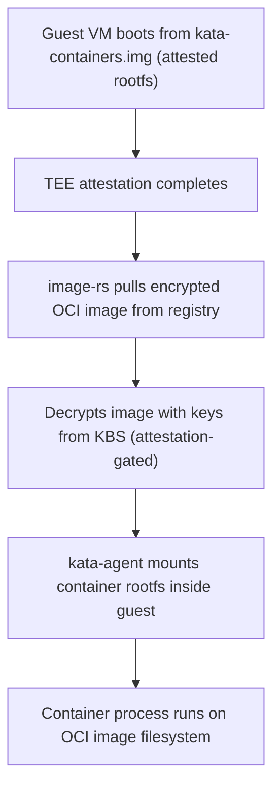

<!-- context-for-ai
type: detail-doc
parent: BEP-1051 (Kata Containers Agent Backend)
scope: Agent configuration schema for Kata backend and host deployment requirements
depends-on: []
key-decisions:
  - New [kata] section in agent unified config
  - Cloud Hypervisor as default hypervisor, QEMU as fallback
  - Config validated at agent startup with fail-fast on missing paths
-->

# BEP-1051: Configuration and Deployment

## Summary

This document defines the configuration schema additions for the Kata backend, including hypervisor selection, VFIO settings, VM resource defaults, and host deployment prerequisites. The `[kata]` section is added to the agent's unified config (`AgentUnifiedConfig` at `src/ai/backend/agent/config/unified.py`).

## Current Design

The agent backend is selected via `local_config.agent_common.backend`, which reads the `AgentBackend` enum (`src/ai/backend/agent/types.py:36`). The `get_agent_discovery()` function (`types.py:84`) dynamically imports the backend package.

Docker-specific configuration lives in the `[container]` section:

```toml
[container]
stats-type = "docker"
sandbox-type = "jail"
scratch-root = "/tmp/scratches"
```

There is no VM or hypervisor configuration in the current schema.

## Proposed Design

### Backend Selection

```toml
[agent]
backend = "kata"  # "docker" | "kubernetes" | "kata"
```

When `backend = "kata"`, the agent imports `ai.backend.agent.kata` and instantiates `KataAgentDiscovery`.

### Kata Configuration Section

```toml
[kata]
# --- Hypervisor ---
hypervisor = "cloud-hypervisor"  # "cloud-hypervisor" | "qemu" | "dragonball"

# --- VM Defaults ---
default-vcpus = 2               # Initial vCPUs per VM (hot-plugged as needed)
default-memory-mb = 2048        # Initial memory per VM in MB
vm-overhead-mb = 64             # Per-VM VMM process + guest kernel + kata-agent overhead (MB), deducted from host capacity

# --- Guest VM Image (NOT the container image — see note below) ---
kernel-path = "/opt/kata/share/kata-containers/vmlinux.container"
initrd-path = ""                # Empty = use rootfs image instead of initrd
rootfs-path = "/opt/kata/share/kata-containers/kata-containers.img"

# --- Storage ---
shared-fs = "virtio-fs"         # "virtio-fs" | "virtio-9p" (9p deprecated)
virtiofsd-path = "/opt/kata/libexec/virtiofsd"
virtio-fs-cache-size = 0        # DAX window in MB; 0 = disabled (recommended default)

# --- Networking ---
network-model = "tcfilter"      # "tcfilter" | "macvtap"

# --- VFIO ---
enable-iommu = true
hotplug-vfio = "root-port"      # "root-port" | "bridge-port" | "no-port"

# --- Containerd ---
containerd-socket = "/run/containerd/containerd.sock"
kata-runtime-class = "kata"     # RuntimeClass name registered in containerd

# --- Confidential Computing (CoCo-by-default) ---
confidential-guest = true       # CoCo is always enabled; no non-CoCo mode
guest-attestation = "tdx"       # "tdx" | "sev-snp" (required)
kbs-endpoint = "http://kbs.internal:8080"  # Key Broker Service for sealed secrets

# --- Storage (guest-side direct mount) ---
kernel-modules = ["nfs", "nfsv4"]  # Modules loaded during create_sandbox()
guest-hook-path = "/usr/share/oci/hooks"  # OCI prestart hook path in guest rootfs

[[kata.storage-mounts]]
fs-type = "nfs4"
source = "storage-server:/exports/vfstore"
mountpoint = "/mnt/vfstore"
options = "vers=4.1,rsize=1048576,wsize=1048576"

[[kata.storage-mounts]]
fs-type = "lustre"
source = "lustre-mgs@tcp:/scratch"
mountpoint = "/mnt/lustre"
options = ""

[kata.storage-nic]
device = "ib0"
address = "10.0.100.5/24"
gateway = "10.0.100.1"
```

### Guest VM Image vs Container Image

Kata Containers uses **two separate filesystem layers** that must not be confused:

1. **Guest VM rootfs** (`rootfs-path` above): A minimal mini-OS image containing only the kata-agent, systemd, and essential utilities. This is the VM's boot disk — shared across all VMs, read-only, and mounted via DAX on a `/dev/pmem*` device inside the guest. It is **not** the user's container image. This is an infrastructure-level asset analogous to a VM template.

2. **Container image** (e.g., `cr.backend.ai/stable/python-tensorflow:2.15-py312-cuda12.3`): The user-selected OCI image that Backend.AI's image management system resolves. Under CoCo-by-default, images are pulled and decrypted **inside the guest** using `image-rs` — the host is untrusted and must not see image contents. Registry credentials are delivered via KBS (Key Broker Service) after remote attestation.



**Image management changes for CoCo:** The image registry and image selection flow are unchanged (manager resolves image references identically). The pull mechanism differs — instead of host-side containerd pull, `image-rs` inside the guest TEE handles pull + integrity verification + decryption. The agent cannot verify image presence on the host; it passes the image reference to the Kata shim and waits for the kernel runner ZMQ connection.

### Pydantic Config Model

```python
class KataConfig(BaseConfigSchema):
    hypervisor: Literal["cloud-hypervisor", "qemu", "dragonball"] = Field(
        default="cloud-hypervisor",
        validation_alias=AliasChoices("hypervisor"),
    )

    # VM defaults
    default_vcpus: int = Field(
        default=2,
        validation_alias=AliasChoices("default_vcpus", "default-vcpus"),
    )
    default_memory_mb: int = Field(
        default=2048,
        validation_alias=AliasChoices("default_memory_mb", "default-memory-mb"),
    )
    vm_overhead_mb: int = Field(
        default=64,
        description="VMM process + guest kernel + kata-agent overhead (MB)",
        validation_alias=AliasChoices("vm_overhead_mb", "vm-overhead-mb"),
    )

    # Guest image
    kernel_path: Path = Field(
        default=Path("/opt/kata/share/kata-containers/vmlinux.container"),
        validation_alias=AliasChoices("kernel_path", "kernel-path"),
    )
    initrd_path: Path | None = Field(
        default=None,
        validation_alias=AliasChoices("initrd_path", "initrd-path"),
    )
    rootfs_path: Path = Field(
        default=Path("/opt/kata/share/kata-containers/kata-containers.img"),
        validation_alias=AliasChoices("rootfs_path", "rootfs-path"),
    )

    # Storage
    shared_fs: Literal["virtio-fs", "virtio-9p"] = Field(
        default="virtio-fs",
        validation_alias=AliasChoices("shared_fs", "shared-fs"),
    )
    virtiofsd_path: Path = Field(
        default=Path("/opt/kata/libexec/virtiofsd"),
        validation_alias=AliasChoices("virtiofsd_path", "virtiofsd-path"),
    )
    virtio_fs_cache_size: int = Field(
        default=0,
        validation_alias=AliasChoices("virtio_fs_cache_size", "virtio-fs-cache-size"),
    )

    # Networking
    network_model: Literal["tcfilter", "macvtap"] = Field(
        default="tcfilter",
        validation_alias=AliasChoices("network_model", "network-model"),
    )

    # VFIO
    enable_iommu: bool = Field(
        default=True,
        validation_alias=AliasChoices("enable_iommu", "enable-iommu"),
    )
    hotplug_vfio: Literal["root-port", "bridge-port", "no-port"] = Field(
        default="root-port",
        validation_alias=AliasChoices("hotplug_vfio", "hotplug-vfio"),
    )

    # Containerd
    containerd_socket: Path = Field(
        default=Path("/run/containerd/containerd.sock"),
        validation_alias=AliasChoices("containerd_socket", "containerd-socket"),
    )
    kata_runtime_class: str = Field(
        default="kata",
        validation_alias=AliasChoices("kata_runtime_class", "kata-runtime-class"),
    )

    # Confidential computing (CoCo-by-default)
    confidential_guest: bool = Field(
        default=True,
        description="CoCo is always enabled; no non-CoCo Kata mode",
        validation_alias=AliasChoices("confidential_guest", "confidential-guest"),
    )
    guest_attestation: Literal["tdx", "sev-snp"] = Field(
        default="tdx",
        description="TEE attestation type (required)",
        validation_alias=AliasChoices("guest_attestation", "guest-attestation"),
    )
    kbs_endpoint: str = Field(
        default="",
        description="Key Broker Service endpoint for sealed secrets and image decryption keys",
        validation_alias=AliasChoices("kbs_endpoint", "kbs-endpoint"),
    )

    # Storage (guest-side direct mount)
    storage_mounts: list[StorageMountSpec] = Field(
        default_factory=list,
        description="Storage volumes to mount inside the guest VM via native NFS/Lustre client",
        validation_alias=AliasChoices("storage_mounts", "storage-mounts"),
    )
    storage_nic: StorageNicSpec | None = Field(
        default=None,
        description="Storage network interface (VFIO passthrough IPoIB/Ethernet) IP configuration",
        validation_alias=AliasChoices("storage_nic", "storage-nic"),
    )

    # Guest hooks
    guest_hook_path: str = Field(
        default="/usr/share/oci/hooks",
        description="Path inside guest rootfs where OCI prestart hooks are scanned",
        validation_alias=AliasChoices("guest_hook_path", "guest-hook-path"),
    )
    kernel_modules: list[str] = Field(
        default_factory=lambda: ["nfs", "nfsv4"],
        description="Kernel modules to load inside guest during sandbox creation",
        validation_alias=AliasChoices("kernel_modules", "kernel-modules"),
    )


class StorageMountSpec(BaseConfigSchema):
    """A storage volume to mount directly inside the guest VM."""
    fs_type: str = Field(description="Filesystem type: nfs, nfs4, lustre, wekafs")
    source: str = Field(description="Mount source (e.g., 'storage-server:/exports/vfstore')")
    mountpoint: str = Field(description="Guest-side mount point (e.g., '/mnt/vfstore')")
    options: str = Field(default="", description="Mount options (e.g., 'vers=4.1,rdma')")


class StorageNicSpec(BaseConfigSchema):
    """Storage network interface IP configuration for guest VM."""
    device: str = Field(description="Guest-side network device name (e.g., 'ib0', 'eth1')")
    address: str = Field(description="IP address with prefix (e.g., '10.0.100.5/24')")
    gateway: str = Field(default="", description="Gateway address (optional)")
```

Integration in `AgentUnifiedConfig`:

```python
class AgentUnifiedConfig(BaseConfigSchema):
    # ... existing fields ...
    kata: KataConfig | None = None  # Only present when backend = "kata"
```

### Startup Validation

At `KataAgent.__ainit__()`, validate:

1. `kernel_path` exists and is readable
2. `rootfs_path` (or `initrd_path`) exists and is readable
3. `virtiofsd_path` exists and is executable
4. `containerd_socket` exists and is connectable
5. Kata runtime class is registered in containerd config
6. If `enable_iommu`: IOMMU is enabled in the kernel (`/sys/class/iommu` is non-empty)
7. `vhost_vsock` kernel module is loaded

Fail fast with descriptive error messages on any validation failure.

### Hypervisor Comparison

| Feature | Cloud Hypervisor | QEMU | Dragonball |
|---------|-----------------|------|------------|
| Boot time | ~125-200ms | ~300-500ms | ~100ms (est., no published benchmark) |
| Memory overhead | ~15MB | ~60MB | ~10MB |
| VFIO passthrough | Yes | Yes | Yes |
| virtio-fs | Yes | Yes | Yes |
| CPU/mem hotplug | Yes | Yes | Yes |
| Confidential (TDX/SEV) | Yes | Yes | No |
| Code size | ~50K LOC (Rust) | ~2M LOC (C) | Rust (in-process) |
| Maturity | Production | Production | Production (Alibaba) |

**Default: Cloud Hypervisor** — best balance of feature completeness, security (small Rust codebase), and performance. QEMU recommended only for confidential computing on older hardware or non-x86 architectures.

## Host Deployment Requirements

### Kernel and Hardware

- Linux kernel >= 5.10 with KVM enabled
- Intel VT-x/VT-d or AMD-V/AMD-Vi (IOMMU)
- Kernel parameters: `intel_iommu=on iommu=pt` (Intel) or `amd_iommu=on iommu=pt` (AMD)
- Kernel modules: `kvm`, `kvm_intel`/`kvm_amd`, `vfio`, `vfio_pci`, `vfio_iommu_type1`, `vhost_vsock`

### Software

- Kata Containers 3.x (`kata-runtime`, guest kernel, guest rootfs/initrd)
- containerd >= 1.7 with Kata shim (`io.containerd.kata.v2`)
- virtiofsd (included in Kata installation)

### containerd Configuration

```toml
# /etc/containerd/config.toml
[plugins."io.containerd.grpc.v1.cri".containerd.runtimes.kata]
  runtime_type = "io.containerd.kata.v2"
  privileged_without_host_devices = true

  [plugins."io.containerd.grpc.v1.cri".containerd.runtimes.kata.options]
    ConfigPath = "/opt/kata/share/defaults/kata-containers/configuration.toml"
```

### VFIO GPU Binding

GPUs intended for VFIO passthrough must be unbound from the `nvidia` driver and bound to `vfio-pci`:

```bash
# Identify GPU PCI addresses
lspci -nn | grep -i nvidia

# Bind to vfio-pci (example for 0000:41:00.0)
echo "0000:41:00.0" > /sys/bus/pci/devices/0000:41:00.0/driver/unbind
echo "10de 2684" > /sys/bus/pci/drivers/vfio-pci/new_id

# Verify
ls -la /dev/vfio/
```

For persistent binding, use `driverctl` or modprobe configuration.

## Implementation Notes

- `KataConfig` is validated at agent startup; the agent refuses to start if prerequisites are not met
- The `generate-sample` CLI command should include the `[kata]` section with comments
- Hypervisor binary paths can be auto-detected from `kata-runtime env` output
- The `[container]` section's `scratch-root` and `port-range` settings are reused by KataAgent
