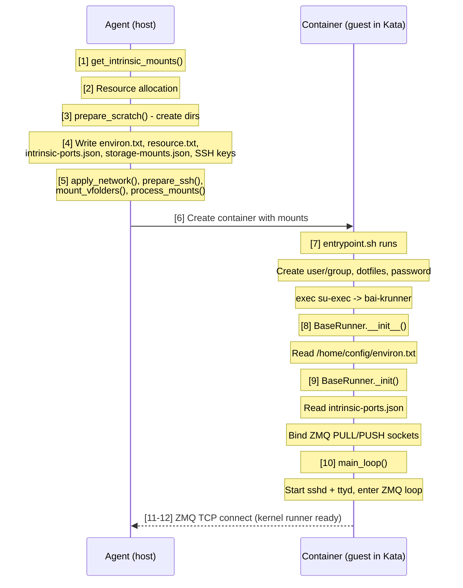
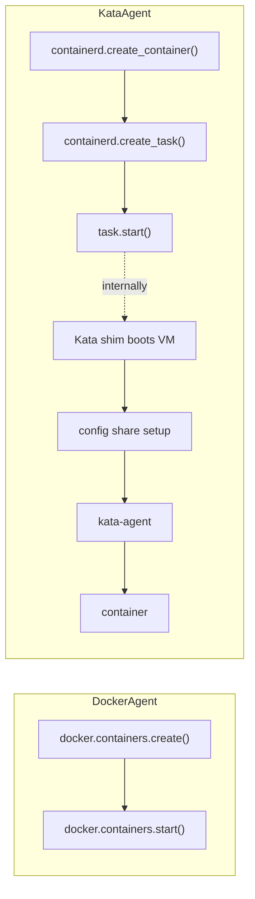

<!-- context-for-ai
type: detail-doc
parent: BEP-1051 (Kata Containers Agent Backend)
scope: KataAgent, KataKernel, KataKernelCreationContext implementation; kernel runner boot sequence in guest VM
depends-on: [configuration-deployment.md, storage-compatibility.md]
key-decisions:
  - Full AbstractAgent implementation with Kata-specific lifecycle
  - Container management via containerd gRPC with Kata shim
  - VFolder storage via direct guest-side NFS/Lustre mount (RDMA-preserving); virtio-fs only for scratch/config
  - All executables (krunner, Python libs) baked into attested guest rootfs (CoCo — host untrusted)
  - ZMQ TCP for agent↔kernel-runner communication (already TCP-based, works across VM boundary)
  - Agent socket (/opt/kernel/agent.sock) not needed for Kata (only used by jail/C binaries, both skipped)
  - entrypoint.sh requires Kata-specific variant (skip LD_PRELOAD/libbaihook, skip jail references)
-->

# BEP-1051: KataAgent Backend

## Summary

KataAgent is the third `AbstractAgent` implementation that manages containers inside lightweight VMs via Kata Containers 3.x. It communicates with containerd's gRPC API to create containers using the Kata runtime shim, replacing Docker API calls with containerd's native client API (containers, tasks, and sandbox services).

## Current Design

### Backend Abstraction

The existing backend enum and dynamic import pattern (`src/ai/backend/agent/types.py`):

```python
class AgentBackend(enum.StrEnum):
    DOCKER = "docker"
    KUBERNETES = "kubernetes"
    DUMMY = "dummy"

def get_agent_discovery(backend: AgentBackend) -> AbstractAgentDiscovery:
    agent_mod = importlib.import_module(f"ai.backend.agent.{backend.value}")
    return cast(AbstractAgentDiscovery, agent_mod.get_agent_discovery())
```

`DockerAgent` (`src/ai/backend/agent/docker/agent.py`) manages containers via `aiodocker`:
- Creates containers with `docker.containers.create(container_config)`
- Merges accelerator plugin args via `update_nested_dict(container_config, plugin_args)`
- Monitors events via `docker.events.subscribe()`
- Shares storage via Docker bind mounts (zero overhead, direct kernel VFS)

### Three-Package Architecture Inside Containers

Backend.AI runs three software layers inside every container:

| Package | Role | Lifecycle |
|---------|------|-----------|
| `ai.backend.runner` (`entrypoint.sh` + static binaries) | Bootstrap: user/group setup, SSH keys, LD_PRELOAD, password generation | Runs once at container start, then `exec`s the main program |
| `ai.backend.kernel` (`BaseRunner` subclasses) | Long-running process (`bai-krunner`): receives commands from agent, executes user code, manages services | Runs for container lifetime |
| `ai.backend.agent` (host-side) | Writes config files to scratch dirs, communicates with kernel runner via ZMQ TCP | Runs on host |

**Boot sequence:**



### Config Files in /home/config

The agent writes several files to `scratch_dir/config/` before container creation. These are mounted read-only at `/home/config` inside the container:

| File | Writer | Reader | Purpose |
|------|--------|--------|---------|
| `environ.txt` | Agent (`docker/agent.py:844-854`) | **Kernel runner** (`BaseRunner.__init__`, line 187) | `key=value` pairs loaded into `child_env` and `os.environ` for all subprocess execution |
| `resource.txt` | Agent (`docker/agent.py:856-867`) | **Agent only** (recovery: `resources.py:887-910`, `scratch/utils.py:100-103`) | Serialized `KernelResourceSpec` — slot allocations, mounts, device mappings. NOT read by the kernel runner |
| `intrinsic-ports.json` | Agent | **Kernel runner** (`BaseRunner._init`, line 244) | Maps service names to ports: `{"replin": 2000, "replout": 2001, "sshd": 2200, "ttyd": 7681}` |
| `ssh/id_cluster` | Agent | **Kernel runner** (`intrinsic.py:89-130`) | Private key for inter-container SSH in multi-node sessions |
| `ssh/id_cluster.pub` | Agent | **Kernel runner** (`intrinsic.py:130-140`) | Public key appended to `~/.ssh/authorized_keys` |
| `ssh/port-mapping.json` | Agent | **Kernel runner** (`intrinsic.py:100-112`) | Cluster node SSH port mapping → written to `~/.ssh/config` |
| `docker-creds.json` | Agent | Container bootstrap | Docker-specific; **NOT used for Kata** — images pulled guest-side via `image-rs` with KBS-delivered credentials |
| `environ_base.txt` | Agent (backup copy) | Agent (recovery) | Baseline copy of environ.txt for hot-update diffing |
| `resource_base.txt` | Agent (backup copy) | Agent (recovery) | Baseline copy of resource.txt for hot-update diffing |

**Key insight for Kata**: `environ.txt` and `intrinsic-ports.json` must be present **before** the kernel runner process starts — they are read during initialization. `resource.txt` is read only by the agent (host-side) for recovery after restarts and for tracking resource usage — it never crosses into the guest's runtime.

### Agent Socket (agent.sock) — Skipped for Kata

The Docker agent socket (`/opt/kernel/agent.sock`) is a ZMQ REP socket for jail/C binaries (PID translation, jail status). **Not used for Kata** — the jail sandbox is not applicable (VM boundary is stronger) and PID translation is irrelevant (guest PIDs are isolated). The primary agent↔kernel-runner communication (ZMQ PUSH/PULL) is TCP-based and works over the Calico network without any changes.

## Proposed Design

### Package Structure

```
src/ai/backend/agent/kata/
├── __init__.py              # KataAgentDiscovery + get_agent_discovery()
├── agent.py                 # KataAgent + KataKernelCreationContext
├── kernel.py                # KataKernel
├── resources.py             # load_resources(), scan_available_resources()
├── intrinsic.py             # CPU/Memory compute plugins for Kata
└── containerd_client.py     # Async containerd gRPC client wrapper
```

### AgentBackend Enum Extension

```python
# src/ai/backend/agent/types.py
class AgentBackend(enum.StrEnum):
    DOCKER = "docker"
    KUBERNETES = "kubernetes"
    KATA = "kata"           # NEW
    DUMMY = "dummy"
```

### KataAgentDiscovery

```python
# src/ai/backend/agent/kata/__init__.py
class KataAgentDiscovery(AbstractAgentDiscovery):
    def get_agent_cls(self) -> type[AbstractAgent[Any, Any]]:
        return KataAgent

    async def load_resources(self, etcd, local_config):
        return await load_resources(etcd, local_config)

    async def scan_available_resources(self, compute_device_types):
        return await scan_available_resources(compute_device_types)

    async def prepare_krunner_env(self, local_config):
        # CoCo: all krunner binaries and Python libraries are baked into
        # the attested guest rootfs. The host is untrusted and must not
        # be a source of executables. No Docker volumes or virtio-fs
        # binary sharing needed.
        return await prepare_krunner_env_kata(local_config)

def get_agent_discovery() -> AbstractAgentDiscovery:
    return KataAgentDiscovery()
```

### KataAgent

```python
class KataAgent(AbstractAgent[KataKernel, KataKernelCreationContext]):
```

Key method overrides:

**`__ainit__()`** — Initialize containerd client, validate Kata runtime availability:

```python
async def __ainit__(self):
    await super().__ainit__()
    kata_config = self.local_config.kata
    self._containerd = ContainerdClient(kata_config.containerd_socket)
    await self._containerd.connect()

    # Validate Kata runtime is registered
    runtime_info = await self._containerd.get_runtime_info(
        kata_config.kata_runtime_class
    )
    if not runtime_info:
        raise AgentError("Kata runtime not found in containerd")

    self._hypervisor = kata_config.hypervisor
    log.info("KataAgent initialized with hypervisor: {}", self._hypervisor)
```

**Container lifecycle** — The core difference from DockerAgent:



**`destroy_kernel()`** — Stop and remove via containerd:

```python
async def destroy_kernel(self, kernel_id, container_id):
    await self._containerd.stop_task(container_id)
    await self._containerd.delete_task(container_id)
    await self._containerd.delete_container(container_id)
    # Kata shim automatically tears down VM when last container is removed
```

**Event monitoring** — Subscribe to containerd events instead of Docker:

```python
async def _handle_container_events(self):
    async for event in self._containerd.subscribe_events():
        if event.topic == "/tasks/exit":
            kernel_id = self._extract_kernel_id(event)
            await self._handle_kernel_exit(kernel_id, event.exit_status)
```

**No agent socket handler** — `handle_agent_socket()` is not started. The jail sandbox and PID translation operations it serves are both irrelevant inside a VM. This eliminates the socat relay container dependency.

### KataKernelCreationContext

Key overrides that differ from `DockerKernelCreationContext`:

**`prepare_scratch()`** — Create directories shared via virtio-fs:

The VM boot disk (`kata-containers.img`) is a read-only, shared mini-OS containing only the kata-agent. Scratch directories serve a different purpose — they carry per-session configuration and workspace:

- `/home/config` (RO): Agent-written config files consumed by entrypoint.sh and kernel runner at startup
- `/home/work` (RW): User's persistent workspace and vfolder mount point

```python
async def prepare_scratch(self):
    scratch_dir = self.scratch_root / str(self.kernel_id)
    config_dir = scratch_dir / "config"
    config_dir.mkdir(parents=True, exist_ok=True)
    (scratch_dir / "work").mkdir(parents=True, exist_ok=True)
```

**`write_config_files()`** — Write environ.txt and resource.txt:

```python
async def write_config_files(self, environ, resource_spec):
    # environ.txt — consumed by BaseRunner.__init__() inside the guest.
    # Every key=value pair becomes part of the child process environment.
    with StringIO() as buf:
        for k, v in environ.items():
            buf.write(f"{k}={v}\n")
        for env in self.computer_docker_args.get("Env", []):
            buf.write(f"{env}\n")
        (self.config_dir / "environ.txt").write_bytes(buf.getvalue().encode("utf8"))

    # resource.txt — read only by the agent (host-side) for recovery.
    # The kernel runner does NOT read this file.
    with StringIO() as buf:
        resource_spec.write_to_file(buf)
        for dev_type, device_alloc in resource_spec.allocations.items():
            device_plugin = self.computers[dev_type].instance
            kvpairs = await device_plugin.generate_resource_data(device_alloc)
            for k, v in kvpairs.items():
                buf.write(f"{k}={v}\n")
        (self.config_dir / "resource.txt").write_bytes(buf.getvalue().encode("utf8"))

    # intrinsic-ports.json — consumed by BaseRunner._init__() for
    # ZMQ socket binding and service port assignment.
    ports = {
        "replin": self._repl_in_port,
        "replout": self._repl_out_port,
        "sshd": 2200,
        "ttyd": 7681,
    }
    (self.config_dir / "intrinsic-ports.json").write_bytes(
        json.dumps(ports).encode("utf8")
    )

    # storage-mounts.json — consumed by the guest prestart hook
    # (OCI hook at /usr/share/oci/hooks/prestart/setup-storage.sh).
    # Contains volume mount specs and storage NIC IP for the guest
    # boot script to configure before the container starts.
    kata_config = self.local_config.kata
    storage_config = {
        "storage_nic": (
            {
                "device": kata_config.storage_nic.device,
                "address": kata_config.storage_nic.address,
                "gateway": kata_config.storage_nic.gateway,
            }
            if kata_config.storage_nic
            else None
        ),
        "volumes": [
            {
                "fs_type": m.fs_type,
                "source": m.source,
                "mountpoint": m.mountpoint,
                "options": m.options,
            }
            for m in kata_config.storage_mounts
        ],
    }
    (self.config_dir / "storage-mounts.json").write_bytes(
        json.dumps(storage_config).encode("utf8")
    )
```

The guest prestart hook (`/usr/share/oci/hooks/prestart/setup-storage.sh`, baked into the attested guest rootfs) reads this file during `create_container()` and:
1. Configures the storage NIC IP (IPoIB or Ethernet) via `ip addr add`
2. Mounts each volume using the guest kernel's native NFS/Lustre client
3. Volumes are then available for container bind mounts at the specified mount points

**`get_intrinsic_mounts()`** — Skip mounts that are unnecessary or incompatible with Kata:

```python
async def get_intrinsic_mounts(self) -> Sequence[Mount]:
    mounts = []
    # KEEP: config dir via virtio-fs (host-originated config delivery)
    mounts.append(Mount(MountTypes.BIND, self.config_dir, Path("/home/config"),
                        MountPermission.READ_ONLY))
    # /home/work is on the guest disk (part of guest rootfs), NOT a virtio-fs mount.
    # VFolder subdirectories are bind-mounted into /home/work/{vfolder}
    # from guest-side NFS/Lustre mounts by the OCI prestart hook.
    # CHANGE: /tmp as guest-side tmpfs (no need to cross VM boundary)
    mounts.append(Mount(MountTypes.TMPFS, None, Path("/tmp"),
                        MountPermission.READ_WRITE))
    # SKIP: /home/work — already exists on guest disk
    # SKIP: timezone — baked into guest rootfs
    # SKIP: lxcfs — guest kernel provides accurate /proc and /sys
    # SKIP: agent.sock — only used by jail/C binaries, both skipped for Kata
    # SKIP: domain socket proxies — UDS cannot cross VM boundary
    # SKIP: deep learning samples — deprecated Docker volume
    return mounts
```

**`mount_krunner()`** — No-op under CoCo; all executables in attested rootfs:

```python
async def mount_krunner(self, resource_spec, environ):
    # CoCo-by-default: all krunner executables (su-exec, entrypoint.sh,
    # dropbearmulti, etc.) and Python libraries (ai.backend.kernel,
    # ai.backend.helpers) are baked into the attested guest rootfs.
    # The host is untrusted — no host→guest executable sharing via virtio-fs.
    #
    # SKIP: krunner binary mounts — already in guest rootfs
    # SKIP: Python library mounts — already in guest rootfs
    # SKIP: libbaihook.so + LD_PRELOAD — guest kernel provides accurate sysconf
    # SKIP: jail binary — VM boundary is stronger isolation
    # SKIP: accelerator LD_PRELOAD hooks — VFIO passthrough makes GPU
    #        natively visible in guest; no hook libraries needed
    pass
```

**`apply_accelerator_allocation()`** — Collect VFIO device info from plugins:

```python
async def apply_accelerator_allocation(self):
    vfio_devices = []
    for dev_type, device_alloc in self.resource_spec.allocations.items():
        computer = self.computers[dev_type].instance
        plugin_args = await computer.generate_docker_args(None, device_alloc)
        # CUDAVFIOPlugin returns {"_kata_vfio_devices": [...]}
        if "_kata_vfio_devices" in plugin_args:
            vfio_devices.extend(plugin_args["_kata_vfio_devices"])
    self._vfio_devices = vfio_devices
```

**`spawn()`** — Create container via containerd with Kata runtime:

```python
async def spawn(self):
    container_config = {
        "image": self.image_ref,
        "runtime": {"name": "io.containerd.kata.v2"},
        "env": self.environ,
        "mounts": self._build_container_mounts(),  # config via virtio-fs + vfolder bind mounts (guest-internal)
        "labels": self._build_labels(),
        "annotations": {
            "io.katacontainers.config.hypervisor.hotplug_vfio_on_root_bus": "true",
            **self._build_vfio_annotations(),
        },
    }
    container = await self._containerd.create_container(
        container_id=str(self.kernel_id),
        config=container_config,
    )
    task = await self._containerd.create_task(container.id)
    await task.start()
    return container.id
```

### Kata-Specific entrypoint.sh

The runner's `entrypoint.sh` needs a Kata-specific variant. The Docker version performs several operations that are incompatible or unnecessary:

| Operation | Docker | Kata | Reason |
|-----------|--------|------|--------|
| Create user/group | Yes | **Yes** | Same user setup needed inside guest |
| `LD_PRELOAD` → `/etc/ld.so.preload` | Yes | **No** | libbaihook.so is not mounted; guest kernel provides accurate sysconf |
| `chown agent.sock` | Yes | **No** | Agent socket is not mounted |
| Extract dotfiles | Yes | **Yes** | Same user environment customization |
| SSH key setup | Yes | **Yes** | Same inter-container SSH support |
| Password generation | Yes | **Yes** | Same session security model |
| `exec su-exec` | Yes | **Yes** | Same privilege drop to user UID/GID |

The Kata variant skips the `LD_PRELOAD` block and the `chown agent.sock` line, but is otherwise identical.

### KataKernel

```python
class KataKernel(AbstractKernel):
    container_id: ContainerId
    sandbox_id: str          # Kata sandbox (VM) identifier

    async def create_code_runner(self):
        # The agent↔kernel-runner communication channel is ZMQ TCP,
        # which already works across the VM boundary without modification.
        #
        # Docker: agent connects to tcp://localhost:{host_mapped_port}
        #         (Docker maps container port to a host port)
        # Kata:   agent connects to tcp://{guest_ip}:{container_port}
        #         (guest IP assigned by Calico CNI, reachable via TC filter)
        #
        # The kernel runner inside the guest binds:
        #   insock  = tcp://*:{repl_in_port}   (ZMQ PULL)
        #   outsock = tcp://*:{repl_out_port}   (ZMQ PUSH)
        # These ports come from /home/config/intrinsic-ports.json.
        return DockerCodeRunner(
            kernel_id=self.kernel_id,
            kernel_host=self._guest_ip,
            repl_in_port=self._repl_in_port,
            repl_out_port=self._repl_out_port,
            exec_timeout=self.exec_timeout,
            client_features=client_features,
        )

    async def check_status(self):
        status = await self._containerd.get_task_status(self.container_id)
        return status == "running"
```

The `DockerCodeRunner` class (or a renamed `CodeRunner` base) is reusable because its only transport is ZMQ over TCP — `get_repl_in_addr()` returns `tcp://{host}:{port}`. The difference is the address: Docker uses `localhost` with port mapping; Kata uses the guest's Calico-assigned IP with direct port access.

### ContainerdClient

Async wrapper around containerd's gRPC API. For **single-container sessions**, each container gets its own Kata sandbox (VM) via the standard `containers.v1` / `tasks.v1` APIs. For **multi-container sessions** (clusters on a single host), the containerd Sandbox API (`sandbox.v1`, available in containerd v2+) is used to create a shared sandbox first, then add containers into it:

```python
class ContainerdClient:
    def __init__(self, socket_path: Path):
        self._socket = socket_path

    async def connect(self): ...
    async def close(self): ...

    # Image operations
    async def list_images(self) -> list[ImageInfo]: ...
    async def pull_image(self, ref: str, auth: dict | None = None): ...

    # Sandbox operations (containerd v2+ Sandbox API)
    # Required for multi-container sessions sharing a single Kata VM.
    # Without the Sandbox API, each container creates a separate VM.
    async def create_sandbox(self, sandbox_id: str, runtime: str,
                             config: dict) -> SandboxInfo: ...
    async def stop_sandbox(self, sandbox_id: str): ...
    async def delete_sandbox(self, sandbox_id: str): ...

    # Container operations
    async def create_container(self, container_id: str, config: dict,
                               sandbox_id: str | None = None) -> ContainerInfo: ...
    async def delete_container(self, container_id: str): ...

    # Task operations (a "task" is a running process in containerd)
    async def create_task(self, container_id: str) -> TaskInfo: ...
    async def start_task(self, container_id: str): ...
    async def stop_task(self, container_id: str, timeout: int = 10): ...
    async def delete_task(self, container_id: str): ...
    async def get_task_status(self, container_id: str) -> str: ...

    # Exec (run command inside running container)
    async def exec_in_container(self, container_id: str,
                                command: list[str]) -> ExecResult: ...

    # Events
    async def subscribe_events(self) -> AsyncIterator[Event]: ...

    # Runtime info
    async def get_runtime_info(self, runtime_class: str) -> dict | None: ...
```

This client uses `grpcio` (or `grpclib` for async) to communicate with containerd's Unix socket. The proto definitions come from the containerd API (`containerd.services.containers.v1`, `containerd.services.tasks.v1`, `containerd.services.sandbox.v1`).

**API choice rationale:** The containerd client API (`containers.v1`, `tasks.v1`, `sandbox.v1`) is the correct programmatic interface for a non-Kubernetes service. CRI `RuntimeService` is the Kubernetes kubelet's API and should not be used directly. The Kata shim v2 API (`containerd.runtime.v2.Task`) is internal to containerd and not called by external clients.

## Interface / API

| Class | Extends | Key Responsibility |
|-------|---------|-------------------|
| `KataAgent` | `AbstractAgent[KataKernel, KataKernelCreationContext]` | Container lifecycle via containerd + Kata shim; no agent socket handler |
| `KataKernel` | `AbstractKernel` | Guest VM container state; code runner connection via ZMQ TCP to guest IP |
| `KataKernelCreationContext` | `AbstractKernelCreationContext` | Config file writing (environ.txt, resource.txt, intrinsic-ports.json); VFIO device collection; mount filtering (skip lxcfs, jail, agent.sock, libbaihook) |
| `KataAgentDiscovery` | `AbstractAgentDiscovery` | Plugin loading, resource scanning, krunner env |
| `ContainerdClient` | (standalone) | Async containerd gRPC wrapper |

## Implementation Notes

- Kata runtime must be installed on the host; the agent does not install it
- Image format: standard OCI images work unchanged; containerd handles the pull and unpack
- The `[container]` section settings (`scratch-root`, `port-range`) are shared between Docker and Kata backends
- Intrinsic CPU/Memory plugins (`intrinsic.py`) can largely reuse the Docker versions; the main difference is that resource limits apply to the VM (host cgroup) rather than directly to the container process
- Log collection: containerd tasks expose stdout/stderr via FIFO pipes, similar to Docker's log stream
- `entrypoint.sh` needs a Kata variant that skips the `LD_PRELOAD` setup and `agent.sock` chown. This can be a conditional branch in the existing script (check an env var like `BACKENDAI_CONTAINER_BACKEND=kata`) or a separate entrypoint file
- The `DockerCodeRunner` class can be reused directly for Kata — its only dependency is ZMQ TCP addressing, which works identically with a guest IP instead of localhost
- `resource.txt` is written to `/home/config/` for agent-side recovery consistency, but the kernel runner never reads it. The hypervisor enforces resource limits (vCPU, memory) at the VM level; environ.txt communicates resource metadata to the kernel runner's child environment
