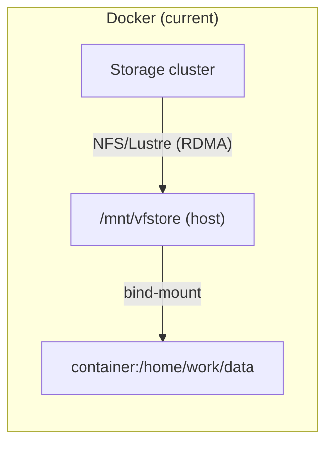
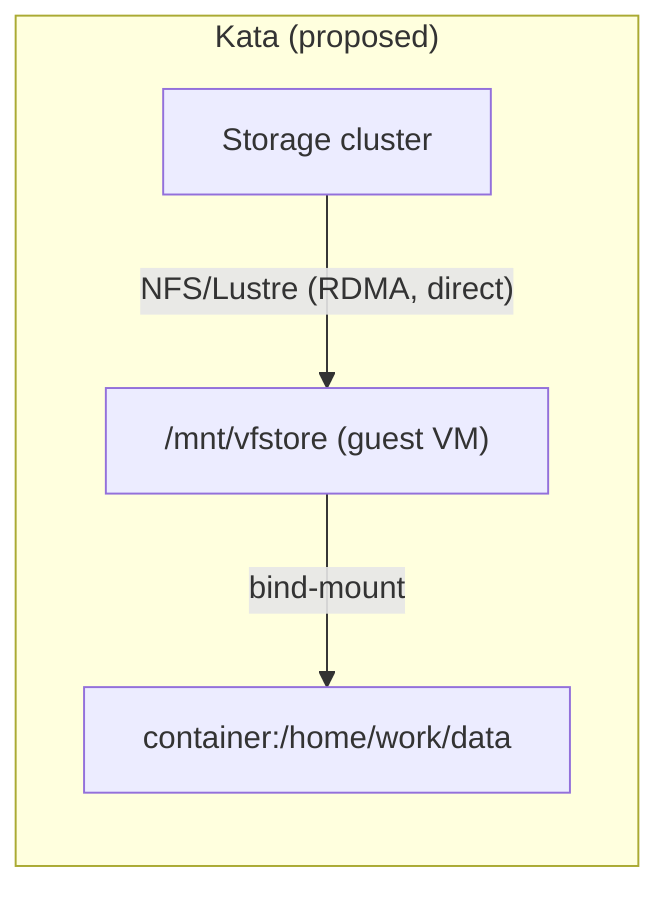

<!-- context-for-ai
type: detail-doc
parent: BEP-1051 (Kata Containers Agent Backend)
scope: Migration strategy and backward compatibility guarantees
depends-on: [kata-agent-backend.md, vfio-accelerator-plugin.md, scheduler-integration.md, configuration-deployment.md]
key-decisions:
  - All changes are additive; no existing behavior modified
  - Kata agents deployed alongside Docker agents in separate scaling groups
  - Rollback is trivial (remove Kata agents, keep schema)
  - VFolder storage via direct guest-side NFS/Lustre/WekaFS mount (native kernel client, RDMA-preserving; mirrors Docker's host-level mount model)
-->

# BEP-1051: Migration and Compatibility

## Summary

Introducing KataAgent is an additive change — new enum value, new package, new config section, new DB column with a safe default. Existing Docker and Kubernetes deployments are completely unaffected. This document details the rollout strategy, compatibility guarantees, and rollback plan.

## Backward Compatibility

### No Breaking Changes

| Component | Change | Impact on Existing Deployments |
|-----------|--------|-------------------------------|
| `AgentBackend` enum | Add `KATA = "kata"` | None — existing `DOCKER`/`KUBERNETES` values unchanged |
| `AgentRow` | Add `backend` column | None — `server_default="docker"` for all existing rows |
| Agent heartbeat | Add `backend` field | None — manager defaults to `"docker"` if field missing |
| Accelerator plugins | New `cuda_vfio` entry point | None — only loaded if agent config allows it |
| Scaling groups | No schema change | None — new groups created for Kata, existing groups unchanged |
| Manager RPC | No protocol change | None — `create_kernel` payload is identical |
| User API | No change | None — users select scaling groups, not backends |
| `AgentMeta` / `AgentInfo` | Add `backend` field with default | None — default `"docker"` preserves behavior |

### Package Independence

The `ai.backend.agent.kata` package is a new addition:

```
src/ai/backend/agent/
├── docker/          ← unchanged
├── kubernetes/      ← unchanged
├── dummy/           ← unchanged
└── kata/            ← new (only imported when backend="kata")
```

The `ai.backend.accelerator.cuda_vfio` package is similarly independent:

```
src/ai/backend/accelerator/
├── cuda_open/       ← unchanged (Docker agents continue using this)
└── cuda_vfio/       ← new (only loaded by Kata agents)
```

### Config Compatibility

The `[kata]` config section is only read when `[agent] backend = "kata"`. Docker agents ignore it entirely. Existing `agent.toml` files require no changes.

## Migration Steps

### Phase 1: Infrastructure Preparation

Before deploying any Backend.AI changes:

1. **Prepare Kata hosts** (dedicated machines or a subset of existing agent nodes):
   - Install Kata Containers 3.x (`kata-runtime`, guest kernel, rootfs image)
   - Configure containerd with Kata shim (`io.containerd.kata.v2`)
   - Enable IOMMU in kernel: `intel_iommu=on iommu=pt` (Intel) or `amd_iommu=on iommu=pt` (AMD)
   - Load kernel modules: `vfio`, `vfio_pci`, `vfio_iommu_type1`, `vhost_vsock`
   - Bind target GPUs to `vfio-pci` driver
   - Verify: `kata-runtime check` passes, `/dev/vfio/` contains group devices

2. **Verify IOMMU groups** on each host:
   ```bash
   for d in /sys/kernel/iommu_groups/*/devices/*; do
     echo "IOMMU Group $(basename $(dirname $(dirname $d))):" \
       "$(lspci -nns $(basename $d))"
   done
   ```
   Confirm each GPU is in its own IOMMU group (or shares only with its audio companion).

### Phase 2: Backend.AI Deployment

1. **Run Alembic migration**:
   - Adds `agents.backend` column with `server_default="docker"`
   - Non-destructive; can be run while existing agents are online
   - Existing agent rows automatically get `backend="docker"`

2. **Deploy updated manager**:
   - Manager accepts the new `backend` field in agent heartbeats
   - Falls back to `"docker"` for agents that don't send it (backward compatible)

3. **Create Kata scaling group(s)**:
   ```sql
   INSERT INTO scaling_groups (name, driver, ...) VALUES ('kata-gpu', 'static', ...);
   ```
   Or via admin API / WebUI.

4. **Deploy Kata agent on prepared hosts**:
   - Config file with `[agent] backend = "kata"` and `[kata]` section
   - Agent registers with the Kata scaling group
   - Agent heartbeat includes `backend="kata"`

### Phase 3: Validation

1. **Agent registration**: Verify Kata agents appear in `agents` table with `backend="kata"`:
   ```sql
   SELECT id, backend, scaling_group, available_slots FROM agents WHERE backend = 'kata';
   ```

2. **Session creation**: Create a test session targeting the Kata scaling group:
   - CPU-only session first (Phase 1 validation)
   - Single GPU session (Phase 2 validation)
   - Multi-GPU session (if IOMMU groups allow)

3. **GPU verification**: Inside the Kata session:
   ```bash
   nvidia-smi  # Should show passthrough GPU(s)
   python -c "import torch; print(torch.cuda.device_count())"
   ```

4. **Storage verification**: Confirm vfolder mounts are accessible:
   ```bash
   ls /home/work/  # Should show mounted vfolders
   echo "test" > /home/work/test.txt  # Write should succeed
   ```

5. **Existing Docker sessions**: Verify no impact:
   - Create sessions in Docker scaling groups — should work identically
   - Check Docker agent heartbeats — `backend="docker"` (or missing, defaulted)
   - Confirm no scheduler behavior changes for Docker groups

### Phase 4: Gradual Rollout

1. **Start small**: One Kata agent, one scaling group, internal testing only
2. **Assign specific projects/users** to the Kata scaling group for controlled testing
3. **Monitor**:
   - VM boot times (target: < 500ms)
   - Memory overhead (should match `kata.vm-overhead-mb` config)
   - GPU compute performance (should be near-native via VFIO)
   - I/O performance on vfolder mounts (direct guest-side NFS/Lustre)
4. **Scale out**: Add more Kata agents as confidence grows

## Rollback Plan

Rollback is straightforward because all changes are additive:

1. **Remove Kata agents** from the Kata scaling group (or set `schedulable=false`)
2. **Reassign users/projects** back to Docker scaling groups
3. **Optionally remove Kata agents** from the cluster entirely
4. **No schema rollback needed**: The `agents.backend` column stays (all values are `"docker"` after Kata agents are removed); the Alembic migration does not need to be reversed

The `backend` column, `AgentBackend.KATA` enum value, and `cuda_vfio` plugin are inert when no Kata agents are deployed — they add no runtime overhead or behavioral changes.

## Future Extensibility

### CoCo Architecture (Built-In from Phase 1)

CoCo (Confidential Containers) is enabled by default for all Kata workloads — there is no non-CoCo Kata mode. The following are part of the baseline architecture, not a future phase:

- `confidential_guest = true` and `guest_attestation = "tdx"` (or `"sev-snp"`) in Kata config — defaults
- Guest-side image pull via `image-rs` — images downloaded and decrypted inside the TEE
- Key Broker Service (KBS) integration for sealed secrets and registry credentials
- Remote attestation endpoint exposed via the manager API
- All executables baked into the attested guest rootfs — no host→guest sharing of binaries

#### VFolder Storage: Direct Guest-Side NFS/Lustre Mount

virtio-fs introduces FUSE overhead on the host side and — critically — breaks RDMA data paths for high-performance storage backends (Lustre over InfiniBand, WekaFS RDMA, GPFS). Since Backend.AI's target deployments use RDMA-capable network-attached storage, virtio-fs is unsuitable for vfolder data I/O.

The correct architecture mirrors Docker: mount the **storage volume** directly inside the guest VM using the guest's own NFS/Lustre/WekaFS kernel client (preserving RDMA, 100% native throughput), then bind-mount the specific vfolder subdirectory into the container.





**How mount specs and storage network config reach the guest:**

1. The KataAgent's `[kata]` config lists storage volume mount points (`[[kata.storage-mounts]]`) and storage NIC IP (`[kata.storage-nic]`). See [configuration-deployment.md](configuration-deployment.md) for the full schema.
2. Before VM boot, `KataKernelCreationContext.write_config_files()` writes `storage-mounts.json` to `/home/config/` (virtio-fs config channel — same mechanism as environ.txt and intrinsic-ports.json).
3. During `create_sandbox()`, the Kata shim loads kernel modules specified in `kernel-modules` config (e.g., `["nfs", "nfsv4"]`) via `modprobe`, and the `guest_hook_path` is scanned for OCI prestart hooks.
4. During `create_container()`, the OCI prestart hook (`/usr/share/oci/hooks/prestart/setup-storage.sh`, baked into the attested guest rootfs) executes and:
   - Reads `storage-mounts.json` from the virtio-fs shared `/home/config/`
   - Configures the storage NIC IP via `ip addr add`
   - Mounts each storage volume using the guest kernel's native NFS/Lustre client
5. After the hook completes, the OCI container spec's bind mounts (`/mnt/vfstore/<vfid>/subpath` → `/home/work/data`) are applied as guest-internal bind mounts — identical to Docker.

**`storage-mounts.json` format:**

```json
{
  "storage_nic": {
    "device": "ib0",
    "address": "10.0.100.5/24",
    "gateway": "10.0.100.1"
  },
  "volumes": [
    {
      "fs_type": "nfs4",
      "source": "storage-server:/exports/vfstore",
      "mountpoint": "/mnt/vfstore",
      "options": "vers=4.1,rsize=1048576,wsize=1048576"
    }
  ]
}
```

**Guest prestart hook** (`/usr/share/oci/hooks/prestart/setup-storage.sh`, baked into attested rootfs):

```bash
#!/bin/bash
# Baked into attested guest rootfs — tamper-proof under CoCo.
# Executed by kata-agent as an OCI prestart hook during create_container().
# Kernel modules (nfs, nfsv4, lustre) are already loaded by create_sandbox().

CONFIG="/run/kata-containers/shared/containers/*/rootfs/home/config/storage-mounts.json"
# Resolve the glob — virtio-fs shared directory has one container entry
CONFIG_FILE=$(ls $CONFIG 2>/dev/null | head -1)
[ -z "$CONFIG_FILE" ] && exit 0

# Configure storage NIC IP (IPoIB or Ethernet)
NIC_DEV=$(jq -r '.storage_nic.device // empty' "$CONFIG_FILE")
if [ -n "$NIC_DEV" ]; then
    NIC_ADDR=$(jq -r '.storage_nic.address' "$CONFIG_FILE")
    NIC_GW=$(jq -r '.storage_nic.gateway // empty' "$CONFIG_FILE")
    ip addr add "$NIC_ADDR" dev "$NIC_DEV" 2>/dev/null
    ip link set "$NIC_DEV" up
    [ -n "$NIC_GW" ] && ip route add default via "$NIC_GW" dev "$NIC_DEV" table 100
fi

# Mount each storage volume
jq -c '.volumes[]' "$CONFIG_FILE" | while read -r vol; do
    FS_TYPE=$(echo "$vol" | jq -r '.fs_type')
    SOURCE=$(echo "$vol" | jq -r '.source')
    MOUNTPOINT=$(echo "$vol" | jq -r '.mountpoint')
    OPTIONS=$(echo "$vol" | jq -r '.options // empty')
    mkdir -p "$MOUNTPOINT"
    if [ -n "$OPTIONS" ]; then
        mount -t "$FS_TYPE" -o "$OPTIONS" "$SOURCE" "$MOUNTPOINT"
    else
        mount -t "$FS_TYPE" "$SOURCE" "$MOUNTPOINT"
    fi
done
```

**Storage NIC IP allocation:** The storage NIC (InfiniBand HCA or dedicated Ethernet NIC) is VFIO-passthrough to the VM as a whole device. In single-tenancy deployments (one VM per agent node — the target for Phase 1), the VM simply takes the static storage IP that would otherwise belong to the host. The IP, subnet, and gateway are configured in the agent's `[kata]` config and written into `storage-mounts.json`. No dynamic IP allocation is needed — the storage network topology is static infrastructure-level configuration. For future multi-tenancy (multiple VMs per node via SR-IOV VFs), each VF would need its own IP, requiring DHCP or an IP pool manager — this is deferred along with SR-IOV support.

**Storage topology visibility:** Container users can see mount info in `/proc/mounts` (server addresses, export paths). This is acceptable — the same isolation model as Docker. Backend.AI's security boundary is the vfolder permission model (users can only access vfolders they're authorized for), not mount concealment. Container users cannot mount their own disks (no `CAP_SYS_ADMIN`).

**What uses virtio-fs (still):**
- Scratch/config directories: `/home/config` (environ.txt, intrinsic-ports.json, storage-mounts.json)
- These are small, non-performance-critical, host-originated configuration data

**Guest VM base image requirements:**

The Kata guest rootfs (or initrd) must include filesystem client drivers for every storage backend that Backend.AI claims to support. This is a build-time dependency — the base image is a managed infrastructure artifact, not a user-provided image.

| Storage Backend | Required Guest Kernel Module / Userspace | Notes |
|-----------------|------------------------------------------|-------|
| NFS (VAST, NetApp, Pure, Dell EMC, Hammerspace) | `nfs`, `nfsv4` kernel modules; `mount.nfs` helper | Most universal; covers majority of supported backends |
| Lustre (DDN EXAScaler) | `lustre` kernel module (out-of-tree, DKMS) | Must match Lustre server version; RDMA (o2ib) requires OFED |
| WekaFS | `wekafs` kernel module + userspace agent | Proprietary; requires WekaFS client package and DPDK for RDMA |
| CephFS | `ceph` kernel module | Native kernel client; alternatively use NFS gateway |
| GPFS (IBM Storage Scale) | `mmfs` kernel module + userspace daemon | Proprietary; requires cluster membership config |

The base image build pipeline must:
1. Start from a minimal Linux rootfs (same as the standard Kata guest rootfs)
2. Install a storage mount boot script as a systemd service (`Before=local-fs.target`) that reads `/home/config/storage-mounts.json` and mounts volumes
3. Include kernel modules for all supported storage backends (compiled against the guest kernel version)
4. Include any required userspace helpers (`mount.nfs`, `mount.lustre`, WekaFS agent, etc.)
5. Version the image: `kata-rootfs-{krunner_version}-{storage_version}.qcow2` to enable atomic rollover when drivers are updated

Not all deployments need all drivers. A modular approach (base image + per-backend overlay or module loading) can reduce image size, but the simplest initial approach is a single "fat" image with all supported clients.

**Limitations:**
- Guest kernel must include storage client modules (managed via the base image build pipeline above)
- Only applicable to network-attached storage — host-local storage still requires virtio-fs
- Proprietary storage clients (WekaFS, GPFS) require vendor licensing and may have distribution restrictions for guest images

### BEP-1016 Alignment

When Accelerator Interface v2 (BEP-1016) is implemented:

- Migrate `CUDAVFIOPlugin.generate_docker_args()` → `create_lifecycle_hook()`
- The `WorkloadConfig` struct replaces the `_kata_vfio_devices` convention:
  ```python
  class WorkloadConfig:
      mounts: list[MountInfo]
      env_vars: dict[str, str]
      resource_data: dict[str, str]
      # VFIO devices expressed as mounts or a dedicated field
  ```
- Both `CUDAPlugin` and `CUDAVFIOPlugin` implement the same interface
- No user-facing or scheduler changes needed

### Mixed Scaling Groups (Future Option)

If operational needs require mixed Docker/Kata agents in the same scaling group:

- Add `allowed_backends: list[str]` to `ScalingGroupOpts`
- Add backend filtering to `AgentSelector`:
  ```python
  candidates = [a for a in agents if a.backend in sgroup.allowed_backends]
  ```
- Add `preferred_backend` to `SessionCreationSpec` (optional, user-specified)
- This is NOT proposed for the initial implementation — homogeneous groups are simpler and sufficient

## References

- [Configuration & Deployment](configuration-deployment.md) — host requirements checklist
- [Scheduler Integration](scheduler-integration.md) — `AgentRow.backend` column details
- [Kata Containers Installation Guide](https://github.com/kata-containers/kata-containers/blob/main/docs/install/README.md)
