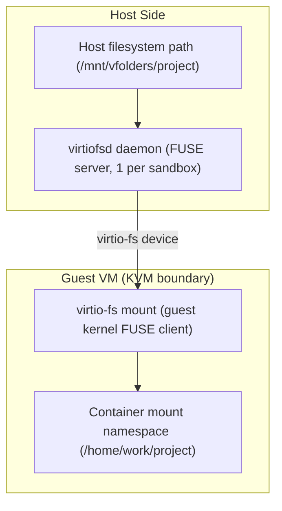
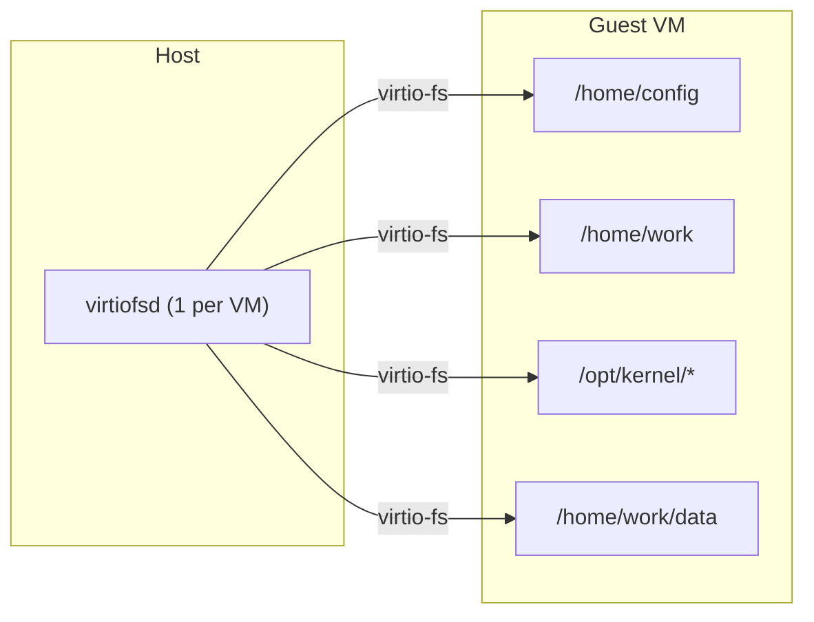
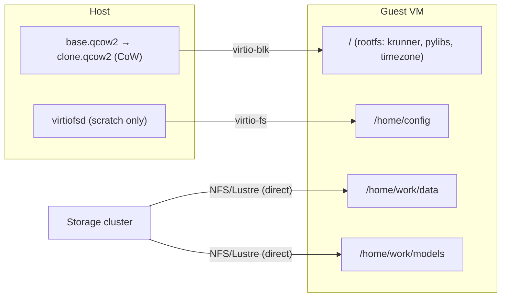

<!-- context-for-ai
type: detail-doc
parent: BEP-1051 (Kata Containers Agent Backend)
scope: Volume mount compatibility between host filesystem and Kata guest VM; intrinsic mount evaluation; storage I/O analysis
depends-on: [kata-agent-backend.md, configuration-deployment.md]
key-decisions:
  - VFolder data does NOT use virtio-fs (RDMA breakage); storage volumes mounted directly inside guest VM via native NFS/Lustre kernel client; container bind-mounts vfolder subdirs — same model as Docker
  - virtio-fs retained only for scratch/config directories (non-performance-critical, host-originated data)
  - Existing Mount abstraction (BIND, source, target, permission) reused unchanged for container-level bind mounts
  - lxcfs mounts skipped (guest kernel provides accurate /proc and /sys natively)
  - libbaihook.so LD_PRELOAD skipped (guest kernel provides accurate sysconf natively)
  - jail ptrace sandbox skipped (VM boundary is stronger isolation)
  - Agent socket skipped entirely (only used by jail/C binaries, both irrelevant for Kata)
  - /tmp uses guest-side tmpfs (no need to cross VM boundary)
  - Accelerator plugin mounts differ entirely (VFIO PCI passthrough replaces Docker DeviceRequests)
  - krunner binaries baked into attested guest rootfs (CoCo — host is untrusted, no virtio-fs sharing of executables)
-->

# BEP-1051: Storage and Volume Mount Compatibility

## Summary

Backend.AI's existing `Mount` abstraction (bind mount with source path, target path, and permission) works unchanged for KataAgent at the container level. Storage mounts are split into two paths: (1) VFolder data is mounted directly inside the guest VM using the guest's own NFS/Lustre/WekaFS kernel client (preserving RDMA, 100% native throughput), and containers bind-mount vfolder subdirectories from this guest-side mount — identical to Docker's model. (2) Scratch/config directories (`/home/config`) use virtio-fs for host→guest sharing of non-performance-critical, host-originated configuration data. No new storage management interface is required. This document details the mount compatibility layer, identifies mounts that require Kata-specific handling, and analyzes the I/O performance implications.

## Current Design: Docker Bind Mount Path

When `DockerAgent` creates a container, all storage mounts follow a single path:

```
Host filesystem ──(Linux bind mount)──→ Container mount namespace
```

This is zero-overhead because Docker containers share the host kernel's VFS. The mount specification flows through:

1. Manager resolves `VFolderMount.host_path` via Storage Proxy (`get_mount_path()` RPC)
2. Agent constructs `Mount(MountTypes.BIND, host_path, kernel_path, permission)`
3. `process_mounts()` converts to Docker API format: `{"Type": "bind", "Source": "...", "Target": "..."}`
4. Docker creates the bind mount in the container's mount namespace

Key files:
- `VFolderMount` type: `src/ai/backend/common/types.py:1299`
- `mount_vfolders()`: `src/ai/backend/agent/agent.py:557` (inherited from `AbstractKernelCreationContext`)
- `get_intrinsic_mounts()`: `src/ai/backend/agent/docker/agent.py:512`
- `process_mounts()`: `src/ai/backend/agent/docker/agent.py:764`

### Mount Inventory (DockerAgent)

| Category | Mount Point(s) | Source | Type | Perm |
|----------|---------------|--------|------|------|
| Scratch workspace | `/home/config` | `scratch_dir/config` | BIND | RO |
| | `/home/work` | `scratch_dir/work` | BIND | RW |
| | `/tmp` | `scratch_dir_tmp` (tmpfs) | BIND | RW |
| Timezone | `/etc/localtime`, `/etc/timezone` | Host files | BIND | RO |
| lxcfs | `/proc/{cpuinfo,meminfo,stat,...}` | `/var/lib/lxcfs/proc/*` | BIND | RW |
| | `/sys/devices/system/cpu{,/online}` | `/var/lib/lxcfs/sys/...` | BIND | RW |
| Agent IPC | `/opt/kernel/agent.sock` | Agent Unix socket | BIND | RW |
| Domain socket proxy | `{host_sock_path}` | `ipc_base_path/proxy/*.sock` | BIND | RW |
| Core dump | `debug.coredump.core_path` | `debug.coredump.path` | BIND | RW |
| Deep learning samples | `/home/work/samples` | Docker volume `deeplearning-samples` | VOLUME | RO |
| krunner volume | `/opt/backend.ai` | Docker volume per distro/arch | VOLUME | RO |
| krunner binaries | `/opt/kernel/{su-exec,entrypoint.sh,...}` | Agent package resources (15+ files) | BIND | RO |
| LD_PRELOAD hooks | `/opt/kernel/libbaihook.so` | Agent package resources | BIND | RO |
| Jail sandbox | `/opt/kernel/jail` | Agent package resources | BIND | RO |
| Python libraries | `/opt/backend.ai/.../ai/backend/{kernel,helpers}` | Agent package resources | BIND | RO |
| Accelerator hooks | `/opt/kernel/{hook}.so` | Compute plugin paths | BIND | RO |
| VFolders | `/home/work/{vfolder}` | NFS/CephFS/local path | BIND | RO/RW |

Total: **20-30+ mounts** per container (varies by accelerator and vfolder count).

## Proposed Design: virtio-fs Compatibility Layer

### How Kata Handles Bind Mounts

When a container is created via containerd with the Kata runtime class, the Kata shim **automatically** translates bind mount specifications into virtio-fs shares:



The Kata shim handles this translation internally:
1. Reads bind mount specs from the OCI runtime config
2. Configures virtiofsd to serve the host directories
3. Inside the guest, kata-agent mounts the virtio-fs share
4. kata-agent creates the container's mount namespace with the target paths

**No changes to the `Mount` abstraction are needed.** The `KataKernelCreationContext.process_mounts()` method passes the same `Mount(BIND, source, target, permission)` objects to containerd, and the Kata shim does the rest.

### KataAgent process_mounts() Implementation

```python
async def process_mounts(self, mounts: Sequence[Mount]) -> None:
    """Convert Backend.AI mounts to containerd mount specs.

    For Kata containers, bind mounts are automatically translated
    to virtio-fs shares by the Kata shim — we just pass them through
    as standard OCI bind mounts.
    """
    oci_mounts = []
    for mount in mounts:
        if mount.type == MountTypes.BIND:
            oci_mounts.append({
                "destination": str(mount.target),
                "source": str(mount.source),
                "type": "bind",
                "options": self._build_mount_options(mount),
            })
        elif mount.type == MountTypes.TMPFS:
            oci_mounts.append({
                "destination": str(mount.target),
                "type": "tmpfs",
                "options": ["nosuid", "nodev", "size=65536k"],
            })
    self._container_mounts.extend(oci_mounts)
```

### Intrinsic Mount Evaluation for Kata

Each mount is evaluated against the fundamental difference: Docker containers share the host kernel, while Kata VMs run a separate guest kernel inside KVM. This changes which host-side resources are visible, which kernel interfaces are shared, and which IPC mechanisms work across the boundary.

#### Mounts That Work Transparently (KEEP)

**Scratch config directory** (`/home/config` RO): The agent creates this on the host and the Kata shim shares it via virtio-fs. `/home/config` contains per-session configuration files written by the agent before container start:

**Work directory** (`/home/work` RW): This is a directory on the guest VM's own disk (part of the guest rootfs). It is NOT a virtio-fs mount. VFolder subdirectories are bind-mounted into `/home/work/{vfolder}` from guest-side NFS/Lustre mounts. `/home/config` contains:
- `environ.txt` — read by `BaseRunner.__init__()` to populate the child process environment (`child_env` and `os.environ`)
- `intrinsic-ports.json` — read by `BaseRunner._init()` for ZMQ socket binding and intrinsic service port assignment
- `resource.txt` — read only by the **agent** (host-side) for recovery/resource tracking; NOT consumed by the kernel runner
- `ssh/` — cluster SSH keys and port mappings, read by the kernel runner's `init_sshd_service()`

`/home/work` is the user's persistent workspace and vfolder mount point. In the Kata design, this path is provided by a **direct guest-side mount** of the underlying storage system (NFS/Lustre/WekaFS) into the VM. The guest kernel's own filesystem client mounts the storage volume (preserving RDMA), and containers bind-mount vfolder subdirectories from the guest filesystem — identical to Docker's host-level mount model.

**Timezone files** (`/etc/localtime`, `/etc/timezone`): Baked into the attested guest rootfs with the host's timezone. The guest rootfs is a managed infrastructure image, so timezone configuration is set at build time.

**VFolder mounts** (`/home/work/{vfolder}`): User storage is **not** exposed via virtio-fs, because that breaks RDMA and adds FUSE overhead on high-performance storage backends. Instead, the storage volume is mounted natively inside the guest using the NFS/Lustre/WekaFS kernel client. Containers bind-mount vfolder subdirectories from this guest-side path. The same `Mount(BIND, host_path, target, permission)` spec is used at the container level, but `host_path` refers to the guest-visible path (e.g., `/mnt/vfstore/<vfid>/subpath`). Mount specs are delivered to the guest via `storage-mounts.json` in `/home/config/` (virtio-fs config channel).

**krunner binaries** (`/opt/kernel/su-exec`, `entrypoint.sh`, `dropbearmulti`, `sftp-server`, `tmux`, `ttyd`, etc.) and **Python libraries** (`ai.backend.kernel`, `ai.backend.helpers`): All executables and libraries are **baked into the attested guest rootfs**. Under CoCo-by-default, the host is untrusted and must not be a source of executables — no host→guest sharing of binaries via virtio-fs. These are present in the guest rootfs at the expected paths (`/opt/kernel/`, `/opt/backend.ai/lib/...`).

#### Mounts That Change Mechanism (CHANGE)

**`/tmp` tmpfs**: In Docker, `/tmp` is backed by a host-side tmpfs bind-mounted into the container. For Kata, sharing host tmpfs across the VM boundary via virtio-fs adds unnecessary overhead for ephemeral data. Use guest-side tmpfs instead: `Mount(TMPFS, None, "/tmp", RW)` — allocated inside guest RAM, never crosses the VM boundary.

**krunner volume** (`/opt/backend.ai`): This Docker named volume contains the pre-built Python runtime environment (distro-matched libc, interpreter, packages). Docker named volumes are not available with containerd. **Phase 1**: extract krunner to a host directory and share via virtio-fs bind mount (transparent translation). **Production**: bake into the guest rootfs image (faster startup, eliminates one virtio-fs share; requires rebuild on krunner update).

**Core dump mount**: In Docker, the host kernel's `/proc/sys/kernel/core_pattern` governs container processes because they share the host kernel. The agent bind-mounts the host's coredump directory so dumps land on the host filesystem. In Kata, the **guest kernel** has its own `core_pattern` — host-side configuration doesn't affect guest processes. To capture guest core dumps: configure the guest kernel's `core_pattern` to write to a guest-local path (e.g., `/home/work/.coredumps` on the guest disk). Low priority.

#### Mounts That Are Skipped (SKIP)

All of the following are Docker-specific mechanisms that are unnecessary or incompatible with the Kata VM model:

- **Agent socket** (`/opt/kernel/agent.sock`): ZMQ REP socket for jail/C binaries (PID translation, jail status). Irrelevant — jail is not used and the VM boundary isolates PIDs. The primary agent↔kernel-runner channel (ZMQ PUSH/PULL) is TCP-based and works over the Calico network.
- **lxcfs** (`/proc/cpuinfo`, `/proc/meminfo`, etc.): Provides cgroup-scoped `/proc` for Docker containers that share the host kernel. Unnecessary — the guest kernel's `/proc` already reflects the VM's allocated resources.
- **`libbaihook.so`** (LD_PRELOAD): Hooks `sysconf()` to return cgroup-scoped CPU count. Unnecessary — the guest kernel already returns the VM's vCPU count.
- **`jail` sandbox** (`/opt/kernel/jail`): ptrace-based syscall tracer. Redundant — the VM boundary (KVM) is a stronger isolation layer.
- **Domain socket proxies**: Host-side Unix socket access for service containers. UDS cannot cross the VM boundary.
- **Deep learning samples volume**: Deprecated Docker named volume. Not available with containerd.

#### Mounts That Differ Entirely (DIFFERENT)

**Accelerator plugin mounts**: For Docker, the `CUDAPlugin` injects hook `.so` files via bind mount (appended to `LD_PRELOAD`) and generates Docker `DeviceRequests` for the NVIDIA Container Toolkit. For Kata with VFIO passthrough, this is entirely replaced:
- No `LD_PRELOAD` GPU hooks — the GPU is natively visible inside the VM via VFIO PCI passthrough
- `CUDAVFIOPlugin` generates VFIO device configuration (PCI addresses, IOMMU groups) passed to the Kata shim, not Docker `DeviceRequests`
- `nvidia-smi` and CUDA work natively inside the guest with the passthrough GPU
- See [vfio-accelerator-plugin.md](vfio-accelerator-plugin.md) for details

### Mount Compatibility Matrix

| Mount | Docker | Kata | Verdict |
|-------|--------|------|---------|
| `/home/config` (scratch) | Bind mount | virtio-fs | **KEEP** — same spec |
| `/home/work` (workspace) | Bind mount | Guest disk directory | **CHANGE** — on guest rootfs, not virtio-fs |
| `/tmp` (tmpfs) | Host tmpfs bind | Guest-side tmpfs | **CHANGE** — `TMPFS` type |
| `/etc/localtime`, `/etc/timezone` | Bind mount | virtio-fs | **KEEP** — same spec |
| lxcfs `/proc/*`, `/sys/*` | Bind mount | N/A | **SKIP** — guest kernel provides |
| `libbaihook.so` + `LD_PRELOAD` | Bind mount | N/A | **SKIP** — guest kernel provides |
| `jail` sandbox | Bind mount | N/A | **SKIP** — VM is stronger isolation |
| `/opt/kernel/agent.sock` | Unix socket (jail/C binaries only) | N/A | **SKIP** — jail skipped, PID translation irrelevant in VM |
| Domain socket proxies | Unix socket | N/A | **SKIP** — defer to future phase |
| Core dump path | Host core_pattern | Guest core_pattern | **CHANGE** — guest-side config |
| krunner volume (`/opt/backend.ai`) | Docker volume | virtio-fs / rootfs | **CHANGE** — no Docker volumes |
| Deep learning samples | Docker volume | N/A | **SKIP** — legacy, deprecated |
| krunner binaries (15+ files) | Bind mount | virtio-fs | **KEEP** — same spec |
| Python libs (`kernel`, `helpers`) | Bind mount | virtio-fs | **KEEP** — same spec |
| Accelerator hooks | Plugin `.so` | VFIO PCI config | **DIFFERENT** — new plugin |
| VFolders | Bind mount | Guest-side NFS/Lustre bind mount | **CHANGE** — NOT virtio-fs; mounted via guest kernel client |

### I/O Performance Characteristics

#### Throughput (vs Native)

Benchmark data from Red Hat virtio-fs mailing list, Kata Containers issues, and Proxmox community testing:

| Workload | virtio-fs (no DAX) | virtio-fs (DAX) | virtio-9p | Source |
|----------|-------------------|-----------------|-----------|--------|
| Sequential read (psync, 4K) | 98 MB/s | 660 MB/s | 99 MB/s | Red Hat ML |
| Sequential read (mmap, 4 threads) | ~219 MB/s | 2,849-3,107 MB/s | 140 MB/s | LWN RFC |
| Sequential write (psync) | ~98 MB/s | 487 MB/s | — | Red Hat ML |
| Random 4K read IOPS | 36.2k | 64.2k | — | Proxmox |
| Random 4K write IOPS | 15.5k | 21.4k | — | Proxmox |
| Large file random R/W (4 GB) | 211 / 70.6 MB/s | — | 43 / 14 MB/s | Kata #2815 |

**Relative to native host performance** (tuned, kernel 6.11+, `cache=never`, `direct-io=1`):

| Workload | % of Native | Notes |
|----------|-------------|-------|
| Sequential read | 85-95% (DAX) | DAX critical for large sequential reads |
| Sequential write | 75-85% (DAX) | `cache=none` outperforms `cache=always` for writes |
| Random 4K read | ~85% (tuned) | 25.4k vs 29.8k IOPS (Proxmox 6.11) |
| Random 4K write | ~85% (tuned) | 13.7k vs 16.1k IOPS |
| Metadata (file create) | ~50-70% (est.) | 3.7x faster than 9p (714 vs 194 files/sec) |
| Directory listing | ~60-80% (est.) | 6.7x faster than 9p with caching (13.5k vs 2k files/sec) |

#### DAX: Critical Caveats

DAX maps host page cache directly into guest memory, providing near-native read performance for sequential workloads. However:

1. **DAX thrashing**: When the working set exceeds the DAX window size, performance **degrades catastrophically** — Kata #2138 measured 3.6k IOPS with DAX enabled vs 252k IOPS with DAX disabled for random workloads. DAX mappings thrash as the VM continuously faults in and evicts pages.

2. **DAX window sizing**: Each 2 MB DAX chunk requires 32 KB of guest page descriptors. A 16 GB window costs ~256 MB in page descriptor overhead (device memory, not counted against VM RAM). Undersized windows trigger thrashing; oversized windows waste host memory reservation.

3. **Small file penalty**: Files under 32 KB should not use DAX — the 32 KB page descriptor overhead per 2 MB chunk exceeds the benefit. Linux 5.17+ supports per-file DAX (`dax=inode`) to selectively enable DAX only for large files.

**Recommendation**: **Disable DAX by default** (`virtio_fs_cache_size = 0` in `kata.toml`). AI/ML workloads alternate between large sequential reads (training data loading — DAX beneficial) and heavy random I/O (checkpointing, Python imports, pip installs — DAX harmful). The penalty from DAX thrashing on random I/O is far worse than the throughput loss from no-DAX on sequential reads. Enable DAX only for workloads with known large-sequential-read-dominant I/O patterns.

#### Host-Side Overhead

Kata runs **one `virtiofsd` process per sandbox** (per VM), not one per bind mount. The virtiofsd serves a shared top-level directory (`/run/kata-containers/shared/sandboxes/<SANDBOX>/`) that contains all container mounts underneath it. Individual bind mounts are subdirectories within this shared tree:

| Resource | Per virtiofsd (1 VM) | 10 VMs |
|----------|---------------------|--------|
| Memory (RSS) | ~15 MB idle | ~150 MB |
| Heap under load | 5-6 MB | ~50-60 MB |
| File descriptors | Up to 80k under heavy load | Cumulative FD pressure |
| Shared memory | VM RAM size (shared with hypervisor, not double-counted) | Per-VM |

The `virtiofsd` Rust implementation is recommended over the legacy C version for better CPU efficiency. Use `--thread-pool-size=1` for most workloads — the default 64 threads causes lock contention that reduces IOPS by ~27%.

**Mount count impact**: Since virtiofsd is shared per sandbox, the 15+ individual krunner binary mounts do not create additional processes. However, consolidating them into a single directory mount simplifies the OCI mount spec and reduces the kata-agent's mount setup time inside the guest.

#### AI/ML Workload Impact Assessment

| Phase | I/O Pattern | Dominant Factor | virtio-fs Impact |
|-------|-------------|-----------------|-----------------|
| Data loading | Large sequential read from vfolders | Throughput | 85-95% native (no DAX sufficient; NVMe/SSD saturates first) |
| Training | GPU compute, minimal I/O | GPU | Negligible — I/O is not on critical path |
| Checkpointing | Large sequential write | Throughput | 75-85% native |
| pip install / imports | Many small file metadata ops | Latency | 50-70% native (one-time cost at session start) |
| Jupyter notebook | Small random R/W | Latency | ~85% native (tuned) |

For typical AI/ML workloads, GPU compute dominates wall-clock time. The virtio-fs overhead is concentrated in data loading (first minutes of a training run) and session startup (pip install, Python imports). Once training begins, the GPU utilization rate determines throughput — not storage I/O.

## Interface / API

No new storage interfaces are introduced. The existing abstractions are reused:

| Abstraction | Location | Change for Kata |
|-------------|----------|-----------------|
| `VFolderMount` | `src/ai/backend/common/types.py:1299` | None |
| `MountTypes` | `src/ai/backend/common/types.py:612` | None |
| `Mount` | `src/ai/backend/agent/resources.py:843` | None |
| `MountPermission` | `src/ai/backend/common/types.py:603` | None |
| `mount_vfolders()` | Agent method | Reuse as-is |
| `get_intrinsic_mounts()` | Agent method | Override: skip lxcfs, agent socket, domain socket proxies, deep learning samples; use guest-side tmpfs |
| `mount_krunner()` | Agent method | Override: skip libbaihook.so + LD_PRELOAD, skip jail; convert krunner Docker volume to bind mount; skip accelerator LD_PRELOAD hooks |
| `process_mounts()` | Agent method | Override to produce OCI mount format (vs Docker API format) |

## Implementation Notes

- The virtiofsd daemon is managed by the Kata shim, not by the Backend.AI agent. No virtiofsd lifecycle code is needed in KataAgent.
- virtio-fs shares are set up per-sandbox (per-VM). Multiple containers in the same Kata sandbox share the same virtio-fs instance. Since Backend.AI uses one container per session (one sandbox per container), this is a 1:1 mapping.
- File ownership (UID/GID) is preserved across the virtio-fs boundary. The `kernel_uid`/`kernel_gid` settings work as expected.
- Symbolic links within mounted directories work correctly with virtio-fs.
- File locking (flock, fcntl) works with virtio-fs but may have different semantics for distributed filesystems (CephFS, NFS) that are already mounted on the host.
- `KataKernelCreationContext.mount_krunner()` should consolidate the 15+ individual krunner binary mounts into a single directory mount (e.g., bind-mount the entire `runner/` directory to `/opt/kernel/`) to simplify the OCI mount spec and reduce kata-agent's mount setup time inside the guest. While virtiofsd is shared per sandbox (not per mount), fewer mount entries reduce guest-side setup overhead. Docker uses individual file mounts to overlay binaries into an existing container filesystem; Kata can use a directory mount since the guest rootfs is purpose-built.
- The `ContainerSandboxType` config option is irrelevant for Kata — always use `DOCKER` (no-op sandbox) or introduce a `VM` type. Never use `JAIL` with Kata.
- **VFolder data does NOT use virtio-fs.** virtio-fs introduces FUSE overhead and breaks RDMA data paths for high-performance storage backends (Lustre over IB, WekaFS RDMA, GPFS). Instead, storage volumes are mounted directly inside the guest VM using the guest's own NFS/Lustre/WekaFS kernel client (preserving RDMA, 100% native throughput). The agent writes `storage-mounts.json` to `/home/config/` (virtio-fs config channel) containing volume mount specs; a guest boot script reads this and performs the mounts before the container starts. Vfolder subdirectories are then bind-mounted into the container — identical to Docker's host-level mount model. Storage topology is visible in guest `/proc/mounts` (acceptable — same isolation model as Docker; users can see mount info but cannot mount their own disks). virtio-fs is retained only for scratch/config directories (`/home/config`). See [migration-compatibility.md](migration-compatibility.md) "VFolder Storage" section for full architecture.

## Direct Storage Access from Guest VMs

### Motivation

Backend.AI supports 12+ storage backends (`vfs`, `xfs`, `netapp`, `dellemc-onefs`, `weka`, `gpfs`, `cephfs`, `vast`, `exascaler`, `purestorage`, `hammerspace`, etc.), each exposing vfolders to agent hosts via different protocols. The adopted design mounts storage volumes **directly inside the guest VM** using the guest's own NFS/Lustre/WekaFS kernel client (preserving RDMA), then bind-mounts vfolder subdirectories into the container at `/home/work/{vfolder}`. This section documents the analysis that led to this decision, including why virtio-fs was rejected for vfolder data I/O.

### Storage Provider Protocol Survey

| Provider | Client Protocol | Native VM Client Feasible? | Notes |
|----------|----------------|---------------------------|-------|
| VAST | NFS v3/v4 | Yes (NFS client in guest) | Pure NFS appliance; no vendor-specific VM integration |
| NetApp ONTAP | NFS v3/v4/v4.1 | Yes (NFS client in guest) | Supports KVM environments via NFS; no Kata-specific support |
| Weka | NFS v3/v4.1 or WekaFS POSIX | NFS: Yes; WekaFS: No | WekaFS native client requires SR-IOV NIC passthrough in VMs — too complex |
| Pure Storage FlashBlade | NFS v3 | Yes (NFS client in guest) | Standard NFS appliance; no vendor-specific VM integration |
| Dell EMC PowerScale (OneFS) | NFS v3/v4/v4.2 | Yes (NFS client in guest) | Standard NFS; guest OS mount documented for VMware VMs |
| Hammerspace | NFS (pNFS/FlexFiles) | Yes (NFS client in guest) | Metadata orchestration layer; supports VM and container environments |
| CephFS | Kernel ceph client or NFS gateway | Yes (kernel ceph client in guest) | Native client in guest achieves ~46% of virtio-fs throughput (see benchmarks below) |
| Lustre (DDN EXAScaler) | Lustre kernel client | Possible but complex | Requires Lustre kernel modules in guest rootfs; no Kata integration exists |
| GPFS (IBM Storage Scale) | GPFS kernel client or NFS gateway | Possible but complex | CSI driver for K8s exists; native client requires cluster membership |
| XFS / VFS (local) | Local filesystem | No | Local storage is host-attached; direct guest access not applicable |

### Why virtio-fs Is the Right Default

The Kata project explicitly chose virtio-fs over network protocols for host-guest file sharing:

> "These techniques [shared memory, DAX mapping] are not applicable to network file systems since the communications channel is bypassed by taking advantage of shared memory on a local machine."

For **host-local storage** (XFS, local NVMe), virtio-fs is unambiguously faster — it uses shared memory between host and guest processes, avoiding any network stack overhead.

An early Kata RFC ([kata-containers/runtime#279](https://github.com/kata-containers/runtime/issues/279)) explored NFS-over-VSOCK as an alternative to 9p (the predecessor to virtio-fs). While optimized NFS achieved 17-35x raw R/W performance over 9p, virtio-fs with DAX superseded this approach, and the NFS-over-VSOCK kernel patches were never upstreamed.

### Double-Hop Analysis for Network Storage

For storage that is **already network-attached** (NFS, CephFS, etc.), the current design creates a double-hop:

```
Storage cluster ──(NFS/CephFS)──→ Host mount ──(virtio-fs)──→ Guest mount
```

A direct guest mount would eliminate one hop:

```
Storage cluster ──(NFS/CephFS)──→ Guest mount (directly)
```

However, benchmarks from CephFS testing on Proxmox suggest virtio-fs passthrough still outperforms direct guest mounts:

| Path | Write (MiB/s) | Read (MiB/s) |
|------|---------------|--------------|
| Host CephFS → virtio-fs → guest | 2145 | 3488 |
| Guest native ceph client → cluster | 984 | 1601 |

The virtio-fs path wins because the host-side ceph client benefits from the host page cache and DAX mapping shares this cache directly with the guest — avoiding the overhead of running a separate ceph client (with its own cache, network connections, and OSD interactions) inside the resource-constrained guest kernel.

For NFS-based providers, the comparison is less clear-cut since NFS clients are lighter weight than ceph clients, but the shared-memory advantage of virtio-fs likely still applies.

### Practical Barriers to Direct Guest Mount

Even where technically feasible, direct guest NFS mount has significant practical issues:

1. **Guest kernel configuration**: The default Kata guest kernel does not include NFS client modules. A custom kernel with `CONFIG_NFS_FS=y`, `CONFIG_NFS_V4=y` is required. Kata [issue #10509](https://github.com/kata-containers/kata-containers/issues/10509) documents that even after adding NFS support, automatic volume mounts fail silently — only manual mounts work.

2. **Network connectivity**: The guest must have network access to the storage cluster. In the virtio-fs model, only the host needs storage network access — the guest's network is limited to the container workload's needs.

3. **Credential management**: NFS exports, CephFS keyrings, Lustre/GPFS client configurations must be provisioned inside the guest. This conflicts with the security model — especially for confidential computing where minimizing guest configuration surface is important.

4. **Mount lifecycle**: Backend.AI's agent manages mount lifecycle (create scratch dirs, write config files, clean up). With virtio-fs, this host-side management works transparently. Direct guest mounts would require the agent to coordinate mount operations inside the guest via kata-agent or containerd exec.

5. **Storage proxy integration**: Backend.AI's Storage Proxy resolves `host_path` for vfolders. These paths are host-local. Direct guest mount would require the guest to resolve storage paths independently, bypassing the Storage Proxy entirely.

### Recommendation

**Use direct guest-side mounts for VFolder data; reserve virtio-fs for scratch/config only.** This aligns with the CoCo-by-default trust model and preserves RDMA performance:

- VFolder data is mounted **inside the guest VM** via the native NFS/Lustre/WekaFS kernel client, achieving 100% native throughput with RDMA preserved end-to-end
- Containers bind-mount vfolder subdirectories from the guest filesystem — the same model as Docker
- virtio-fs is retained only for non-performance-critical, host-originated paths (scratch/config directories), where the FUSE overhead is acceptable and simplifies host→guest config file delivery
- Storage topology visible in guest `/proc/mounts` — acceptable per the same isolation model as Docker (vfolder permissions enforce access control, not mount concealment)

The earlier analysis of virtio-fs performance (DAX, throughput benchmarks) remains relevant as background context for understanding the I/O characteristics of scratch/config mounts, but **virtio-fs is not used for VFolder data I/O** in the final design.

## Per-VM Cloned Disk: Hybrid Storage Model

### Motivation

While virtiofsd runs as a single process per sandbox (not per mount), the virtio-fs-for-everything model has I/O performance implications: every file operation on read-only infrastructure mounts (krunner binaries, Python libraries, timezone files) crosses the VM boundary via the FUSE protocol, even though these files never change at runtime. Block devices (virtio-blk) provide near-native I/O for read-only content because the guest kernel accesses them directly without FUSE overhead.

Conventional VM hypervisors (VMware, Proxmox, OpenStack) solve this differently: they clone a template disk image for each VM and the guest mounts it as a local block device. Kata Containers supports a similar model via **qcow2 CoW (Copy-on-Write) cloning** and **virtio-blk device passthrough**.

### Block Device Options in Kata

**qcow2 CoW cloning**: Create instant thin-clone disks from a base image. `qemu-img create -f qcow2 -b base.qcow2 -F qcow2 clone.qcow2` takes <10ms and produces a file that starts at near-zero size, growing only as the guest writes new data. Reads fall through to the base image. QEMU and Cloud Hypervisor both support multi-level backing chains.

**devicemapper snapshotter**: containerd's devicemapper snapshotter stores each OCI image layer as a thin-provisioned block device. The Kata shim attaches these as `virtio-blk` devices to the guest VM. The kata-agent inside the guest assembles the layers using devicemapper. No virtiofsd needed for the container rootfs.

**EROFS snapshotter** (containerd 2.1+): Each OCI image layer is stored as a read-only EROFS (Enhanced Read-Only File System) blob and exposed to the guest via `virtio-blk`. EROFS is optimized for read-heavy container workloads with better compression and lower memory overhead than ext4/xfs overlays.

### Two Models Compared

**Model A: virtio-fs for everything** (reference — NOT the adopted model for vfolders)



**Model B: Per-VM cloned disk + selective virtio-fs** (hybrid)



### Trade-off Analysis

| Dimension | Model A (virtio-fs only) | Model B (hybrid) |
|-----------|-------------------------|-------------------|
| Host memory overhead | ~15 MB per VM (1 virtiofsd) | ~15 MB per VM (same — 1 virtiofsd for remaining shares) |
| Read-only I/O perf | 85-95% native via FUSE path | Near-native (virtio-blk, direct block I/O) |
| Random 4K IOPS | ~85% native (tuned) | Near-native for rootfs; ~85% for vfolders |
| Bidirectional sharing | Native (inherent to virtio-fs) | Only for virtio-fs mounts (scratch, vfolders) |
| Config injection | Write to host path → visible in guest | Write to host path → visible only for virtio-fs mounts |
| Disk space per VM | Zero (shared host paths) | Thin clone overhead (~100-500 MB per VM for CoW writes) |
| Startup complexity | Low (Kata shim handles) | Medium (template management, clone lifecycle) |
| Image update rollout | Immediate (host files are live) | Requires template rebuild + new clones |

### Critical Constraint: Bidirectional File Sharing

Backend.AI's architecture relies on the agent writing config files (environ.txt, resource.txt, SSH keys, accelerator configs) to scratch directories **after** container creation — the kernel runner reads these at startup. This requires **bidirectional** host-guest file sharing:

1. Agent writes `scratch_dir/config/environ.txt` on the host
2. Kernel runner reads `/home/config/environ.txt` inside the guest
3. User writes files to `/home/work/` inside the guest
4. VFolder sync reads those files from `scratch_dir/work/` on the host

Block devices (qcow2 clones, virtio-blk) are **guest-local** — the host cannot write to them after the VM boots without offline image manipulation. This means scratch directories and vfolders **must** remain on virtio-fs regardless of what model is chosen for read-only infrastructure mounts.

### Recommended Hybrid Approach

Use block devices for **read-only infrastructure** (VM rootfs, container image, krunner binaries, Python libraries), virtio-fs for **config delivery** (scratch/config dirs), and direct guest-side NFS/Lustre mounts for **vfolder data**:

| Mount Category | Transport | Rationale |
|---------------|-----------|-----------|
| VM boot rootfs | virtio-pmem (existing) | Kata default — read-only shared base image |
| Container OCI image | virtio-blk (devicemapper/EROFS) | Read-only layers; eliminates largest virtiofsd share |
| krunner + Python libs | Baked into guest rootfs template **or** virtio-blk overlay | Eliminates 15+ individual virtio-fs shares |
| Timezone | Baked into guest rootfs template | Static config, no runtime changes |
| Scratch dirs (`/home/config`) | virtio-fs | Bidirectional sharing required for config delivery |
| VFolders | **Direct guest-side NFS/Lustre mount** | RDMA-preserving; NOT virtio-fs |

Since virtiofsd is already one process per sandbox, the hybrid model does not reduce process count. Its benefit is **I/O performance**: read-only infrastructure content is served via direct block I/O instead of the FUSE protocol.

### Implementation Considerations

- **Template lifecycle**: The guest rootfs template containing krunner binaries, Python libraries, DCGM/Node Exporter, and storage mount scripts must be rebuilt when these components are updated. Versioned template naming (`kata-rootfs-{version}.qcow2`) enables atomic rollover.
- **devicemapper setup**: Requires a dedicated thin pool on the host (LVM thin provisioning or loopback device). containerd's devicemapper snapshotter handles pool management, but initial setup is more complex than the default overlayfs snapshotter.
- **EROFS availability**: Requires containerd >= 2.1 and the `nydus-snapshotter` plugin. EROFS support is maturing but not yet the default in most distributions.
- **Phase 1 storage model**: VFolders use direct guest-side NFS/Lustre mounts from day one (RDMA required). virtio-fs is used only for scratch/config directories (`/home/config`). krunner binaries and Python libraries are baked into the attested guest rootfs (CoCo — host untrusted). The hybrid block device model (virtio-blk for container rootfs) is a future optimization.
