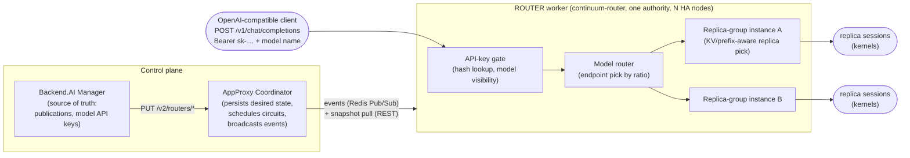

<!-- context-for-ai
type: master-bep
scope: Add a ROUTER frontend mode to AppProxy so continuum-router serves every published model behind one OpenAI-compatible address, driven by Manager-defined model publications and model API keys.
detail-docs: [architecture.md, coordinator.md, manager.md, migration.md]
key-constraints: [Manager never talks to routers directly (the coordinator is the control plane), no plaintext credential at rest or on the event bus, stock WILDCARD/PORT workers and deployment access tokens unchanged, coordinator-worker protocol stays events + pull (no coordinator-to-worker dialing)]
key-decisions: [hierarchical routing realized inside the ROUTER worker with per-replica-group router instances (2026-07-15), replica-group id/weight propagated through the existing circuit wire (2026-07-15), fail-fast on stock/ROUTER inference-worker colocation (2026-07-15), model API keys with hash-only custody (2026-06-21), publications scoped per authority (2026-06-21)]
phases: 6
-->

# ROUTER Frontend Mode: LLM Inference Gateway Integration

## Related Issues

- JIRA: TBD
- GitHub: [lablup/backend.ai#12331](https://github.com/lablup/backend.ai/pull/12331) (this refinement),
  [lablup/continuum-router#748](https://github.com/lablup/continuum-router/pull/748) (paired worker-side design:
  `docs/en/architecture/appproxy-worker.md`),
  [lablup/continuum-router#804](https://github.com/lablup/continuum-router/issues/804) (router-side implementation epic; rework tracker)

## Motivation

Backend.AI publishes each model deployment at its *own* frontend slot — a
dedicated wildcard subdomain or port with a per-deployment JWT. That shape is
transparent, but it leaves four gaps for LLM inference at the cluster level:

- **No single surface.** Every deployment has a different base URL; no
  OpenAI-compatible SDK can hold one address and pick a model by name.
- **No model abstraction.** Users address a *deployment*, not a *model*; there
  is no first-class way to back one model name with several deployments (A/B
  tests, cross-resource-group balancing).
- **No key governance.** A deployment access token grants one deployment; no
  API-key surface scopes *which models* a consumer may see across the cluster.
- **No LLM-aware data plane.** The stock worker forwards bytes; protocol
  translation, fallback chains, and prefix/KV-cache-aware routing need an L7
  router that understands inference traffic.

[Continuum Router](https://github.com/lablup/continuum-router) is that data
plane. This proposal integrates it as a new kind of AppProxy worker — a
**ROUTER frontend mode** — and gives the Manager a management surface for what
the router publishes. The design intent, in one sentence each:

- **The router owns one address; the request's `model` name is the addressing
  key.** No slots, no per-deployment URLs; the Manager hands users the triple
  *(base URL, model name, model API key)*.
- **Users configure names and keys deliberately; the system keeps traffic
  correct continuously.** Publications and keys are explicit Manager actions;
  replica scaling, health, and rollout ramps flow through existing machinery
  with no user action.
- **The routing hierarchy mirrors the platform's own hierarchy.** Model →
  deployment endpoints → replica groups → replicas, each level normalized and
  owned by the layer that already owns that concept (see the architecture
  document).
- **Reuse the existing control-plane idioms.** Full-state-per-entity events +
  pull-reconcile snapshots, first-ack proactive deploy, shared
  `X-BackendAI-Token` auth — the same shapes the circuit protocol already uses.

## Architecture at a glance

A request resolves through three mapping layers, each owned by a different
part of the stack; the split between deliberate user configuration and
continuous system maintenance is the design's backbone:

| Mapping layer | Owner | How |
|---|---|---|
| API key → visible models | **User at issuance** (system shrinks) | Explicit allow-list, validated to be a subset of the owner's RBAC-visible published names; never auto-expands |
| Model → endpoints (+ split `ratio`) | **User** | Explicit *publication* management via WebUI / API / CLI |
| Endpoint → replica groups → replicas | **System** | Existing deployment scaling, rollout, and health machinery; propagated over the existing circuit wire |

## Document index

| Document | Description |
|---|---|
| [architecture](./BEP-1053/architecture.md) | Hierarchical routing model, weight normalization, KV-cache tier scoping, per-replica-group instance lifecycle (and the in-memory vs subprocess trade-off), HA |
| [coordinator](./BEP-1053/coordinator.md) | `FrontendMode.ROUTER`, registration + colocation fail-fast, per-node liveness, desired-state tables, `/v2/routers/*` API, snapshot + events, failure model, key custody |
| [manager](./BEP-1053/manager.md) | Publication / model API key entities, Manager-side data model, RBAC visibility + shrink reconciler, rotation/revocation, authority discovery, BEP-1049 interplay |
| [migration](./BEP-1053/migration.md) | Adding a ROUTER surface to an existing AppProxy deployment, compatibility, version gates, rollback |

## Implementation Plan

| Phase | Scope | Detail doc |
|---|---|---|
| 1 | `FrontendMode.ROUTER`, `traffic_port` / `node_id` registration fields, colocation fail-fast validation, slot-free circuits, ROUTER branch in `pick_worker()` / `get_endpoint_url()` | coordinator |
| 1a | Per-node liveness: valkey liveness set, derived `nodes` (mixed-mode-safe), per-node metadata + REST/metrics exposure | coordinator |
| 2 | Desired-state tables (`router_models`, `router_api_keys`), per-authority `revision`, `/v2/routers/*` manager API, `router-config` snapshot with conditional polling | coordinator |
| 3 | The five router-config events, `node_id`-tagged acks, first-ack proactive deploy, opt-in strict revocation | coordinator |
| 4 | Replica-group wire propagation: `replica_groups` on the circuit payload + `replica_group_id` per route, Manager pushing group `traffic_weight` (folds in the BA-6233 follow-up) | architecture, coordinator |
| 5 | Manager surface: publication + model API key entities and tables, RBAC-validated visibility + shrink reconciler, GraphQL/CLI, authority discovery + fleet view, endpoint lifecycle hooks, access-info presentation | manager |
| 6 | End-to-end validation with the reworked continuum-router worker (`appproxy-router` feature), including hierarchy overhead measurement for streaming | — |

Cross-repo dependency: continuum-router's shipped ROUTER worker (epic #804)
implements the *flattened* selection this proposal supersedes; its reconcile
must be reworked to the hierarchical model before Phase 6 (tracked on #804).

## Decision Log

| Date | Decision | Rationale |
|---|---|---|
| 2026-06-21 | Publications are scoped to **one authority**; multi-region is caller-side fan-out | Keeps the entity simple; "one surface for many scaling groups" is met by routing scaling groups to one coordinator |
| 2026-06-21 | Model API keys use **hash-only custody** (plain SHA-256, plaintext shown once) | A leaked hash is not bearer-equivalent; high key entropy makes unsalted SHA-256 safe and keeps hash-keyed lookup |
| 2026-06-21 | Key→model visibility is **explicit at issuance, RBAC-validated, shrink-only** | The router only enforces a materialized list; no privilege escalation, no surprise auto-expansion |
| 2026-06-21 | **Two-tier revocation** accepted; opt-in `strict` all-live-nodes revoke | Explicit revoke is fast; RBAC-driven revoke is bounded by reconcile intervals; instant offboarding uses explicit DELETE |
| 2026-06-21 | **Aliases** are a first-class publication feature, gated per name per key | One deployment exposed under several names without duplicate publications |
| 2026-06-21 | `ratio` is a non-negative **relative weight**; `0` drains an endpoint | No sum-to-1 bookkeeping; drain without unmapping |
| 2026-06-21 | Per-authority single `revision` + conditional snapshot polling; per-node liveness via ephemeral `node_id` | Cheap no-change polls; crash-safe `nodes` accounting without graceful deregistration |
| 2026-06-21 | Per-node best-effort `rate_limit` (cluster ceiling ≈ limit × nodes) | Preserves stateless nodes; global quota deferred until demanded |
| 2026-07-15 | **Hierarchical (chained) routing adopted; the flattened one-level pool is superseded** | The shipped flatten-then-multiply weight composition cannot reproduce configured endpoint splits under uneven replica counts; hierarchy normalizes each level independently |
| 2026-07-15 | Hierarchy is realized **inside the ROUTER worker** as per-replica-group router instances — not by forwarding to stock backing circuits | Forwarding to stock circuits would forfeit continuum-router's replica-level KV machinery (prefix-aware routing, KV index, disaggregated serving); internal realization keeps it and minimizes rework of the shipped worker |
| 2026-07-15 | **Replica-group id + `traffic_weight` propagate over the existing circuit wire** (`replica_groups` on the circuit, `replica_group_id` per route) | The router needs group membership to build instances; this folds the BA-6233 "weight never reaches AppProxy" follow-up into this proposal |
| 2026-07-15 | **Fail-fast**: coordinator rejects registrations that would colocate stock and ROUTER inference workers on one coordinator | `pick_worker()` has no key to separate them; explicit error beats silent misrouting (review request on #12331) |
| 2026-07-15 | Coordinator schema treated as **freely evolvable**; JSONB mirror columns stay | BEP-1005 (coordinator/Manager consolidation) has no work plan; coordinator storage mirrors wire payloads 1:1 and can be normalized later without wire impact |
| 2026-07-15 | Manager-side data model specified (normalized names/mappings tables, CASCADE backstops + service-layer hooks) | The Manager is the validator: per-authority name uniqueness and reverse lookups become DB constraints and indexed queries |
| 2026-07-15 | Mixed `node_id` adoption handled deterministically: `nodes` = liveness-set count **+** legacy counter | "First registration decides the mode" breaks during rolling upgrades of stock workers adopting `node_id` |

## Open Questions

- **Per-replica-group instance substrate: in-memory scopes vs a subprocess
  pool.** The lifecycle is self-managed by continuum-router either way; the
  open question is whether each replica-group instance runs as an in-process
  scoped selection context or as a supervised child process. Trade-off
  discussion and the current recommendation (in-memory first, behind a
  substrate-agnostic seam) live in
  [architecture.md](./BEP-1053/architecture.md#instance-substrate-in-memory-vs-subprocess).
- **Conditional snapshot polling: `?known_revision=` query param vs
  `ETag`/`If-None-Match`.** Functionally equivalent for the single purpose-built
  client; see the trade-off note in
  [coordinator.md](./BEP-1053/coordinator.md#snapshot-endpoint). The shipped
  router client uses the query param; switching is a small, acceptable change.

## References

- [continuum-router PR #748](https://github.com/lablup/continuum-router/pull/748)
  (`docs/en/architecture/appproxy-worker.md`) — the paired worker-side design;
  to be re-synced to the hierarchical model decided here.
- [continuum-router#804](https://github.com/lablup/continuum-router/issues/804)
  — router-side implementation epic (shipped with the superseded flattened
  selection) and rework tracker.
- [BEP-1005: Unified AppProxy](BEP-1005-unified-appproxy.md) — longer-term
  consolidation direction; no work plan, recorded as an evolvability
  assumption in the Decision Log.
- [BEP-1006: Service Deployment Strategy](BEP-1006-service-deployment-strategy.md),
  [BEP-1049: Deployment Strategy Handler](BEP-1049-deployment-strategy-handler.md)
  — deployment / replica-group lifecycle this proposal builds on (replica
  groups introduced in PR #11871, BA-6233).
- [BEP-1008](BEP-1008-RBAC.md), [BEP-1012](BEP-1012-RBAC.md),
  [BEP-1048](BEP-1048-RBAC-entity-relationship-model.md) — the RBAC model from
  which key→model visibility derives.
- `src/ai/backend/appproxy/coordinator/types.py` (`CircuitManager`) — the
  existing propagation mechanisms whose idioms this proposal reuses.
