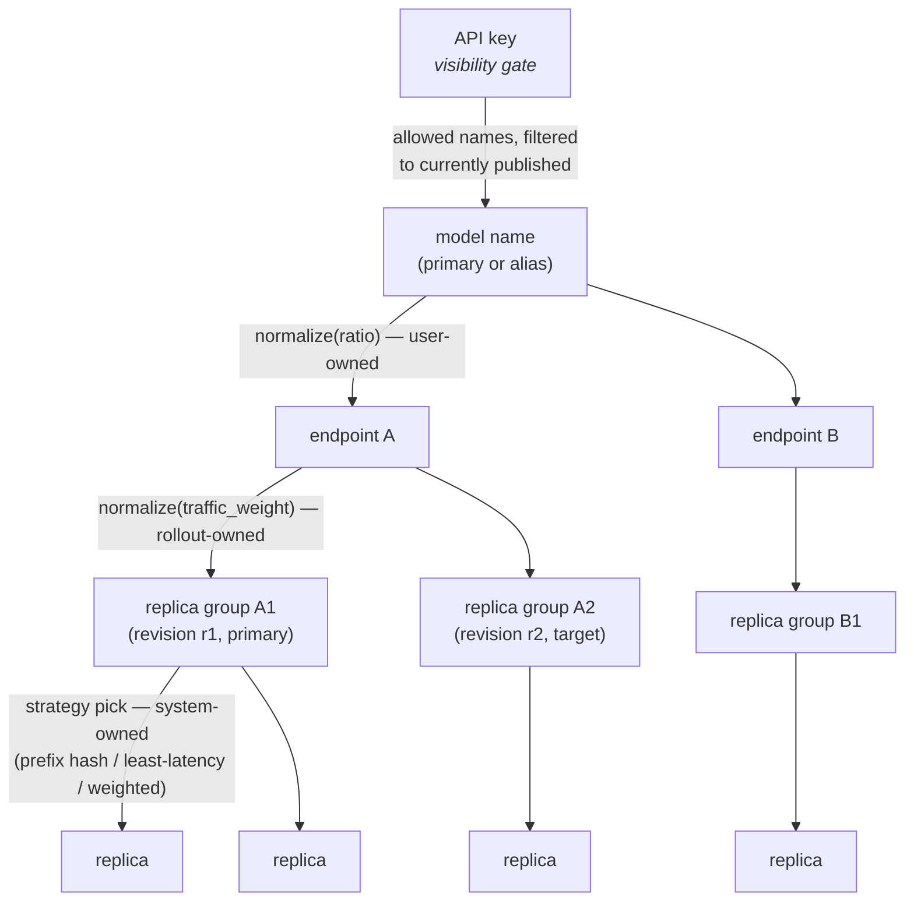
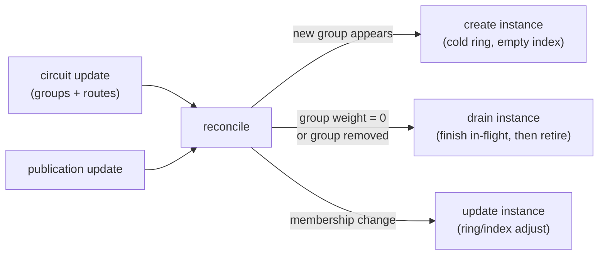

<!-- context-for-ai
type: detail-doc
parent: BEP-1053 (ROUTER Frontend Mode)
scope: The hierarchical routing model inside the ROUTER worker — levels, weight normalization, KV-cache tier scoping, per-replica-group instance lifecycle and substrate, HA behaviour.
depends-on: [coordinator.md]
key-decisions:
  - Hierarchical routing adopted; flattened pool superseded (2026-07-15)
  - Hierarchy realized inside the ROUTER worker with per-replica-group instances (2026-07-15)
  - Replica-group id/weight propagated over the existing circuit wire (2026-07-15)
-->

# BEP-1053: Routing Architecture

## Summary

The ROUTER worker (continuum-router with the `appproxy-router` feature) serves
every published model on one address and resolves each request through a
**three-level hierarchy that mirrors the platform's own structure** — model →
deployment endpoints → replica groups → replicas — normalizing traffic weights
independently at each level and scoping KV-cache machinery to the level where
it is meaningful.

## Terminology

| Term | Meaning |
|---|---|
| **Publication** | The Manager-defined entity that makes deployments reachable by model name: a primary name (+ optional **aliases** routing identically) bound to one or more endpoints, each with a split `ratio`, on one **authority**. Not a deployment, not a circuit — the name-to-endpoints binding on top of them. |
| **Model API key** | The new consumer credential (`sk-…`), carrying an explicit allowed-model set; hash-only custody (see coordinator.md). Distinct from the existing per-deployment **deployment access token**, which is unchanged. |
| **Authority / node** | An authority is the logical router identity (HA replicas share it); a node is one router process, identified by an ephemeral `node_id`. |
| **Replica group** | Existing Backend.AI concept (`ReplicaGroupRow`, PR #11871): a versioned sub-fleet within one endpoint owning a revision pointer and a `traffic_weight`. An endpoint has a primary group and, mid-rollout, a target group. Every route belongs to exactly one group. |
| **Replica-group instance** | *(new, router-internal)* One selection scope per replica group inside the ROUTER worker: its own replica set, health view, prefix-hash ring, and KV index. See "Per-replica-group instances" below. |

## The hierarchy



Each level is owned by the layer that already owns the concept:

| Level | Selection input | Owner / writer |
|---|---|---|
| model → endpoint | publication `ratio` (relative weight, `0` = drain) | User (or a future BEP-1049 cross-endpoint strategy; see manager.md) |
| endpoint → replica group | `ReplicaGroupRow.traffic_weight` | BEP-1049 deployment-strategy handler (rollout ramps) |
| replica group → replica | selection strategy over healthy replicas, weighted by `traffic_ratio` | System (health checks, KV/latency-aware strategies) |

### Weight normalization: the invariant

**Normalize within a level before composing with the level above.** A 7:3
`ratio` must yield a 7:3 endpoint split regardless of how many (or how
unevenly weighted) replicas back each side:

```text
weight(replica) = normalize_over_endpoints(ratio)
                × normalize_over_groups_in_endpoint(traffic_weight)
                × normalize_over_replicas_in_group(traffic_ratio)
```

The hierarchy makes this structural rather than a formula to get right: each
level's table is normalized over its own children only. This supersedes the
**flattened** realization initially shipped router-side (every replica of
every mapped endpoint in a single weighted pool, `composed_weight =
ratio × traffic_ratio` normalized once globally — continuum-router PR #817),
which does not reproduce configured splits under uneven replica counts
(flagged in review on the paired design, PR #748). The rework is tracked on
continuum-router#804.

Graceful degradation is preserved from the flattened design: a group with no
healthy replicas forfeits its weight share to sibling groups; an endpoint with
no serving groups forfeits its `ratio` share to sibling endpoints; a model
with no serving endpoint resolves to its `fallback_chains` if configured,
otherwise model-unavailable. A/B arms degrade with no control-plane round trip.

### What the hierarchy needs from the wire

The router builds replica-group instances from group membership, so the
existing circuit payload is extended (optional fields; stock workers ignore
them — see coordinator.md for the exact shapes):

- the circuit carries `replica_groups: [{id, traffic_weight, lifecycle}]`;
- each `RouteInfo` entry carries its `replica_group_id`.

The Manager populates these from `ReplicaGroupRow` when pushing routes. This
**folds the BA-6233 follow-up into this proposal**: `traffic_weight`, until
now DB-only bookkeeping ramped by the promoting handler, reaches the data
plane through the existing circuit sync path — a rollout ramp is an ordinary
route-update event, never a publication mutation and never an authority
`revision` bump. Routes missing `replica_group_id` (older Manager) fall into
an implicit default group with weight 100, which reproduces today's
group-blind behaviour.

## KV-cache machinery and where each tier lives

Continuum Router already ships a four-tier KV optimization system plus
disaggregated prefill/decode serving (`docs/en/architecture/kv-cache.md`,
`disaggregated-serving.md`). All replica-affine tiers operate on individual
backends — which is precisely why the hierarchy must be realized *inside* the
router rather than by forwarding to per-endpoint stock circuits (Decision Log
2026-07-15): a stock worker in the middle would hide replicas and forfeit
these tiers entirely.

| Tier | Mechanism | Scope in ROUTER mode |
|---|---|---|
| 1. Prefix-aware sticky routing | CHWBL consistent-hash ring: prefix key → backend | **Per replica-group instance.** A group is one revision — a homogeneous replica set — the correct affinity domain; the ring never spans revisions or endpoints. |
| 2. Response cache | Deterministic request → cached response, before any backend | **Root (model level).** Keyed by model name + request; independent of which endpoint/group would serve. |
| 3. Shared external cache | Redis/Valkey substrate for tier 2 across router nodes | Root, shared across the authority's nodes (unchanged). |
| 4. Backend KV cache index | Tracks which backends hold GPU-resident KV for recent prefixes | **Per replica-group instance**, bounding index size per group. |
| Disaggregated prefill/decode | KV tensors transferred between workers via external storage | Per replica-group instance (prefill/decode roles exist among one revision's replicas); wiring replica metadata for role assignment is future work, but the scoping decision is made here so it has a home. |

Notes:

- Prefix affinity across an in-flight rollout: requests keep their affinity
  within the old group while the new group warms; the cutover cold-start is
  inherent to any rollout and not made worse by the hierarchy.
- Under HA, each node computes the same deterministic hash over the same
  group membership, so prefix affinity is consistent across nodes with no
  cross-node coordination (unchanged property).

## Per-replica-group instances

The router materializes one **replica-group instance** per group of every
mapped endpoint: the unit that owns the group's replica set, health/circuit-
breaker state, prefix-hash ring, and KV index. Continuum Router manages
instance lifecycle itself, driven entirely by control-plane state — no
operator action:



A BEP-1049 blue-green rollout, seen from the router: the target group's
instance is created cold, receives a growing `traffic_weight` share as the
handler ramps it, and the primary group's instance drains and retires on
finalization — all via ordinary circuit route-update events.

### Instance substrate: in-memory vs subprocess

**Open question** (main doc, Open Questions). Both variants keep the
lifecycle self-managed and the external contract identical; they differ in
the execution substrate:

| | **In-memory scopes** (recommended) | **Subprocess pool** |
|---|---|---|
| Isolation | Per-task panic isolation; per-scope caps bound KV-index/ring memory; a defect in safe Rust rarely crosses scopes | OS-level: a crash/leak in one group's child cannot touch siblings |
| Data path | Zero extra hops; one HTTP parse per request | One loopback hop per request; SSE streams re-parsed/copied at the boundary — measurable at high token throughput |
| Lifecycle cost | Create/drop a struct; rollouts churn groups frequently and stay cheap | Spawn/supervise/drain a process per group per rollout; crash-loop and config-delivery handling needed |
| Operational surface | One process per node: one metrics endpoint, one config, one log stream | N children per node: port allocation, per-child metrics aggregation, fd/memory multiplied under HA |
| Config divergence per group | Per-scope strategy config (achievable in-process) | Free: each child is a full router with its own config |
| Failure blast radius under HA | Whole-node crash is already covered by LB + multi-node HA | Adds intra-node containment on top of inter-node HA |

**Recommendation:** implement instances as in-memory scoped contexts behind a
substrate-agnostic seam (an instance trait covering create / update / drain /
select), and revisit subprocess isolation only if operational evidence (e.g.
pathological per-group memory growth that caps cannot bound) demands it. The
seam keeps the switch local to continuum-router — no wire or coordinator
impact either way. Rationale: the subprocess pool's isolation mostly
duplicates what multi-node HA already provides, while its costs (per-token
streaming overhead, a supervisor, per-child observability) are paid on every
request and every rollout.

## Request path

1. **API-key gate.** Key from `Authorization: Bearer` (or `x-api-key`);
   authenticated by SHA-256 hash lookup (blocking mode — unknown key
   rejected). `/v1/models` lists exactly the intersection of the key's
   allowed names and currently-published names; any other name is `403`.
   Aliases are gated independently of the primary name.
2. **Model → endpoint.** The body's `model` resolves the publication (primary
   name or alias — identical routing); an endpoint is picked by normalized
   `ratio`. Tier-2 response cache may answer before any pick happens.
3. **Endpoint → group → replica.** A group is picked by normalized
   `traffic_weight`; the group instance picks a healthy replica via its
   selection strategy (prefix-hash first when a prefix key exists, else the
   configured default), weighted by `traffic_ratio`.
4. **Fallback (scoped).** Only when every group of every mapped endpoint has
   no healthy replica does `fallback_chains` take over. The key gate runs
   before fallback — it is never an unauthenticated bypass. Unknown model
   names get `404`/`403` and never enter fallback.

Deployment access tokens are **not used** on this path; model API keys are
the only user-facing data-plane credential for published models. Circuits'
`allowed_client_ips` CIDR lists, when present, are still honoured;
`open_to_public` is ignored for ROUTER circuits (keys gate access).

## High availability

Multiple router nodes register under one authority, typically behind an
external L4 LB/VIP whose address is the advertised hostname. HA
synchronization is **inherent in the shared-authority model**, not a separate
subsystem: all nodes share one coordinator-side Worker row, Pub/Sub events
fan out to every node, and the authority-scoped snapshot pull reconciles any
late-joining or restarted node to identical desired state. Per-node identity
and liveness (ephemeral `node_id`, TTL-evicted liveness set) are specified in
coordinator.md; routing traffic away from a dead node remains the LB/VIP's
job. Deterministic strategies (prefix hash) pick identically on every node;
locally-observed strategies (least-latency) and per-key `rate_limit` operate
per node (cluster ceiling ≈ limit × live nodes — accepted, Decision Log).

## Implementation Notes

- Requires the wire extensions and validation rules in coordinator.md and the
  Manager-side entities in manager.md.
- continuum-router rework (tracked on #804): replace the flattened reconcile
  (`composed_weight`) with the hierarchy — group instances behind the
  substrate seam, per-level normalization, group-scoped tiers 1/4 — and
  re-sync `docs/en/architecture/appproxy-worker.md` (PR #748) to this design.
  The shipped coordinator client, event codec, key gate, and lifecycle
  skeleton carry over unchanged.
- Hierarchy overhead (especially for streaming responses, and doubly so if
  the subprocess substrate is ever chosen) is an explicit Phase 6
  measurement item.
