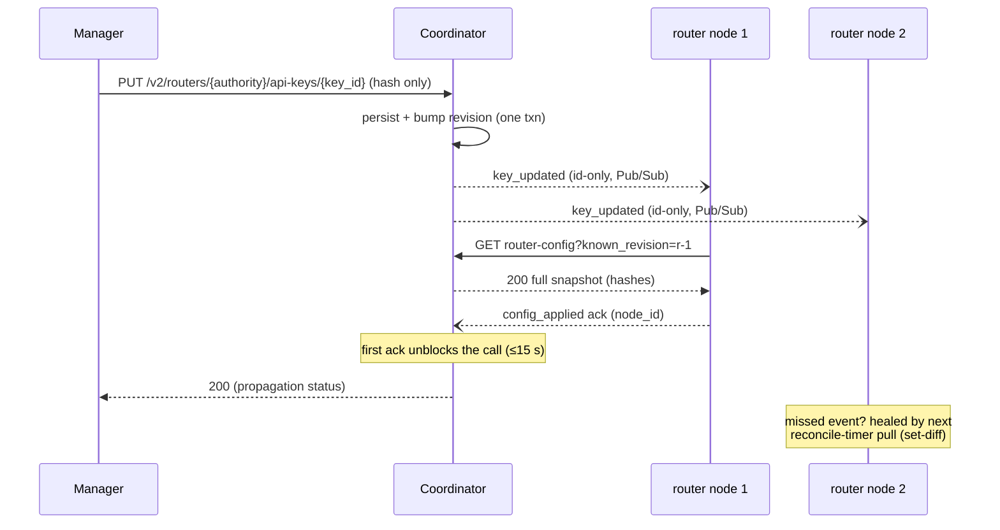

<!-- context-for-ai
type: detail-doc
parent: BEP-1053 (ROUTER Frontend Mode)
scope: All AppProxy coordinator changes — the ROUTER frontend mode, registration validation (colocation fail-fast), per-node liveness, desired-state persistence, manager- and worker-scope APIs, events, failure model, and key custody on the wire.
depends-on: [architecture.md]
key-decisions:
  - Fail-fast on stock/ROUTER inference-worker colocation (2026-07-15)
  - Mixed node_id adoption handled by liveness-set + legacy-counter sum (2026-07-15)
  - Coordinator schema freely evolvable; JSONB mirrors stay (2026-07-15)
  - Hash-only key custody; no secret on the event bus (2026-06-21)
-->

# BEP-1053: Coordinator Design

## Summary

The coordinator remains the control plane: it admits ROUTER workers as a new
frontend mode, persists the desired publication/key state per authority,
exposes a manager-scope API to mutate it and a worker-scope snapshot to
replay it, and broadcasts changes as events — reusing the circuit protocol's
idioms (full-state-per-entity payloads, first-ack proactive deploy,
pull-reconcile backstop, no coordinator→worker dialing).

## Current design (what exists today)

- `FrontendMode` (`src/ai/backend/appproxy/common/types.py`) has `wildcard`
  and `port`. A worker advertises a slot space at registration; the
  coordinator allocates one slot per circuit and builds per-deployment URLs
  from it.
- Deployment access tokens: per-endpoint JWTs minted via the coordinator
  (HS256, cluster `jwt_secret`), stored in `EndpointTokenRow` — unchanged by
  this proposal, still the credential for WILDCARD/PORT frontends.
- Propagation has two modes (`coordinator/types.py:CircuitManager`): legacy
  Redis Pub/Sub events carrying full per-entity state (circuit create blocks
  up to 15 s for the first worker ack, `E10001` on timeout) with a one-time
  startup pull, and the Traefik/etcd path whose leader-elected reconcile
  task re-publishes desired state every 30 s as a safety net. The protocol
  never dials workers; idempotency comes from full-state payloads; lossy
  events are healed by periodic set-diff reconciliation. ROUTER mode reuses
  exactly these idioms.

## `FrontendMode.ROUTER` and registration

```python
class FrontendMode(enum.StrEnum):
    WILDCARD_DOMAIN = "wildcard"
    PORT = "port"
    ROUTER = "router"  # new
```

`WorkerRequestModel` gains two optional fields:

| Field | Meaning |
|---|---|
| `traffic_port: int \| None` | ROUTER mode: advertised data-plane port (an LB may front the worker); defaults to `api_port` |
| `node_id: str \| None` | Ephemeral per-process UUID for per-node liveness; repeated on every heartbeat; mode-independent (stock workers adopt it in follow-up work) |

Registration validation per mode:

- ROUTER requires both `port_range` and `wildcard_domain` to be null and
  accepts `traffic_port`; existing modes are unchanged.
- **Colocation fail-fast (Decision Log 2026-07-15).** A registration is
  rejected with an explicit error if it would make one coordinator host
  both a ROUTER worker and a stock (WILDCARD/PORT) worker whose
  `accepted_traffics` include `inference` — in either order. Rationale:
  `pick_worker()` distinguishes workers only by `protocol` and
  `accepted_traffics` (the legacy `WorkerAppFilter` keys off
  domain/project/user/runtime_variant and is unused in practice), so mixed
  registration would misroute inference circuits nondeterministically.
  Interactive stock workers colocate freely — `accepted_traffics` separates
  `inference` from `interactive` cleanly. The migration path for existing
  deployments is documented in migration.md.
- A ROUTER worker cannot register against a coordinator predating this
  proposal: the unknown `frontend_mode` fails validation — the intended
  version gate.

## Slot-free circuits

- `Worker._calculate_available_slots()` returns unbounded (`-1`) for ROUTER
  workers; `occupied_slots` accounting is skipped. `pick_worker()` treats
  ROUTER as unbounded capacity (as it already treats wildcard), so the
  ROUTER worker is a valid candidate for inference circuits — without this,
  the slot filter would exclude it.
- `add_circuit()` skips slot allocation: ROUTER circuits have `port = None`
  **and** `subdomain = None`. `SerializableCircuit` consumers must tolerate
  this shape; existing workers filter events by `target_worker_authority`
  and never see ROUTER circuits.
- `Circuit.get_endpoint_url()` gains a ROUTER branch returning the worker's
  single advertised base URL (`hostname` + `traffic_port`, scheme from
  `tls_advertised`) — the same URL for every circuit on that worker.

Endpoint placement needs no new mechanism: a scaling group selects its
coordinator via `ScalingGroupProxyTarget`; pointing several scaling groups at
the coordinator hosting the ROUTER authority is what puts one model surface
over many scaling groups. Consequently a publication can only reference
endpoints whose circuits live on that authority's coordinator (validated by
the Manager at publish time; the coordinator double-checks best-effort).

## Circuit wire extension: replica groups

To let the router build per-replica-group instances (architecture.md), the
circuit payloads gain **optional** fields, populated by the Manager from
`ReplicaGroupRow` state and flowing through the existing create/route-update
events and snapshot pull:

| Payload | Addition |
|---|---|
| `SerializableCircuit` | `replica_groups: [{id, traffic_weight, lifecycle}]` |
| `RouteInfo` / `RouteEntry` (manager→coordinator) | `replica_group_id: UUID \| None` per route |

Routes without `replica_group_id` fall into an implicit default group
(weight 100) — reproducing today's group-blind behaviour, which keeps old
Managers and stock workers compatible. A BEP-1049 rollout ramp is therefore
an ordinary route-update event: no publication mutation, no authority
`revision` bump, no snapshot re-pull.

## Per-node liveness

The shared-authority Worker row makes the coordinator blind to individual
nodes: a crashed node never decrements the `nodes` counter (only graceful
`DELETE` does). ROUTER mode makes multi-node authorities the common case, so
liveness becomes node-granular. This is a **general coordinator capability**
(stock workers can be HA too); ROUTER workers send `node_id` from day one.

- **Identity.** Each worker process generates an ephemeral `node_id` at
  startup and repeats it on registration and every heartbeat; a restart
  yields a new `node_id` and the old one expires.
- **Liveness set.** Per authority, `valkey_live` holds member = `node_id`,
  value = `last_seen`, TTL'd to the heartbeat timeout. Heartbeats upsert;
  expiry means the node is gone. Per-node metadata (direct address behind
  the VIP, version, `registered_at`, `last_seen`) is captured for exposure.
- **`nodes` is derived; mixed adoption is deterministic (Decision Log
  2026-07-15).** `nodes = count(live set entries) + legacy_counter`, where
  the legacy counter is touched only by registrations/deregistrations that
  carry no `node_id`. `status` flips to `LOST` when the sum reaches zero. A
  crash converges via TTL without graceful deregistration; a rolling upgrade
  that mixes old (counter) and new (liveness-set) nodes under one authority
  stays correct throughout — no "first registration decides the mode" rule.
- **Exposure.** A `nodes: [...]` array on the worker-detail REST response
  (`GET /api/worker/{id}`) and Prometheus metrics (live nodes per authority,
  heartbeat age per node). Per-node `status` is derived (alive iff
  `last_seen` within timeout), never stored. The Manager's fleet view
  consumes this via `list_workers()` (manager.md).

Responsibility split: the coordinator **observes** per-node health; the
LB/VIP routes traffic away from dead nodes.

## Desired-state persistence

Two new tables, scoped per authority, with a per-authority monotonic
`revision` bumped in the same transaction as any mutation:

```text
router_models:
    id UUID PK
    worker_authority str (indexed)
    model_name str        # primary name; the publication's API/identity key
    aliases JSONB         # additional names routing identically
    mappings JSONB        # [{"endpoint_id": UUID, "ratio": float}]
    control_mode str      # "manual" | "strategy-managed" (manager.md)
    created_at / updated_at
    UNIQUE (worker_authority, model_name)

router_api_keys:
    id UUID PK
    worker_authority str (indexed)
    key_id str            # manager-side identifier
    token_hash str        # SHA-256 of the key material — never plaintext
    display_hint str      # masked tail for listings, e.g. "sk-…wxyz"
    allowed_models JSONB  # explicit per-name grants (primary or alias)
    expires_at datetime | None
    rate_limit int | None # per-node best-effort; unit: requests/min
    created_at / updated_at
    UNIQUE (worker_authority, key_id)
```

- Names are unique per authority across primaries **and** aliases. The
  Manager (source of truth) validates at publish time; the coordinator
  checks best-effort.
- `ratio` is a non-negative relative weight (no sum-to-1 requirement);
  `ratio = 0` drains an endpoint.
- Persistence is required, not optional: router runtime state is in-memory
  by design, so the coordinator must replay the full set whenever a node
  (re-)registers. Only `token_hash` is ever stored.
- **Storage shape (Decision Log 2026-07-15).** `mappings`, `aliases`, and
  `allowed_models` stay JSONB rather than child tables: every propagation
  payload is full-state-per-entity, so the stored shape mirrors the wire
  shape 1:1, and per-authority entity counts are deliberately small
  (publications and keys are created by hand). This is coordinator-internal
  storage — normalizing later is a local migration with no wire or Manager
  impact. (Relational integrity and reverse lookups live Manager-side,
  where the source of truth is normalized — manager.md.)

## Manager-scope REST API (new)

Authenticated with the shared `X-BackendAI-Token`, like `/v2/endpoints`:

| Method & path | Purpose |
|---|---|
| `GET /v2/routers/{authority}/models` | list publications |
| `PUT /v2/routers/{authority}/models/{model}` | upsert: `{aliases, mappings: [{endpoint_id, ratio}], control_mode}` |
| `DELETE /v2/routers/{authority}/models/{model}` | unpublish (removes all aliases too) |
| `GET /v2/routers/{authority}/api-keys` | list keys (masked via `display_hint`) |
| `PUT /v2/routers/{authority}/api-keys/{key_id}` | upsert: `{token_hash, allowed_models, expires_at, rate_limit}` |
| `DELETE /v2/routers/{authority}/api-keys/{key_id}?strict={bool}` | revoke (`strict` waits for all-live-nodes ack) |

- The Manager sends only the SHA-256 `token_hash` on key upserts; plaintext
  never reaches the coordinator.
- **Proactive-deploy semantics.** Each mutation (1) persists to PostgreSQL
  and bumps the authority `revision`, (2) broadcasts the corresponding
  event, (3) waits up to 15 s for the **first** worker ack (the
  `initialize_legacy_circuit` pattern) and returns. It never waits for every
  node, and replica-session health never gates it. On ack timeout the call
  still succeeds — persisted state is authoritative and pull reconciliation
  guarantees convergence — with propagation flagged as deferred in the
  response.
- **Strict revocation (opt-in).** `?strict=true` on key delete waits for an
  ack from **every currently-live node** (the liveness set), bounded by a
  timeout; on timeout it returns the unconfirmed node set so the operator
  can act (e.g. drain at the LB) instead of assuming convergence. This
  tightens the control-plane window to all-nodes-applied; in-flight requests
  and LB timing remain outside it.

## Snapshot endpoint

```text
GET /api/worker/{worker_id}/router-config?known_revision={r}
→ 304 Not Modified                                  (if r == current revision)
→ 200 {revision, models: [...], api_keys: [...]}    (full snapshot otherwise)
```

The router pulls this at registration (full in-memory restore) and on its
reconcile timer, reconciling by set-diff — the Traefik-reconcile idiom moved
worker-side. A single per-authority `revision` covers both tables; any
change returns the combined snapshot and the worker diffs the whole thing.
The snapshot carries only `token_hash` values; a key change bumps the
revision, which is what makes workers pull the new hash.

**Open question — conditional-polling mechanism.** The explicit
`?known_revision=` param is specified because the coordinator's REST layer
has no conditional-GET middleware. The `ETag`/`If-None-Match` header form is
functionally equivalent here and standards-aligned; its real trade-off is
that a *generic* middleware can only short-circuit after the handler has
built the body (saving bytes, not the DB read) — skipping the read requires
a per-route version resolver, which is the `known_revision` check under
another name. If adopted, it should be a small handler-level helper
(revision as a strong ETag, early 304 before the state query), not a blanket
middleware. The shipped router client uses the query param; switching is a
one-line header change and is acceptable.

## Events

Five new events on the existing `events_all-appproxy` bus, following the
existing envelope: each inbound event carries the **full new state of exactly
one entity** (or its deletion) — idempotent, last-writer-wins, no version
chain.

| Event | Direction | args |
|---|---|---|
| `appproxy_router_model_updated_event` | → worker | `(authority, model_json)` — full publication state |
| `appproxy_router_model_removed_event` | → worker | `(authority, model_name)` |
| `appproxy_router_key_updated_event` | → worker | `(authority, key_id)` — **notification only, no token, no hash** |
| `appproxy_router_key_removed_event` | → worker | `(authority, key_id)` — applied immediately |
| `appproxy_worker_router_config_applied_event` | ← worker (ack) | `(authority, node_id, kind, id)` — `node_id` attributes the ack so strict revocation can count per-node acks |

**No secret rides the event bus.** Publication events carry full payloads (a
mapping contains no secrets); key events are id-only notifications and the
worker fetches hashes via the authenticated snapshot. Circuit events already
transit this shared bus carrying kernel addresses but never credentials;
this design preserves that property. The coordinator emits these events for
ROUTER workers in **both** coordinator modes — the Traefik/etcd path applies
to stock circuits only and never signals a ROUTER worker.



## Failure model

| Failure | Outcome |
|---|---|
| Redis down | Events lost; manager call succeeds with ack timeout flagged; workers converge via periodic snapshot pull (`reconcile_interval`) |
| Router node down during a change | Full replay via snapshot pull on re-registration |
| Coordinator cannot dial a worker (NAT/k8s) | Non-issue — the protocol never dials workers |
| Both signals lost | Periodic set-diff pull heals within `reconcile_interval` |
| Coordinator restart mid-fan-out | Desired state is in PostgreSQL; pull reconciliation converges |

Revocation is **two-tier** (rationale in manager.md): explicit key revoke
propagates within ~the worker `reconcile_interval` worst-case (default 15 s
router-side), tightened by `?strict=true`; RBAC-driven implicit revoke adds
the Manager's reconcile interval on top. Operators needing instant
offboarding use explicit `DELETE`.

## Security

- All control-plane REST (manager→coordinator, worker→coordinator) keeps the
  shared `X-BackendAI-Token` authentication.
- **Hash-only key custody (plain SHA-256).** Plaintext exists transiently in
  the Manager at generation and is shown to the user once; the Manager DB,
  coordinator DB, snapshot, and router memory hold only the hash (+ masked
  display hint). The router authenticates by hashing the presented bearer. A
  leaked hash is not bearer-equivalent; high key entropy (128+ bits) makes
  unsalted SHA-256 safe (no per-key salt — it would break hash-keyed lookup;
  no slow KDF needed). The two HTTP hops carry only hashes and should run
  over TLS or a trusted network; values are never logged; listings are
  masked.
- Deployment access tokens (`Circuit.generate_jwt` / `EndpointTokenRow`) are
  **not used** for ROUTER circuits; model API keys replace them as the
  data-plane credential. Existing tokens keep working for WILDCARD/PORT
  circuits unchanged.

## Relationship to BEP-1005

BEP-1005 proposes dissolving the coordinator into the Manager. This proposal
deepens the coordinator's role instead (new tables, APIs, events) — the
opposite premise. **Decision (2026-07-15):** BEP-1005 has no work plan, so
the coordinator schema is treated as freely evolvable and this proposal
proceeds; if BEP-1005 is ever picked up, the desired-state tables and APIs
here migrate into the Manager or are re-justified then.
