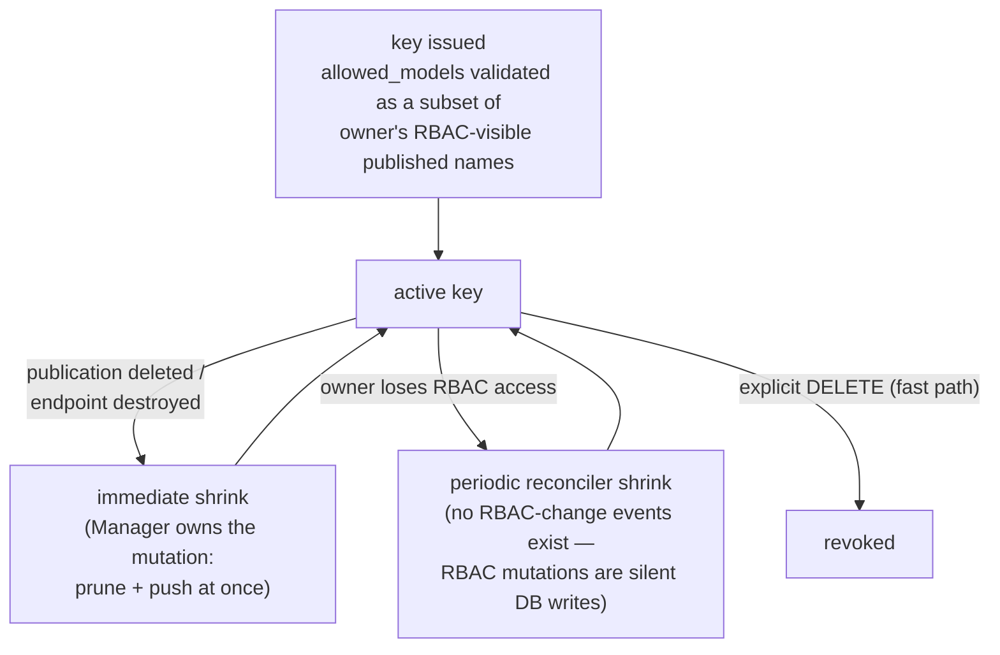

<!-- context-for-ai
type: detail-doc
parent: BEP-1053 (ROUTER Frontend Mode)
scope: Manager-side design — publication and model API key entities, the Manager DB data model, RBAC-validated visibility and the shrink reconciler, rotation/revocation, authority discovery, endpoint lifecycle hooks, BEP-1049 interplay, access-info contract.
depends-on: [architecture.md, coordinator.md]
key-decisions:
  - Manager-side data model normalized; coordinator mirror stays JSONB (2026-07-15)
  - Key visibility explicit at issuance, RBAC-validated, shrink-only (2026-06-21)
  - control_mode reserved for cross-endpoint strategies only (2026-07-15)
-->

# BEP-1053: Manager Design

## Summary

The Manager is the **source of truth and the single user-facing surface** for
two new entities — model publications and model API keys — persisted in its
own DB, validated against RBAC, and mirrored to the coordinator through
`/v2/routers/*`. Users decide *what is published, who gets a key, and which
models that key grants*; the system keeps the serving state correct
continuously and automatically narrows keys when the ground beneath them
disappears.

## Entities and user surface

- **Model publication.** Maps a published model name (+ optional aliases, all
  routing identically) to one or more deployment endpoints with split
  `ratio`s, targeted at one router authority. Exposed via GraphQL
  mutations/queries, CLI, and WebUI following the v2 patterns (REST v2 DTOs,
  adapters, SDK, standard operations).
- **Model API key.** An opaque `sk-…` token minted by the Manager: plaintext
  shown to the user **exactly once**, persisted hash-only with the owning
  user/project, allowed-model set, expiry, and optional rate limit. Issuing,
  listing (masked), rotating, and revoking are Manager operations.
  - **Rotation** replaces the hash atomically under the same `key_id` (no
    dual-valid window; a brief old-still-valid tail bounded by propagation).
    Zero-downtime overlap = issue a second `key_id`, then revoke the first.
- Naming: "model API key" is deliberate — "access key" already means the AK
  half of the platform keypair, and "router key" leaks a data-plane component
  name into user vocabulary. Internal identifiers (`router_api_keys`,
  `/v2/routers/*`, event names) may reference the ROUTER mode; user-facing
  surfaces say *model API key*.

## Manager-side data model

New `models/` domains (per the models-layer conventions: `row.py` per domain,
`StrEnumType` enums, Row types below `repositories/`). The replica-group work
(PR #11871) sets the local style. Unlike the coordinator's JSONB mirrors, the
Manager normalizes names and mappings — it is the validator, so per-authority
name uniqueness and reverse lookups become DB constraints and indexed
queries:

```text
model_publications:
    id UUID PK
    name str                      # primary model name
    authority str (indexed)       # target router authority
    control_mode str              # manual | strategy-managed
    created_user UUID             # audit; visibility derives from endpoints
    created_at / updated_at
    UNIQUE (authority, name)

model_publication_names:          # one row per name (primary + each alias)
    id UUID PK
    publication_id UUID FK → model_publications.id (ondelete=CASCADE)
    authority str                 # denormalized: cross-table UNIQUE is not
    name str                      #   expressible otherwise
    is_primary bool
    UNIQUE (authority, name)      # primaries and aliases share one namespace

model_publication_endpoints:      # the mapping entries
    id UUID PK
    publication_id UUID FK → model_publications.id (ondelete=CASCADE)
    endpoint_id UUID FK → endpoints.id (ondelete=CASCADE)   # backstop only
    ratio float                   # non-negative relative weight; 0 = drain
    UNIQUE (publication_id, endpoint_id)

model_api_keys:
    id UUID PK                    # == the coordinator-side key_id
    token_hash str                # SHA-256; plaintext stored nowhere
    display_hint str              # masked tail, e.g. "sk-…wxyz"
    authority str (indexed)
    session_owner UUID            # owning user (EndpointTokenRow pattern)
    domain str FK → domains.name (ondelete=CASCADE)
    project UUID FK → groups.id (ondelete=CASCADE)
    allowed_models JSONB          # explicit per-name grants
    expires_at datetime | None
    rate_limit int | None
    status str                    # ACTIVE | REVOKED (rows kept for audit)
    revoked_at datetime | None
    created_at / updated_at
```

Design notes:

- **Endpoint FKs are CASCADE backstops.** The user-visible behaviour on
  endpoint destroy (below) is a service-layer lifecycle hook; the FK only
  guarantees no dangling row if some path bypasses it.
- **No replica-group reference anywhere.** Publications bind to endpoints;
  replica groups stay below the endpoint boundary by design — their
  `traffic_weight` reaches the data plane through the circuit wire
  (architecture.md), never through publications.
- **`allowed_models` stays JSONB on the key row.** Reverse lookups ("keys
  granting this name") use a JSONB containment scan — acceptable because
  keys are issued deliberately and counts stay small; normalizing into a
  child table is a local optimization if that assumption breaks.

## Validation and lifecycle rules

- **Publish-time validation (fail-fast).** Every `endpoint_id` must exist
  and resolve to the target authority's coordinator (via the endpoint's
  scaling group → `ScalingGroupProxyTarget`); every name (primary or alias)
  must be unique within the authority. Violations fail with explicit errors.
- **Endpoint destroy.** A service-layer hook removes the endpoint from any
  publication and pushes the update. If that empties a publication, the
  model stays **published-but-empty** (degrades to fallback / unavailable at
  the router) and the Manager **warns** — it never auto-unpublishes; only an
  explicit unpublish removes the name.
- **Authority discovery.** Operators never hand-type authority strings: the
  appproxy client (`manager/clients/appproxy/client.py`) gains
  `list_workers()`, filtered to `frontend_mode == router`, feeding both
  publication targeting and the router-fleet admin view (per-node health
  from the coordinator's liveness data). Publishing one name across several
  authorities (multi-region) is caller-side composition — optionally a UI
  fan-out to N independent per-authority operations — not a multi-target
  entity.
- **Propagation.** The Manager never talks to a router directly; it commits
  locally first, then calls `/v2/routers/*` with full-state upserts. A
  failed push is healed by the periodic reconciler below re-pushing any
  entity whose desired state differs from the coordinator's (idempotent
  upserts make this safe — no outbox table).

## Key visibility: explicit, RBAC-validated, shrink-only

`allowed_models` is an explicit set chosen at issuance, validated by the
Manager to be a **subset of the owner's RBAC-visible published names** (no
privilege escalation). Thereafter it is static except for two automatic
shrink triggers — it **never auto-expands**; widening is an explicit
re-issue:



The router only ever *enforces* the materialized list (its `/v1/models` for a
key returns the intersection of `allowed_models` with currently-published
names; aliases are gated independently) — it never evaluates permissions.
The **shrink reconciler** (modelled on the sokovan reconcilers) periodically
recomputes each active key's `allowed_models` against the intersection of
current RBAC visibility and published names, then pushes shrink diffs; key
counts are small, so a full
recompute on a modest interval is cheap. The same tick re-pushes any
Manager/coordinator drift (see Propagation above).

Revocation is therefore **two-tier**: explicit revoke is fast (coordinator
push + worker pickup, `strict` optional); RBAC-driven implicit revoke is
bounded by the Manager reconcile interval plus the worker's. That slower
window is a convenience bound, not a security hole — instant offboarding
uses the explicit path.

## BEP-1049 interplay: `control_mode`

The hierarchy assigns each rollout axis a home (architecture.md), which
narrows what `control_mode` must govern:

- **Intra-endpoint rollouts** (BEP-1049's ramp of `traffic_weight` across an
  endpoint's replica groups) flow through the circuit wire and reach ROUTER
  traffic automatically. They never touch `/v2/routers/*` and need no
  `control_mode`.
- **Cross-endpoint strategies** (e.g. a canary across two distinct
  `EndpointRow`s) would drive the publication's per-endpoint `ratio`. A
  publication's `control_mode` selects the writer for that axis: `manual`
  (default — the user owns ratios; strategy writes rejected) or
  `strategy-managed` (a future BEP-1049 cross-endpoint strategy owns them;
  manual ratio edits rejected). No such strategy exists yet; the flag is
  **reserved** to preclude a dual-writer conflict, and its mechanics stay
  deferred to BEP-1049.

## Access-info contract

For deployments attached to a ROUTER publication, the user-visible access
information becomes **(gateway base URL, model name, model API key)** instead
of a per-deployment URL + deployment access token. This is an additive
presentation path in WebUI/CLI; per-deployment access for unpublished
endpoints is unchanged.

## Implementation Notes

- Follows the v2 stack patterns end-to-end: `common/dto/manager/v2/`,
  Strawberry GraphQL under `api/gql/`, adapters, client SDK
  (`client/v2/domains_v2/`), CLI (`client/cli/v2/`), standard operations.
- Layering: API handlers → processors → services (Actions/ActionResults) →
  repositories (own transactions) → the tables above; the appproxy client
  calls sit behind the service layer.
- Depends on coordinator.md for the `/v2/routers/*` contract and on
  architecture.md for what must never live here (replica-group state).
