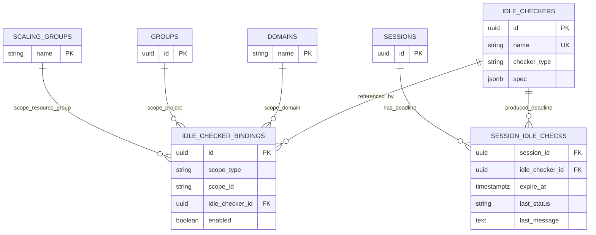
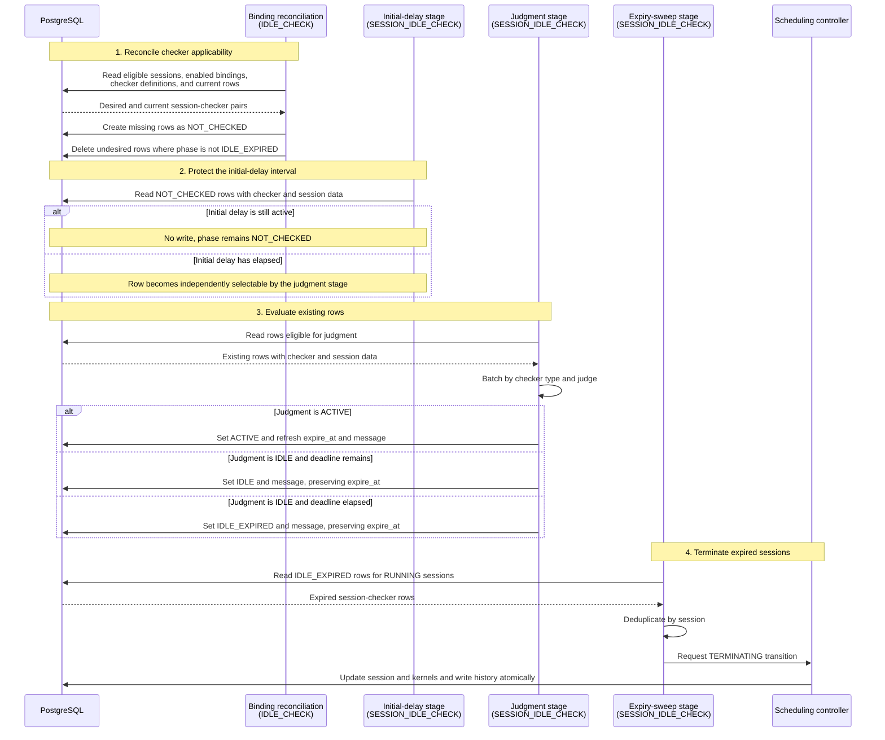

# BEP-1054: Reconciler-Based Idle Checker

## Motivation

Backend.AI Manager's idle checker currently lives in `manager/idle.py`, driven by a dedicated `IdleCheckerHost` and `GlobalTimer`. As scheduling, deployment, and routing move onto the sokovan coordinator/reconciler pattern, idle checking is left behind on a separate timer and event path, with several structural problems:

1. **Detached from the sokovan lifecycle.** Idle checking runs on its own timer and `DoIdleCheckEvent` wiring instead of the generic reconciler flow the rest of the lifecycle is converging on.
2. **The idle checker is not a first-class object.** A checker today is a Python class plus config keys. There is no way to define one checker spec (e.g. "GPU under-utilized for 30 minutes") and reuse it across multiple domains, projects, or resource groups.
3. **Configuration is scattered.** Global config lives in `config.idle`, per-keypair values in the keypair resource policy, and runtime/report state in Valkey. Which setting applies to which session is hard to trace.
4. **Judgment, I/O, and reporting are entangled.** Checkers read Valkey, accumulate cross-tick state, and write reports inline, which makes them hard to test and extend.
5. **Utilization is tied to the legacy live-stat shape.** Utilization idle should be derivable from agent-emitted Prometheus metrics aggregated over a window.

This proposal re-homes idle checking onto a sokovan reconciler stage and promotes the idle checker to a reusable DB object. Each scope applies a checker through a separate association row.

### Goals

- Run idle checking as separate sokovan reconciler stages for binding reconciliation, initial-delay handling, judgment, and expiry sweep on the generic Source → Handler → Applier flow.
- Model the idle checker as a first-class, reusable DB object that is independent of any scope.
- Express scope application (domain / project / resource group) through a dedicated association table.
- Drive utilization decisions from agent-emitted Prometheus metrics.
- Keep checker I/O and judgment behind one batched per-type contract and keep reporting outside the checker; persist each check's projected cleanup time and latest judgment to the database (not Valkey) as the single source for both the sweep decision and client-facing reporting.
- Expose when a session is scheduled to be cleaned up — per checker and as a session-level aggregate — replacing the Valkey remaining-time report.
- Record a generic idle-check timeout message in session scheduling history; expose checker-specific status and messages through the idle-check reporting API.

### Non-Goals

- The concrete judgment rules of each checker (timeout math, threshold comparison, metric names) are implementation concerns and are out of scope.
- Backfilling or falling back to legacy keypair resource-policy idle settings is out of scope. Reconciler-based idle checkers use only their own specs.

## Current Design

Idle checking runs as `IdleCheckerHost.start()` → `GlobalTimer` → `DoIdleCheckEvent` → `do_idle_check()`. Each tick reads live kernel/session rows, excludes inference sessions, loads keypair resource policies per access key, and runs every registered checker against each session; if any checker reports idle, a terminate event is emitted.

Two properties matter for this proposal:

- **Session-first iteration.** The host reads sessions and runs all checkers against each one. It does not start from checker definitions.
- **Checkers are code, not data.** A checker is a class plus config, not a DB-identifiable spec. Configuration is spread across `config.idle`, the keypair resource policy, and Valkey live/stat state.

### Limitations

- A checker spec has no DB identity and cannot be reused across scopes.
- There is no place to express per-binding enable/disable.
- Per-checker config shape is not validated at a single boundary.
- Utilization is coupled to the legacy Valkey live-stat shape.
- Report writes happen inline during a tick, coupling judgment with reporting.

## Proposed Design

### Overview

The redesign rests on two ideas:

1. **Idle checking becomes sokovan reconciler stages.** A `Source` gathers what to evaluate, a `Handler` drives the stage work, and an `Applier` writes stage-owned outcomes where applicable — the same shape as other reconciler stages. Binding reconciliation is separated from the lifecycle of existing session-checker rows, and acting on an expired judgment is separated from producing that judgment (see *Reconciler Stages*). The sweep delegates its cross-domain session transition from the Handler to the scheduling controller and keeps its Applier as a no-op.
2. **The idle checker becomes a first-class DB object.** A checker is a reusable, scope-agnostic spec. Whether and where it applies is expressed by separate association rows that bind it to a domain, project, or resource group.

### Data Model

Three tables. The checker carries no scope of its own; the association table carries the entire scope relationship; and a per-session result table records when each applied checker will next clean the session up.

#### `idle_checkers` — the reusable checker spec

| Column | Type | Description |
|---|---|---|
| `id` | UUID, PK | Identity of the reusable checker |
| `name` | string | Human-readable name |
| `description` | string, nullable | Optional description |
| `checker_type` | string | `session_lifetime` / `network_timeout` / `utilization` |
| `spec` | JSONB | Checker-type-specific configuration payload |
| `created_at` / `modified_at` | timestamptz | |

The checker is intentionally **scope-free** — it carries no `owner_scope_*` columns. A checker is a definition that can be bound to any number of scopes; making it scope-agnostic is exactly what lets one spec be reused everywhere. `checker_type` is a top-level column (for search and validation) and the `spec` payload is interpreted according to it.

#### `idle_checker_bindings` — the scope ↔ checker association

| Column | Type | Description |
|---|---|---|
| `id` | UUID, PK | |
| `scope_type` | string | `domain` / `project` / `resource_group` |
| `scope_id` | string | Domain name / project id / resource group name |
| `idle_checker_id` | UUID, FK → `idle_checkers.id` | The bound checker |
| `enabled` | bool | Whether this binding participates |
| `created_at` / `modified_at` | timestamptz | |

A binding is one `(scope_type, scope_id) → idle_checker` edge. **This association table — not a column on the checker — is the single place that expresses "this checker applies at this scope."** Keeping the relationship separate is what makes the checker a true first-class object: the same checker may be bound to many scopes, a scope may bind many checkers, and each binding carries its own `enabled` flag.

A dedicated association table (rather than reusing the RBAC `association_scopes_entities`) is chosen because idle application needs its own `enabled` flag and future binding-level metadata (e.g. priority), and because idle application semantics should not be conflated with RBAC permission semantics.

#### `session_idle_checks` — per-session projected cleanup time and latest judgment

The binding-reconciliation stage creates one row for each running session and each checker applied to it. Later stages use this table as their work queue and record **when that checker would next clean the session up** and its latest lifecycle phase. The sweep stage acts on this row, clients read it through the idle-check reporting API, and scheduling history records that an idle-check timeout triggered termination without duplicating the checker-specific report.

| Column | Type | Description |
|---|---|---|
| `session_id` | UUID, FK → `sessions.id` (ON DELETE CASCADE) | The evaluated session |
| `idle_checker_id` | UUID, FK → `idle_checkers.id` (ON DELETE CASCADE) | The checker that produced this deadline |
| `expire_at` | timestamptz, nullable | When the session is scheduled to be cleaned up by this checker. `NULL` while the checker is in a grace period or cannot yet determine a deadline |
| `last_status` | string | Current lifecycle phase: `NOT_CHECKED`, `ACTIVE`, `IDLE`, or `IDLE_EXPIRED` |
| `last_message` | text | Human-readable reason returned with the latest judgment |
| `updated_at` | timestamptz | When the latest judgment was persisted |

Primary key `(session_id, idle_checker_id)` — one row per session × applied checker. `expire_at` is the **projected cleanup time, not a termination timestamp**: it is the deadline after which the judgment stage may mark the row `IDLE_EXPIRED` and the sweep stage may perform the actual `TERMINATING` transition. The FK to `idle_checkers` ties each result back to the checker that owns it, so a `SessionIdleCheck` node can name its checker and a deleted checker's rows are removed by cascade.

The phases have the following meanings:

| Phase | Meaning |
|---|---|
| `NOT_CHECKED` | The binding applies, but the checker has not produced an effective judgment yet |
| `ACTIVE` | The latest judgment found activity and refreshed the projected cleanup deadline |
| `IDLE` | The latest judgment found the session idle, but the stored deadline has not elapsed |
| `IDLE_EXPIRED` | The session is idle and the stored deadline has elapsed; ownership has passed to the sweep stage |

#### Scope-ID convention

| `scope_type` | `scope_id` |
|---|---|
| `domain` | domain name |
| `project` | project id |
| `resource_group` | resource group (scaling group) name |

`scope_id` is a polymorphic string key. Scope existence is validated on the write path rather than by a DB-level foreign key.

#### ERD



### Checker Spec Model

The `spec` column is **not free-form JSON** — it holds a typed, polymorphic payload whose shape is fixed by the row's `checker_type`. Two layers express this:

- **`ABCColumn` — a generic, reusable polymorphic JSONB column.** It is not idle-specific: it persists any value that satisfies a load/write contract (JSONB dict ↔ typed object) and rehydrates the typed object on read. Idle checking is its first user, but the column type is meant to back any table that stores polymorphic, validated config.
- **`IdleCheckerABC` — the idle-specific payload the column carries.** On load it dispatches by the `checker_type` discriminator to the concrete spec (`session_lifetime` / `network_timeout` / `utilization`), and it declares the behavior contract every checker implements: how it batch-loads runtime signals and renders judgments for its assignments, each judgment carrying the projected `expire_at`, status, and message for that session.

Conceptually (the contract only — bodies are an implementation concern):

```text
ABCColumnPayload                  # storage contract ABCColumn speaks to
  load(raw)  -> payload           # JSONB dict   -> typed object
  write()    -> raw               # typed object -> JSONB dict

IdleCheckerABC(ABCColumnPayload)  # the value stored in idle_checkers.spec
  load(raw)  -> concrete spec     # dispatch by checker_type discriminator
  judge(assignments) -> judgments  # batched I/O -> expire_at + status + message
```

This buys three things:

- **One validation boundary.** Unknown or malformed specs are rejected at load, so an `idle_checkers` row can never hold a payload its `checker_type` cannot interpret.
- **Config lives with its checker.** Each `checker_type` owns its own spec fields instead of a shared column shape every checker must understand.
- **Extensible without schema change.** A new `checker_type` adds a new `IdleCheckerABC` subtype; the table and column are untouched.

`judge` is the behavioral half of this contract; the orchestration that drives it is described under *Checker-Owned Runtime State* below.

### Reconciler Stages

Idle checking uses four reconciler stages. The first reconciles applicability from bindings; the remaining stages operate from existing `session_idle_checks` rows instead of resolving scopes again.

| Stage | Reconciler category | Source axis | Responsibility |
|---|---|---|---|
| Binding reconciliation | `IDLE_CHECK` | scopes, bindings, checkers, and sessions | Create and remove `session_idle_checks` rows to match current applicability |
| Initial-delay handling | `SESSION_IDLE_CHECK` | existing `session_idle_checks` rows | Keep newly created rows at `NOT_CHECKED` while their initial delay applies |
| Judgment | `SESSION_IDLE_CHECK` | existing `session_idle_checks` rows | Run checkers and transition rows to `ACTIVE`, `IDLE`, or `IDLE_EXPIRED` |
| Expiry sweep | `SESSION_IDLE_CHECK` | existing `IDLE_EXPIRED` rows | Transition affected sessions to `TERMINATING` |

The categories are separate history axes. Applicability reconciliation is recorded under `IDLE_CHECK`; the lifecycle of an existing session-checker row is recorded under `SESSION_IDLE_CHECK`. The initial-delay, judgment, and sweep stages use distinct reconciler phases within the latter category.

**1. Binding-reconciliation stage** — materializes which checkers currently apply to which sessions.

- **Source** — resolves each eligible running session's scopes and enabled bindings, then compares the desired `(session_id, idle_checker_id)` set with existing rows.
- **Handler** — produces rows to create and rows whose bindings no longer apply.
- **Applier** — creates missing rows as `NOT_CHECKED` and deletes rows that are no longer desired, except rows already in `IDLE_EXPIRED`.

The `IDLE_EXPIRED` exclusion is enforced by the delete operation itself, not only by the Source snapshot. This prevents binding reconciliation from deleting a row that concurrently became expired after the Source read. Removing a session or checker itself remains a hard-delete boundary: the existing foreign-key cascades may remove its `session_idle_checks` rows, including expired rows.

If a binding is disabled or removed, its non-expired rows are deleted. Re-enabling the binding later creates a fresh `NOT_CHECKED` row and restarts its initial-delay lifecycle. An `IDLE_EXPIRED` row is not reset by binding changes and remains owned by the sweep stage.

**2. Initial-delay stage** — protects newly applicable sessions from being judged before the checker's initial delay has elapsed.

- **Source** — reads existing `NOT_CHECKED` rows together with only the checker and session data needed to determine whether the initial delay still applies.
- **Handler / Applier** — leave rows in `NOT_CHECKED` during the delay. Rows whose delay has elapsed become eligible for the judgment stage; the stages do not pass in-memory state to one another.

**3. Judgment stage** — runs checker implementations for eligible existing rows.

- **Source** — reads `session_idle_checks` rows eligible for judgment together with their checker definitions and session data. It does not resolve scope bindings; row creation and removal belong exclusively to binding reconciliation.
- **Handler** — pivots the batch by checker type and invokes each checker's batched `judge` contract. Checker-owned external reads occur behind this contract.
- **Applier** — applies the judgment to the existing row only. An `ACTIVE` judgment refreshes `expire_at`, `last_status`, and `last_message`. An `IDLE` judgment preserves `expire_at` while updating `last_status` and `last_message`; if the stored deadline has elapsed, it writes `IDLE_EXPIRED` instead. The stage does not insert missing rows.

**4. Expiry-sweep stage** — terminates sessions represented by expired judgments.

- **Source** — reads `session_idle_checks` rows in `IDLE_EXPIRED`, joined to `RUNNING` sessions. No per-resource-group iteration or checker execution is required. Multiple expired rows for one session remain available through the idle-check reporting API, while the session itself is transitioned at most once.
- **Handler** — deduplicates rows by session, then passes the session IDs to the scheduling controller's common termination operation with the idle-timeout lifecycle reason and a generic idle-check timeout history message. The operation follows the existing scheduler termination lifecycle; sessions already terminating or terminal are skipped.
- **Applier** — no-op. The Handler delegates the state-changing operation to the session scheduling domain instead of applying an idle-check-owned persistence result.

Once a row becomes `IDLE_EXPIRED`, neither binding reconciliation nor judgment changes it. The sweep does not re-evaluate runtime signals or checker applicability. Judgment cadence determines how quickly runtime changes and elapsed deadlines are reflected, while sweep cadence determines how long termination may occur after `IDLE_EXPIRED` is persisted.

### Source Fetch Direction

Scope resolution belongs only to the **binding-reconciliation** stage. It lives on the generic reconciler — one fetch per tick, not per resource group. Even so, its Source reads sessions **per resource group**, following the pattern the scheduler coordinator already uses (`ScheduleCoordinator` iterates scaling groups and reads each with `get_sessions_for_handler(scaling_group, …)`). The initial-delay, judgment, and sweep Sources start from `session_idle_checks` and do not repeat this work.

**Per resource group, the Source:**

1. reads the idle-eligible running sessions with a recorded start time in the group;
2. collects the distinct scopes those sessions belong to — the resource group, their projects, their domains;
3. loads only the enabled `idle_checker_bindings` (with their checker specs) attached to those scopes;
4. composes each session's effective checker set from the bindings on its own scopes.

**Why session-first, per resource group:**

- **Consistent.** Reuses the scheduler coordinator's per-resource-group read shape instead of a new global query. The idle stage does its own read — the generic reconciler has no fetch to literally share — but keeps the same shape.
- **Minimal checker load.** Only checkers bound to scopes that have running sessions are loaded; scopes with none are never consulted.
- **No global scan.** No per-tick scan over all bindings.

**Why not binding-first** — scan every enabled binding, build a combined scope predicate, then fetch sessions across all bound scopes:

- forces a global binding scan on every tick, and
- reads sessions across all bound scopes regardless of where running sessions actually are — departing from the per-resource-group read pattern the scheduler already uses.

### Scope Resolution

Each session maps to exactly three candidate scopes, computed explicitly:

```text
resource_group: the session's resource group
project:        the session's project
domain:         the session's domain
```

RBAC scope-chain traversal is not used: a resource group can be linked to many domains/projects, so following parent relationships could attach checkers unrelated to the session.

A session's **effective checkers** are the union of enabled bindings attached to its resource group, its project, and its domain. The handler evaluates every implemented checker, and each yields its own `expire_at` for the session, persisted as a separate `session_idle_checks` row. The earliest of those deadlines governs when the session is swept, so one session still yields at most one termination.

#### Matching across scopes

Because a session belongs to three scopes at once and each scope may carry several bindings, three matching cases arise. All three reduce to one rule: **take the union, de-duplicate by checker, evaluate every checker, and record each one's `expire_at` as its own row.**

- **Different checkers across scopes.** A `network_timeout` bound at the domain, a `utilization` at the project, and another checker at the resource group all apply; the effective set is their union and every checker contributes its own `expire_at` row.
- **The same checker reachable from multiple scopes.** One `idle_checker_id` may be bound at both the session's domain and its project. It resolves to a **single** effective checker, de-duplicated by checker id and evaluated once for that session.
- **Multiple checkers bound to one scope.** A single scope (e.g. one resource group) may carry many bindings, each its own row with its own `enabled` flag; all enabled checkers participate. Multiple definitions of the same `checker_type` are batched into one implementation call.

A binding with `enabled = false` is dropped from the desired union. Binding reconciliation therefore removes its non-expired `session_idle_checks` rows; an `IDLE_EXPIRED` row is retained for the sweep even after the binding is disabled or removed.

### Checker-Owned Runtime State

The judgment Source does not branch centrally on checker type to read Valkey or Prometheus. The Handler groups assignments by checker type and calls each implementation once per tick. Each checker owns its batched external reads and internal judgment material; the public contract exposes only assignments and judgments. This keeps query shapes inside the checker without exposing preparer state to the orchestration layer.

### Checker Types

| `checker_type` | Terminates when… | Runtime signal |
|---|---|---|
| `session_lifetime` | a started session has run longer than its maximum lifetime; zero disables the definition | none (session start time) |
| `network_timeout` | an interactive session has had no access and no active connections beyond a timeout | last-access / active-connection signals |
| `utilization` | a session's resource utilization stays below thresholds across a window, after a grace period | windowed utilization metrics |

The exact judgment rules for each checker are an implementation concern and are intentionally not specified here. A single scope can bind multiple checkers of the same `checker_type`.

Checker specs are the sole configuration source for reconciler-based idle decisions. The Source and checker implementations do not read `keypair_resource_policies.idle_timeout` or `keypair_resource_policies.max_session_lifetime`, and those legacy values are neither fallback values nor implicit defaults. Whether a checker applies is controlled only by its scope bindings; its threshold or lifetime is controlled only by its spec.

### Utilization via Prometheus

Utilization is evaluated from agent-emitted Prometheus metrics aggregated over a window, not from the legacy Valkey live-stat shape. The concrete metric names and label sets are settled together with the agent metric design. This decouples utilization judgment from the legacy stat-accumulation path and lets it evolve with the metric pipeline.

### Termination Handling

The **sweep** stage's Handler does not kill containers or perform the final `TERMINATED` transition. It asks the scheduling controller to mark sessions with elapsed deadlines as `TERMINATING` through the existing scheduler termination lifecycle, which is idempotent for sessions already terminating or terminal. The sweep Applier is a no-op. The existing session scheduler coordinator then reads `TERMINATING` sessions per resource group and drives agent termination as it does today.

The common termination operation accepts an optional scheduling-history message and defaults to `mark_terminating success`. The sweep supplies a generic idle-check timeout message. For every session actually transitioned, the session status update, kernel status updates, and scheduling-history write happen atomically. Checker-specific `last_status` and `last_message` remain in `session_idle_checks` and are exposed through the idle-check reporting API instead of being duplicated in scheduling history.

The generic reconciler's per-entity retry classification (`decisions()`) is intentionally unused by these stages: neither a set of row mutations nor a list of expired sessions is a set of retryable per-entity outcomes. The stages leave the classification path empty.

### Deadline Persistence & Reporting

Each check's projected cleanup time is stored in `session_idle_checks.expire_at` as an **absolute timestamp**, not a countdown. Remaining time is derived on read as `expire_at - now` (negative once past due). The latest status and message are persisted with it, and `updated_at` records when that judgment was stored. Absolute timestamps need no writes merely to make a countdown tick and do not drift between refresh ticks.

This DB-backed report **replaces the Valkey remaining-time report** previously published per checker under `session.{session_id}.idle_checker.{checker_id}.remaining`. That Valkey path and `IdleCheckerHost.get_idle_check_report` are retired; `session_idle_checks` is the single source for both the sweep decision and client-facing remaining time.

### GraphQL Exposure

`session_idle_checks` is exposed through the Strawberry `SessionV2` API so clients can read a session-level aggregate and drill into each checker's contribution:

- **`SessionIdleCheck` node** — one per `session_idle_checks` row: the bound `idle_checker` (id / name / `checker_type`), `expire_at`, derived `remaining_seconds` (`expire_at - now`, computed at read), `last_status`, `last_message`, and `updated_at`. Reachable from `SessionV2`.
- **`SessionV2.idle_expire_at`** — the `min` of the session's non-null `expire_at` values: the earliest time the session is scheduled to be cleaned up. `NULL` when no applied checker has a deadline yet.

These fields are added to `SessionV2GQL` in `api/gql/session/types.py`. The legacy Graphene module is referenced only to remove the old `Session.idle_checks` JSONString that read the Valkey report; no new API surface is added there.

### Stage Sequence

Each stage runs independently on its own reconciliation tick and uses PostgreSQL as the hand-off boundary. No stage passes an in-memory result directly to the next stage.




## Open Questions

- Should utilization `and` / `or` threshold semantics match the legacy behavior or be redefined?

## References

- `src/ai/backend/manager/idle.py`
- `src/ai/backend/manager/sokovan/reconciler/base.py`
- `src/ai/backend/manager/sokovan/stages/factory.py`
- `src/ai/backend/manager/models/idle_checker/row.py` (new `session_idle_checks` table)
- `src/ai/backend/manager/api/gql/session/types.py` (new `SessionV2` idle-check exposure)
- `src/ai/backend/manager/api/gql_legacy/session.py` (legacy `Session.idle_checks` removal only)
- `docs/superpowers/specs/2026-06-17-first-class-idle-checker-design.md`
- [BEP-1029: Sokovan Observer Handler](BEP-1029-sokovan-observer-handler.md)
- [BEP-1050: Prometheus Query Preset System](BEP-1050-prometheus-query-preset-system.md)
