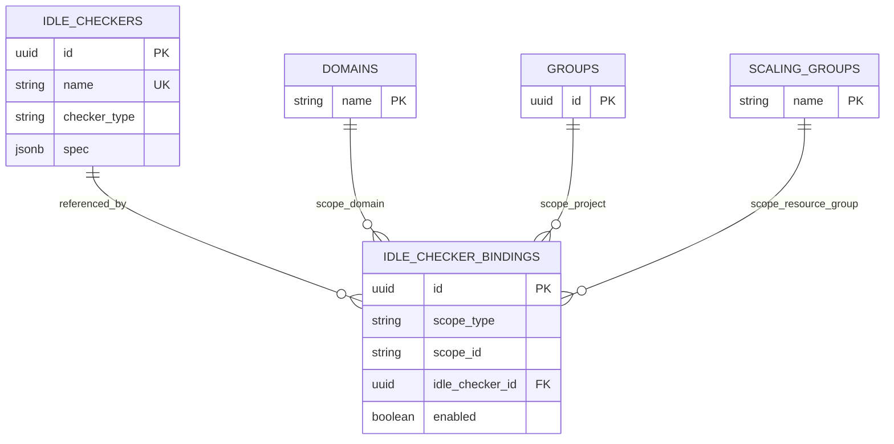
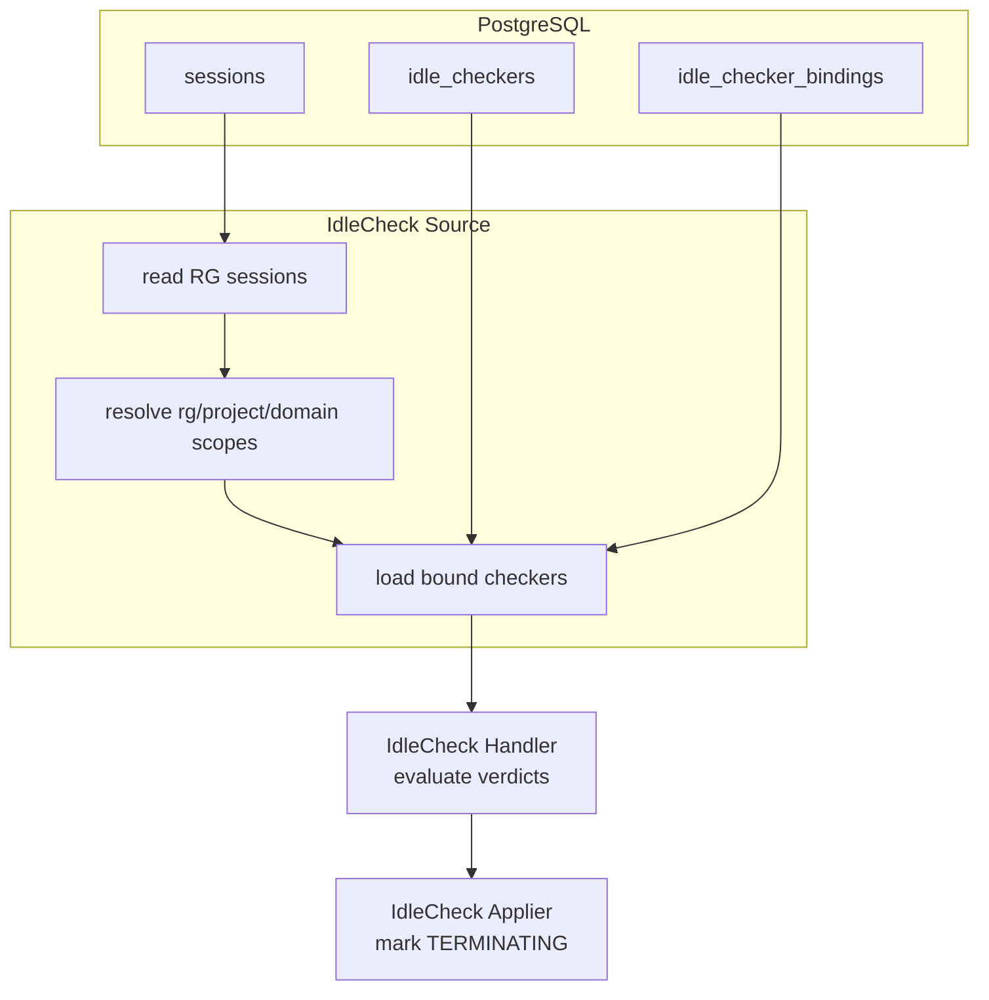

# BEP-1054: Reconciler-Based Idle Checker

## Motivation

Backend.AI Manager's idle checker currently lives in `manager/idle.py`, driven by a dedicated `IdleCheckerHost` and `GlobalTimer`. As scheduling, deployment, and routing move onto the sokovan coordinator/reconciler pattern, idle checking is left behind on a separate timer and event path, with several structural problems:

1. **Detached from the sokovan lifecycle.** Idle checking runs on its own timer and `DoIdleCheckEvent` wiring instead of the generic reconciler flow the rest of the lifecycle is converging on.
2. **The idle checker is not a first-class object.** A checker today is a Python class plus config keys. There is no way to define one checker spec (e.g. "GPU under-utilized for 30 minutes") and reuse it across multiple domains, projects, or resource groups.
3. **Configuration is scattered.** Global config lives in `config.idle`, per-keypair values in the keypair resource policy, and runtime/report state in Valkey. Which setting applies to which session is hard to trace.
4. **Judgment, I/O, and reporting are entangled.** Checkers read Valkey, accumulate cross-tick state, and write reports inline, which makes them hard to test and extend.
5. **Utilization is tied to the legacy live-stat shape.** Utilization idle should be derivable from agent-emitted Prometheus metrics aggregated over a window.

This proposal re-homes idle checking onto a sokovan reconciler stage and promotes the idle checker to a reusable DB object. Each scope applies a checker through a separate association row.

### Goals

- Run idle checking as a sokovan reconciler stage on the generic Source → Handler → Applier flow.
- Model the idle checker as a first-class, reusable DB object that is independent of any scope.
- Express scope application (domain / project / resource group) through a dedicated association table.
- Drive utilization decisions from agent-emitted Prometheus metrics.
- Keep checker I/O and judgment behind one batched per-type contract and keep reporting outside the checker; the stage only hands idle sessions to the existing termination lifecycle.

### Non-Goals

- The concrete judgment rules of each checker (timeout math, threshold comparison, metric names) are implementation concerns and are out of scope.
- Backfilling legacy keypair `idle_timeout` / `max_session_lifetime` into checker specs is left as an open question.

## Current Design

Idle checking runs as `IdleCheckerHost.start()` → `GlobalTimer` → `DoIdleCheckEvent` → `do_idle_check()`. Each tick reads live kernel/session rows, excludes inference sessions, loads keypair resource policies per access key, and runs every registered checker against each session; if any checker reports idle, a terminate event is emitted.

Two properties matter for this proposal:

- **Session-first iteration.** The host reads sessions and runs all checkers against each one. It does not start from checker definitions.
- **Checkers are code, not data.** A checker is a class plus config, not a DB-identifiable spec. Configuration is spread across `config.idle`, the keypair resource policy, and Valkey live/stat state.

### Limitations

- A checker spec has no DB identity and cannot be reused across scopes.
- There is no place to express per-binding enable/disable.
- Per-checker config shape is not validated at a single boundary.
- Utilization is coupled to the legacy Valkey live-stat shape.
- Report writes happen inline during a tick, coupling judgment with reporting.

## Proposed Design

### Overview

The redesign rests on two ideas:

1. **Idle checking becomes a sokovan reconciler stage.** A `Source` gathers what to evaluate, a `Handler` drives each checker's batched I/O and judgment contract, and an `Applier` marks idle sessions for termination — the same shape as other reconciler stages.
2. **The idle checker becomes a first-class DB object.** A checker is a reusable, scope-agnostic spec. Whether and where it applies is expressed by separate association rows that bind it to a domain, project, or resource group.

### Data Model

Two tables. The checker carries no scope of its own; the association table carries the entire scope relationship.

#### `idle_checkers` — the reusable checker spec

| Column | Type | Description |
|---|---|---|
| `id` | UUID, PK | Identity of the reusable checker |
| `name` | string | Human-readable name |
| `description` | string, nullable | Optional description |
| `checker_type` | string | `session_lifetime` / `network_timeout` / `utilization` |
| `spec` | JSONB | Checker-type-specific configuration payload |
| `created_at` / `modified_at` | timestamptz | |

The checker is intentionally **scope-free** — it carries no `owner_scope_*` columns. A checker is a definition that can be bound to any number of scopes; making it scope-agnostic is exactly what lets one spec be reused everywhere. `checker_type` is a top-level column (for search and validation) and the `spec` payload is interpreted according to it.

#### `idle_checker_bindings` — the scope ↔ checker association

| Column | Type | Description |
|---|---|---|
| `id` | UUID, PK | |
| `scope_type` | string | `domain` / `project` / `resource_group` |
| `scope_id` | string | Domain name / project id / resource group name |
| `idle_checker_id` | UUID, FK → `idle_checkers.id` | The bound checker |
| `enabled` | bool | Whether this binding participates |
| `created_at` / `modified_at` | timestamptz | |

A binding is one `(scope_type, scope_id) → idle_checker` edge. **This association table — not a column on the checker — is the single place that expresses "this checker applies at this scope."** Keeping the relationship separate is what makes the checker a true first-class object: the same checker may be bound to many scopes, a scope may bind many checkers, and each binding carries its own `enabled` flag.

A dedicated association table (rather than reusing the RBAC `association_scopes_entities`) is chosen because idle application needs its own `enabled` flag and future binding-level metadata (e.g. priority), and because idle application semantics should not be conflated with RBAC permission semantics.

#### Scope-ID convention

| `scope_type` | `scope_id` |
|---|---|
| `domain` | domain name |
| `project` | project id |
| `resource_group` | resource group (scaling group) name |

`scope_id` is a polymorphic string key. Scope existence is validated on the write path rather than by a DB-level foreign key.

#### ERD



### Checker Spec Model

The `spec` column is **not free-form JSON** — it holds a typed, polymorphic payload whose shape is fixed by the row's `checker_type`. Two layers express this:

- **`ABCColumn` — a generic, reusable polymorphic JSONB column.** It is not idle-specific: it persists any value that satisfies a load/write contract (JSONB dict ↔ typed object) and rehydrates the typed object on read. Idle checking is its first user, but the column type is meant to back any table that stores polymorphic, validated config.
- **`IdleCheckerABC` — the idle-specific payload the column carries.** On load it dispatches by the `checker_type` discriminator to the concrete spec (`session_lifetime` / `network_timeout` / `utilization`), and it declares the behavior contract every checker implements: how it batch-loads runtime signals and renders judgments for its assignments.

Conceptually (the contract only — bodies are an implementation concern):

```text
ABCColumnPayload                  # storage contract ABCColumn speaks to
  load(raw)  -> payload           # JSONB dict   -> typed object
  write()    -> raw               # typed object -> JSONB dict

IdleCheckerABC(ABCColumnPayload)  # the value stored in idle_checkers.spec
  load(raw)  -> concrete spec     # dispatch by checker_type discriminator
  judge(assignments) -> judgments  # batched I/O + decision
```

This buys three things:

- **One validation boundary.** Unknown or malformed specs are rejected at load, so an `idle_checkers` row can never hold a payload its `checker_type` cannot interpret.
- **Config lives with its checker.** Each `checker_type` owns its own spec fields instead of a shared column shape every checker must understand.
- **Extensible without schema change.** A new `checker_type` adds a new `IdleCheckerABC` subtype; the table and column are untouched.

`judge` is the behavioral half of this contract; the orchestration that drives it is described under *Checker-Owned Runtime State* below.

### Reconciler Stage

The stage follows the generic reconciler contract:

- **Source** — gathers the sessions to evaluate and the checkers that apply to them.
- **Handler** — pivots the batch by checker type and invokes each checker's single batched `judge` contract. Checker-owned external reads occur behind this contract.
- **Applier** — collects idle sessions and marks them for termination through the existing scheduler lifecycle.

### Source Fetch Direction

The idle stage lives on the **generic reconciler** — one fetch per tick, not per resource group. Even so, its Source reads sessions **per resource group**, following the pattern the scheduler coordinator already uses (`ScheduleCoordinator` iterates scaling groups and reads each with `get_sessions_for_handler(scaling_group, …)`).

**Per resource group, the Source:**

1. reads the idle-eligible running sessions in the group;
2. collects the distinct scopes those sessions belong to — the resource group, their projects, their domains;
3. loads only the enabled `idle_checker_bindings` (with their checker specs) attached to those scopes;
4. composes each session's effective checker set from the bindings on its own scopes.

**Why session-first, per resource group:**

- **Consistent.** Reuses the scheduler coordinator's per-resource-group read shape instead of a new global query. The idle stage does its own read — the generic reconciler has no fetch to literally share — but keeps the same shape.
- **Minimal checker load.** Only checkers bound to scopes that have running sessions are loaded; scopes with none are never consulted.
- **No global scan.** No per-tick scan over all bindings.

**Why not binding-first** — scan every enabled binding, build a combined scope predicate, then fetch sessions across all bound scopes:

- forces a global binding scan on every tick, and
- reads sessions across all bound scopes regardless of where running sessions actually are — departing from the per-resource-group read pattern the scheduler already uses.

### Scope Resolution

Each session maps to exactly three candidate scopes, computed explicitly:

```text
resource_group: the session's resource group
project:        the session's project
domain:         the session's domain
```

RBAC scope-chain traversal is not used: a resource group can be linked to many domains/projects, so following parent relationships could attach checkers unrelated to the session.

A session's **effective checkers** are the union of enabled bindings attached to its resource group, its project, and its domain. The handler evaluates every implemented checker and merges all idle judgments into one per-session report; one session still yields at most one termination.

#### Matching across scopes

Because a session belongs to three scopes at once and each scope may carry several bindings, three matching cases arise. All three reduce to one rule: **take the union, de-duplicate by checker, evaluate every checker, and merge their idle reasons.**

- **Different checkers across scopes.** A `network_timeout` bound at the domain, a `utilization` at the project, and another checker at the resource group all apply; the effective set is their union and every checker contributes its idle reason.
- **The same checker reachable from multiple scopes.** One `idle_checker_id` may be bound at both the session's domain and its project. It resolves to a **single** effective checker, de-duplicated by checker id and evaluated once for that session.
- **Multiple checkers bound to one scope.** A single scope (e.g. one resource group) may carry many bindings, each its own row with its own `enabled` flag; all enabled checkers participate. Multiple definitions of the same `checker_type` are batched into one implementation call.

A binding with `enabled = false` is dropped from the union before any of this, so a disabled binding never contributes a checker.

### Checker-Owned Runtime State

The Source does not branch centrally on checker type to read Valkey or Prometheus. The Handler groups assignments by checker type and calls each implementation once per tick. Each checker owns its batched external reads and internal judgment material; the public contract exposes only assignments and judgments. This keeps query shapes inside the checker without exposing preparer state to the orchestration layer.

### Checker Types

| `checker_type` | Terminates when… | Runtime signal |
|---|---|---|
| `session_lifetime` | a session has run longer than its maximum lifetime | none (session creation time) |
| `network_timeout` | an interactive session has had no access and no active connections beyond a timeout | last-access / active-connection signals |
| `utilization` | a session's resource utilization stays below thresholds across a window, after a grace period | windowed utilization metrics |

The exact judgment rules for each checker are an implementation concern and are intentionally not specified here. A single scope can bind multiple checkers of the same `checker_type`

### Utilization via Prometheus

Utilization is evaluated from agent-emitted Prometheus metrics aggregated over a window, not from the legacy Valkey live-stat shape. The concrete metric names and label sets are settled together with the agent metric design. This decouples utilization judgment from the legacy stat-accumulation path and lets it evolve with the metric pipeline.

### Termination Handling

The Applier does not kill containers or perform the final `TERMINATED` transition. It marks idle-judged sessions as `TERMINATING` through the existing scheduler termination lifecycle, which is idempotent for sessions already terminating or terminal. The existing session scheduler coordinator then reads `TERMINATING` sessions per resource group and drives agent termination as it does today.

The generic reconciler's per-entity retry/history classification (`decisions()`) is intentionally unused: an idle result is a list of sessions to terminate, not a set of retryable per-entity outcomes. The stage produces a termination list and leaves the classification path empty.

### Data Flow




## Open Questions

- Should the legacy keypair `idle_timeout` / `max_session_lifetime` values be backfilled into checker specs, or only honored as a fallback during rollout?
- Should utilization `and` / `or` threshold semantics match the legacy behavior or be redefined?

## References

- `src/ai/backend/manager/idle.py`
- `src/ai/backend/manager/sokovan/reconciler/base.py`
- `src/ai/backend/manager/sokovan/stages/factory.py`
- `docs/superpowers/specs/2026-06-17-first-class-idle-checker-design.md`
- [BEP-1029: Sokovan Observer Handler](BEP-1029-sokovan-observer-handler.md)
- [BEP-1050: Prometheus Query Preset System](BEP-1050-prometheus-query-preset-system.md)
