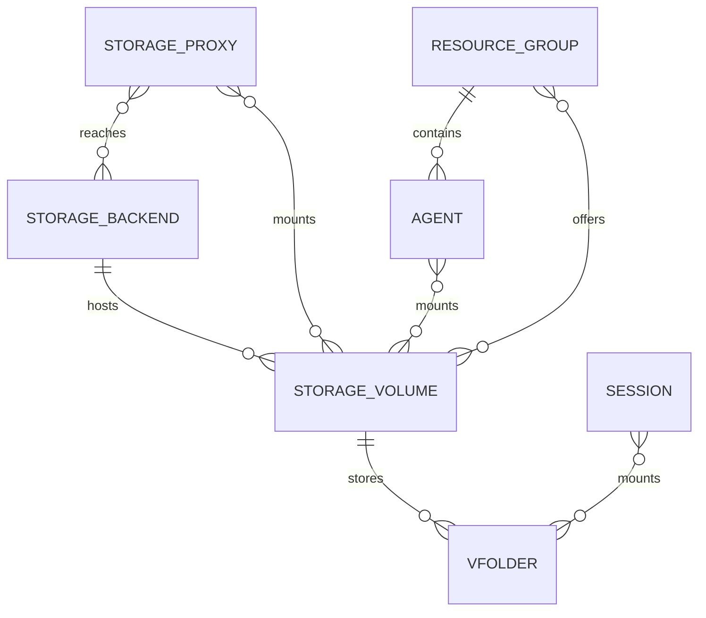

<!-- context-for-ai
type: bep
scope: Normalize storage proxies, backends, volumes and their mounts into the database
key-constraints:
  - Storage proxy identity and address stay in the service catalog, never in a dedicated table
  - Volume identity is the operator-declared volume name, never an inferred path
  - Service state lives in the service catalog; storage state lives on relationships, never on a volume or a backend
key-decisions:
  - Heartbeat upserts volumes by name; backends are inserted only when absent
  - vfolder host_path is computed by the manager, not fetched from the storage proxy
upstream: BEP-1046 (service catalog)
-->

# Storage Proxy Enhancement

## Related Issues

- JIRA Epic: BA-7620 (Storage backend and volume normalization groundwork)
- JIRA: BA-7630 (storage proxy registration payload)
- Related Epic: BA-4313 (Unified Service Discovery with DB-backed Service Catalog)

## Motivation

Storage proxy and volume information is spread across three places that do not agree with each other, and none of them can answer basic operational questions.

| Problem | Consequence |
|---------|-------------|
| Proxy connection settings live in etcd, loaded once at manager bootstrap | Adding or changing a proxy requires a manager restart |
| Volumes exist only in each proxy's TOML file | The manager cannot list volumes without calling every proxy |
| `vfolders.host` is the string `"proxy:volume"` | No referential integrity; renaming or removing a proxy silently breaks folders |
| No record of which backend appliance serves a volume | Cannot tell which volumes are affected when an appliance fails |
| `GET /volumes` echoes the proxy's config | A dropped mount is indistinguishable from a healthy one |
| Session mounts are stored as JSONB on `sessions` and `kernels` | Cannot query which sessions use a given folder |

The goal is a normalized model in which every relationship is a row, service liveness comes from one place, and the manager can answer "which volumes exist, who serves them, and are they healthy" from the database.

## Current Design

| Area | Where it lives today | Status |
|------|---------------------|--------|
| Proxy address, secret, TLS, timeouts | etcd `volumes/proxies/<name>/` | ➕ to move |
| Proxy liveness | Service catalog (`service_catalog`), registration path disabled | ✅ exists, unused |
| Volume list | Each proxy's TOML `[volume.<name>]`, read at runtime via `GET /volumes` | ➕ to normalize |
| Backend appliance | Not represented; only a backend *type* string per volume | ➕ to add |
| Volume ↔ resource group | Not represented; all resource groups may use all volumes | ➕ to add |
| vfolder ↔ volume | `vfolders.host` string | ➕ to normalize |
| Session mounts | `sessions.vfolder_mounts` / `kernels.vfolder_mounts` JSONB | ➕ to normalize |
| Mount path used by agents | Fetched per request from the proxy (`GET /folder/mount`) | ➕ to move into the database |

The service catalog (`service_catalog`, `service_catalog_endpoint`) already exists with heartbeat, status and role/scope-keyed endpoints, and every component already ships a publisher. This BEP builds on it rather than redefining it; see BEP-1046.

## Proposed Design

### Entity model

A storage backend is one storage appliance. A storage volume is a logical volume on it, identified by an operator-declared name. Storage proxies and agents both mount volumes, each at its own path, so the proxy's path and an agent's path are independent facts rather than an assumption. A resource group offers a set of volumes to the sessions scheduled onto its agents.

Every many-to-many relationship above carries data of its own:

| Relationship | Carries | Set by |
|--------------|---------|--------|
| Storage proxy — storage backend | Whether the appliance answers from this proxy | Proxy probe |
| Storage proxy — storage volume | This proxy's mount path; whether the mount is alive | Proxy declaration and probe |
| Agent — storage volume | This agent's mount path; whether the mount is alive | Agent declaration and probe |
| Resource group — storage volume | Whether the volume is offered to this group | Administrator |
| Session — vfolder | Destination path inside the container, subpath, permission | Session creation |

Storage proxies and agents are not storage-specific records. They are services: their identity, address and state live in the service catalog, and this proposal adds only the storage-specific relationships hanging off them.

### Volume identity

A volume is identified by its **name**, declared as the configuration section key in every service that mounts it. Two services declaring the same name are declaring the same volume; that declaration is the only evidence of sameness the system has.

Paths cannot serve as identity. A path is a local mount point on one host: the same export mounted at two different paths is still one volume, and two unrelated local disks mounted at the same path are two volumes. Inferring identity from a path would merge unrelated storage and point folders at the wrong data.

### State management

**Storage proxies and agents are state-managed through the service catalog.** Both register there, both heartbeat there, and whether a service is up is answered from there and nowhere else. The `agents` table keeps only what scheduling strictly requires; the rest of an agent's state belongs to its catalog record. Exactly where that line falls is being settled in BEP-1046.

**Everything else about storage state belongs to relationships. Neither a storage backend nor a storage volume carries a state of its own.**

| Subject | State managed | Where |
|---------|--------------|-------|
| Storage proxy, agent | ✅ Liveness | Service catalog, from heartbeats and the stale sweep |
| Storage proxy — storage backend | ✅ Is the appliance reachable from this proxy | Relationship |
| Storage proxy — storage volume | ✅ Is the mount alive on this proxy | Relationship |
| Agent — storage volume | ✅ Is the mount alive on this agent | Relationship |
| Resource group — storage volume | Administrator toggle, not health | Relationship |
| Storage backend itself | ❌ Not managed | — |
| Storage volume itself | ❌ Not managed | — |

A storage backend has no overall verdict. Only the services that mount its volumes can reach it, each over its own network path, and rolling their observations into a single value would need an arbitrary rule — one reachable proxy out of four is neither healthy nor unhealthy. Consumers read the per-relationship states and decide for themselves.

For the same reason a volume has no state. A volume that no service reports is not unhealthy; it simply has no service relationships, and folders on it cannot be mounted. Its record is kept regardless, so folders keep a valid reference.

The two probes are distinct because they fail independently: a vendor appliance can answer its management API while a network mount on one proxy has silently dropped.

| Probe | Runs on | Detects |
|-------|---------|---------|
| `st_dev` comparison against the value captured at volume init | The mounting service | The mount fell off and the path reverted to the underlying directory |
| `statvfs` in an executor with a timeout | The mounting service | A dead network mount, where the timeout is itself the signal |
| Marker file holding the volume name | The mounting service | The path is serving different storage than declared |
| `get_hwinfo()` | Storage proxy | The backend appliance itself |

Mount failures are not written onto the agent. They are published as events that an administrator can subscribe to through a notification rule.

### How records are created and change

Registration is driven by heartbeats so that a fresh installation needs no manual setup, while everything remains administrator-editable afterwards. Services only ever add; the manager is the only party that removes.

**A service starts and finishes initializing.** It registers in the service catalog and its heartbeat declares the backends it is configured against and the volumes it mounts, each with that service's mount path. The manager then:

- inserts a storage backend record **only if one with that name is absent**, so administrator-supplied connection details are never overwritten;
- upserts each storage volume by name and links it to its backend, logging an error and leaving the volume unlinked if the named backend does not resolve;
- creates the service's backend and volume relationships, with mount state unknown until the first probe.

A backend name is optional in the service configuration; when absent the backend type is used as the name, so existing configurations register a backend named after their type. Connection details and credentials are never carried in a heartbeat, because it travels over the shared event bus.

**A heartbeat arrives normally.** The catalog records it. The service's relationships are reconciled against what it now reports: a volume newly declared gets a relationship, and one no longer declared has its relationship marked detached rather than deleted. Backend and volume records are not touched beyond the volume upsert.

**Heartbeats stop arriving.** A missed heartbeat is not proof that a service is gone: the event bus can lag, drop messages, or be partitioned from the publisher while the service itself keeps serving. A manager reconciler therefore picks up catalog records whose last heartbeat has aged past the threshold and **probes those services directly** before acting on them. A service that answers has its record refreshed and its volumes re-verified; only one that fails the probe is marked unhealthy. This extends the passive stale sweep of BEP-1046, which marks a record unhealthy on age alone.

Once a service is confirmed down, its relationships are left in place but are no longer treated as usable, so folders on a volume that only this service mounted cannot be mounted. A volume that another healthy service still reports stays fully usable — this is the point of keeping mount state per relationship.

**A service deregisters.** Nothing is deleted from the database. The catalog record moves to its deregistered state and the manager marks that service's storage relationships detached, so the history of what was mounted where survives and a returning service reattaches instead of being recreated from nothing. Backend and volume records persist untouched; they are permanent once created, because folders reference them.

**An administrator acts.** Backend connection details and credentials, and which volumes a resource group offers, are set only this way. There is no API to create or edit a volume — volumes exist because a service declares them.

| Record | Created by | Updated by | Removed by |
|--------|-----------|-----------|-----------|
| Storage backend | First heartbeat naming it | Administrator | Nothing |
| Storage volume | First heartbeat naming it | Heartbeat | Nothing |
| Storage proxy — backend | Heartbeat | Probe results | Never deleted; marked detached by the manager on deregistration |
| Storage proxy — volume | Heartbeat | Heartbeat, probe results | Never deleted; marked detached when the service deregisters or stops declaring it |
| Agent — volume | Heartbeat | Heartbeat, probe results | Never deleted; marked detached when the service deregisters or stops declaring it |
| Resource group — volume | Administrator | Administrator | Administrator |
| vfolder — volume | Folder creation | Nothing | With the folder |
| Session — vfolder | Session creation | Nothing | With the session |

### Who calls what

**Storage proxy**

| When | Calls | Purpose |
|------|-------|---------|
| On start, then periodically | Event bus | Heartbeat declaring its backends and the volumes it mounts, each with this proxy's mount path |
| Periodically | Its own filesystem | Mount probe. The result is published as an event, not written directly |
| Periodically | The backend appliance | `get_hwinfo()`, for the appliance's reachability from this proxy |
| On request from the manager | — | Serves the volume verification endpoint. **New** — the existing volume listing only echoes configuration and cannot answer whether a volume is ready |
| On request from a client | — | Serves the existing vfolder file APIs, unchanged |

**Agent**

| When | Calls | Purpose |
|------|-------|---------|
| On start, then periodically | Event bus | Heartbeat declaring the volumes it mounts, each with this agent's mount path. **New** — agents have no volume concept today |
| Periodically | Its own filesystem | Mount probe, published as an event |
| On session start | — | Binds the host path the manager supplies, unchanged |

**Manager**

| When | Calls | Purpose |
|------|-------|---------|
| On every heartbeat and health event | Its own database | Writes the catalog record and the storage relationships |
| Whenever it needs a proxy address | Its own database | Service catalog lookup by role and scope, replacing the address previously held in etcd |
| Periodically, for records with an aged heartbeat | The service itself | Direct probe before declaring it down |
| Periodically | Storage proxy | Volume verification, to move a relationship into a verified state |
| On session start | Its own database | Computes the agent's host path from that agent's volume relationship. **This replaces a synchronous call to the storage proxy** |
| On folder create, delete, clone, quota change | Storage proxy | Existing manager-facing APIs, unchanged |

**Administrator and users**

| When | Calls | Purpose |
|------|-------|---------|
| Registering appliance connection details or credentials | Manager | Mutation on the storage backend. The only way these are ever set |
| Offering a volume to a resource group, or disabling it | Manager | Mutation on the resource group relationship |
| Creating or editing a volume | — | No API. Volumes exist because a service declares them |
| Reading or writing folder contents | Storage proxy | Existing vfolder APIs, unchanged |

The host path is derived rather than fetched. Its layout is fixed by the volume mount path, the quota scope and the folder id, and the storage proxy marks the method final so no backend can change it. Removing the round trip takes one synchronous call out of the session creation path.

## Migration / Compatibility

| Step | Note |
|------|------|
| Proxy connection settings move from etcd to the manager configuration file | The TOML loader must take precedence over the etcd volume loader, otherwise the file values are silently overridden |
| Built-in backend types are seeded when the schema is created | Following `resource_slot_types`, the migration inserts a backend record per built-in type, so an existing single-node installation has a working `vfs` backend before any heartbeat arrives |
| Volume and backend records are pulled from the running storage proxies by a CLI command | etcd holds no volume or backend data — it lives only in each proxy's configuration file. The command reads what each proxy reports and writes the records and relationships, so an operator does not have to wait for every proxy to be upgraded to the new heartbeat |
| `vfolders.host` is split into a volume reference | Hosts naming a volume that no longer exists still get a row, so the reference stays valid |
| `resource_group_storage_volumes` is seeded with every resource group and every volume | Resource groups place no restriction on volumes today; seeding preserves that. Without it, no session could mount anything after the migration |
| `sessions` and `kernels` mount columns are dropped | After session mount resolution reads the new table |

Data migration runs through a manager CLI command, not an Alembic migration, so that it can be rehearsed with a dry run and repeated. Alembic only creates and drops schema.

`vfolders.storage_volume_id` becomes required for every folder that is not in a terminal deletion state.

## Implementation Plan

| Phase | Content |
|-------|---------|
| 1 | This BEP; the new tables; mount and backend health probes with the status updates they feed |
| 2 | Heartbeat payload for proxies and agents; manager-side record creation; verification and reconciliation |
| 3 | Administrator APIs; session mount resolution from the database; configuration move; etcd retirement; notification rule types |

## Decision Log

| Date | Decision | Rationale |
|------|----------|-----------|
| 2026-09-04 | Storage proxies get no table; the service catalog is their record | A proxy is a service like any other, and its liveness is already tracked there |
| 2026-09-04 | Volume identity is the declared name | A path is a property of a host, not of a volume, and inferring identity from it can merge unrelated storage |
| 2026-09-04 | Storage proxies and agents are state-managed through the service catalog | One place answers whether a service is up; the `agents` table keeps only what scheduling requires |
| 2026-09-04 | Health belongs to relationships | The same appliance can be reachable from one service and not another |
| 2026-09-04 | No overall verdict for a backend or a volume | Aggregating per-service observations into one value needs an arbitrary rule, and consumers already have the per-relationship states |
| 2026-09-04 | Heartbeats upsert volumes but only insert backends | Volumes are fully described by the proxy; backend credentials are not, and must survive |
| 2026-09-04 | Credentials never travel in a heartbeat | The event bus is readable by every component that consumes events |
| 2026-09-04 | The manager computes `host_path` | The layout is fixed and the inputs are already in the database |
| 2026-09-04 | A stale service is probed before being declared down | A missed heartbeat can mean a lagging event bus rather than a dead service |
| 2026-09-04 | Services and their relationships are soft-deleted | A returning service reattaches, and the record of what was mounted where survives |
| 2026-09-04 | Mount failures raise notifications rather than writing agent state | Keeps one owner for agent state and lets operators choose the response |

## Open Questions

1. Which columns remain on `agents` once liveness is read from the catalog. The principle is settled; drawing the exact line is BEP-1046 Open Question 2.
2. Whether the mount path must be identical on every service holding the same volume, or whether per-service divergence is supported from the start.
3. How `.resolve()` symlink handling is reconciled when the manager computes a path that the proxy would have resolved.
4. Which `storage_volumes` rows an administrator may remove once folders reference them.

## References

- [BEP-1046: Unified Service Discovery with DB-backed Service Catalog](BEP-1046-unified-service-discovery.md) — service catalog, heartbeat and endpoint model this proposal builds on
- [BEP-1047: Resource Slot DB Normalization](BEP-1047-resource-slot-db-normalization.md) — prior art for normalizing a registry out of configuration
- [BEP-1065: Encrypted Secret-Key Storage](BEP-1065-encrypted-secret-key-storage.md) — credential storage for backend appliances
