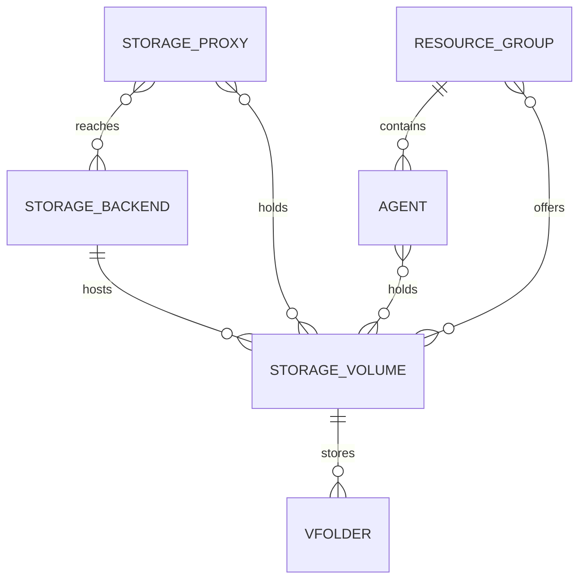

<!-- context-for-ai
type: bep
scope: Normalize storage backends, volumes, and which services hold them into the database
key-constraints:
  - Storage proxy identity and address stay in the service catalog, never in a dedicated table
  - Volume and backend identity is an operator-assigned id declared in each service's configuration, never a name or an inferred path
  - Service state lives in the service catalog; storage state lives on relationships, never on a volume or a backend
  - Mounts are never recorded in the manager database; a volume implementation owns its mounts and reports one volume state per service
key-decisions:
  - Heartbeat upserts volumes by id; backends are inserted only when absent
  - Agents and storage proxies run the same volume implementation from the same volume declaration
upstream: BEP-1046 (service catalog)
-->

# Storage Proxy Enhancement

## Related Issues

- JIRA Epic: BA-7620 (Storage backend and volume normalization groundwork)
- JIRA: BA-7630 (storage proxy registration payload)
- Related Epic: BA-4313 (Unified Service Discovery with DB-backed Service Catalog)

## Motivation

Storage proxy and volume information is spread across three places that do not agree with each other, and none of them can answer basic operational questions.

| Problem | Consequence |
|---------|-------------|
| Proxy connection settings live in etcd, loaded once at manager bootstrap | Adding or changing a proxy requires a manager restart |
| Volumes exist only in each proxy's TOML file | The manager cannot list volumes without calling every proxy |
| `vfolders.host` is the string `"proxy:volume"` | No referential integrity; renaming or removing a proxy silently breaks folders |
| No record of which backend appliance serves a volume | Cannot tell which volumes are affected when an appliance fails |
| `GET /volumes` echoes the proxy's config | A volume whose storage has gone away is indistinguishable from a healthy one |

The goal is a normalized model in which every relationship is a row, service liveness comes from one place, and the manager can answer "which volumes exist, who serves them, and are they healthy" from the database.

## Current Design

| Area | Where it lives today | Status |
|------|---------------------|--------|
| Proxy address, secret, TLS, timeouts | etcd `volumes/proxies/<name>/` | ➕ to move |
| Proxy liveness | Service catalog (`service_catalog`), registration path disabled | ✅ exists, unused |
| Volume list | Each proxy's TOML `[volume.<name>]`, read at runtime via `GET /volumes` | ➕ to normalize |
| Backend appliance | Not represented; only a backend *type* string per volume | ➕ to add |
| Volume ↔ resource group | Not represented; all resource groups may use all volumes | ➕ to add |
| vfolder ↔ volume | `vfolders.host` string | ➕ to normalize |

The service catalog (`service_catalog`, `service_catalog_endpoint`) already exists with heartbeat, status and role/scope-keyed endpoints, and every component already ships a publisher. This BEP builds on it rather than redefining it; see BEP-1046.

## Proposed Design

### Entity model

A storage backend is one storage appliance. A storage volume is a logical volume on it, identified by an operator-assigned id. Storage proxies and agents both hold volumes: each runs the same volume implementation from the same volume declaration, and the implementation owns whatever mounts it needs. A volume may be backed by many mounts on one service, one per user on Hammerspace, so a relationship is a service holding a volume and never one mount. A resource group offers a set of volumes to the sessions scheduled onto its agents.

Every many-to-many relationship above carries data of its own:

| Relationship | Carries | Set by |
|--------------|---------|--------|
| Storage proxy — storage backend | Whether the appliance answers from this proxy | Proxy probe |
| Storage proxy — storage volume | Whether the volume is usable on this proxy, as its volume implementation reports | Proxy declaration and volume implementation |
| Agent — storage volume | Whether the volume is usable on this agent, as its volume implementation reports | Agent declaration and volume implementation |
| Resource group — storage volume | Whether the volume is offered to this group | Administrator |

Storage proxies and agents are not storage-specific records. They are services: their identity, address and state live in the service catalog, and this proposal adds only the storage-specific relationships hanging off them.

The agent — volume relationship records which agents hold a volume. Whether it constrains placement is out of scope here.

### Identity

A storage volume and a storage backend are each identified by an **id (UUID)**, assigned by the operator and written into the configuration of every service that declares it. Two services declaring the same id are declaring the same volume or the same backend, and that declaration is the only evidence of sameness the system has. A name stays a human label and may be changed without touching a reference.

Neither a name nor a path can serve as identity. A name is scoped per proxy today, so the same configuration section key on two proxies can mean unrelated storage. A path is a local mount point on one host: the same export mounted at two different paths is still one volume, and two unrelated local disks mounted at the same path are two volumes.

### State management

**Storage proxies and agents are state-managed through the service catalog.** Both register there, both heartbeat there, and whether a service is up is answered from there and nowhere else. The `agents` table keeps only what scheduling strictly requires; the rest of an agent's state belongs to its catalog record. Exactly where that line falls is being settled in BEP-1046.

**Everything else about storage state belongs to relationships. Neither a storage backend nor a storage volume carries a state of its own.**

| Subject | State managed | Where |
|---------|--------------|-------|
| Storage proxy, agent | ✅ Liveness | Service catalog, from heartbeats and the stale sweep |
| Storage proxy — storage backend | ✅ Is the appliance reachable from this proxy | Relationship |
| Storage proxy — storage volume | ✅ Is the volume usable on this proxy | Relationship |
| Agent — storage volume | ✅ Is the volume usable on this agent | Relationship |
| Resource group — storage volume | Administrator toggle, not health | Relationship |
| Storage backend itself | ❌ Not managed | — |
| Storage volume itself | ❌ Not managed | — |

A storage backend has no overall verdict. Only the services that hold its volumes can reach it, each over its own network path, and rolling their observations into a single value would need an arbitrary rule — one reachable proxy out of four is neither healthy nor unhealthy. Consumers read the per-relationship states and decide for themselves.

For the same reason a volume has no state. A volume that no service reports is not unhealthy; it simply has no service relationships, and folders on it cannot be mounted. Its record is kept regardless, so folders keep a valid reference.

The state on a service — volume relationship is the volume state as that service's volume implementation reports it. The implementation owns its mounts and derives one state from them: a single-mount volume reports its mount's state, and a multi-mount volume applies its own rule, such as reporting a problem when any mount has one. Mounts themselves are never recorded in the manager database. On Hammerspace a volume gains a mount per user, so a record per mount would grow with users rather than with volumes.

The volume check and the backend check are distinct because they fail independently: a vendor appliance can answer its management API while a network mount on one proxy has silently dropped.

| Check | Owned by | Detects |
|-------|----------|---------|
| `st_dev` comparison against the value captured at volume init | Volume implementation, per mount | The mount fell off and the path reverted to the underlying directory |
| `statvfs` in an executor with a timeout | Volume implementation, per mount | A dead network mount, where the timeout is itself the signal |
| Marker file holding the volume name | Volume implementation, per mount | The path is serving different storage than declared |
| `get_hwinfo()` | Storage proxy | The backend appliance itself |

The three mount checks are how the current single-mount implementation derives its volume state. Another implementation may check its mounts differently; only the volume state it reports leaves the service.

Each probe runs on its own periodic loop and leaves its latest result, with the time it was taken, in the service's memory; the heartbeat carries that snapshot. Probe cadence and heartbeat cadence stay independent, so a slow or hung probe never delays a heartbeat and never makes a healthy service look dead. Because every entry carries its check time, a service reports no separate unknown state — the manager decides fresh from stale itself, and a volume never yet probed is still declared, without one.

Probes run independently per volume: a dead network mount blocks in its system call, and walking the volumes in one loop would let a single one starve the rest. A probe that timed out is not retried while the previous attempt is outstanding, because cancelling the await does not release the executor thread.

Volume failures are not written onto the agent. They reach an administrator through a notification rule.

### How records are created and change

Registration is driven by heartbeats so that a fresh installation needs no manual setup, while everything remains administrator-editable afterwards. Services only ever add; the manager is the only party that removes.

**A service starts and finishes initializing.** It registers in the service catalog and its heartbeat declares the backends it is configured against and the volumes it holds, each with the state its volume implementation reports. The manager then:

- inserts a storage backend record **only if one with that id is absent**, so administrator-supplied connection details are never overwritten;
- upserts each storage volume by id and links it to its backend, logging an error and leaving the volume unlinked if the declared backend id does not resolve;
- creates the service's backend and volume relationships, with state absent until the first report.

Every volume and backend in a service's configuration carries its id. A declaration missing one is rejected rather than registered under a generated id, so which records exist is always the operator's choice. Connection details and credentials are never carried in a heartbeat, because it travels over the shared event bus.

**A heartbeat arrives normally.** The catalog records it. The service's relationships are reconciled against what it now reports: a volume newly declared gets a relationship, and one no longer declared has its relationship marked detached rather than deleted. Backend and volume records are not touched beyond the volume upsert.

**Heartbeats stop arriving.** A missed heartbeat is not proof that a service is gone: the event bus can lag, drop messages, or be partitioned from the publisher while the service itself keeps serving. A manager reconciler therefore picks up catalog records whose last heartbeat has aged past the threshold and **probes those services directly** before acting on them. A service that answers has its record refreshed and its volumes re-verified; only one that fails the probe is marked unhealthy. This extends the passive stale sweep of BEP-1046, which marks a record unhealthy on age alone.

Once a service is confirmed down, its relationships are left in place but are no longer treated as usable, so folders on a volume that only this service held cannot be mounted. A volume that another healthy service still reports stays fully usable — this is the point of keeping volume state per relationship.

**A service deregisters.** Nothing is deleted from the database. The catalog record moves to its deregistered state and the manager marks that service's storage relationships detached, so the record of which service held which volume survives and a returning service reattaches instead of being recreated from nothing. Backend and volume records persist untouched. Nothing is ever hard-deleted, because folders reference them.

**An administrator acts.** Which volumes a resource group offers is set only this way, and so is the manager's copy of the backend connection details. There is no API to create or edit a volume — volumes exist because a service declares them — but an administrator may soft-delete one. A soft-deleted volume is withheld from new folder creation while every existing reference to it stays valid; a service that keeps declaring it does not resurrect it.

| Record | Created by | Updated by | Removed by |
|--------|-----------|-----------|-----------|
| Storage backend | First heartbeat declaring it | Administrator | Nothing |
| Storage volume | First heartbeat declaring it | Heartbeat | Administrator, soft delete only |
| Storage proxy — backend | Heartbeat | Probe results | Never deleted; marked detached by the manager on deregistration |
| Storage proxy — volume | Heartbeat | Heartbeat, reported volume state | Never deleted; marked detached when the service deregisters or stops declaring it |
| Agent — volume | Heartbeat | Heartbeat, reported volume state | Never deleted; marked detached when the service deregisters or stops declaring it |
| Resource group — volume | Administrator | Administrator | Administrator |
| vfolder — volume | Folder creation | Nothing | With the folder |

### Who calls what

An agent and a storage proxy run the same volume implementation. Injecting a volume declaration into an agent's configuration is all it takes for the agent to hold that volume; acquiring mounts, resolving paths and deriving the volume state belong to the implementation, and the two services differ only in what they expose on top of it.

**Storage proxy**

| When | Calls | Purpose |
|------|-------|---------|
| On start, then periodically | Event bus | Heartbeat declaring its backends and the volumes it holds, each with the latest volume state held in memory |
| Periodically, independently per volume | Its own mounts | Volume state check, run by the volume implementation. The result is kept in memory and rides the next heartbeat |
| Periodically | The backend appliance | `get_hwinfo()`, for the appliance's reachability from this proxy. Also kept in memory |
| On request from the manager | — | Serves the volume verification endpoint. **New** — the existing volume listing only echoes configuration and cannot answer whether a volume is ready |
| On request from a client | — | Serves the existing vfolder file APIs, unchanged |

**Agent**

| When | Calls | Purpose |
|------|-------|---------|
| On start, then periodically | Event bus | Heartbeat declaring the volumes it holds, each with the latest volume state. **New** — agents have no volume concept today |
| Periodically, independently per volume | Its own mounts | Volume state check, run by the volume implementation. The result is kept in memory and rides the next heartbeat |
| On session prepare, when the session mounts folders | Its own volume implementation | Checks that each folder's volume is usable on this agent and that the folder's path exists under it, then resolves the host path to bind. Either check failing fails the prepare. **New** — today the manager supplies the path after asking the proxy |

**Manager**

| When | Calls | Purpose |
|------|-------|---------|
| On every heartbeat | Its own database | Writes the catalog record and the storage relationships, including the probe results the heartbeat carried |
| Whenever it needs a proxy address | Its own database | Service catalog lookup by role and scope, replacing the address previously held in etcd |
| Periodically, for records with an aged heartbeat | The service itself | Direct probe before declaring it down |
| When a heartbeat has not arrived | Storage proxy | Volume verification, on demand. Routine state arrives with the heartbeat, so this endpoint exists for the case where it has stopped |
| On folder create, delete, clone and quota change | Storage proxy | Existing manager-facing APIs, unchanged. The proxy is selected from the folder's volume rather than read off the folder |
| On session start | Its own database | Passes each folder's volume id to the agent. **New** — the manager no longer asks the proxy for a host path |

A folder names a volume and no longer names a proxy, so the manager selects one for every call. Eligible proxies are those whose relationship to that volume is attached and reported alive, and whose catalog record is healthy. Each manager-facing call is self-contained and every eligible proxy sees the same files, so any one of them may serve it and no affinity is carried between calls. When no proxy is eligible the call fails with an error naming the volume — the folder and its data are intact and nothing reaches them, which is a different condition from a missing folder.

**Administrator and users**

| When | Calls | Purpose |
|------|-------|---------|
| Registering appliance connection details or credentials | Manager | Mutation on the storage backend |
| Offering a volume to a resource group, or disabling it | Manager | Mutation on the resource group relationship |
| Creating or editing a volume | — | No API. Volumes exist because a service declares them; an administrator may only soft-delete one |
| Reading or writing folder contents | Storage proxy | Existing vfolder APIs, unchanged |

## Migration / Compatibility

| Step | Note |
|------|------|
| Proxy connection settings move from etcd to the manager configuration file | The TOML loader must take precedence over the etcd volume loader, otherwise the file values are silently overridden |
| Volume and backend records are pulled from the running storage proxies by a CLI command | etcd holds no volume or backend data — it lives only in each proxy's configuration file. The command reads what each proxy reports and writes the records and relationships, so an operator does not have to wait for every proxy to be upgraded to the new heartbeat |
| The CLI assigns an id to every volume and backend it finds, and the operator writes those ids into each proxy's configuration | Configurations carry no id today. Until a proxy's configuration is updated its declarations are rejected, so the assignment is reported and rehearsed before it is applied |
| `vfolders.host` is split into a volume reference | Hosts naming a volume that no longer exists still get a row, so the reference stays valid |
| Agent configuration gains the volume declarations of the volumes it holds | Today an agent has no volume concept. Until it carries the declarations it holds no volume and no session on it can mount a folder |
| `resource_group_storage_volumes` is seeded with every resource group and every volume | Resource groups place no restriction on volumes today; seeding preserves that. Without it, no session could mount anything after the migration |

Data migration runs through a manager CLI command, not an Alembic migration, so that it can be rehearsed with a dry run and repeated. Alembic only creates and drops schema.

`vfolders.storage_volume_id` is nullable. It is null exactly for unmanaged folders, which carry an `unmanaged_path` and bind that host path directly without passing through a volume. Every other folder carries a volume reference.

## Implementation Plan

| Phase | Content |
|-------|---------|
| 1 | This BEP; the new tables; volume and backend state checks with the status updates they feed |
| 2 | Heartbeat payload for proxies and agents; the volume implementation on the agent; manager-side record creation; verification and reconciliation |
| 3 | Administrator APIs; configuration move; etcd retirement; notification rule types |

## Decision Log

| Date | Decision | Rationale |
|------|----------|-----------|
| 2026-09-04 | Storage proxies get no table; the service catalog is their record | A proxy is a service like any other, and its liveness is already tracked there |
| 2026-09-09 | Volume and backend identity is an operator-assigned id | A name is scoped per proxy and a path is a property of a host; neither is a stable reference, and a folder must keep pointing at the same storage across a rename |
| 2026-09-04 | Storage proxies and agents are state-managed through the service catalog | One place answers whether a service is up; the `agents` table keeps only what scheduling requires |
| 2026-09-04 | Health belongs to relationships | The same appliance can be reachable from one service and not another |
| 2026-09-04 | No overall verdict for a backend or a volume | Aggregating per-service observations into one value needs an arbitrary rule, and consumers already have the per-relationship states |
| 2026-09-04 | Heartbeats upsert volumes but only insert backends | Volumes are fully described by the proxy; backend credentials are not, and must survive |
| 2026-09-04 | Credentials never travel in a heartbeat | The event bus is readable by every component that consumes events |
| 2026-09-04 | A stale service is probed before being declared down | A missed heartbeat can mean a lagging event bus rather than a dead service |
| 2026-09-05 | Probe results ride the heartbeat rather than a separate health event | One payload and one cadence to reason about; the heartbeat is already an event |
| 2026-09-04 | Services and their relationships are soft-deleted | A returning service reattaches, and the record of which service held which volume survives |
| 2026-09-04 | Volume failures raise notifications rather than writing agent state | Keeps one owner for agent state and lets operators choose the response |
| 2026-09-09 | An administrator may soft-delete a volume, never hard-delete it | Withdrawing a volume from new folders is an operational need; folders already on it keep a valid reference |
| 2026-09-09 | Session mounts are left as they are | Per-kernel mount identity is a question of its own, and normalizing it here would widen this proposal past storage |
| 2026-09-22 | A service — volume relationship means the service holds the volume, not that it mounts it | One volume may be backed by many mounts on one service; Hammerspace adds a mount per user |
| 2026-09-22 | Volume state is derived by the volume implementation from its mounts | A single-mount volume reports its mount's state; a multi-mount volume applies its own rule |
| 2026-09-22 | Mounts are never recorded in the manager database | Their number grows with users on Hammerspace, and a record per mount would grow the same way |
| 2026-09-22 | Agents and storage proxies run the same volume implementation from the same declaration | The agent resolves its own host paths, so the manager stops asking the proxy for a path on session start |
| 2026-09-22 | The agent verifies volume state and folder path at session prepare | The heartbeat state is a snapshot; the check at bind time is what keeps a session from starting on a broken mount |

## Open Questions

1. Which columns remain on `agents` once liveness is read from the catalog. The principle is settled; drawing the exact line is BEP-1046 Open Question 2.

## References

- [BEP-1046: Unified Service Discovery with DB-backed Service Catalog](BEP-1046-unified-service-discovery.md) — service catalog, heartbeat and endpoint model this proposal builds on
- [BEP-1047: Resource Slot DB Normalization](BEP-1047-resource-slot-db-normalization.md) — prior art for normalizing a registry out of configuration
- [BEP-1065: Encrypted Secret-Key Storage](BEP-1065-encrypted-secret-key-storage.md) — credential storage for backend appliances
