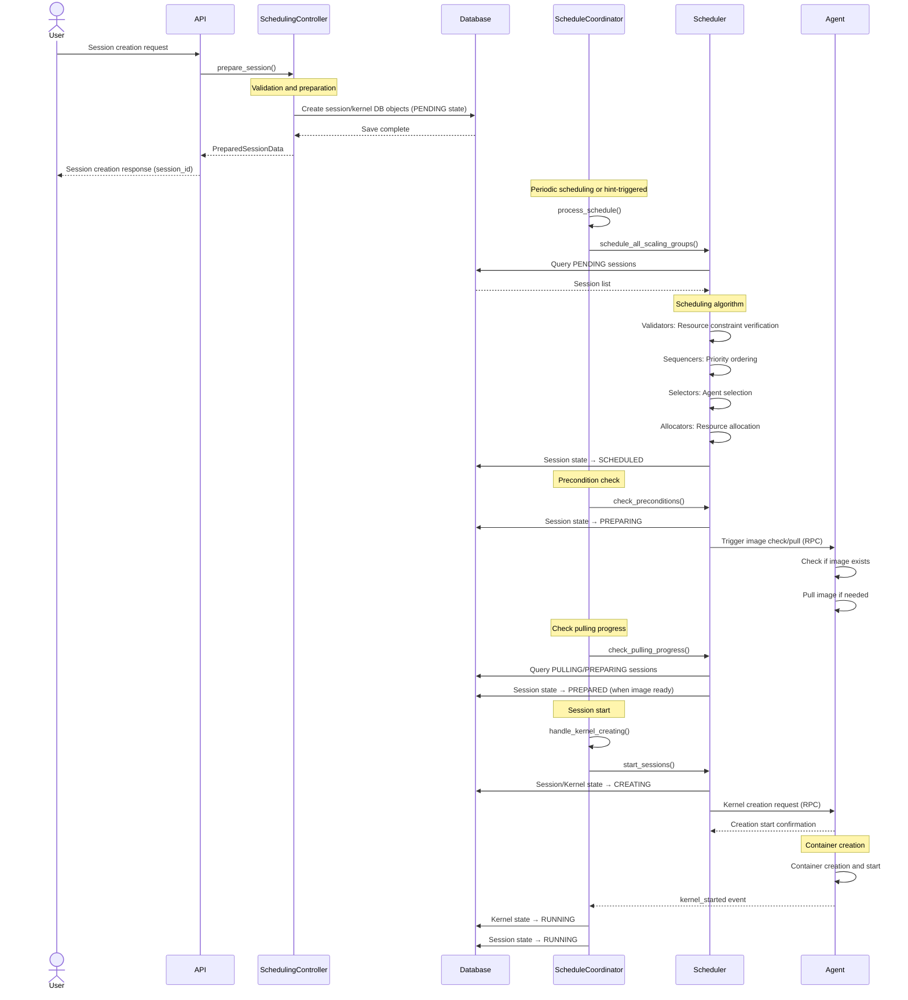
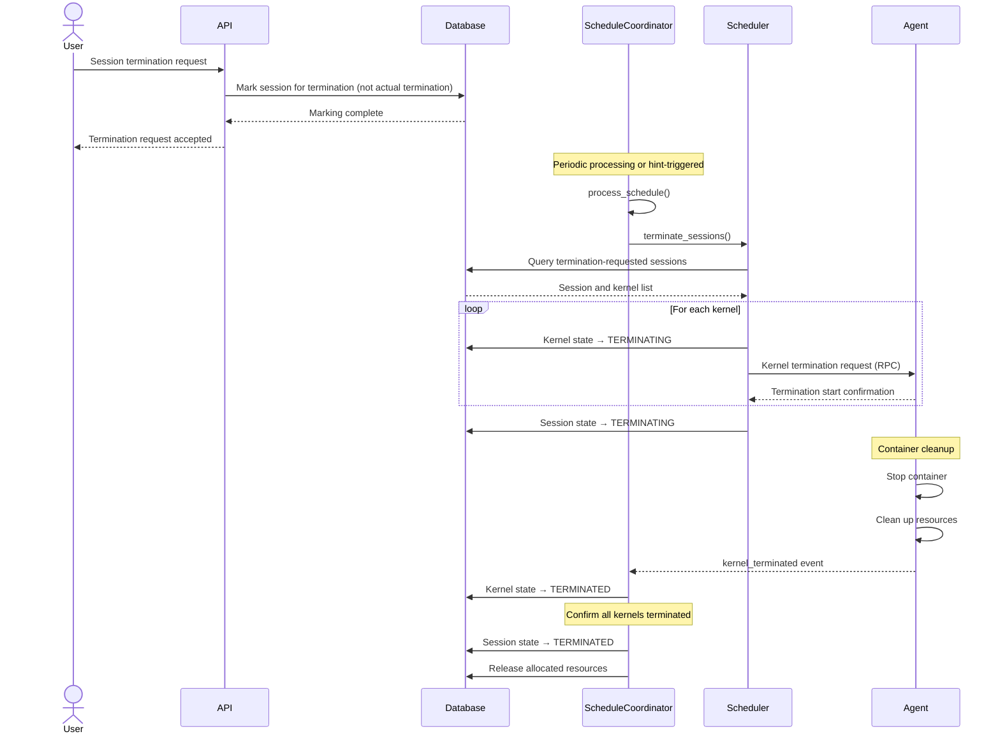
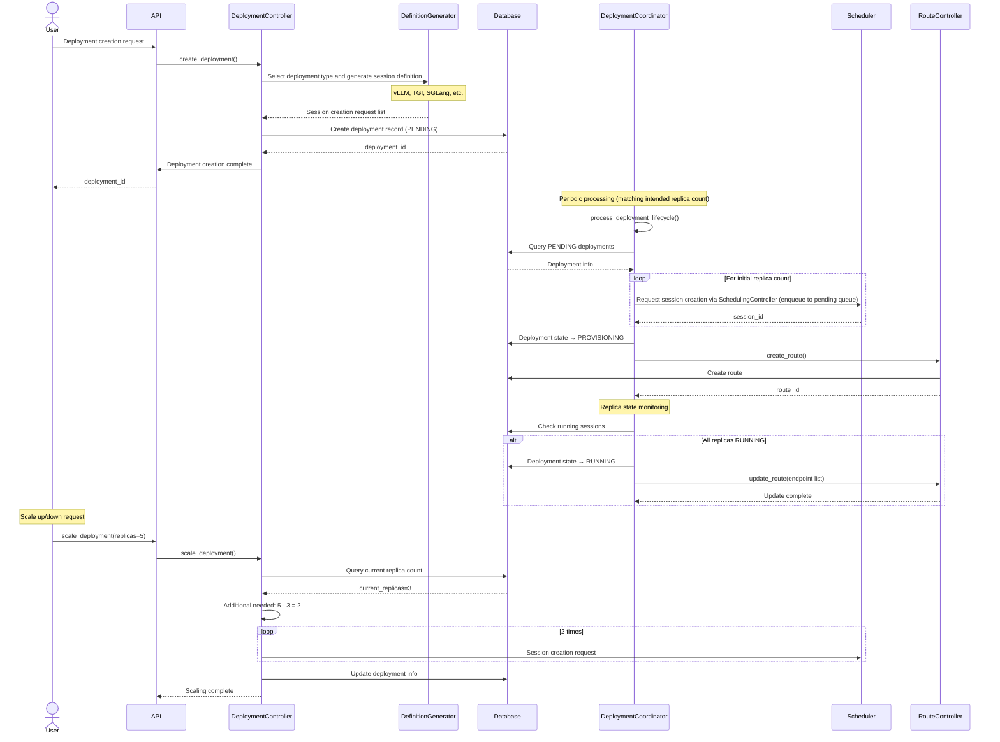

# Sokovan

← [Back to Manager](../README.md#manager-architecture-documentation) | [Architecture Overview](../../README.md#manager)

## Overview

Sokovan is the orchestration layer that comprehensively coordinates session scheduling, deployment management, and route management in Backend.AI.

**Key Responsibilities:**
- **Session Scheduling**: Managing the creation, start, and termination of computing sessions based on user requests
- **Deployment Management**: Deployment and scaling of long-running services including model serving
- **Route Management**: Network routing and health checks for deployed services

## Architecture

Sokovan consists of a 3-tier architecture:

```
┌────────────────────────────────────────────────────────────────────────────────────┐
│                          SokovanOrchestrator                                       │
│                        (Top-level Orchestrator)                                    │
│                                                                                    │
│                   - Creates and manages 3 Coordinators                             │
│                   - Schedules periodic tasks                                       │
│                   - Provides common dependencies (events, locks)                   │
│                                                                                    │
└──────────────────────────────────────┬─────────────────────────────────────────────┘
                                       │
         ┌─────────────────────────────┼─────────────────────────────┐
         │                             │                             │
         ▼                             ▼                             ▼
┌───────────────────────────┐  ┌──────────────────────────┐  ┌──────────────────────────┐
│                           │  │                          │  │                          │
│   ScheduleCoordinator     │  │  DeploymentCoordinator   │  │    RouteCoordinator      │
│                           │  │                          │  │                          │
│                           │  │                          │  │                          │
│     Session lifecycle     │  │   Deployment lifecycle   │  │    Route lifecycle       │
│       coordination        │  │      coordination        │  │      coordination        │
│                           │  │                          │  │                          │
│                           │  │                          │  │                          │
└─────────────┬─────────────┘  └────────────┬─────────────┘  └────────────┬─────────────┘
              │                             │                             │
              │                             │                             │
              ▼                             ▼                             ▼
┌───────────────────────────┐  ┌──────────────────────────┐  ┌──────────────────────────┐
│                           │  │                          │  │                          │
│  Scheduler                │  │  DeploymentController    │  │   RouteController        │
│      +                    │  │                          │  │                          │
│  SchedulingController     │  │                          │  │                          │
│                           │  │                          │  │                          │
│                           │  │   Actual deployment      │  │   Actual route           │
│  Actual scheduling logic  │  │   control logic          │  │   control logic          │
│                           │  │                          │  │                          │
│                           │  │                          │  │                          │
└───────────────────────────┘  └──────────────────────────┘  └──────────────────────────┘
```

### Roles by Layer

#### 1. Orchestrator Layer (SokovanOrchestrator)

SokovanOrchestrator is the top-level entry point of the entire system. It creates and initializes three Coordinator instances, defines and registers periodically executed tasks (TaskSpec). It also manages common dependencies like EventProducer and SchedulingController, and governs the lifecycle of the entire system.

**Main Components:**

*Coordinator Layer:*
- **ScheduleCoordinator**: Session scheduling coordination
- **DeploymentCoordinator**: Deployment management coordination
- **RouteCoordinator**: Route management coordination

*Controller Layer:*
- **SchedulingController**: Session validation and preparation before creation

*Common Infrastructure:*
- **EventProducer**: System event publication

#### 2. Coordinator Layer

Coordinators orchestrate the internal processing flow for each domain (sessions, deployments, routes).

**Periodic Operation Mechanism**

Coordinators operate through two cycle loops:

- **Short-cycle loop**: Operates based on hints, performing actual work only when hints are set. When specific events (session creation, kernel events, etc.) occur, a hint flag is set to process quickly in the next loop.
- **Long-cycle loop**: Always performs actual work regardless of hints, ensuring processing even when hints are missed and preventing the system from hanging through periodic retries.

The hint mechanism works by setting a hint flag when a specific event occurs, checking the hint in the short-cycle loop and performing work, then clearing the hint after completion. The important point is that it operates according to the periodic loop, not proportionally to requests immediately.

**Role of State-based Handlers**

Coordinators check the current state of resources (sessions, deployments, routes) and execute the Handler matching that state. Handlers execute the work that needs to be performed in the current state, transitioning to the next state on success, or transitioning to an error state or retry-waiting state on failure.

**Controller vs Coordinator**

The roles of Controller and Coordinator are clearly distinguished:

- **Controller**: The only entry point that can modify the state of sessions, deployments, etc.
  - Performs only initial work (enqueue, mark, etc.) and does not perform actual operations
  - Triggers by changing state so Coordinator can process
  - Example: Session creation request → Save to DB in PENDING state after validation
  - Example: Session termination request → Only mark for termination
- **Coordinator**: Performs actual work according to internal processing flow
  - Operates when triggered periodically or through hints
  - Example: PENDING session → Schedule and create kernel → Transition to RUNNING state
  - Example: Termination-marked session → Actual kernel termination and resource cleanup

Coordinators execute periodic tasks for their domain, select and execute state-specific handlers, and delegate actual work to Schedulers or Engines. They transition states based on work results.

**Coordinator Roles by Domain:**

- **ScheduleCoordinator**
  - Scheduling coordination for pending sessions
  - Processing kernel events (pulling, creating, running, terminated, etc.)
  - Image pulling coordination
  - Session state transition management

- **DeploymentCoordinator**
  - Processing coordination for deployment lifecycle stages
  - Replica management coordination
  - Integration with RouteController

- **RouteCoordinator**
  - Processing coordination for route lifecycle stages
  - Health check execution coordination

#### 3. Controller/Engine Layer

Controllers and Engines perform actual business logic:

- **Scheduler**
  - Querying pending sessions and executing scheduling algorithms
  - Resource constraint verification through Validators
  - Priority determination through Sequencers
  - Agent selection through Selectors
  - Resource allocation through Allocators
  - Handling session start, termination, retry

- **SchedulingController**
  - Pre-validation of session creation requests
  - Preparation of data needed for scheduling
  - Calculation of resource requirements
  - Selection of appropriate scaling groups

- **DeploymentController**
  - Deployment creation, update, deletion
  - Session definition generation per deployment type through Definition Generators
  - Replica count management

- **RouteController**
  - Route creation, update, deletion
  - Endpoint management
  - Traffic routing configuration

## Main Processing Flows

### Session Creation and Start

Session creation and start clearly distinguish the roles of Controller and Coordinator:

- **SchedulingController** (External request handling)
  - Session creation request validation and preparation
  - Create session and kernel DB objects in PENDING state upon validation success (enqueue)
  - Does not perform actual scheduling logic or kernel creation on Agent

- **ScheduleCoordinator** (Internal processing flow)
  - Query PENDING sessions and perform scheduling
  - Request kernel creation on scheduling success
  - Manage kernel state transitions (PULLING → RUNNING)
  - Transition session to RUNNING when all kernels are RUNNING

The complete flow from session creation request to actual execution is shown below. For more details, refer to the [Scheduler documentation](scheduler/README.md).



**Step-by-step Explanation:**

When a user requests session creation through the API, SchedulingController validates and prepares the request. Validators verify cluster size, mount paths, etc., Preparers prepare internal data, cluster configuration, and mount configuration. ResourceCalculator calculates required resources, and ScalingGroupResolver selects an appropriate scaling group. If validation fails, an error is returned immediately.

If validation passes, a session record is created in PENDING state and a session_id is generated and returned.

ScheduleCoordinator executes scheduling periodically. It queries sessions in PENDING state and verifies resource constraints with Validators (user/group quotas, etc.). It determines priority with Sequencers (FIFO, DRF, etc.), selects optimal agents with Selectors, and allocates and reserves resources with Allocators. On success, it transitions the session and kernel states to SCHEDULED.

After scheduling, check_preconditions() transitions sessions to PREPARING state and triggers image check/pull on the selected agents. The agent checks if the required container image exists locally, and pulls it if needed.

check_pulling_progress() periodically checks if all images are ready. Once image pulling is complete for all kernels in a session, it transitions the session to PREPARED state.

When preconditions are satisfied, start_sessions() transitions sessions to CREATING state and requests kernel creation from the agents, passing image name, resource slots, environment variables, etc.

The agent creates and starts the container using the already-pulled image, then publishes a kernel_started event.

When ScheduleCoordinator receives kernel_started events from all kernels, it transitions kernel states to RUNNING, and when all kernels are in RUNNING state, it transitions the session state to RUNNING as well.

### Session Termination

Session termination also distinguishes the roles of Controller and Coordinator:

- **API/Controller** (External request handling)
  - Receives session termination request and only marks for termination
  - Does not perform actual kernel termination or resource cleanup
  - Ensures asynchronous processing by returning response immediately

- **ScheduleCoordinator** (Internal processing flow)
  - Queries termination-marked sessions and performs actual termination
  - Calls kernel termination RPC to agents
  - Manages kernel state transitions (TERMINATING → TERMINATED)
  - Transitions session to TERMINATED and releases resources when all kernels are TERMINATED



**Step-by-step Explanation:**

When termination is requested by user request or system policy, a termination flag is set on the session and a response is immediately returned (asynchronous processing).

Scheduler periodically queries termination-requested sessions and sends termination requests for all kernels of the session. It transitions kernel states to TERMINATING and transitions session state to TERMINATING as well.

The agent terminates the container and cleans up related resources (volumes, network, etc.).

ScheduleCoordinator receives kernel_terminated events and transitions kernel states to TERMINATED. When all kernels are in TERMINATED state, it transitions session state to TERMINATED and releases allocated resources (DB update).

### Deployment Creation and Scaling



**Step-by-step Explanation:**

Deployment creation request includes deployment type (vllm, tgi, sglang, etc.), model path/name, resource requirements, and initial replica count.

DeploymentController selects a Definition Generator matching the deployment type. The Generator creates session creation requests, setting image, resources, environment variables, etc.

It saves deployment info in PENDING state and generates and returns a deployment_id.

DeploymentCoordinator requests session creation for the initial replica count through SchedulingController to enqueue to the pending queue. Each session is subsequently scheduled through Scheduler, and deployment state transitions to PROVISIONING.

RouteController creates a route for the deployment and registers it with App Proxy Coordinator. It prepares endpoint configuration.

App Proxy performs periodic health checks on registered routes, and Manager periodically reads these results.

It periodically checks replica session status. When all replicas' health checks are satisfied, it transitions deployment state to RUNNING and updates the endpoint list in RouteController.

During scaling, it compares current replica count with target replica count, creating new sessions if insufficient or terminating old sessions if excess.

## Dependencies

Sokovan depends on the following infrastructure components:

**PostgreSQL**: Persistence of sessions, kernels, deployments, routes, agent states

**Redis (Valkey)**: Agent state cache, event streams

**etcd**: Global configuration sharing

**App Proxy**: Deployment route registration and health check execution

## Directory Structure

```
sokovan/
├── scheduler/                 # Session scheduling
│   ├── validators/            # Resource constraint verification
│   ├── sequencers/            # Priority ordering
│   ├── selectors/             # Agent selection
│   └── allocators/            # Resource allocation
│
├── deployment/                # Deployment management
│   ├── definition_generator/  # Session definition generation per deployment type
│   └── route/                 # Routing management
│
└── scheduling_controller/     # Session validation and preparation
    ├── validators/            # Request validation
    ├── preparers/             # Data preparation
    └── calculators/           # Resource calculation
```

## State Transitions

### Session/Kernel State Transitions

```
PENDING → SCHEDULED → PREPARED → CREATING → RUNNING → TERMINATING → TERMINATED
   ↓           ↓           ↓          ↓          ↓
CANCELLED     └──────── TERMINATING ─────────────┘
```

**Session State Transition Conditions and Processing:**

| Current State | Next State | Transition Trigger | Responsible Component | On Failure |
|----------|----------|------------|--------------|------------|
| PENDING | SCHEDULED | Scheduling success (agent allocation complete) | Scheduler | CANCELLED (on validation failure) |
| PENDING | CANCELLED | User cancellation request or pending timeout exceeded | API/Handler | - |
| SCHEDULED | PREPARED | Image preparation complete | Scheduler | TERMINATING (on preparation failure) |
| SCHEDULED | TERMINATING | User termination request or system policy | API/Scheduler | - |
| PREPARED | CREATING | Kernel creation RPC call success | Scheduler | TERMINATING (on RPC failure) |
| PREPARED | TERMINATING | User termination request or system policy | API/Scheduler | - |
| CREATING | RUNNING | `kernel_started` event received (all kernels) | ScheduleCoordinator | TERMINATING (on kernel creation failure) |
| CREATING | TERMINATING | User termination request or system policy | API/Scheduler | - |
| RUNNING | TERMINATING | User termination request or system policy | API/Scheduler | - |
| TERMINATING | TERMINATED | All kernel `kernel_terminated` events received | ScheduleCoordinator | TERMINATED (after forced termination) |

**Independent Kernel State Management:**

Kernels manage state independently from sessions. Multiple kernels can belong to a single session (cluster session), and session state is determined by synthesizing all kernel states:
- Session RUNNING: When all kernels are in RUNNING state
- Session TERMINATING: When one or more kernels fail or termination is requested
- Session TERMINATED: When all kernels are in TERMINATED state

**Failure Handling:**

- **PREPARED failure**: Transition to TERMINATING on image preparation failure
- **CREATING failure**: Transition to TERMINATING on kernel creation failure
- **Failure cases**: Image does not exist, insufficient permissions, configuration error, resource shortage

### Deployment State Transitions

```
PENDING → PROVISIONING → RUNNING → DESTROYING → TERMINATED
```

**Deployment State Transition Conditions and Processing:**

| Current State | Next State | Transition Trigger | Responsible Component | On Failure |
|----------|----------|------------|--------------|------------|
| PENDING | PROVISIONING | Replica session creation start | DeploymentCoordinator | Maintain PROVISIONING (retry) |
| PROVISIONING | RUNNING | All replica sessions' health checks satisfied | ReplicaHandler | Maintain PROVISIONING (retry) |
| RUNNING | RUNNING | Scale up/down request processing | ScalingHandler | Maintain RUNNING (partial failure allowed) |
| RUNNING | DESTROYING | User deletion request | API/DeploymentController | - |
| DESTROYING | TERMINATED | All replica sessions terminated | DestroyingHandler | TERMINATED (after forced termination) |

**Replica Recovery Policy:**
- On replica session failure: Automatically create new replica
- Partial availability: Deployment maintains RUNNING if at least 1 replica satisfies health check (degraded mode)

### Route State Transitions

```
PENDING → PROVISIONING → RUNNING → TERMINATING → TERMINATED
                ↓           ↓
              ERROR ←───────┘
```

**Route State Transition Conditions and Processing:**

| Current State | Next State | Transition Trigger | Responsible Component | On Failure |
|----------|----------|------------|--------------|------------|
| PENDING | PROVISIONING | Route configuration creation start | RouteCoordinator | ERROR (configuration validation failure) |
| PROVISIONING | RUNNING | At least 1 healthy endpoint confirmed | ProvisioningHandler | ERROR (health check failure) |
| RUNNING | RUNNING | Endpoint addition/removal (on deployment scaling) | RunningHandler | Maintain RUNNING |
| RUNNING | TERMINATING | Deployment deletion or user request | RouteController | - |
| TERMINATING | TERMINATED | Route configuration deletion complete | TerminatingHandler | TERMINATED (after forced deletion) |

**Health Check Policy:**
- Healthy determination: 2 consecutive successful responses
- Unhealthy determination: 3 consecutive failed responses
- Unhealthy endpoints: Automatically removed from routing list
- Recovery: Re-added to routing list on health check success

## Troubleshooting

### Common Issues

#### 1. Session Stays in PENDING State for Long Time

**Symptoms**: Session remains in PENDING state for more than 10 minutes after creation

**Causes**:
- Insufficient available agents in scaling group
- Agent resource shortage
- Resource quota exceeded

**Diagnosis**:
- **Check Session History**: Check Session History on session detail page to identify reasons for persistent PENDING state
- **Scaling Group Status**: Check agent count and status in the scaling group
- **Resource Availability**: Check available resources per agent

**Resolution**:
1. Add agents to scaling group
2. Check and recover agent status
3. Adjust resource quotas

#### 2. Kernel Stuck in PULLING State

**Symptoms**: Kernel remains in PULLING state for extended period

**Causes**:
- Image registry access failure
- Agent disk space shortage
- Network connection issues

**Diagnosis**:
- **Check Session History**: Check image pulling related events and error messages
- **Agent Status**: Check disk usage and network status of the agent

**Resolution**:
1. Verify image registry connection
2. Free up agent disk space
3. Wait for automatic retry on timeout

## Sokovan Component Documentation

Detailed documentation for each Sokovan component:

### Core Components
- **[Scheduler](./scheduler/README.md)**: Core scheduling engine for session placement and resource allocation
  - Session scheduling algorithm implementation
  - Resource matching and agent selection
  - Session state transitions and lifecycle management

- **[Scheduling Controller](./scheduling_controller/README.md)**: Validation and preparation logic for scheduling
  - Session creation validation rules
  - Resource requirement preparation
  - Image and environment preparation

- **[Deployment Controller](./deployment/README.md)**: Deployment lifecycle management
  - Deployment creation and scaling
  - Service endpoint management
  - Deployment health monitoring

### Related Documentation
- [Manager Overview](../README.md): Manager component architecture and responsibilities
- [Services Layer](../services/README.md): Business logic patterns and implementation
- [Repositories Layer](../repositories/README.md): Data access patterns and query optimization
