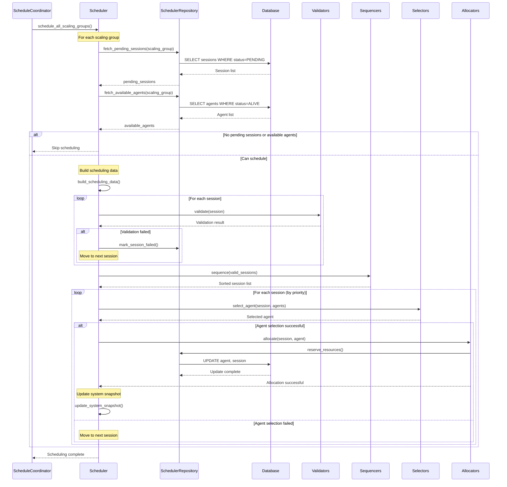
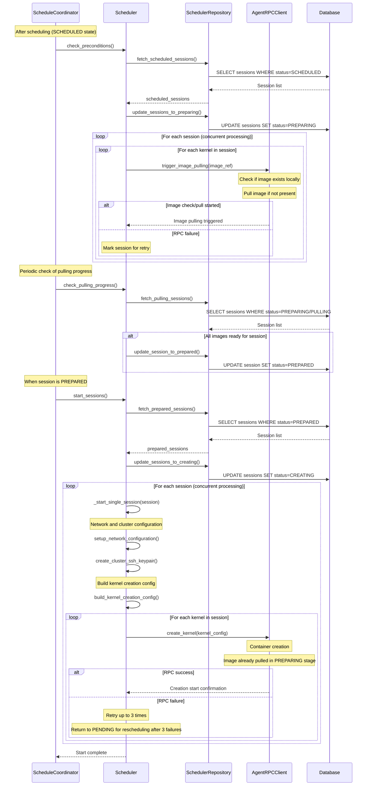
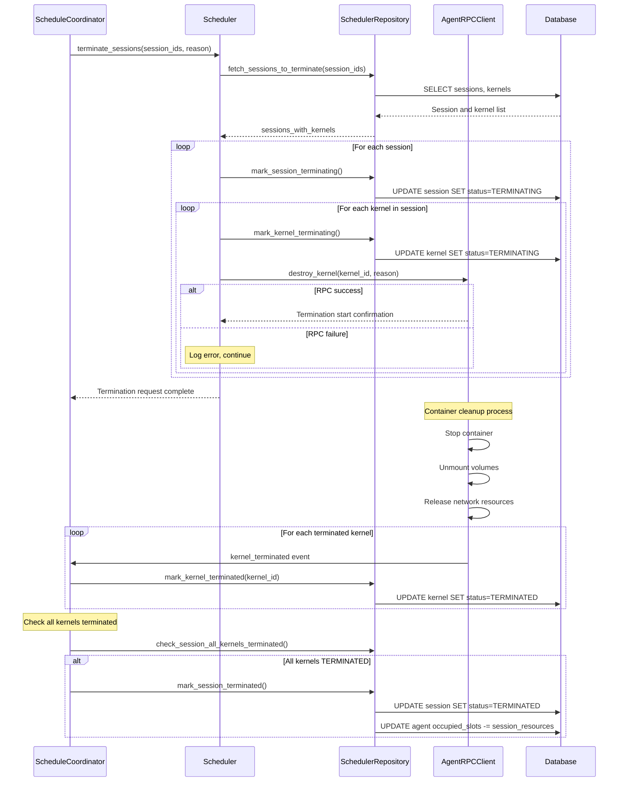

# Scheduler

← [Back to Sokovan](../README.md#sokovan-component-documentation) | [Manager](../../README.md#manager-architecture-documentation) | [Architecture Overview](../../../README.md#manager)

## Overview

Scheduler is the core module responsible for session scheduling in Backend.AI, allocating pending sessions to appropriate agents and managing the entire lifecycle of sessions.

**Key Responsibilities:**
- **Session Scheduling**: Allocates waiting sessions to available agents
- **Resource Constraint Validation**: Verifies that requested resources satisfy system constraints
- **Lifecycle Management**: Handles session start, termination, retry on failure, etc.
- **State Transition Management**: Tracks kernel state transitions (SCHEDULED → PREPARING → PULLING → PREPARED → CREATING → RUNNING → TERMINATING → TERMINATED)

## Architecture

```
┌────────────────────────────────────────────┐
│        ScheduleCoordinator                 │
│  - Orchestrates scheduling operations      │
│  - Manages state-specific handlers         │
│  - Processes and distributes events        │
└──────────────┬─────────────────────────────┘
               │
    ┌──────────┼──────────┐
    │          │          │
    ▼          ▼          ▼
┌─────────┐ ┌─────────┐ ┌─────────┐
│Scheduler│ │Handlers │ │ Kernel  │
│         │ │         │ │ State   │
│         │ │         │ │ Engine  │
└────┬────┘ └────┬────┘ └─────────┘
     │           │
     │           ├─── lifecycle/    (Session lifecycle)
     │           ├─── progress/     (Progress checking)
     │           ├─── recovery/     (Retry and recovery)
     │           └─── maintenance/  (Cleanup and sweep)
     │
     └─── Provisioner (Session provisioning plugins)
          │
          ├─── Validators   (Resource constraint validation)
          ├─── Sequencers   (Priority determination)
          ├─── Selectors    (Agent selection)
          └─── Allocators   (Resource allocation)
```

## Directory Structure

```
scheduler/
├── coordinator.py          # ScheduleCoordinator - top-level orchestrator
├── scheduler.py            # Scheduler - scheduling engine
├── factory.py              # Component factory
├── types.py                # Type definitions
├── results.py              # Result types
├── exceptions.py           # Exception definitions
│
├── provisioner/            # Session provisioning plugins
│   ├── validators/         # Resource constraint validation
│   ├── sequencers/         # Priority determination (FIFO, LIFO, DRF)
│   ├── selectors/          # Agent selection strategies
│   └── allocators/         # Resource allocation
│
├── handlers/               # State-specific handlers
│   ├── lifecycle/          # Session lifecycle (schedule, start, terminate)
│   ├── progress/           # Progress checking (pulling, creating, terminating)
│   ├── recovery/           # Retry and recovery (preparing, creating failures)
│   └── maintenance/        # Cleanup and sweep operations
│
├── hooks/                  # Session type-specific hooks
├── kernel/                 # Kernel state management
└── recorder/               # Event recording
```

## Dependencies

Scheduler depends on the following infrastructure components:

**PostgreSQL**: Persists session, kernel, agent, and scaling group states

**Redis (Valkey)**: Caches agent states, event streams

**etcd**: Shares global configuration

## Major Components

### ScheduleCoordinator

ScheduleCoordinator acts as the top-level orchestrator for session scheduling and serves as the central hub of the Scheduler layer. It periodically executes scheduling tasks and invokes appropriate processing handlers based on the current state of sessions. It receives and processes kernel-related events from agents (image pulling start/complete/fail, kernel creation/running/termination, etc.) and orchestrates image pulling operations across multiple agents.

**Key Dependencies:**
- **Scheduler**: Executes actual scheduling logic
- **SchedulingController**: Pre-validation and preparation before session creation
- **KernelStateEngine**: Manages kernel state transitions
- **SchedulerRepository**: Database access
- **State-specific Handlers**: Handles various session states (PENDING, SCHEDULED, PREPARING, RUNNING, TERMINATING, etc.)

**Key Methods:**

#### `process_schedule()`
Schedules pending sessions.

```python
async def process_schedule(self) -> None:
    """
    Process pending sessions for scheduling.
    """
```

**Processing Flow:**
1. Execute ScheduleSessionsHandler
2. Call Scheduler's schedule_all_scaling_groups()
3. Process scheduling results

#### `handle_kernel_pulling()`
Processes image pulling-related events.

```python
async def handle_kernel_pulling(
    self,
    agent_id: AgentId,
    event_name: str,
    image: str,
    *,
    image_ref: str | None = None,
    error_msg: str | None = None,
) -> None:
```

**Processing Cases:**
- `image_pull_started`: Image pulling started
- `image_pulled`: Image pulling succeeded
- `image_pull_failed`: Image pulling failed

#### `handle_kernel_creating()`, `handle_kernel_running()`, `handle_kernel_terminated()`
Process kernel lifecycle events.

### Scheduler

Scheduler is the engine that executes actual scheduling algorithms, responsible for querying pending sessions and allocating them to available agents. It provides an extensible scheduling mechanism through a plugin system, designed to flexibly change scheduling policies or algorithms. It performs session start and termination processing, confirms progress during image pulling or kernel creation, and handles retry logic on failure.

**Key Plugins and Dependencies:**
- **SessionValidator**: Validates whether resources satisfy system constraints (user/group/domain quotas, concurrent execution limits, etc.)
- **SessionSequencer**: Determines scheduling priority for pending sessions (FIFO, LIFO, DRF, etc., applicable per scaling group)
- **AgentSelector**: Selects the optimal agent for session execution (configurable per scaling group)
- **SessionAllocator**: Allocates resources to selected agents and reflects in database
- **SchedulerRepository**: Database access
- **AgentRPCPool**: RPC communication with agents
- **HookRegistry**: Executes custom logic per session type

**Core Methods:**

#### `schedule_all_scaling_groups()`
Schedules pending sessions for all scaling groups.

```python
async def schedule_all_scaling_groups(self) -> None:
    """
    Schedule sessions for all scaling groups.
    """
```

#### `terminate_sessions()`
Terminates sessions.

```python
async def terminate_sessions(
    self,
    session_ids: Sequence[SessionId],
    *,
    reason: str,
    forced: bool = False,
) -> None:
```

#### `start_sessions()`
Starts scheduled sessions.

```python
async def start_sessions(self) -> None:
    """
    Start scheduled sessions by creating kernels on agents.
    """
```

## Scheduling Processing Flow

### Complete Scheduling Process



**Step-by-Step Explanation:**

The complete scheduling process consists of five major stages. In the first stage, pending sessions and available agents are queried by scaling group. Sessions in PENDING state are retrieved from the scaling group, and agents in ALIVE state belonging to the same scaling group are queried. If there are no pending sessions or available agents, scheduling for that scaling group is skipped.

In the second stage, data needed for scheduling is constructed. Current resource usage and available resources for each agent are queried, and resource requirements requested by each pending session are analyzed. Scaling group configuration (scheduling policy, resource limits, etc.) is retrieved, and all this information is synthesized to construct an in-memory snapshot representing the current state of the entire system.

In the third stage, Validator plugins validate each session. They check resource quotas configured per user, group, and domain, verify concurrent session count limits, and confirm that inter-session dependencies are satisfied. Sessions that fail validation are immediately marked as failed and excluded from subsequent stages.

In the fourth stage, the Sequencer plugin determines priority for sessions that passed validation. It sorts sessions according to the policy configured in the scaling group (FIFO, LIFO, DRF, etc.) to decide which session to process first.

In the fifth stage, each session is processed according to sorted priority. The Selector plugin selects the optimal agent considering the session's resource requirements and agents' available resources. If an agent is selected, the Allocator plugin actually allocates resources on that agent, changes session state to SCHEDULED, and creates kernel records in PREPARING state. Whenever allocation succeeds, the in-memory system snapshot is updated to reflect the latest resource state for subsequent session scheduling.

### Session Start Flow



**Step-by-Step Explanation:**

The session start flow proceeds through three major phases: Precondition Check, Pulling Progress Check, and Session Start.

**Phase 1: Precondition Check (SCHEDULED → PREPARING)**

In the first phase, check_preconditions() queries sessions in SCHEDULED state and their kernels. For each session, it transitions the session state to PREPARING and triggers image check/pull operations on the selected agents. The agent checks if the required container image exists locally, and if not, initiates image pulling. This phase ensures all required images are available before actual kernel creation.

**Phase 2: Pulling Progress Check (PREPARING → PREPARED)**

In the second phase, check_pulling_progress() periodically queries sessions in PREPARING or PULLING state. For each session, it checks whether all kernels have their images ready. Once all images for a session are confirmed to be pulled and ready, the session state is transitioned to PREPARED. This phase monitors image pulling progress and moves sessions forward when ready.

**Phase 3: Session Start (PREPARED → CREATING)**

In the third phase, start_sessions() queries sessions in PREPARED state—sessions that have passed precondition checks and have all images ready. For cluster sessions, SSH key pairs are generated for inter-node communication, and cluster-dedicated networks are configured. All information needed for kernel creation is constructed, including image references, resource slots, environment variables, volume mounts, and network settings.

The agent's create_kernel RPC method is called for each kernel with the prepared configuration. Since images are already pulled in the PREPARING phase, the agent can immediately create and start containers without additional image pulling. Multiple kernels can be created concurrently. If RPC calls succeed, kernels transition to CREATING state, and when all kernels in a session successfully start, the session transitions to RUNNING state.

### Session Termination Flow



**Step-by-Step Explanation:**

The session termination flow consists of five stages and proceeds asynchronously. In the first stage, sessions requested for termination and all kernels belonging to those sessions are queried from the database, and the current state of each session and kernel is checked.

In the second stage, states are marked to indicate termination is in progress. The session's state is changed to TERMINATING, and the state of each kernel belonging to the session is also changed to TERMINATING. These state changes are immediately reflected in the database so other components can know that the session and kernels are terminating.

In the third stage, the destroy_kernel RPC method of the agent where each kernel is running is called. Forced or normal termination mode can be selected according to the forced flag value. Even if RPC call fails, the error is logged and processing continues with the next kernel, ensuring failure of some kernels doesn't block the entire termination process.

The fourth stage is performed on the agent side. The agent sends a SIGTERM signal to the container to attempt normal termination and waits for the configured timeout. If the container doesn't terminate within the timeout period, a SIGKILL signal is sent to force termination. After the container terminates, mounted volumes are unmounted and allocated network resources are released.

In the fifth stage, termination completion is handled. When kernel cleanup is completed, the agent publishes a kernel_terminated event, and ScheduleCoordinator receives this event to update the kernel's state to TERMINATED. When all kernels belonging to a session are in TERMINATED state, the session's state is also changed to TERMINATED and the agent's occupied_slots is decreased to release allocated resources.

## Provisioner Plugin System

Scheduler provides an extensible plugin architecture through the `provisioner/` package that allows flexible modification or extension of scheduling policies and algorithms. Each plugin type defines a clear interface, and system administrators can implement and use custom plugins as needed.

> **Note:** All provisioning plugins are located in `scheduler/provisioner/`. For detailed documentation on each plugin type, see the [Provisioner README](./provisioner/README.md).

### Validators

Validator is a plugin that validates whether resources requested by sessions satisfy system constraints.

**Basic Interface:**
```python
class SessionValidator(abc.ABC):
    @abc.abstractmethod
    async def validate(
        self,
        session: SessionWorkload,
        context: ValidationContext,
    ) -> None:
        """
        Validate the session against resource constraints.
        Raises SessionSchedulingError if validation fails.
        """
```

**Key Implementations:**

#### KeypairResourceLimitValidator

KeypairResourceLimitValidator validates resource usage limits per user (keypair). This validator queries the resources currently used by the user, and checks whether configured quotas would be exceeded when considering additional resources from the new session request. If quotas are exceeded, it stops scheduling by raising a SessionSchedulingError exception.

#### GroupResourceLimitValidator

GroupResourceLimitValidator validates resource usage limits per group. It checks whether the sum of resource usage by all users belonging to a group is within group quotas.

#### DomainResourceLimitValidator

DomainResourceLimitValidator validates resource usage limits per domain. It verifies that domain-wide resource usage doesn't exceed domain quotas.

#### ConcurrencyValidator

ConcurrencyValidator validates concurrent session count limits. It checks the concurrent session count configured per user, group, or domain, compares it with currently running session count to determine whether new session start is possible.

#### DependenciesValidator

DependenciesValidator validates inter-session dependencies. When a session depends on another session (e.g., main container depends on sidecar container), it checks whether the dependency target session exists and verifies that the session is in RUNNING state. If dependencies are not satisfied, session start is deferred.

### Sequencers

Sequencer is a plugin that determines the scheduling order for pending sessions that passed validation. Different Sequencers can be configured per scaling group to apply priority policies suited to each group's characteristics.

**Basic Interface:**
```python
class WorkloadSequencer(abc.ABC):
    @abc.abstractmethod
    def sequence(
        self,
        sessions: Sequence[SessionWorkload],
        context: SequencingContext,
    ) -> Sequence[SessionWorkload]:
        """
        Sort sessions by priority.
        """
```

**Key Implementations:**

#### FIFOSequencer (First In First Out)

FIFOSequencer sorts in order of session creation time. The earliest created session has the highest priority, performing ascending sort based on `created_at` timestamp.

#### LIFOSequencer (Last In First Out)

LIFOSequencer sorts in reverse order of session creation time. The most recently created session has the highest priority, which can be useful in some special use cases.

#### DRFSequencer (Dominant Resource Fairness)

DRFSequencer calculates priority based on resource fairness. It first calculates each user's dominant resource (the resource type used most), and assigns higher priority to sessions of users with lower dominant resource utilization. This enables fair distribution of system resources among multiple users. Among sessions of the same user, FIFO policy is applied.

### Selectors

Selector is a plugin that selects the optimal agent to execute a session. Different selection strategies can be applied according to scaling group characteristics or operational goals.

**Basic Interface:**
```python
class AgentSelector(abc.ABC):
    @abc.abstractmethod
    def select(
        self,
        session: SessionWorkload,
        agents: Sequence[AgentInfo],
        context: SelectionContext,
    ) -> AgentId | None:
        """
        Select the best agent for the session.
        Returns None if no suitable agent is found.
        """
```

**Key Implementations:**

#### ConcentratedSelector (Concentrated Placement)

ConcentratedSelector uses a strategy that concentrates resource usage to maximize efficiency. It first filters agents with sufficient available resources to provide what the session requests. Among them, it preferentially selects agents with high current resource utilization, and if utilization is equal, selects agents with smaller total resource capacity. This strategy is advantageous for maximizing resource utilization and minimizing the number of idle agents.

#### DispersedSelector (Dispersed Placement)

DispersedSelector uses a strategy that distributes resources across multiple agents to ensure high availability. Among agents with sufficient available resources, it preferentially selects agents with low current resource utilization, and if utilization is equal, selects agents with larger total resource capacity. This strategy is advantageous for minimizing impact when one agent fails and evenly distributing load across multiple agents.

#### RoundRobinSelector (Round Robin)

RoundRobinSelector uses a simple strategy that selects agents sequentially. After filtering agents with sufficient available resources, it uses an internal counter to cycle through agents for selection. This strategy provides simple implementation and predictable distribution effects.

### Allocators

Allocator is a plugin that actually allocates session resources on the agent selected by Selector. It ensures atomicity and consistency of resource allocation through database transactions.

**Basic Interface:**
```python
class SchedulingAllocator(abc.ABC):
    @abc.abstractmethod
    async def allocate(
        self,
        session: SessionWorkload,
        agent: AgentInfo,
        context: AllocationContext,
    ) -> AllocationResult:
        """
        Allocate resources for the session on the agent.
        """
```

**Key Implementations:**

#### RepositoryAllocator

RepositoryAllocator performs resource allocation through the database. It first starts a database transaction and uses SELECT FOR UPDATE query to query the agent's current resource state while simultaneously acquiring row locks. This prevents other scheduling processes from simultaneously allocating resources on the same agent.

After reconfirming resources are still sufficient, it changes the session's state to SCHEDULED and creates records for each kernel in PREPARING state. It increases the agent's occupied_slots by the resources requested by the session to reflect resource usage. If all operations succeed, the transaction is committed, and if an error occurs midway, it is automatically rolled back to maintain data consistency.

RepositoryAllocator controls concurrency through row locks via SELECT FOR UPDATE and transaction isolation level guarantees, and protects system consistency through automatic rollback on allocation failure.

### Hooks

Hook is an extension point that can execute custom logic according to session type. Different processing per session type can be performed before/after scheduling or at specific points in the session lifecycle.

**Basic Interface:**
```python
class SessionHook(abc.ABC):
    """
    Hook interface for session type-specific logic.
    """

    @abc.abstractmethod
    async def on_schedule(
        self,
        session: SessionWorkload,
        context: HookContext,
    ) -> SessionWorkload:
        """
        Called before scheduling.
        Can modify session configuration.
        """
```

**Key Implementations:**

#### InteractiveHook

InteractiveHook is for interactive sessions (Jupyter notebooks, terminals, etc.), applying configurations specific to sessions where users directly interact.

#### BatchHook

BatchHook is for batch sessions, handling configurations and processing needed for sessions performing automated tasks.

#### InferenceHook

InferenceHook is for inference sessions (model serving), applying configurations optimized for sessions providing AI models as services.

## State-Specific Handlers

ScheduleCoordinator uses multiple handlers to process various session states. Each handler performs necessary tasks for specific states or situations. Handlers are organized into four categories under `handlers/`:

### Lifecycle Handlers (`handlers/lifecycle/`)

Handlers for core session lifecycle operations.

#### ScheduleSessionsHandler
Schedules pending sessions by calling Scheduler's schedule_all_scaling_groups() method to process PENDING sessions for all scaling groups.

#### StartSessionsHandler
Starts scheduled sessions by calling Scheduler's start_sessions() method to begin actual kernel creation for sessions in SCHEDULED state.

#### TerminateSessionsHandler
Terminates sessions by querying sessions with termination requests from the database, then calling Scheduler's terminate_sessions() method to send termination RPC to agents.

### Progress Handlers (`handlers/progress/`)

Handlers for checking operation progress and handling timeouts.

#### CheckPullingProgressHandler
Checks image pulling progress. Queries sessions that have remained in PULLING state longer than the configured timeout to identify sessions where pulling is delayed or failed.

#### CheckCreatingProgressHandler
Checks kernel creation progress. Queries sessions that have remained in PREPARING state longer than the configured timeout to handle sessions where kernel creation is delayed or failed.

#### CheckTerminatingProgressHandler
Checks termination progress. Queries sessions that have remained in TERMINATING state longer than the configured timeout to attempt forced termination for sessions that didn't terminate normally.

### Recovery Handlers (`handlers/recovery/`)

Handlers for retry and recovery operations.

#### RetryPreparingHandler
Retries sessions that failed during preparation stage. Analyzes failure causes to determine if errors are retryable, returns sessions to PENDING state for scheduling retry if retryable, and cancels sessions if not retryable.

#### RetryCreatingHandler
Retries sessions that failed during creation stage. Analyzes kernel creation failure causes to determine if errors are temporary or permanent, attempts retry for temporary errors, and cancels sessions for permanent errors.

### Maintenance Handlers (`handlers/maintenance/`)

Handlers for cleanup and maintenance operations.

#### SweepSessionsHandler
Cleans up old sessions. Queries long-waiting sessions and cancels or cleans sessions according to configured policy. This removes sessions that occupy resources but aren't actually being used.

#### SweepLostAgentKernelsHandler
Sweeps kernels whose agents have been lost or are no longer available. Handles cleanup when agent connectivity is lost.

## Kernel State Engine

### KernelStateEngine

KernelStateEngine is the component that manages kernel state transitions. It updates kernel state, validates whether state transitions are valid, and synchronizes related session state according to kernel state changes.

**Key Methods:**

#### `mark_kernel_pulling()`

The mark_kernel_pulling() method transitions the kernel to PULLING state. It's called when the agent starts container image pulling, and receives kernel ID and state transition reason as parameters.

```python
async def mark_kernel_pulling(
    self,
    kernel_id: KernelId,
    reason: str,
) -> bool:
```

#### `mark_kernel_running()`

The mark_kernel_running() method transitions the kernel to RUNNING state. It's called when the container successfully starts on the agent, and receives kernel ID, state transition reason, and created kernel information (container ID, network information, etc.) as parameters.

```python
async def mark_kernel_running(
    self,
    kernel_id: KernelId,
    reason: str,
    creation_info: KernelCreationInfo,
) -> bool:
```

#### `mark_kernel_cancelled()`

The mark_kernel_cancelled() method transitions the kernel to CANCELLED state. It's called when a cancellation request comes before kernel start, and receives kernel ID, session ID, and cancellation reason as parameters. It performs special handling to transition the session itself to CANCELLED state when all kernels in the session are in CANCELLED state.

```python
async def mark_kernel_cancelled(
    self,
    kernel_id: KernelId,
    session_id: SessionId,
    reason: str,
) -> bool:
```

#### `mark_kernel_terminated()`

The mark_kernel_terminated() method transitions the kernel to TERMINATED state. It's called when the container terminates on the agent, and receives kernel ID, termination reason, and optionally the container's exit code as parameters.

```python
async def mark_kernel_terminated(
    self,
    kernel_id: KernelId,
    reason: str,
    exit_code: Optional[int] = None,
) -> bool:
```

## State Transition Details

### Session State Transitions

Sessions follow these state transition paths:

```
PENDING → SCHEDULED → PREPARING → PREPARED → CREATING → RUNNING → TERMINATING → TERMINATED
   ↓
CANCELLED
```

**Transition Condition Details:**

| Current State | Next State | Transition Trigger | Responsible Component | Failure Handling |
|----------|----------|------------|--------------|------------|
| PENDING | SCHEDULED | Scheduling success, agent allocation complete | Scheduler | CANCELLED (validation failure) |
| PENDING | CANCELLED | User cancellation request, timeout | ScheduleCoordinator | - |
| SCHEDULED | PREPARING | Precondition check started, image pull triggered | Scheduler | ERROR (RPC failure) |
| PREPARING | PREPARED | All images pulled and ready | Scheduler | CANCELLED (pulling failure) |
| PREPARED | CREATING | Kernel creation RPC started | Scheduler | ERROR (RPC failure) |
| CREATING | RUNNING | All kernels in RUNNING state | KernelStateEngine | TERMINATING (partial failure) |
| RUNNING | TERMINATING | Termination request received | Scheduler | - |
| TERMINATING | TERMINATED | All kernels TERMINATED | KernelStateEngine | - |

**Key Rules:**
- Can only directly transition to CANCELLED from PENDING state
- After SCHEDULED must transition to TERMINATED via TERMINATING
- Image pulling occurs in PREPARING phase before kernel creation
- Failure in PREPARING or CREATING treats entire session as TERMINATING

### Kernel State Transitions

Kernels follow these state transition paths:

```
SCHEDULED → PREPARING → PULLING → PREPARED → CREATING → RUNNING → TERMINATING → TERMINATED
   ↓
CANCELLED
```

**Transition Condition Details:**

| Current State | Next State | Transition Trigger | Responsible Component | Failure Handling | Retry Policy |
|----------|----------|------------|--------------|------------|------------|
| SCHEDULED | PREPARING | Session scheduled, kernel allocated | Scheduler | - | - |
| PREPARING | PULLING | Image pull RPC triggered | Scheduler | CANCELLED | 3 retries |
| PULLING | PREPARED | Image pulling complete | Agent → Event | CANCELLED | Reschedule |
| PREPARED | CREATING | Kernel creation RPC started | Scheduler | CANCELLED | 3 retries |
| CREATING | RUNNING | Container created and started | Agent → Event | CANCELLED | Reschedule |
| SCHEDULED | CANCELLED | Cancellation request before image pull | KernelStateEngine | - | - |
| PREPARING | CANCELLED | Cancellation request during image pull trigger | KernelStateEngine | - | - |
| PULLING | CANCELLED | Cancellation request during image pulling | KernelStateEngine | - | - |
| PREPARED | CANCELLED | Cancellation request before kernel creation | KernelStateEngine | - | - |
| CREATING | CANCELLED | Cancellation request during kernel creation | KernelStateEngine | - | - |
| RUNNING | TERMINATING | Termination RPC called | Scheduler | - | - |
| TERMINATING | TERMINATED | Container cleanup complete | Agent → Event | - | Force terminate |

**Retry Policies:**

**PREPARING stage failure** (image pull trigger RPC failure):
- Up to 3 retries in same stage
- After 3 failures: Return session to PENDING state for rescheduling (attempt assignment to different agent)

**PULLING stage failure** (image pulling failure):
- Up to 3 retries in same stage
- After 3 failures: Return session to PENDING state for rescheduling

**CREATING stage failure** (kernel creation RPC failure):
- Up to 3 retries in same stage
- After 3 failures: Return session to PENDING state for rescheduling (attempt assignment to different agent)

**PENDING timeout**:
- Automatically transition to CANCELLED state if not scheduled within configured time
- Timeout duration can be configured per scaling group

**Termination failure** (TERMINATING stage):
- Force terminate (SIGKILL) after timeout

## Troubleshooting

### 1. Session Stuck in PENDING State

**Symptoms**:
- Session remains in PENDING state for extended time

**Causes**:
- Insufficient available agents in scaling group
- Agent resource shortage
- Resource quota exceeded

**Diagnosis**:
- **Check Session History**: Review Session History on session detail page to identify cause of persistent PENDING state
- **Scaling Group Status**: Check agent count and state in scaling group
- **Resource Availability**: Check available resources per agent

**Resolution**:
1. Add agents to scaling group
2. Check and recover agent state
3. Adjust resource quotas

### 2. Kernel Stuck in PULLING State

**Symptoms**:
- Kernel remains in PULLING state for extended time

**Causes**:
- Image registry access failure
- Agent disk space shortage
- Network connection issues

**Diagnosis**:
- **Check Session History**: Review image pulling-related events and error messages
- **Agent State**: Check agent disk usage and network state

**Resolution**:
1. Verify image registry connection
2. Free agent disk space
3. Wait for automatic retry on timeout

### 3. Kernel Repeatedly Fails in PREPARING

**Symptoms**:
- Kernel creation repeatedly fails
- Returns to PENDING after exceeding retry count

**Causes**:
- Container image errors
- Agent resource shortage
- Session configuration errors

**Diagnosis**:
- **Check Session History**: Review kernel creation failure reasons and retry history
- **Image Validity**: Verify the image being used is correct
- **Agent State**: Check agent resource state

**Resolution**:
1. Validate and fix image
2. Review session configuration (environ, mounts, etc.)
3. Secure agent resources

### 4. Session Termination Not Completing

**Symptoms**:
- Stuck in TERMINATING state
- Resources not released

**Causes**:
- No agent RPC response
- Container force termination failure

**Diagnosis**:
- **Check Session History**: Review termination progress and failure reasons
- **Agent Connection State**: Check agent connection state and responsiveness

**Resolution**:
1. Wait for automatic force termination after timeout
2. Check and recover agent connection state
3. Manually clean up session if necessary

## Parent Document
- [Sokovan Overall Architecture](../README.md)

## Related Documents
- [Deployment Architecture](../deployment/README.md)
- [SchedulingController Architecture](../scheduling_controller/README.md)
