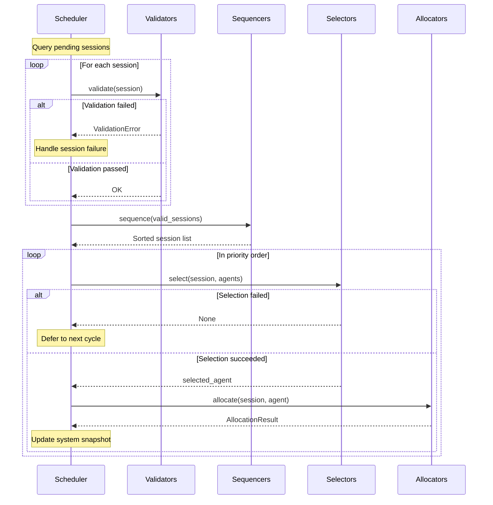

# Provisioner

← [Back to Scheduler](../README.md)

## Overview

Provisioner is a package that provides the core plugin system for session scheduling. It contains four plugin types that comprise the entire provisioning pipeline for allocating pending sessions to appropriate agents.

**Key Responsibilities:**
- **Resource Constraint Validation**: Verify sessions meet system constraints
- **Priority Determination**: Decide scheduling order
- **Agent Selection**: Select optimal agents
- **Resource Allocation**: Perform actual resource allocation

## Architecture

```
                    ┌─────────────────┐
                    │ Pending Session │
                    └────────┬────────┘
                             │
                             ▼
┌────────────────────────────────────────────────────┐
│                   Validators                        │
│  Verify resource quotas, concurrency limits,        │
│  dependencies, etc.                                 │
│  (Session scheduling stops on failure)              │
└────────────────────────────────────────────────────┘
                             │
                             ▼ (Sessions that passed validation)
┌────────────────────────────────────────────────────┐
│                   Sequencers                        │
│  Sort by priority according to FIFO, LIFO, DRF     │
│  policies                                           │
└────────────────────────────────────────────────────┘
                             │
                             ▼ (In sorted order)
┌────────────────────────────────────────────────────┐
│                   Selectors                         │
│  Select agent using concentrated/dispersed/         │
│  round-robin strategies                             │
└────────────────────────────────────────────────────┘
                             │
                             ▼ (Selected agent)
┌────────────────────────────────────────────────────┐
│                   Allocators                        │
│  Map session to agent, create kernels,              │
│  record resource occupancy                          │
└────────────────────────────────────────────────────┘
                             │
                             ▼
                    ┌─────────────────┐
                    │ Scheduled Session│
                    └─────────────────┘
```

## Directory Structure

```
provisioner/
├── __init__.py
├── README.md
│
├── validators/          # Resource constraint validation
│   ├── validator.py     # Base classes
│   ├── exceptions.py    # Validation exceptions
│   ├── keypair_resource_limit.py
│   ├── group_resource_limit.py
│   ├── domain_resource_limit.py
│   ├── user_resource_limit.py
│   ├── concurrency.py
│   ├── dependencies.py
│   └── ...
│
├── sequencers/          # Priority determination
│   ├── sequencer.py     # WorkloadSequencer base class
│   ├── fifo.py          # First-In-First-Out
│   ├── lifo.py          # Last-In-First-Out
│   └── drf.py           # Dominant Resource Fairness
│
├── selectors/           # Agent selection
│   ├── selector.py      # AgentSelector base class
│   ├── exceptions.py    # Selection exceptions
│   ├── concentrated.py  # Concentrated placement
│   ├── dispersed.py     # Dispersed placement
│   ├── roundrobin.py    # Round-robin
│   └── ...
│
└── allocators/          # Resource allocation
    ├── allocator.py     # SchedulingAllocator base class
    └── repository_allocator.py  # DB-based allocation
```

## Plugin Types

### 1. Validators

Validates resource constraints before sessions are scheduled.

**Execution Point:** First stage of the scheduling pipeline

**Behavior:**
- All Validators execute sequentially
- If any fails, the session is excluded from scheduling
- Failure reasons are recorded and communicated to users

**Key Implementations:**
| Validator | Description |
|-----------|-------------|
| KeypairResourceLimitValidator | Per-user (keypair) resource quota validation |
| GroupResourceLimitValidator | Per-group resource quota validation |
| DomainResourceLimitValidator | Per-domain resource quota validation |
| UserResourceLimitValidator | Per-user resource quota validation |
| ConcurrencyValidator | Concurrent session count limit validation |
| DependenciesValidator | Inter-session dependency validation |
| PendingSessionCountLimitValidator | Pending session count limit validation |
| PendingSessionResourceLimitValidator | Pending session resource limit validation |
| ReservedBatchSessionValidator | Reserved batch session validation |

→ Details: [validators/README.md](./validators/README.md)

### 2. Sequencers

Determines scheduling order for sessions that passed validation.

**Execution Point:** After Validators pass

**Behavior:**
- Uses Sequencer configured per scaling group
- Receives session list and returns sorted by priority

**Key Implementations:**
| Sequencer | Description |
|-----------|-------------|
| FIFOSequencer | Earlier created sessions first (First-In-First-Out) |
| LIFOSequencer | Later created sessions first (Last-In-First-Out) |
| DRFSequencer | Resource fairness-based priority (Dominant Resource Fairness) |

→ Details: [sequencers/README.md](./sequencers/README.md)

### 3. Selectors

Selects the optimal agent to run a session.

**Execution Point:** Executed for each session in Sequencer-sorted order

**Behavior:**
- Uses Selector configured per scaling group
- Selects agent from agent list that meets session requirements
- On selection failure, session is deferred to next scheduling cycle

**Key Implementations:**
| Selector | Description |
|----------|-------------|
| ConcentratedSelector | Maximize utilization by concentrating resources |
| DispersedSelector | Ensure high availability by dispersing resources |
| RoundRobinSelector | Sequential agent rotation |
| LegacySelector | Legacy scheduler compatible selector |

→ Details: [selectors/README.md](./selectors/README.md)

### 4. Allocators

Actually allocates resources on the agent selected by Selector.

**Execution Point:** Immediately after Selector selects an agent

**Behavior:**
- Atomic allocation via database transactions
- Changes session status to SCHEDULED
- Creates kernel records
- Updates agent's occupied_slots

**Key Implementations:**
| Allocator | Description |
|-----------|-------------|
| RepositoryAllocator | DB transaction-based resource allocation |

→ Details: [allocators/README.md](./allocators/README.md)

## Scheduling Pipeline Flow



## Writing Custom Plugins

### Validator Example

```python
from ai.backend.manager.sokovan.scheduler.provisioner.validators.validator import ValidatorRule
from ai.backend.manager.sokovan.scheduler.provisioner.validators.exceptions import SchedulingValidationError

class CustomValidator(ValidatorRule):
    async def validate(
        self,
        session: SessionWorkload,
        system_snapshot: SystemSnapshot,
    ) -> None:
        if not self._check_custom_condition(session):
            raise SchedulingValidationError(
                "Custom validation failed",
                session_id=session.session_id,
            )
```

### Sequencer Example

```python
from ai.backend.manager.sokovan.scheduler.provisioner.sequencers.sequencer import WorkloadSequencer

class CustomSequencer(WorkloadSequencer):
    def sequence(
        self,
        sessions: Sequence[SessionWorkload],
        context: SequencingContext,
    ) -> Sequence[SessionWorkload]:
        return sorted(sessions, key=lambda s: self._custom_priority(s))
```

### Selector Example

```python
from ai.backend.manager.sokovan.scheduler.provisioner.selectors.selector import AgentSelector

class CustomSelector(AgentSelector):
    def select(
        self,
        session: SessionWorkload,
        agents: Sequence[AgentInfo],
        context: SelectionContext,
    ) -> AgentId | None:
        for agent in agents:
            if self._matches_custom_criteria(session, agent):
                return agent.agent_id
        return None
```

## Configuration

Each plugin is configured per scaling group:

```python
# In scaling group configuration
scaling_group_config = {
    "scheduler": "fifo",           # Sequencer selection
    "scheduler_opts": {
        "agent_selector": "dispersed",  # Selector selection
    },
}
```

## Related Documents

- [Scheduler README](../README.md) - Overall scheduler architecture
- [validators/README.md](./validators/README.md) - Validator details
- [sequencers/README.md](./sequencers/README.md) - Sequencer details
- [selectors/README.md](./selectors/README.md) - Selector details
- [allocators/README.md](./allocators/README.md) - Allocator details
