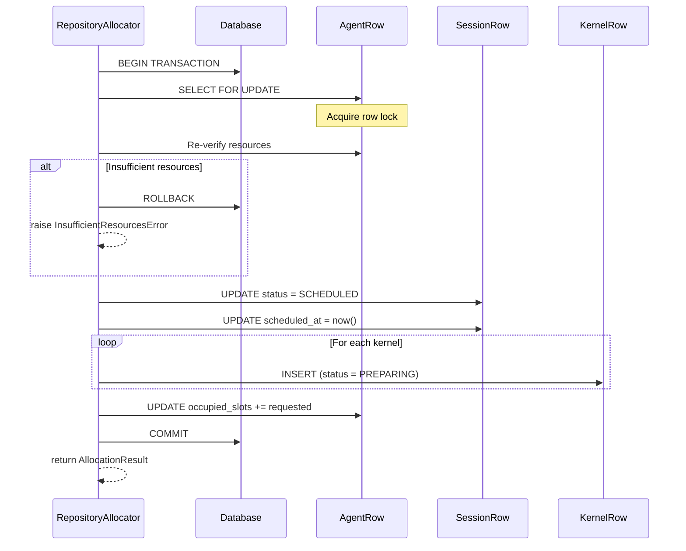

# Allocators

← [Back to Provisioner](../README.md) | [Scheduler](../../README.md)

## Overview

Allocators are plugins that actually allocate resources on the agent selected by the Selector. As the final stage of the scheduling pipeline, they guarantee atomic resource allocation through database transactions.

**Key Responsibilities:**
- Changing session status to SCHEDULED
- Creating kernel records (PREPARING status)
- Updating agent occupied_slots
- Transaction-based atomic allocation

## Architecture

```
┌───────────────────────────────────────┐
│   Selector Result (Session + Agent)   │
└─────────────────┬─────────────────────┘
                  │
                  ▼
┌───────────────────────────────────────┐
│         SchedulingAllocator           │
│                                       │
│  ┌─────────────────────────────────┐  │
│  │     Database Transaction        │  │
│  │  ┌───────────────────────────┐  │  │
│  │  │ 1. Lock Agent Row         │  │  │
│  │  │ 2. Verify Resources       │  │  │
│  │  │ 3. Update Session Status  │  │  │
│  │  │ 4. Create Kernel Records  │  │  │
│  │  │ 5. Update Agent Slots     │  │  │
│  │  │ 6. Commit                 │  │  │
│  │  └───────────────────────────┘  │  │
│  └─────────────────────────────────┘  │
└─────────────────┬─────────────────────┘
                  │
                  ▼
┌───────────────────────────────────────┐
│        AllocationResult               │
│  - scheduled_session                  │
│  - created_kernels                    │
└───────────────────────────────────────┘
```

## Core Classes

### SchedulingAllocator (Abstract Base)

Base class for all Allocators.

```python
class SchedulingAllocator(abc.ABC):
    @abc.abstractmethod
    async def allocate(
        self,
        session: SessionWorkload,
        agent_selection: AgentSelection,
        context: AllocationContext,
    ) -> AllocationResult:
        """
        Allocate session resources on the selected agent.

        Args:
            session: Session to allocate
            agent_selection: Agent information selected by Selector
            context: Allocation context

        Returns:
            Allocation result (including created kernel information)

        Raises:
            AllocationError: On allocation failure
        """
        pass
```

### AllocationResult

Data class containing allocation results.

```python
@dataclass
class AllocationResult:
    session_id: SessionId
    scheduled_at: datetime
    kernels: list[KernelInfo]
    agent_allocations: dict[AgentId, ResourceSlot]
```

## Implementations

### RepositoryAllocator

Database transaction-based resource allocator.

**Features:**
- Concurrency control with SELECT FOR UPDATE
- Data consistency guaranteed by transaction isolation
- Automatic rollback on failure

**Allocation Process:**



**Concurrency Control:**

```python
async def allocate(self, session, agent_selection, context):
    async with self._db.begin_session() as db_sess:
        # SELECT FOR UPDATE - Lock agent row
        agent = await db_sess.execute(
            sa.select(AgentRow)
            .where(AgentRow.id == agent_selection.agent_id)
            .with_for_update()
        )

        # Re-verify resources (another transaction may have allocated first)
        if not self._has_sufficient_resources(agent, session):
            raise InsufficientResourcesError()

        # Perform allocation
        await self._update_session_status(db_sess, session)
        await self._create_kernels(db_sess, session, agent)
        await self._update_agent_slots(db_sess, agent, session)

        # Transaction commit (automatic)
        return AllocationResult(...)
```

## Allocation Steps in Detail

### 1. Agent Row Locking

```sql
SELECT * FROM agents
WHERE id = :agent_id
FOR UPDATE
```

- Prevents concurrent modifications by other transactions
- Guarantees serialized allocation on the same agent

### 2. Resource Re-verification

Resources may have been allocated by another transaction after Selector selection, so re-verification is needed.

```python
def _has_sufficient_resources(self, agent: AgentRow, session: SessionWorkload) -> bool:
    available = agent.available_slots - agent.occupied_slots
    return available >= session.requested_slots
```

### 3. Session Status Change

```sql
UPDATE sessions
SET status = 'SCHEDULED',
    scheduled_at = NOW()
WHERE id = :session_id
```

### 4. Kernel Record Creation

Create records in PREPARING status for each kernel:

```sql
INSERT INTO kernels (
    id, session_id, agent, status, created_at
) VALUES (
    :kernel_id, :session_id, :agent_id, 'PREPARING', NOW()
)
```

### 5. Agent Resource Update

```sql
UPDATE agents
SET occupied_slots = occupied_slots + :requested_slots
WHERE id = :agent_id
```

## Cluster Session Allocation

Cluster sessions are distributed across multiple agents.

```python
async def allocate_cluster(
    self,
    session: SessionWorkload,
    kernel_allocations: list[tuple[KernelSpec, AgentId]],
    context: AllocationContext,
) -> AllocationResult:
    async with self._db.begin_session() as db_sess:
        # Lock all related agents
        agent_ids = {alloc[1] for alloc in kernel_allocations}
        agents = await self._lock_agents(db_sess, agent_ids)

        # Allocate each kernel
        for kernel_spec, agent_id in kernel_allocations:
            await self._allocate_kernel(db_sess, kernel_spec, agents[agent_id])

        # Update session status
        await self._update_session_status(db_sess, session)

        return AllocationResult(...)
```

## Error Handling

### On Allocation Failure

```python
try:
    result = await allocator.allocate(session, selection, context)
except InsufficientResourcesError:
    # Retry with different agent or defer to next scheduling cycle
    log.warning("Resource exhausted during allocation, will retry")
except AllocationError as e:
    # Handle session failure
    await self._mark_session_failed(session, reason=str(e))
```

### Transaction Rollback

```python
async with self._db.begin_session() as db_sess:
    try:
        # Allocation operations
        ...
    except Exception:
        # Automatic rollback (context manager)
        raise
```

## Writing Custom Allocators

### 1. Inherit SchedulingAllocator

```python
from ai.backend.manager.sokovan.scheduler.provisioner.allocators.allocator import SchedulingAllocator

class CustomAllocator(SchedulingAllocator):
    async def allocate(
        self,
        session: SessionWorkload,
        agent_selection: AgentSelection,
        context: AllocationContext,
    ) -> AllocationResult:
        async with self._db.begin_session() as db_sess:
            # Custom allocation logic
            ...
```

### 2. Additional Allocation Operations

```python
class EnhancedAllocator(RepositoryAllocator):
    async def allocate(self, session, agent_selection, context):
        result = await super().allocate(session, agent_selection, context)

        # Additional: Record monitoring metrics
        await self._record_allocation_metrics(result)

        # Additional: Send notification
        await self._notify_allocation(result)

        return result
```

## Performance Considerations

### Row Locking Optimization

- Lock only necessary rows (minimal scope)
- Minimize lock duration
- Consistent lock ordering to prevent deadlocks

### Batch Allocation

When allocating multiple sessions at once:

```python
async def allocate_batch(self, sessions: list[SessionWorkload]) -> list[AllocationResult]:
    # Group by agent
    by_agent = groupby(sessions, key=lambda s: s.assigned_agent)

    results = []
    for agent_id, agent_sessions in by_agent:
        async with self._db.begin_session() as db_sess:
            agent = await self._lock_agent(db_sess, agent_id)
            for session in agent_sessions:
                result = await self._allocate_single(db_sess, session, agent)
                results.append(result)

    return results
```

## Related Documents

- [Provisioner README](../README.md)
- [Scheduler README](../../README.md)
- [Selectors README](../selectors/README.md) - Agent selection process
