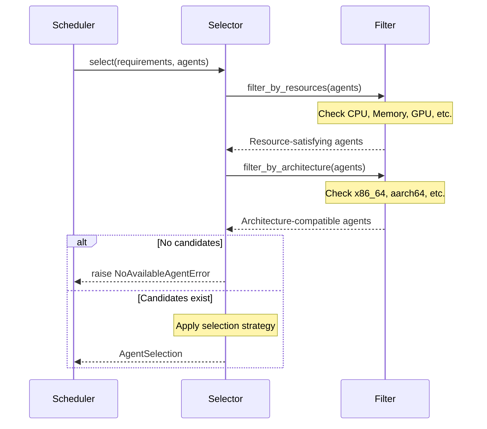

# Selectors

← [Back to Provisioner](../README.md) | [Scheduler](../../README.md)

## Overview

Selectors are plugins that select the optimal agent to run a session. Different selection strategies can be applied per scaling group, providing agent selection tailored to various objectives such as cluster utilization, high availability, and load balancing.

**Key Responsibilities:**
- Filtering agents that satisfy resource requirements
- Selecting optimal agent based on selection strategy
- Multi-agent selection for cluster sessions

## Architecture

```
┌───────────────────────────────────────┐
│     Session (Resource Requirements)   │
└─────────────────┬─────────────────────┘
                  │
                  ▼
┌───────────────────────────────────────┐
│           AgentSelector               │
│  1. Filter available agents           │
│  2. Apply selection strategy          │
│  3. Return optimal agent              │
└─────────────────┬─────────────────────┘
                  │
        ┌─────────┼─────────┬─────────┐
        │         │         │         │
        ▼         ▼         ▼         ▼
┌──────────┐ ┌──────────┐ ┌──────────┐ ┌──────────┐
│Concentrated│ │Dispersed│ │RoundRobin│ │ Legacy  │
│(Bin-pack) │ │(Spread) │ │(Rotation)│ │(Compat) │
└──────────┘ └──────────┘ └──────────┘ └──────────┘
```

## Core Classes

### AgentInfo

Data class containing agent information.

```python
@dataclass
class AgentInfo:
    agent_id: AgentId
    available_slots: ResourceSlot    # Available resources
    occupied_slots: ResourceSlot     # Resources in use
    architecture: str                # CPU architecture
    # ... other attributes
```

### ResourceRequirements

Defines resource requirements for a session.

```python
@dataclass
class ResourceRequirements:
    requested_slots: ResourceSlot    # Requested resources
    architecture: str | None         # Required architecture
    # ... other requirements
```

### AgentSelector (Abstract Base)

Base class for all Selectors.

```python
class AgentSelector(abc.ABC):
    @abc.abstractmethod
    def select(
        self,
        requirements: ResourceRequirements,
        agents: Sequence[AgentInfo],
        criteria: AgentSelectionCriteria,
    ) -> AgentSelection:
        """
        Select the optimal agent that satisfies session requirements.

        Args:
            requirements: Session resource requirements
            agents: Candidate agent list
            criteria: Selection criteria settings

        Returns:
            Selected agent information

        Raises:
            NoAvailableAgentError: No agent satisfies conditions
        """
        pass
```

## Implementations

### ConcentratedSelector (Bin-packing)

Concentrates resources on specific agents to maximize utilization.

**Algorithm:**
1. Filter agents that satisfy resource requirements
2. Prioritize agents with higher current occupancy
3. If occupancy is equal, select agent with smaller total capacity

**Advantages:**
- Maximizes cluster utilization
- Minimizes idle agents
- Power/cost efficiency

**Disadvantages:**
- Load concentration on specific agents
- Increased impact scope on agent failure

```
Agent Status:
  Agent A: [████████░░] 80% used
  Agent B: [████░░░░░░] 40% used
  Agent C: [░░░░░░░░░░] 0% used

Selection Result: Agent A (highest occupancy)
```

### DispersedSelector (Spreading)

Distributes resources across multiple agents for high availability.

**Algorithm:**
1. Filter agents that satisfy resource requirements
2. Prioritize agents with lower current occupancy
3. If occupancy is equal, select agent with larger total capacity

**Advantages:**
- Ensures high availability
- Minimizes impact on agent failure
- Balanced load distribution

**Disadvantages:**
- Potential resource fragmentation
- Reduced cluster efficiency

```
Agent Status:
  Agent A: [████████░░] 80% used
  Agent B: [████░░░░░░] 40% used
  Agent C: [░░░░░░░░░░] 0% used

Selection Result: Agent C (lowest occupancy)
```

### RoundRobinSelector (Sequential Rotation)

Selects agents sequentially in rotation.

**Algorithm:**
1. Filter agents that satisfy resource requirements
2. Select next agent based on internal counter
3. Increment and cycle counter

**Advantages:**
- Predictable distribution
- Simple implementation
- Equal request distribution

**Disadvantages:**
- Does not consider agent capacity differences
- Does not reflect dynamic load changes

```
Selection Order:
  Request 1 → Agent A
  Request 2 → Agent B
  Request 3 → Agent C
  Request 4 → Agent A (cycle)
```

### LegacySelector (Compatibility Mode)

Selector for compatibility with existing scheduler.

**Features:**
- Maintains existing scheduler logic
- Supports gradual migration
- Compatible with existing configurations

## Exception Hierarchy

```
AgentSelectionError (base)
├── NoAvailableAgentError        # No available agents
├── NoCompatibleAgentError       # No compatible agents
├── ArchitectureIncompatibleError # Architecture mismatch
├── InsufficientResourcesError   # Insufficient resources
├── ContainerLimitExceededError  # Container count limit exceeded
└── TrackerCompatibilityError    # Tracker compatibility error
```

## Selection Process



## Cluster Session Support

Cluster sessions (sessions composed of multiple kernels) require multi-agent selection.

```python
# Cluster session example
cluster_size = 4  # Cluster requiring 4 kernels

# Selector selects agent for each kernel
for kernel_idx in range(cluster_size):
    selection = selector.select(
        requirements=kernel_requirements[kernel_idx],
        agents=available_agents,
        criteria=criteria,
    )
    # Update selected agent's resource state
    tracker.allocate(selection.agent_id, kernel_requirements[kernel_idx])
```

## Writing Custom Selectors

### 1. Inherit AgentSelector

```python
from ai.backend.manager.sokovan.scheduler.provisioner.selectors.selector import AgentSelector

class AffinitySelector(AgentSelector):
    """Image affinity-based selection"""

    def select(
        self,
        requirements: ResourceRequirements,
        agents: Sequence[AgentInfo],
        criteria: AgentSelectionCriteria,
    ) -> AgentSelection:
        # 1. Basic filtering
        candidates = self._filter_by_resources(agents, requirements)

        if not candidates:
            raise NoAvailableAgentError()

        # 2. Prioritize agents that already have the image
        for agent in candidates:
            if requirements.image in agent.cached_images:
                return AgentSelection(agent_id=agent.agent_id)

        # 3. Select first candidate if none have image
        return AgentSelection(agent_id=candidates[0].agent_id)
```

### 2. Weight-based Selection

```python
class WeightedSelector(AgentSelector):
    """Multi-factor weight-based selection"""

    def __init__(
        self,
        utilization_weight: float = 0.4,
        affinity_weight: float = 0.3,
        locality_weight: float = 0.3,
    ):
        self._weights = {
            "utilization": utilization_weight,
            "affinity": affinity_weight,
            "locality": locality_weight,
        }

    def select(
        self,
        requirements: ResourceRequirements,
        agents: Sequence[AgentInfo],
        criteria: AgentSelectionCriteria,
    ) -> AgentSelection:
        candidates = self._filter_by_resources(agents, requirements)

        if not candidates:
            raise NoAvailableAgentError()

        # Calculate score for each agent
        scored = [
            (agent, self._calculate_score(agent, requirements))
            for agent in candidates
        ]

        # Select agent with highest score
        best_agent = max(scored, key=lambda x: x[1])[0]
        return AgentSelection(agent_id=best_agent.agent_id)
```

## Configuration

Configure Selector per scaling group:

```python
scaling_group = {
    "name": "gpu-cluster",
    "scheduler": "fifo",
    "scheduler_opts": {
        "agent_selector": "concentrated",  # Selection strategy
    },
}
```

**Configuration Options:**

| Option | Description | Recommended Use Case |
|--------|-------------|---------------------|
| `concentrated` | Bin-packing | GPU clusters, cost optimization |
| `dispersed` | Spreading | High availability requirements, production |
| `roundrobin` | Sequential rotation | Development/test environments |
| `legacy` | Compatibility mode | Migration period |

## Performance Considerations

- Agent filtering has O(n) complexity
- Sorting-based selection has O(n log n) complexity
- Consider caching for large clusters

## Related Documents

- [Provisioner README](../README.md)
- [Scheduler README](../../README.md)
- [Allocators README](../allocators/README.md) - Post-selection allocation process
