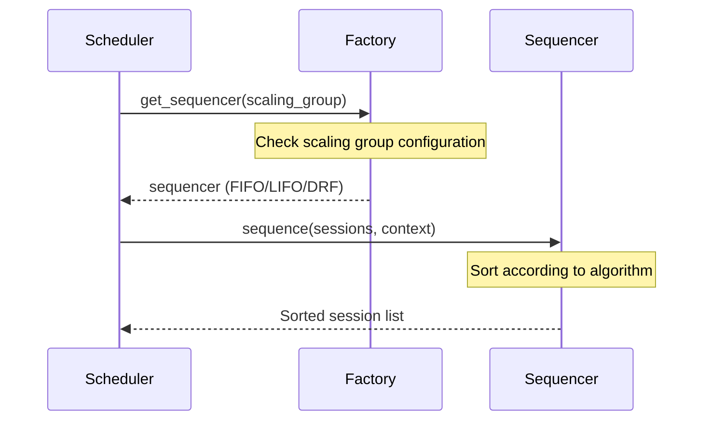

# Sequencers

← [Back to Provisioner](../README.md) | [Scheduler](../../README.md)

## Overview

Sequencers are plugins that determine the scheduling order of pending sessions that passed validation. Different policies can be applied per scaling group, controlling the resource allocation order by determining session priorities.

**Key Responsibilities:**
- Determining pending session priorities
- Fair resource distribution
- Custom policy per scaling group

## Architecture

```
┌───────────────────────────────────────┐
│       Validated Session List          │
│   [Session A, Session B, Session C]   │
└─────────────────┬─────────────────────┘
                  │
                  ▼
┌───────────────────────────────────────┐
│          WorkloadSequencer            │
│   (Selected based on scaling group)   │
└─────────────────┬─────────────────────┘
                  │
        ┌─────────┼─────────┐
        │         │         │
        ▼         ▼         ▼
   ┌────────┐ ┌────────┐ ┌────────┐
   │  FIFO  │ │  LIFO  │ │  DRF   │
   └────────┘ └────────┘ └────────┘
                  │
                  ▼
┌───────────────────────────────────────┐
│         Sorted Session List           │
│   [Session B, Session A, Session C]   │
└───────────────────────────────────────┘
```

## Core Classes

### WorkloadSequencer (Abstract Base)

Base class for all Sequencers.

```python
class WorkloadSequencer(abc.ABC):
    @abc.abstractmethod
    def sequence(
        self,
        workloads: Sequence[SessionWorkload],
        context: SequencingContext,
    ) -> Sequence[SessionWorkload]:
        """
        Sort the session list by priority.

        Args:
            workloads: List of sessions to sort
            context: Context information needed for sorting

        Returns:
            Session list sorted by priority
        """
        pass
```

## Implementations

### FIFOSequencer (First-In-First-Out)

Schedules earlier created sessions first.

**Algorithm:**
- Sort in ascending order by `created_at` timestamp
- Longest waiting session has highest priority

**Use Cases:**
- When fair waiting order guarantee is needed
- General work queue processing

```python
class FIFOSequencer(WorkloadSequencer):
    def sequence(
        self,
        workloads: Sequence[SessionWorkload],
        context: SequencingContext,
    ) -> Sequence[SessionWorkload]:
        return sorted(workloads, key=lambda w: w.created_at)
```

**Sorting Example:**
```
Input:  [Session(created=10:03), Session(created=10:01), Session(created=10:02)]
Output: [Session(created=10:01), Session(created=10:02), Session(created=10:03)]
```

### LIFOSequencer (Last-In-First-Out)

Schedules later created sessions first.

**Algorithm:**
- Sort in descending order by `created_at` timestamp
- Most recently requested session has highest priority

**Use Cases:**
- When latest request priority is needed
- Interactive workloads where real-time response is important

```python
class LIFOSequencer(WorkloadSequencer):
    def sequence(
        self,
        workloads: Sequence[SessionWorkload],
        context: SequencingContext,
    ) -> Sequence[SessionWorkload]:
        return sorted(workloads, key=lambda w: w.created_at, reverse=True)
```

**Sorting Example:**
```
Input:  [Session(created=10:03), Session(created=10:01), Session(created=10:02)]
Output: [Session(created=10:03), Session(created=10:02), Session(created=10:01)]
```

### DRFSequencer (Dominant Resource Fairness)

Determines priority based on resource fairness.

**Algorithm:**
1. Calculate each user's "dominant resource" (resource type most heavily used)
2. Assign higher priority to sessions from users with lower dominant resource usage
3. Apply FIFO policy among sessions from the same user

**Dominant Resource Calculation:**
```
User A: CPU 50% used, Memory 30% used → Dominant = CPU (50%)
User B: CPU 20% used, Memory 60% used → Dominant = Memory (60%)

→ User A's session gets priority (lower dominant resource usage)
```

**Use Cases:**
- Fair resource distribution in multi-user environments
- Preventing resource monopolization by specific users
- Cluster utilization optimization

```python
class DRFSequencer(WorkloadSequencer):
    def sequence(
        self,
        workloads: Sequence[SessionWorkload],
        context: SequencingContext,
    ) -> Sequence[SessionWorkload]:
        # Calculate dominant resource per user
        user_dominant = self._calculate_dominant_resources(context)

        # Sort by dominant resource usage
        return sorted(
            workloads,
            key=lambda w: (
                user_dominant.get(w.access_key, 0.0),  # Primary: dominant resource
                w.created_at,  # Secondary: creation time (FIFO)
            )
        )
```

**Sorting Example:**
```
Input:
  - Session A (User1, dominant=0.5, created=10:01)
  - Session B (User2, dominant=0.3, created=10:02)
  - Session C (User1, dominant=0.5, created=10:03)

Output:
  - Session B (dominant=0.3) ← Highest priority
  - Session A (dominant=0.5, created=10:01)
  - Session C (dominant=0.5, created=10:03)
```

## Selection Flow



## Writing Custom Sequencers

### 1. Inherit WorkloadSequencer

```python
from ai.backend.manager.sokovan.scheduler.provisioner.sequencers.sequencer import WorkloadSequencer

class PrioritySequencer(WorkloadSequencer):
    """Priority field-based sorting"""

    def sequence(
        self,
        workloads: Sequence[SessionWorkload],
        context: SequencingContext,
    ) -> Sequence[SessionWorkload]:
        return sorted(
            workloads,
            key=lambda w: (
                -w.priority,      # Primary: priority (higher value first)
                w.created_at,     # Secondary: creation time (FIFO)
            )
        )
```

### 2. Apply Composite Sorting Criteria

```python
class WeightedSequencer(WorkloadSequencer):
    """Weight-based composite sorting"""

    def __init__(self, wait_time_weight: float = 0.5, resource_weight: float = 0.5):
        self._wait_time_weight = wait_time_weight
        self._resource_weight = resource_weight

    def sequence(
        self,
        workloads: Sequence[SessionWorkload],
        context: SequencingContext,
    ) -> Sequence[SessionWorkload]:
        now = datetime.now()

        def calculate_score(w: SessionWorkload) -> float:
            wait_time = (now - w.created_at).total_seconds()
            resource_size = sum(w.requested_slots.values())

            # Higher score for longer wait time and smaller resource request
            return (
                self._wait_time_weight * wait_time +
                self._resource_weight * (1 / resource_size)
            )

        return sorted(workloads, key=calculate_score, reverse=True)
```

### 3. Register in Factory

```python
def get_sequencer(self, scheduler_name: str) -> WorkloadSequencer:
    match scheduler_name:
        case "fifo":
            return FIFOSequencer()
        case "lifo":
            return LIFOSequencer()
        case "drf":
            return DRFSequencer()
        case "priority":
            return PrioritySequencer()  # Add custom
        case _:
            return FIFOSequencer()
```

## Configuration

Configure Sequencer per scaling group:

```python
# Scaling group configuration
scaling_group = {
    "name": "default",
    "scheduler": "fifo",  # Choose from "fifo", "lifo", "drf"
}
```

**Configuration Options:**

| Option | Description | Default |
|--------|-------------|---------|
| `fifo` | First-In-First-Out - Guarantees waiting order | ✓ |
| `lifo` | Last-In-First-Out - Prioritizes latest requests | |
| `drf` | Resource fairness-based | |

## Performance Considerations

- Sorting operations have O(n log n) complexity
- Consider sorting cost with large numbers of pending sessions
- DRF requires additional resource usage calculations

## Related Documents

- [Provisioner README](../README.md)
- [Scheduler README](../../README.md)
- [DRF Algorithm Paper](https://cs.stanford.edu/~matei/papers/2011/nsdi_drf.pdf)
