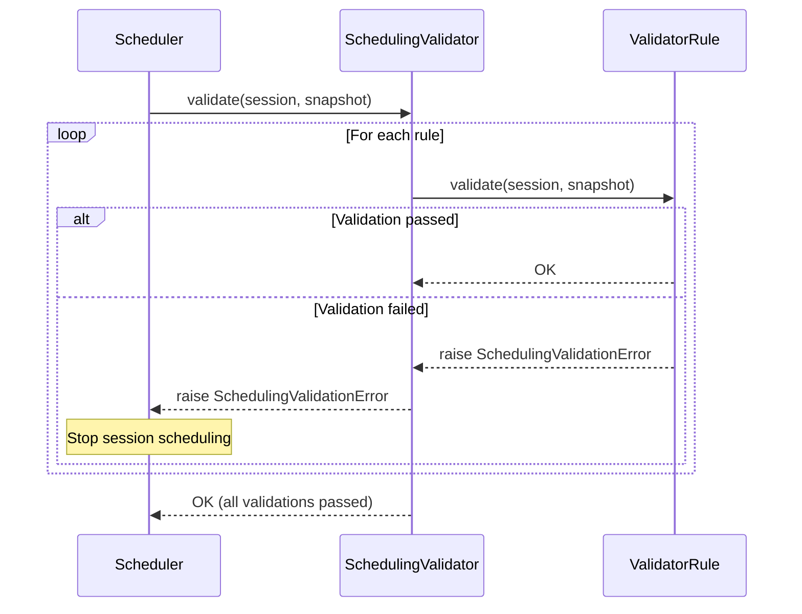

# Validators

← [Back to Provisioner](../README.md) | [Scheduler](../../README.md)

## Overview

Validators are plugins that validate resource constraints before sessions are scheduled. They execute in the first stage of the scheduling pipeline, and sessions that fail validation are immediately excluded from scheduling.

**Key Responsibilities:**
- Per-user/group/domain resource quota validation
- Concurrent session count limit validation
- Inter-session dependency validation
- Pending session limit validation

## Architecture

```
┌─────────────────────────────────────────────────┐
│              SchedulingValidator                 │
│  (Executes multiple ValidatorRules sequentially) │
└─────────────────────────────────────────────────┘
                      │
        ┌─────────────┼─────────────┐
        │             │             │
        ▼             ▼             ▼
┌─────────────┐ ┌─────────────┐ ┌─────────────┐
│ValidatorRule│ │ValidatorRule│ │ValidatorRule│
│  (Keypair)  │ │   (Group)   │ │(Concurrency)│
└─────────────┘ └─────────────┘ └─────────────┘
```

## Core Classes

### ValidatorRule (Abstract Base)

Base class for each validation rule.

```python
class ValidatorRule(abc.ABC):
    @abc.abstractmethod
    async def validate(
        self,
        session: SessionWorkload,
        system_snapshot: SystemSnapshot,
    ) -> None:
        """
        Verify that the session satisfies the validation rule.
        Raises SchedulingValidationError on failure.
        """
        pass
```

### SchedulingValidator

Composite class that combines and executes multiple ValidatorRules.

```python
class SchedulingValidator:
    def __init__(self, rules: Sequence[ValidatorRule]):
        self._rules = rules

    async def validate(
        self,
        session: SessionWorkload,
        system_snapshot: SystemSnapshot,
    ) -> None:
        """Execute all rules sequentially."""
        for rule in self._rules:
            await rule.validate(session, system_snapshot)
```

## Implementations

### Resource Quota Validation

#### KeypairResourceLimitValidator

Validates per-user (keypair) resource usage limits.

**Validates:**
- Currently used resources + requested resources ≤ allocated quota
- Per-resource-type validation (CPU, memory, GPU, etc.)

**On Failure:** `KeypairResourceQuotaExceeded`

#### UserResourceLimitValidator

Validates per-user resource usage limits.

**Validates:**
- Resource limits set in user policies

**On Failure:** `UserResourceQuotaExceeded`

#### GroupResourceLimitValidator

Validates per-group resource usage limits.

**Validates:**
- Total resource usage across all users in the group
- Group quota exceeded check

**On Failure:** `GroupResourceQuotaExceeded`

#### DomainResourceLimitValidator

Validates per-domain resource usage limits.

**Validates:**
- Domain-wide resource usage
- Domain quota exceeded check

**On Failure:** `DomainResourceQuotaExceeded`

### Concurrency Validation

#### ConcurrencyValidator

Validates concurrent session count limits.

**Validates:**
- Per-user concurrent session count limit
- Per-group concurrent session count limit
- Per-domain concurrent session count limit

**On Failure:** `ConcurrencyLimitExceeded`

### Dependency Validation

#### DependenciesValidator

Validates inter-session dependencies.

**Validates:**
- Dependent session exists
- Dependent session is in RUNNING state
- Circular dependency prevention

**On Failure:** `DependenciesNotSatisfied`

### Pending Session Validation

#### PendingSessionCountLimitValidator

Validates per-user pending session count limits.

**Validates:**
- Current PENDING session count
- Maximum pending session count exceeded check

**On Failure:** `PendingSessionCountLimitExceeded`

#### PendingSessionResourceLimitValidator

Validates total resource limits for pending sessions.

**Validates:**
- Total requested resources of PENDING sessions
- Pending resource limit exceeded check

**On Failure:** `PendingSessionResourceLimitExceeded`

### Special Validation

#### ReservedBatchSessionValidator

Validates reserved batch sessions.

**Validates:**
- Batch session reservation time
- Reservation time arrival check

## Exception Hierarchy

```
SchedulingValidationError (base)
├── ConcurrencyLimitExceeded
├── DependenciesNotSatisfied
├── KeypairResourceQuotaExceeded
├── UserResourceQuotaExceeded
├── GroupResourceQuotaExceeded
├── DomainResourceQuotaExceeded
├── PendingSessionCountLimitExceeded
├── PendingSessionResourceLimitExceeded
└── MultipleValidationErrors
```

## Validation Flow



## Writing Custom Validators

### 1. Inherit ValidatorRule

```python
from ai.backend.manager.sokovan.scheduler.provisioner.validators.validator import ValidatorRule
from ai.backend.manager.sokovan.scheduler.provisioner.validators.exceptions import SchedulingValidationError

class CustomValidator(ValidatorRule):
    async def validate(
        self,
        session: SessionWorkload,
        system_snapshot: SystemSnapshot,
    ) -> None:
        # Custom validation logic
        if not self._check_custom_condition(session, system_snapshot):
            raise SchedulingValidationError(
                "Custom validation failed: condition not satisfied",
                session_id=session.session_id,
            )

    def _check_custom_condition(
        self,
        session: SessionWorkload,
        snapshot: SystemSnapshot,
    ) -> bool:
        # Implement specific validation logic
        return True
```

### 2. Define Custom Exception (Optional)

```python
from ai.backend.manager.sokovan.scheduler.provisioner.validators.exceptions import SchedulingValidationError

class CustomValidationError(SchedulingValidationError):
    """Custom validation failure exception"""
    pass
```

### 3. Register in Factory

Add custom rule when creating Validator in `factory.py`:

```python
def create_validator(self) -> SchedulingValidator:
    rules = [
        KeypairResourceLimitValidator(),
        GroupResourceLimitValidator(),
        CustomValidator(),  # Add custom rule
    ]
    return SchedulingValidator(rules)
```

## Configuration

Validators are enabled/disabled at the system level. Individual resource limits are configured in:

- **Keypair Quotas**: Set during user creation or by administrator
- **Group Quotas**: Set during group creation
- **Domain Quotas**: Set during domain creation
- **Concurrency Limits**: Set in resource policies

## Related Documents

- [Provisioner README](../README.md)
- [Scheduler README](../../README.md)
